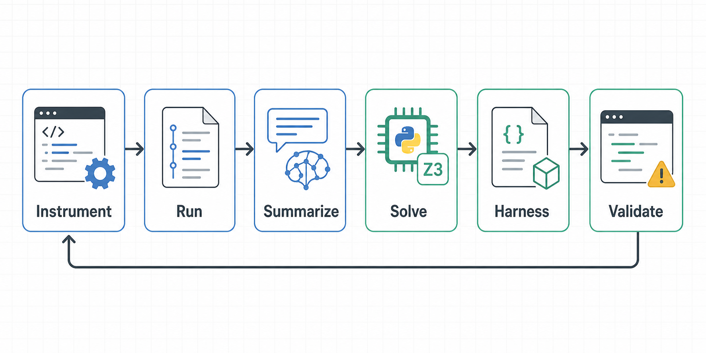

| Item | Details |
| --- | --- |
| Paper title | Agentic Concolic Execution |
| Authors | Zhengxiong Luo, Huan Zhao, Dylan Wolff, Cristian Cadar, Abhik Roychoudhury |
| Venue | IEEE Symposium on Security and Privacy, S&P 2026 |

## 0. One-line summary

The paper starts by asking why traditional concolic execution gets stuck on real programs. It is hard to build symbolic models for every library and execution environment, and even when you do, the solver often cannot finish the resulting constraints.

CONCOLLMIC does not solve this by asking an LLM to "find bugs." It has the LLM read execution traces, pick the next branch to open, and generate the inputs and environment setup that branch needs. The result is then confirmed by actually running the program.

## 1. Why I picked this paper

I picked this paper because it uses LLMs for security analysis in a way that goes beyond code summarization or asking about vulnerabilities.

It is close to harness engineering, which I have been interested in lately. A harness is the working frame that bundles prompts, tool calls, the execution environment, feedback, and validation loops so that an LLM performs a specific task well. Google OSS-Fuzz shows a similar flow: Fuzz Introspector finds under-fuzzed functions, an LLM writes fuzz targets, and build/runtime feedback is used to fix them. What I care about is the same thing: instead of leaving the LLM on its own, you design the working environment to push its performance up.

I think this paper shares the same problem. The structure that makes the LLM read execution traces, call tools, and get feedback from failures may matter more than generating one good input.

## 2. Problem definition

Concolic execution combines concrete execution with symbolic reasoning. For simple code, you collect the path conditions, flip one of them, and generate a new input. For example, if execution took the false side of `if (x > 10)`, you next generate an input satisfying `x > 10` to open the true side.

The problem is that this flow gets complicated quickly on real programs.

- Much behavior depends on libraries and the runtime, such as `atof`, `memcpy`, and floating-point arithmetic.
- Files, the network, CLI arguments, and environment variables also change the execution path.
- Modeling all of this as SMT formulas requires separate models per language and environment.
- Even with models, the solver struggles once the constraints grow large.

The paper calls the first problem C1: symbolic modeling, and the second C2: constraint solving.

In short, the difference between the traditional approach and CONCOLLMIC is as follows.

| Traditional concolic execution | CONCOLLMIC |
| --- | --- |
| Collects execution paths as low-level constraints. | Reads execution logs and rewrites the needed conditions at a higher level. |
| Library, runtime, and environment behavior must be modeled inside the tool. | Actually runs the program and checks by varying inputs and the environment. |
| Producing solver-friendly formulas is what matters. | Chooses the right representation among natural language, Python, and Z3, and combines tools. |
| Whether a new input is meaningful depends heavily on the tool's internal model. | Finally verifies by real execution whether the target branch was reached. |

As I see it, the paper's starting point is not "Is an LLM a smarter solver?" but rather "Can an LLM rewrite conditions into a more tractable form, the way a human reads code semantics and simplifies conditions?" A more tractable form might be a formula like in the traditional approach, or it might be natural language.

## 3. Core idea

CONCOLLMIC does not replace the solver with an LLM.

The LLM reads execution traces, picks a branch not yet reached, and organizes the conditions needed to open it. Those conditions do not have to be low-level SMT formulas. Sometimes natural language is better; sometimes Python code or a Z3 formula is better.

For example, there are cases where a human only needs to know "there are at most 20 representable values between two floats." Traditional tools get stuck trying to turn every `atof`, `memcpy`, type conversion, and loop along the way into formulas. CONCOLLMIC summarizes such conditions at a higher semantic level and hands the actual computation to tools like Python or Z3.

The important part is that everything is confirmed by real execution at the end. Even if the LLM produces a plausible condition, it counts as a failure if the target line is not reached. Without this validation loop, it would be closer to an agent that is just good at explaining code.

## 4. Method / system description

This section is easiest to follow as "how CONCOLLMIC produces one new test input." One iteration looks roughly like this.

First, `ACE.py instrument` inserts logging into the source code. For C/C++ code, it adds logs like `fprintf(stderr, ...)`. These markers let you later reconstruct whether a function was entered, which basic blocks were passed, and which line of which file was executed.

The key point is that the program is actually executed. Traditional symbolic execution tools have to implement a lot of operational semantics per language. CONCOLLMIC instead compiles and runs the program normally, then reconstructs "which path this input took" from the logs left during execution. The repo's `--instr_languages` option is less a selector for per-language analysis engines and more a filter for which file extensions get logging inserted.

Next, `ACE.py run` runs the instrumented program. The user passes a Python function that defines how to run the target. The repo calls this the test harness, which does not mean the target code itself is the harness. It is more of an outer working frame that creates input files, passes command-line arguments, sets environment variables, runs the program, and returns stderr and the exit code.

Running once with the initial input produces logs. CONCOLLMIC does not throw these logs at the LLM as-is; it condenses them into a readable execution summary. This includes the function call flow, the code actually executed, the code blocks not yet executed, and coverage information for each block. Put simply, it is a map showing "how far this run got and where it has not been yet."

From there, three kinds of agents split the work.

- The scheduling agent picks which existing test case to continue exploring from. It looks at low-coverage regions, past failure rates, and the history of how test cases were created.
- The summarization agent picks one branch that has not been executed yet. It then lays out how the input file, command-line arguments, environment variables, and earlier branch conditions must line up to reach that branch.
- The solving agent turns those conditions into concrete executable values. If needed, it can run Python to compute values or solve formulas with Z3.

The summarization agent's job is especially important. Just writing "make this if statement true" leaves the solving agent with no idea what to do. For a program that reads a file, for example, it has to spell out the input format too: "the first line must contain an integer and a float," "after that there must be as many values as the integer," "the difference between two values must be below the threshold." Only then can the next stage build an actual input file.

This is where the paper's distinctive approach lies. Conditions are not restricted to SMT formulas. Some conditions are shorter and more precise in natural language, some are better computed in Python, and some are better left to Z3. In the FP-Bench example, the condition "at most 20 representable values between two floating-point values" is one sentence to a human, but solving it as low-level formulas drags in `atof`, loops, and floating-point representation one after another. CONCOLLMIC folds such parts into higher-level conditions.

The solving agent takes the organized conditions and produces a new way to run the program: changing the input file contents, the program arguments, or the environment variables. This result also does not stay as words. CONCOLLMIC actually runs the new execution and checks whether the target line was reached.

On success, the new test case is saved to the queue. On failure, it is not thrown away immediately; the cause is diagnosed. It re-examines whether the solving agent failed to satisfy the condition correctly, or whether the summarization agent omitted or misstated the condition in the first place. The repo code also has separate steps for reviewing the solving result and the summarization result.

So CONCOLLMIC is not a system that merely "asks an LLM how to open a branch." It informs the LLM of the current state through execution logs, has it choose a branch to open, has it rewrite the conditions at the input/environment level, lets it use tools like Python or Z3, and finally checks correctness by real execution.

As I see it, this structure is the most important part of the paper. The LLM does not guess on its own; it operates within organized execution information, tools, and failure feedback. This is also the core from a harness engineering perspective: the input information, tools, execution method, and validation criteria are bundled into one working frame so that the LLM performs a specific analysis task well.

## 5. Evaluation and interpretation of results

| Evaluation target | Comparison setup | Result |
| --- | --- | --- |
| 8 C/C++ programs | Each tool run five times per target, comparing GCov branch coverage | 233% higher branch coverage than KLEE, 135% than KLEE-Pending, 130% than SymCC, 115% than SymSan |
| AFL++ comparison | Compared against 48-hour AFL++ runs | 81% higher coverage on average |
| Multi-language programs | No suitable existing multi-language symbolic execution tool, so measured CONCOLLMIC's internal line coverage gain over the initial input | Coverage increased 3.5x for ultrajson, 8.2x for jansi, 1.9x for py4j, 1.9x for protobuf-go |
| FP-Bench | Compared with KLEE-Float and plain KLEE on 26 floating-point reasoning benchmarks | 20% higher coverage than KLEE-Float, 107% higher than plain KLEE |
| Bug detection | Checked newly reached paths in real-world and multi-language programs | 11 new bugs found, 9 confirmed or fixed, libsoup bug assigned CVE-2025-4945 |

The experiments ran in Docker containers with 2 CPUs and 8 GiB RAM, and each tool was run five times per target. What matters in this table is that the comparison baseline differs slightly for each number. For C/C++ programs, branch coverage was compared against existing DSE tools on the same targets, and against AFL++ using 48-hour fuzzing results. For multi-language programs, comparable tools were lacking, so the metric was how much more code was executed relative to the initial input.

Looking only at the numbers, it is easy to conclude that CONCOLLMIC is simply better than KLEE or AFL++, but that reading is misleading. KLEE-style tools have the advantage where symbolic models are well defined and solvers are strong. CONCOLLMIC, on the other hand, is strong in areas that are hard to model, such as library calls, environment variables, CLI arguments, and network input.

So the result reads better not as "the LLM replaced the solver," but as LLM agents serving as a semantic bridge at the points where traditional concolic execution gets stuck due to low-level modeling.

The libsoup bug leading to a CVE is especially significant. It did not just raise coverage numbers; it reached paths leading to real bugs. Since it was a new finding independent of the model's training cutoff, it is also hard to dismiss as something memorized from training data.

## 6. Most memorable case: the malloc failure path in `bc`

The `bc` case impressed me the most. In ordinary testing `malloc` almost never fails, so branches that handle allocation failure rarely get exercised.

CONCOLLMIC did not simply change the input file here.

- Goal: reach the `malloc` failure branch
- Condition: `malloc(size)` inside `bc_malloc` must return `NULL`
- Method: write a custom malloc wrapper
- Execution: intercept the standard `malloc` with `LD_PRELOAD`
- Result: executed an error-handling path that is normally hard to reach

## 7. Limitations

First, it is expensive. According to the paper, generating one test input takes 69 seconds and $0.21 on average. This does not fit well with approaches that throw inputs in bulk, like fuzzers.

There is probably a more realistic use. It is closer to an auxiliary tool that makes a few more expensive but meaningful attempts at the points where existing fuzzers or dynamic symbolic execution tools get stuck.

The conditions the LLM produces can also be wrong. CONCOLLMIC grounds itself in execution traces, calls tools, and rechecks with real execution to filter out wrong outputs. Still, it does not guarantee correctness mathematically. So it is better viewed as a bug-finding tool rather than a verification tool.

The ablation study in the appendix is also important. Having the LLM choose the next test input was not statistically significantly better than depth-first search or random selection. In other words, the core of the performance seems to lie less in "the LLM picks the next target brilliantly" and more in condition summarization, condition solving, and environment manipulation.

The failure analysis tells a similar story. Of 50 `oggenc` failures, a large share were cases where an unreachable path was chosen in the first place, or where the program crashed before reaching the target. There were also cases where the summarization agent got the condition wrong, but the overall failures are hard to explain simply as "LLM hallucination."

The paper's meta-review also pointed out that the evaluated programs were limited in scale and that the balance between high-level semantic interpretation and low-level precise execution was not shown sufficiently. Reproducibility is also worth thinking about.

## 8. Thoughts

What stuck with me most after reading was how it designs the frame in which the LLM does its work.

CONCOLLMIC does not just ask the LLM to find bugs. It makes the LLM think about what environment is needed to reach a specific branch, and confirms that with real execution.

LLM-based security research seems to be moving in this direction lately. Rather than leaving the final judgment to the model, the model is used to produce executable intermediate artifacts, which are then verified through builds, execution, coverage, and crashes.

I felt this is also why harness engineering is becoming important. What information the model sees, what tools it uses, and by what criteria it fixes failures can make a bigger difference than a single good model. LLMs can reduce this manual work, but it is still risky to trust them without a validation loop.

This line of thought led me to think about harness engineering design for Web3 bug bounties. In smart contract analysis too, building a working frame that sets a target state, provides the necessary context and tools, and feeds execution results back seemed more promising than asking the LLM about vulnerabilities directly.

## 9. Next steps

From here on, these are not things the paper covers directly but experiment ideas I extended on my own.

For a harness engineering design aimed at Web3 bug bounties, rather than targeting an entire DeFi protocol from the start, it seems better to pick one "branch that only executes in a specific state" within the scope of a single public bug bounty.

For example, states like these could be targets.

- When the price oracle value is in a specific range
- Right after a permission state changes
- When pool reserves reach an abnormal ratio
- When a liquidation condition sits right on the boundary
- When multiple transactions must execute in a specific order

Then, CONCOLLMIC-style, leave execution logs, pick a target branch, and have the LLM assemble the transaction sequence or fork environment needed to reach that branch.

Setting "find a bug" as the goal from the start makes the experiment too big, so a small success criterion seems better. For example, reaching a branch after a `require` that existing fuzzers could not reach, or producing a transaction sequence that passes a specific revert condition, would be enough for a first experiment.

In Web3, call order and state often matter more than a single input, so the case of using `LD_PRELOAD` to force a `malloc` failure really resonated with me. In smart contracts too, what matters in the end is deliberately constructing a specific state, and I saw bundling context, tools, the execution environment, and validation criteria so that the LLM runs experiments to reach that state well as a good example of harness engineering.

## Conclusion

CONCOLLMIC is less a paper that simply repackages concolic execution with an LLM and more a study that inserts LLM agents at the points where existing tools get stuck.

The key is not handing the LLM "find bugs," but bundling execution traces, target branches, tool calls, environment manipulation, failure feedback, and real-execution validation into one working frame so that the LLM repeatedly performs a specific analysis task.

Its cost and speed make it a burden to use like a continuously running fuzzer. A more realistic use is as an auxiliary system that, at the points where existing fuzzers or symbolic execution get stuck, has the LLM make a few more expensive attempts within tools and a validation loop.

## References

- [Agentic Concolic Execution paper PDF](https://fouzhe.github.io/publications/paper/SP26-ConcoLLMic.pdf)
- [ConcoLLMic GitHub Repository](https://github.com/ConcoLLMic/ConcoLLMic)
- [OSS-Fuzz: Fuzz target generation using LLMs](https://google.github.io/oss-fuzz/research/llms/target_generation/)
- [Google Security Blog: AI-Powered Fuzzing](https://security.googleblog.com/2023/08/ai-powered-fuzzing-breaking-bug-hunting.html)
- [Google Security Blog: Leveling Up Fuzzing](https://security.googleblog.com/2024/11/leveling-up-fuzzing-finding-more.html)
