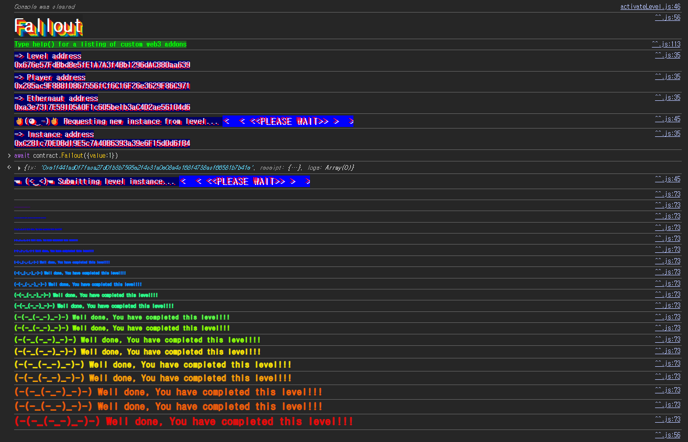

## Challenge
### Prompt
Claim ownership of the contract below to complete this level.
Things that might help
Solidity Remix IDE
### Code
```solidity
// SPDX-License-Identifier: MIT
pragma solidity ^0.6.0;

import "openzeppelin-contracts-06/math/SafeMath.sol";

contract Fallout {
    using SafeMath for uint256;

    mapping(address => uint256) allocations;
    address payable public owner;

    /* constructor */
    function Fal1out() public payable {
        owner = msg.sender;
        allocations[owner] = msg.value;
    }

    modifier onlyOwner() {
        require(msg.sender == owner, "caller is not the owner");
        _;
    }

    function allocate() public payable {
        allocations[msg.sender] = allocations[msg.sender].add(msg.value);
    }

    function sendAllocation(address payable allocator) public {
        require(allocations[allocator] > 0);
        allocator.transfer(allocations[allocator]);
    }

    function collectAllocations() public onlyOwner {
        msg.sender.transfer(address(this).balance);
    }

    function allocatorBalance(address allocator) public view returns (uint256) {
        return allocations[allocator];
    }
}
```
## Background

---

In current Solidity, a constructor is written as `constructor()`. It runs once at deployment and cannot be called externally afterward.
Before Solidity 0.4.22, a constructor was written as a function with the same name as the contract instead of with the `constructor()` keyword. For a contract named `Fallout`, the constructor looked like `function Fallout() public { ... }`.
This approach is vulnerable to typos. If the function name does not exactly match the contract name, the compiler treats it as an ordinary `public` function, which anyone can call after deployment.

---

`payable` is the keyword that lets a function receive ETH. `msg.value` is the amount of ETH sent with the call.
This challenge's `Fal1out()` is `public payable`, so an external account can call it directly while sending ETH. Since it runs `owner = msg.sender`, the caller becomes `owner`.
## Challenge code analysis

---

First, `owner` and `onlyOwner`.
```solidity
address payable public owner;

modifier onlyOwner() {
    require(msg.sender == owner, "caller is not the owner");
    _;
}
```
`owner` is the contract's admin address. `onlyOwner` only runs the function when `msg.sender` equals the current `owner`.
So this level's goal, taking over ownership, means changing the `owner` value to my address.

---

The problem is the function below that looks like a constructor.
```solidity
/* constructor */
function Fal1out() public payable {
    owner = msg.sender;
    allocations[owner] = msg.value;
}
```
The comment says `constructor`, but the actual function name is `Fal1out`. The digit `1` sits where the second `l` of `Fallout` appears to be.
The contract name is `Fallout` and the function name is `Fal1out`, so the two differ. It is not a constructor under the old syntax, and under Solidity 0.6.0 it is not `constructor()` either. So this is an ordinary `public` function that anyone can call after deployment.
Since `owner = msg.sender` has no access control, any address that calls `Fal1out()` becomes `owner`.
## Solution
`Fal1out()` runs `owner = msg.sender` directly, so calling it once from my account satisfies the ownership claim.
The function is `payable`, so ETH can be sent along, but `value: 1` is enough to change ownership.
### Exploit
```javascript
await contract.Fal1out({ value: 1 })
```

