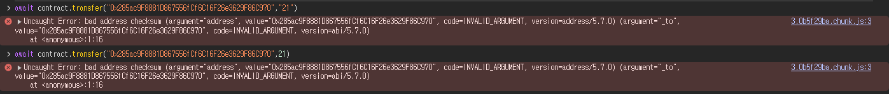
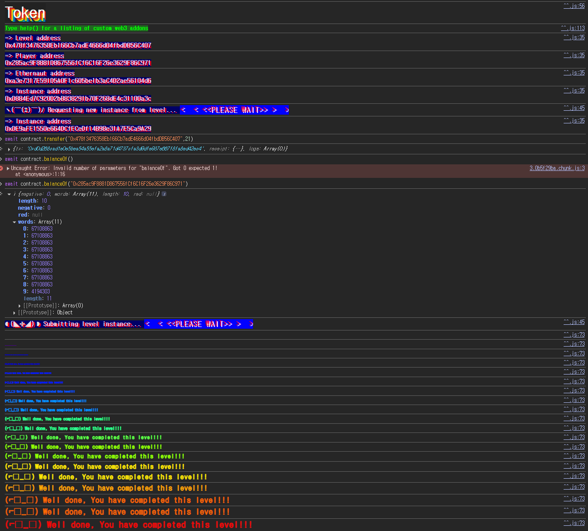

## Challenge
### Description
The goal of this level is for you to hack the basic token contract below.
You are given 20 tokens to start with and you will beat the level if you somehow manage to get your hands on any additional tokens. Preferably a very large amount of tokens.
Things that might help:
What is an odometer?
### Code
```solidity
// SPDX-License-Identifier: MIT
pragma solidity ^0.6.0;

contract Token {
    mapping(address => uint256) balances;
    uint256 public totalSupply;

    constructor(uint256 _initialSupply) public {
        balances[msg.sender] = totalSupply = _initialSupply;
    }

    function transfer(address _to, uint256 _value) public returns (bool) {
        require(balances[msg.sender] - _value >= 0);
        balances[msg.sender] -= _value;
        balances[_to] += _value;
        return true;
    }

    function balanceOf(address _owner) public view returns (uint256 balance) {
        return balances[_owner];
    }
}
```
## Background

---

`uint256` is an unsigned 256-bit integer, so it can represent values from $0$ to $2^{256}-1$.
The problem is arithmetic that goes outside this range. For example, subtracting 1 from a `uint256` value of 0 wraps around to $2^{256}-1$.
The odometer in the hint means the same thing. Just as an odometer rolls back to 0 after passing its maximum, a fixed-size integer wraps to the start or end of its range when it goes out of bounds.


---

This challenge uses `pragma solidity ^0.6.0`. Before Solidity 0.8.0, basic arithmetic operations are not automatically checked for overflow/underflow.
So subtracting `uint256` values without `SafeMath` does not revert on underflow; the value simply wraps within the `uint256` range. That is why the `balances[msg.sender] - _value` check protects nothing.
## Code analysis

---

Balances are stored like this.
```solidity
mapping(address => uint256) balances;
uint256 public totalSupply;

constructor(uint256 _initialSupply) public {
    balances[msg.sender] = totalSupply = _initialSupply;
}
```
`balances` stores the token balance per address. The player starts with 20 tokens, and the win condition is holding more than 20 tokens.
So there is no need to legitimately increase `totalSupply`. We only need `balanceOf(player)` to exceed 20.

---

The bug is in the balance check.
```solidity
require(balances[msg.sender] - _value >= 0);
```
On the surface, this looks like it prevents sending more than the current balance. But since `balances[msg.sender]` and `_value` are both `uint256`, the result of the subtraction is also `uint256`.
A `uint256` can never be negative, so the `>= 0` comparison is meaningless. Subtracting 21 from a balance of 20 underflows to $2^{256}-1$ without reverting.
To enforce the intended check, the comparison must be done before the subtraction, like this.
```solidity
require(balances[msg.sender] >= _value);
```

---

The state update happens in the following order.
```solidity
balances[msg.sender] -= _value;
balances[_to] += _value;
```
With a player balance of 20, passing 21 as `_value` makes the player's balance $2^{256}-1$ on the first line. That is far greater than 20, so it satisfies the level condition.
`_to` must not be my own address. Otherwise 21 is subtracted from and then added back to the same slot, leaving the original balance.
So `_to` has to be some address other than the player.

## Solution
The player's starting balance is 20. Passing 21 to `transfer` triggers an underflow at the balance deduction step.
The recipient can be any address other than mine. Here I sent to the level address.
### Exploit
```javascript
await contract.transfer("0x478f3476358Eb166Cb7adE4666d04fbdDB56C407", 21)
```

