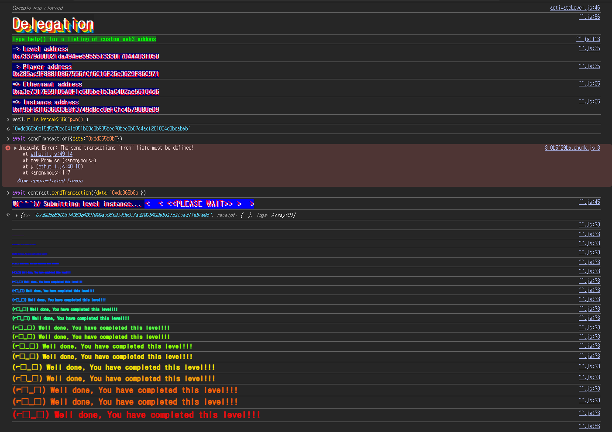

## Challenge
### Description
The goal of this level is for you to claim ownership of the instance you are given.
Things that might help
- Look into Solidity's documentation on the `delegatecall` low level function, how it works, how it can be used to delegate operations to on-chain libraries, and what implications it has on execution scope.
- Fallback methods
- Method ids
### Code
```solidity
// SPDX-License-Identifier: MIT
pragma solidity ^0.8.0;

contract Delegate {
    address public owner;

    constructor(address _owner) {
        owner = _owner;
    }

    function pwn() public {
        owner = msg.sender;
    }
}

contract Delegation {
    address public owner;
    Delegate delegate;

    constructor(address _delegateAddress) {
        delegate = Delegate(_delegateAddress);
        owner = msg.sender;
    }

    fallback() external {
        (bool result,) = address(delegate).delegatecall(msg.data);
        if (result) {
            this;
        }
    }
}
```
## Background

---

`fallback()` runs when the called function selector does not match any function in the current contract.
In this challenge, `Delegation` has no `pwn()` function. So calldata for `pwn()` sent to the `Delegation` address goes into `fallback()`.
`fallback()` is not `payable`, so the call carries only calldata and no ether.

---

A low-level call encodes the ABI manually. In Solidity, the first 4 bytes of a function call's calldata are made by hashing the function signature with `keccak256` and taking the first 4 bytes.
The selector for `pwn()` is computed like this:
```javascript
web3.utils.keccak256("pwn()").slice(0, 10)
```
The result is `0xdd365b8b`. Since the function takes no arguments, the calldata only needs this 4-byte selector.

---

`delegatecall` executes the target contract's code but uses the calling contract's execution context.
With `A.delegatecall(B's code)`, the code is `B`'s, but `address(this)`, `msg.sender`, and storage stay those of `A`.
`Delegate.pwn()` contains `owner = msg.sender`, and when this code runs via `delegatecall`, it changes `Delegation.owner`, not `Delegate.owner`.
## Challenge code analysis

---

```solidity
contract Delegate {
    address public owner;

    constructor(address _owner) {
        owner = _owner;
    }

    function pwn() public {
        owner = msg.sender;
    }
}
```
`Delegate` has `pwn()`, which stores the caller's address in `owner`.
Calling `pwn()` directly on `Delegate` only changes `Delegate`'s `owner`. The goal is `Delegation`'s `owner`, so `Delegation` has to execute `Delegate`'s code for us.

---

```solidity
contract Delegation {
    address public owner;
    Delegate delegate;

    constructor(address _delegateAddress) {
        delegate = Delegate(_delegateAddress);
        owner = msg.sender;
    }

    fallback() external {
        (bool result,) = address(delegate).delegatecall(msg.data);
        if (result) {
            this;
        }
    }
}
```
`Delegation` has no `pwn()` function. So sending `pwn()`'s selector, `0xdd365b8b`, to the `Delegation` address triggers `fallback()`.
`fallback()` forwards the received `msg.data` as-is to `delegatecall`, so the `pwn()` in `Delegate` that matches the same selector runs.
`delegatecall` uses `Delegation`'s storage. Both contracts have `address public owner` as their first state variable, so slot 0 lines up as `owner`.
So `owner = msg.sender` in `Delegate.pwn()` overwrites slot 0 of `Delegation`, i.e. `Delegation.owner`, with my address.

---

Three conditions are required.
- Send a function selector that `Delegation` does not have, triggering `fallback()`.
- `fallback()` forwards `msg.data` as-is to `delegatecall`.
- `Delegate.pwn()` runs in the `delegatecall` context and changes `Delegation.owner`.

All three hold, so we only need to send `pwn()`'s selector, `0xdd365b8b`, to the `Delegation` instance.
## Solution
Compute the function selector of `pwn()` and send it as calldata to the `Delegation` instance.
```javascript
web3.utils.keccak256("pwn()")
// '0xdd365b8b15d5d78ec041b851b68c8b985bee78bee0b87c4acf261024d8beabab'
```
The function selector is the first 4 bytes of this hash, so we send `0xdd365b8b`. `Delegation` has no function matching this selector, so the call goes into `fallback()`. There it runs `delegatecall(msg.data)` against `Delegate`, which executes `pwn()`.
### Exploit
```javascript
await contract.sendTransaction({ data: "0xdd365b8b" })
```

