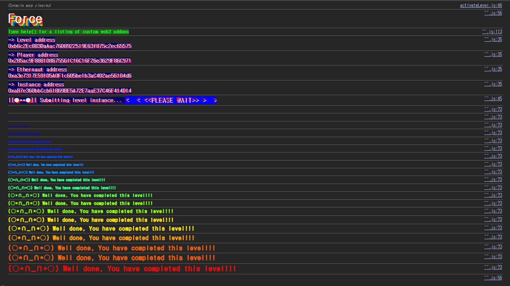

## Challenge
### Prompt
Some contracts will simply not take your money `¯\_(ツ)_/¯`
The goal of this level is to make the balance of the contract greater than zero.
Things that might help:
- Fallback methods
- Sometimes the best way to attack a contract is with another contract.
- See the ["?"](https://ethernaut.openzeppelin.com/help) page above, section "Beyond the console"
### Code
```solidity
// SPDX-License-Identifier: MIT
pragma solidity ^0.8.0;

contract Force { /*
                   MEOW ?
         /\_/\   /
    ____/ o o \
    /~____  =ø= /
    (______)__m_m)
                   */ }
```
## Background

---

For a contract to receive ether, it usually needs a `receive()` or a `payable fallback()`.
When you send only ether with no `msg.data`, `receive()` runs; if there is no `receive()`, it falls through to `fallback()`. If there is no payable function to execute at that point, an ordinary ether transfer reverts.
In other words, for a contract like `Force` that has neither `receive()` nor `fallback()`, it is hard to deposit ether via `transfer`, `send`, or a low-level `call{value: ...}("")`.

---

But in the EVM a contract's balance is not a value that increases only through paths the contract code explicitly allows. Notably, ether can be forcibly placed at a given address in the following two ways.
- Another contract calls `selfdestruct(target)` and sends its remaining ether to `target`.
- A miner/validator sets the block reward recipient address to that contract address.

In this challenge there is no need to go as far as the second method; the first method works as the exploit path.

---

`selfdestruct(payable recipient)` sends the calling contract's balance to `recipient`. This transfer is not an ordinary message call that invokes the receiving contract's `receive()` or `fallback()`. So the balance can increase even if the receiving contract has no ether-receiving function.
Since EIP-6780, `selfdestruct()`'s code-deletion behavior has been restricted, but whether deletion happens does not matter in this level. What we need is the effect of forcibly sending the attack contract's balance to the `Force` address.
## Analyzing the challenge code

---

The challenge contract is empty.
```solidity
contract Force { /* ... */ }
```
`Force` has no state variables and no functions. In particular, it has no `receive()` and no `fallback()`.
So if the player sends ether to the `Force` address in the normal way, the transfer fails because there is no payable entrypoint to execute. The goal of the challenge is not to change ownership or call a function, but simply to make `Force`'s balance greater than 0.

---

The goal is to make the `Force` contract's balance greater than 0. The validation condition is roughly as follows.
```solidity
address(force).balance > 0
```
Even without internal functions, the address itself can hold an ether balance. So the key is to find a way to increase only the balance of the `Force` address without running `Force`'s code.

---

We deploy the attack contract with a payable constructor, putting 1 wei into it. Then calling `selfdestruct(forceAddress)` from the attack contract moves the attack contract's balance to the `Force` address.
During this process, `Force`'s `receive()` or `fallback()` is not called. So even though `Force` has no functions at all, it ends up with a balance and satisfies the level condition.
## Solution
A normal transfer fails because `Force` has no function to receive ether. But the balance transfer caused by `selfdestruct()` increases the address's balance regardless of whether the recipient has a payable function.
So we create an attack contract holding 1 wei and `selfdestruct` that contract, specifying the `Force` address as the recipient.
### Exploit
```solidity
// SPDX-License-Identifier: MIT
pragma solidity ^0.8.0;

contract Attack {
    constructor() payable {}

    function attack(address payable target) public {
        selfdestruct(target);
    }
}
```


