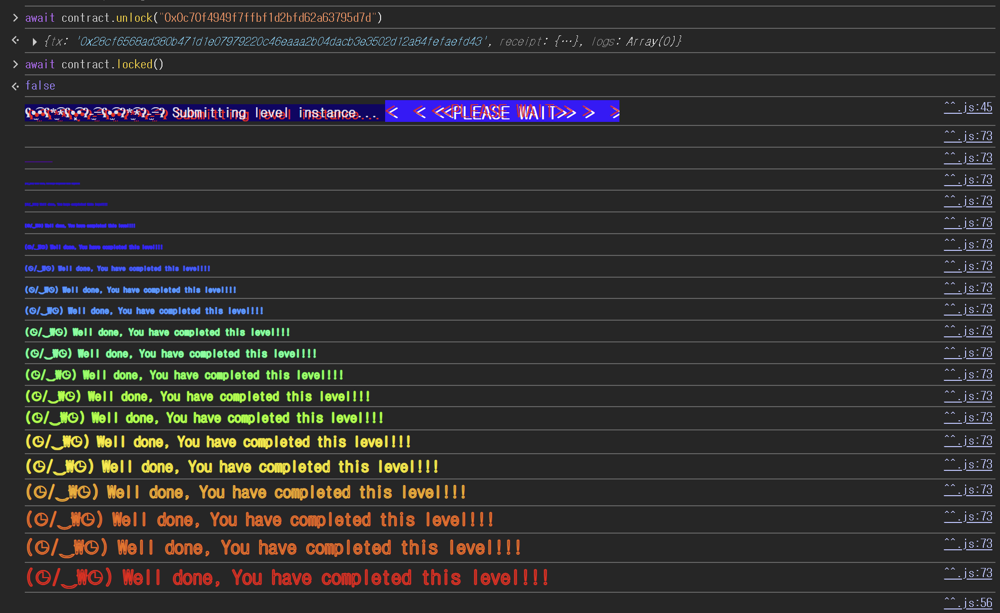

## Challenge
### Prompt
The creator of this contract was careful enough to protect the sensitive areas of its storage.
Unlock this contract to beat the level.
Things that might help:
- Understanding how storage works
- Understanding how parameter parsing works
- Understanding how casting works

Tips:
- Remember that metamask is just a commodity. Use another tool if it is presenting problems. Advanced gameplay could involve using remix, or your own web3 provider.
### Code
```solidity
// SPDX-License-Identifier: MIT
pragma solidity ^0.8.0;

contract Privacy {
    bool public locked = true;
    uint256 public ID = block.timestamp;
    uint8 private flattening = 10;
    uint8 private denomination = 255;
    uint16 private awkwardness = uint16(block.timestamp);
    bytes32[3] private data;

    constructor(bytes32[3] memory _data) {
        data = _data;
    }

    function unlock(bytes16 _key) public {
        require(_key == bytes16(data[2]));
        locked = false;
    }

    /*
    A bunch of super advanced solidity algorithms...

      ,*'^`*.,*'^`*.,*'^`*.,*'^`*.,*'^`*.,*'^`
      .,*'^`*.,*'^`*.,*'^`*.,*'^`*.,*'^`*.,*'^`*.,
      *.,*'^`*.,*'^`*.,*'^`*.,*'^`*.,*'^`*.,*'^`*.,*'^         ,---/V\
      `*.,*'^`*.,*'^`*.,*'^`*.,*'^`*.,*'^`*.,*'^`*.,*'^`*.    ~|__(o.o)
      ^`*.,*'^`*.,*'^`*.,*'^`*.,*'^`*.,*'^`*.,*'^`*.,*'^`*.,*'  UU  UU
    */
}
```
## Background

---

`private` is a Solidity-level access modifier. It means you cannot read the variable directly from an external contract with a getter like `data()`, and inheriting contracts cannot access it either.
But the storage on the blockchain is not encrypted. A contract's state variables are stored in EVM storage slots, and if you know a specific slot number, you can read its value with `web3.eth.getStorageAt`. So `private` should not be used as a secret store.

---

EVM storage is organized into 32-byte slots. Values that use all 32 bytes, like `uint256` or `bytes32`, occupy a slot on their own.
Values smaller than 32 bytes, like `bool`, `uint8`, and `uint16`, are stored together in the same slot when possible. They are placed into slots in declaration order, and the small values fill a slot from the right.
The variable layout of this challenge:
```solidity
// slot 0
bool public locked = true;

// slot 1
uint256 public ID = block.timestamp;

// slot 2
uint8 private flattening = 10;
uint8 private denomination = 255;
uint16 private awkwardness = uint16(block.timestamp);

// slot 3, 4, 5
bytes32[3] private data;
```
With this layout, `data[0]` is stored in slot 3, `data[1]` in slot 4, and `data[2]` in slot 5.

---

Fixed-size byte types do not convert like integer types. When converting from `bytesN` to `bytesM` with `N > M`, the right bytes are truncated and the left bytes remain.
For example, converting a `bytes32` value to `bytes16` keeps only the first 16 bytes.
```solidity
bytes16(data[2])
```
So the `_key` to pass to `unlock` is the first 16 bytes of the 32-byte value stored in slot 5.
## Challenge code analysis

---

```solidity
bool public locked = true;
```
To pass the level, you have to change `locked` to `false`. There is no public setter to change the value directly, so you have to pass `unlock`.
Since `locked` is the first state variable, it is stored in slot 0. Reading slot 0 shows the last value is `01`, which is `true`.

---

```solidity
uint8 private flattening = 10;
uint8 private denomination = 255;
uint16 private awkwardness = uint16(block.timestamp);
bytes32[3] private data;
```
`flattening`, `denomination`, and `awkwardness` are all small, so they are packed together into slot 2. The `bytes32[3] data` that follows has 32-byte elements, so it takes one slot each starting from slot 3.
The slot of `data[2]`:
```solidity
slot(data[2]) = slot(data[0]) + 2 = 3 + 2 = 5
```
Even though `data` is `private`, this slot can be read externally, because `private` only stops the getter from being generated.

---

```solidity
function unlock(bytes16 _key) public {
    require(_key == bytes16(data[2]));
    locked = false;
}
```
The value used in the comparison is `bytes16(data[2])`. `data[2]` is `bytes32` and `_key` is `bytes16`, so before comparing it keeps only the first 16 bytes of `data[2]`.
So after reading slot 5, truncate it to the first 16 bytes and pass that to `unlock`.
## Solution
Since `data[2]` is in slot 5, just read that slot.
```javascript
await web3.eth.getStorageAt("0xF5149Bd38aE9B0634ADdE17A238c1517f7191E69", 5)
// "0x0c70f4949f7ffbf1d2bfd62a63795d7d3f6d6e787d928794f25c6c0a6848af62"
```
`unlock` converts this value to `bytes16` for the comparison. Since the `bytes32 -> bytes16` conversion keeps only the first 16 bytes, the key is `0x0c70f4949f7ffbf1d2bfd62a63795d7d`.
### Exploit
```solidity
await contract.unlock("0x0c70f4949f7ffbf1d2bfd62a63795d7d")
{tx: '0x28cf6568ad380b471d1e07979220c46eaaa2b04dacb3e3502d12a84fefaefd43', receipt: {…}, logs: Array(0)}
await contract.locked()
false
```

