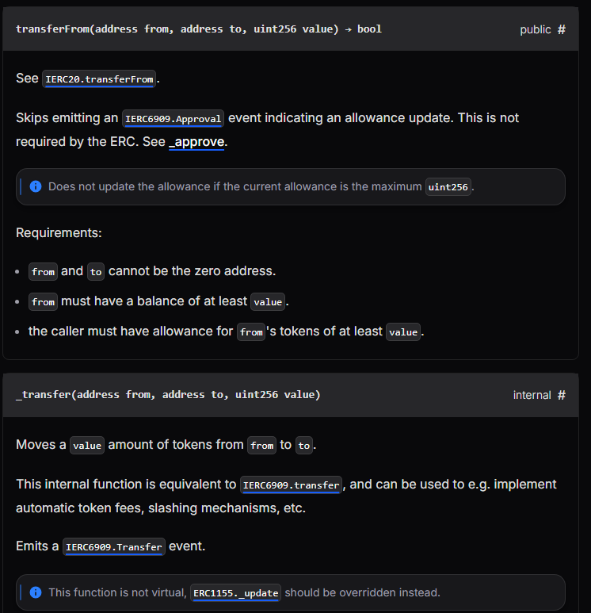
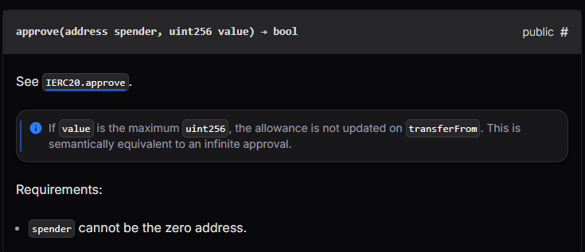

## Challenge
### Prompt
NaughtCoin is an ERC20 token and you're already holding all of them. The catch is that you'll only be able to transfer them after a 10 year lockout period. Can you figure out how to get them out to another address so that you can transfer them freely? Complete this level by getting your token balance to 0.
Things that might help
- The [ERC20](https://github.com/ethereum/EIPs/blob/master/EIPS/eip-20.md) Spec
- The [OpenZeppelin](https://github.com/OpenZeppelin/zeppelin-solidity/tree/master/contracts) codebase
### Code
```solidity
// SPDX-License-Identifier: MIT
pragma solidity ^0.8.0;

import "openzeppelin-contracts-08/token/ERC20/ERC20.sol";

contract NaughtCoin is ERC20 {
    // string public constant name = 'NaughtCoin';
    // string public constant symbol = '0x0';
    // uint public constant decimals = 18;
    uint256 public timeLock = block.timestamp + 10 * 365 days;
    uint256 public INITIAL_SUPPLY;
    address public player;

    constructor(address _player) ERC20("NaughtCoin", "0x0") {
        player = _player;
        INITIAL_SUPPLY = 1000000 * (10 ** uint256(decimals()));
        // _totalSupply = INITIAL_SUPPLY;
        // _balances[player] = INITIAL_SUPPLY;
        _mint(player, INITIAL_SUPPLY);
        emit Transfer(address(0), player, INITIAL_SUPPLY);
    }

    function transfer(address _to, uint256 _value) public override lockTokens returns (bool) {
        super.transfer(_to, _value);
    }

    // Prevent the initial owner from transferring tokens until the timelock has passed
    modifier lockTokens() {
        if (msg.sender == player) {
            require(block.timestamp > timeLock);
            _;
        } else {
            _;
        }
    }
}
```
## Background

---

ERC20 is a token standard that defines common functions such as `transfer`, `approve`, `transferFrom`, `balanceOf`, and `allowance`.
NaughtCoin inherits OpenZeppelin's `ERC20` instead of implementing the transfer logic itself, so the inherited ERC20 standard functions matter as much as the `transfer` visible in the code.

---

There are two main ways to move tokens in ERC20.
`transfer(to, amount)` sends `msg.sender`'s tokens directly to `to`.
```solidity
function transfer(address to, uint256 value) external returns (bool);
```

`transferFrom(from, to, amount)` sends `from`'s tokens to `to`. Since not just anyone should be able to move someone else's tokens, `from` must first open an allowance to `msg.sender`.
```solidity
function transferFrom(address from, address to, uint256 value) external returns (bool);
```


---

`approve(spender, amount)` allows `spender` to take up to `amount` of my tokens. This allowance can be queried with `allowance(owner, spender)`.
The flow looks like this:
1. `player` calls `approve(spender, amount)`.
2. `spender` calls `transferFrom(player, receiver, amount)`.
3. ERC20 deducts `allowance(player, spender)` and moves `player`'s balance to `receiver`.

In this challenge, `spender` can simply be `player` itself. By opening an allowance to yourself with `approve(player, amount)` and calling `transferFrom(player, receiver, amount)` from the same address, `msg.sender` is `player`, so the allowance condition is satisfied.
## Challenge code analysis

---

The initial tokens are handed out in the constructor.
```solidity
uint256 public timeLock = block.timestamp + 10 * 365 days;
uint256 public INITIAL_SUPPLY;
address public player;

constructor(address _player) ERC20("NaughtCoin", "0x0") {
    player = _player;
    INITIAL_SUPPLY = 1000000 * (10 ** uint256(decimals()));
    _mint(player, INITIAL_SUPPLY);
    emit Transfer(address(0), player, INITIAL_SUPPLY);
}
```
When the contract is deployed, the entire supply is minted to `player`. The goal is to make this `player`'s token balance 0.
`INITIAL_SUPPLY` is `1000000 * 10^18`. Because OpenZeppelin ERC20's default `decimals()` is 18, in terms of the smallest unit this comes to `1000000000000000000000000`.

---

The lock is applied here.
```solidity
function transfer(address _to, uint256 _value) public override lockTokens returns (bool) {
    super.transfer(_to, _value);
}

modifier lockTokens() {
    if (msg.sender == player) {
        require(block.timestamp > timeLock);
        _;
    } else {
        _;
    }
}
```
`lockTokens` requires 10 years to pass to proceed when `msg.sender == player`. But the only function with this modifier is `transfer`.
If `player` calls `transfer` directly, it is blocked. But ERC20 also has `transferFrom`, and NaughtCoin did not override `transferFrom`. The inherited OpenZeppelin `transferFrom` is left open.

---

The restriction only covers one side.
```solidity
contract NaughtCoin is ERC20 {
    ...
    function transfer(address _to, uint256 _value) public override lockTokens returns (bool) {
        super.transfer(_to, _value);
    }
}
```
The security intent is to block `player`'s token movement for 10 years. That would require restricting `transferFrom` as well as `transfer`.
The current code only blocks `transfer` and leaves `approve` and `transferFrom` open. So if `player` first opens an allowance and then moves its own balance to another address with `transferFrom`, the challenge condition is met.
## Solution
Skip `transfer`, which `lockTokens` blocks, and use `approve` and `transferFrom`, which NaughtCoin leaves alone.
Open an allowance to `player` for the full token amount and call `transferFrom(player, recipient, amount)`. Here `recipient` can be another of my wallet addresses or any receiving address. The condition is that `player`'s `balanceOf(player)` becomes 0.
### Exploit
```javascript
await contract.approve(player, "1000000000000000000000000")
await contract.transferFrom(player, "0x828AA4DE1439A14e7440F4200358B6a51D06cFE3", "1000000000000000000000000")
```

