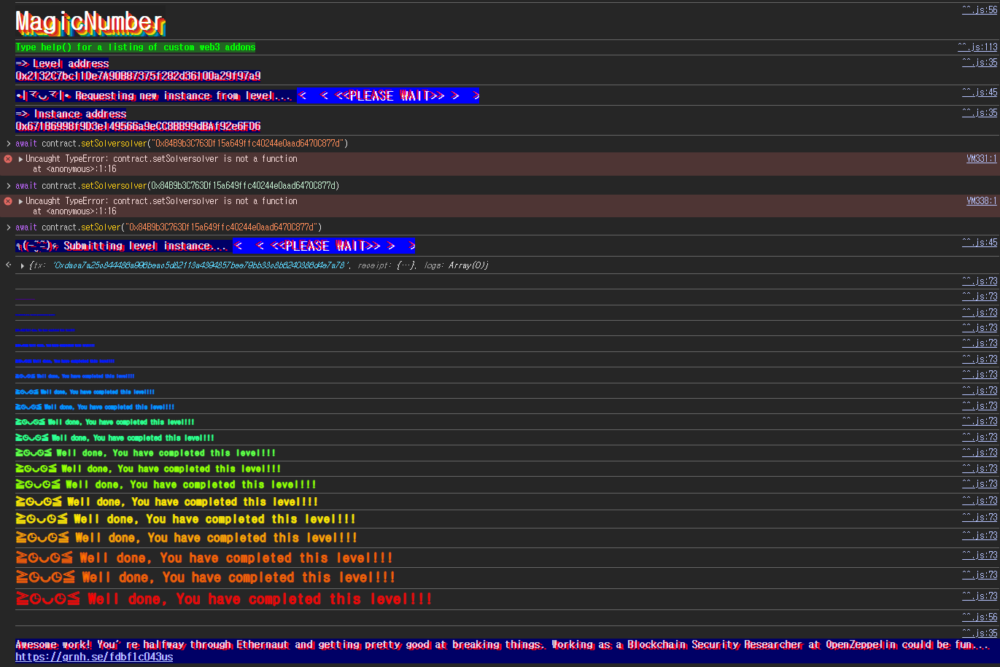

## Challenge
### Description
To solve this level, you only need to provide the Ethernaut with a Solver, a contract that responds to whatIsTheMeaningOfLife() with the right 32 byte number.
Easy right? Well... there's a catch.
The solver's code needs to be really tiny. Really reaaaaaallly tiny. Like freakin' really really itty-bitty tiny: 10 bytes at most.
Hint: Perhaps its time to leave the comfort of the Solidity compiler momentarily, and build this one by hand O_o. That's right: Raw EVM bytecode.
Good luck!
### Code
```solidity
// SPDX-License-Identifier: MIT
pragma solidity ^0.8.0;

contract MagicNum {
    address public solver;

    constructor() {}

    function setSolver(address _solver) public {
        solver = _solver;
    }

    /*
    ____________/\\\\\\_______/\\\\\\\\\\\\\\\\\\_____        
     __________/\\\\\\\\\\_____/\\\\\\///////\\\\\\___       
      ________/\\\\\\/\\\\\\____\\///______\\//\\\\\\__      
       ______/\\\\\\/\\/\\\\\\______________/\\\\\\/___     
        ____/\\\\\\/__\\/\\\\\\___________/\\\\\\//_____    
         __/\\\\\\\\\\\\\\\\\\\\\\\\\\\\\\\\_____/\\\\\\//________   
          _\\///////////\\\\\\//____/\\\\\\/___________  
           ___________\\/\\\\\\_____/\\\\\\\\\\\\\\\\\\\\\\\\\\\\\\_ 
            ___________\\///_____\\///////////////__
    */
}
```
## Background

---

A Solidity contract's bytecode is split into `creation code` and `runtime code`.
`creation code` runs once when the contract is deployed. The `constructor` is part of this phase. This code builds the `runtime code` that will actually be stored, and finally returns that bytecode with `return`.
`runtime code` is the code stored at the contract address after deployment. This code runs whenever the contract is called afterwards, so the code size reported by `extcodesize` is the size of the `runtime code`, not the `creation code`.
The 10-byte limit on the solver's code applies to the `runtime code` left after deployment. So instead of a regular contract produced by the Solidity compiler, you need to hand-build a 10-byte runtime code and deploy it.

---

EVM instructions mostly operate on the stack. For example, `PUSH1 0x2a` pushes the 1-byte value `0x2a` onto the stack. `MSTORE` pops an offset and a value from the stack and stores a 32-byte value in memory, and `RETURN` returns a given region of memory as the call result.
Only three opcodes are needed here.
<table>
<tr>
<td>Opcode</td>
<td>Instruction</td>
<td>Meaning</td>
</tr>
<tr>
<td>0x60</td>
<td>PUSH1</td>
<td>Pushes a 1-byte value onto the stack</td>
</tr>
<tr>
<td>0x52</td>
<td>MSTORE</td>
<td>Stores a 32-byte value at the given memory offset</td>
</tr>
<tr>
<td>0xf3</td>
<td>RETURN</td>
<td>Returns length bytes of memory starting at offset</td>
</tr>
</table>

Ethernaut only checks the return value when it calls `whatIsTheMeaningOfLife()`, so the code does not need to check the selector. If the runtime code returns 42 for any calldata, the condition is satisfied.
## Code analysis

---

```solidity
address public solver;

function setSolver(address _solver) public {
    solver = _solver;
}
```
`MagicNum` only provides a way to store the `solver` address. There is no access check, and `setSolver` does not validate what code `_solver` has.
Validation happens during Ethernaut's level completion. Calling `whatIsTheMeaningOfLife()` on the stored `solver` must return the 32-byte integer 42, and the solver's runtime code size must be 10 bytes or less.

---

The value to return is 42. In hex that is `0x2a`, and in the ABI a `uint256` return value is encoded as 32 bytes.
Store `0x2a` as a 32-byte value at memory offset 0, then return 32 bytes starting at memory offset 0.
```plain text
PUSH1 0x2a
PUSH1 0x00
MSTORE
PUSH1 0x20
PUSH1 0x00
RETURN
```
As bytecode, this is:
```plain text
60 2a 60 00 52 60 20 60 00 f3
```
That is exactly 10 bytes.
```plain text
602a60005260206000f3
```
`MSTORE` stores values in 32-byte units. `0x2a` is stored as a `uint256`, so the return data is these 32 bytes:
```plain text
000000000000000000000000000000000000000000000000000000000000002a
```

---

Sending the 10-byte code directly as transaction data does not deploy it. The data of a contract creation transaction is first executed as `creation code`, and the byte string returned by that execution is stored as the contract's `runtime code`.
So the deployer contract's `constructor` should put `602a60005260206000f3` into memory and return just those 10 bytes.
```solidity
constructor() {
    assembly {
        mstore(0, 0x602a60005260206000f3)
        return(22, 10)
    }
}
```
`mstore(0, value)` stores `value` in memory as 32 bytes. The value is right-aligned, so the 10-byte runtime code starts at memory offset 22.
The memory layout:
```plain text
00 ... 00 60 2a 60 00 52 60 20 60 00 f3
<--22B--> <------------- 10B ------------->
```
`return(22, 10)` makes sure only our 10 bytes are stored as the `runtime code`.

## Solution
Instead of implementing `whatIsTheMeaningOfLife()` as a Solidity function, we hand-build a 10-byte `runtime code` that returns 42 for any call.
The runtime code is `602a60005260206000f3`. It stores `0x2a` in memory as a 32-byte value and returns those 32 bytes as is. Since it does not check the function selector, it also returns 42 for a `whatIsTheMeaningOfLife()` call.
For deployment, make the `constructor` return this runtime code, then pass the deployed `Attack` contract address to `setSolver`.

### Exploit
```solidity
// SPDX-License-Identifier: MIT
pragma solidity ^0.8.0;

contract Attack {
    constructor() {
        assembly {
            mstore(0, 0x602a60005260206000f3)
            return(22, 10)
        }
    }
}
```

