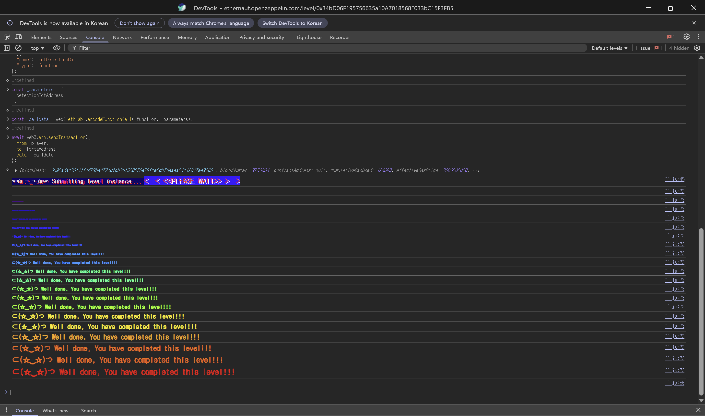

## Challenge
### Description
This level has a `CryptoVault` with a `sweepToken` function. `sweepToken` is a function commonly used to recover tokens that were mistakenly sent to a contract.
`CryptoVault` treats the `underlying` token as a protected asset, so that token must not be swept. Here, `underlying` is the DET token implemented in the `DoubleEntryPoint` contract, and `CryptoVault` holds 100 DET. It also holds 100 LGT, which is the `LegacyToken`.
The goal is to find where the bug in `CryptoVault` is, and to implement a `detection bot` to register with `Forta` so the tokens cannot be drained.
The part to pay attention to is the structure where an LGT call leads to a DET transfer.
### Code
```solidity
// SPDX-License-Identifier: MIT
pragma solidity ^0.8.0;

import "openzeppelin-contracts-08/access/Ownable.sol";
import "openzeppelin-contracts-08/token/ERC20/ERC20.sol";

interface DelegateERC20 {
    function delegateTransfer(address to, uint256 value, address origSender) external returns (bool);
}

interface IDetectionBot {
    function handleTransaction(address user, bytes calldata msgData) external;
}

interface IForta {
    function setDetectionBot(address detectionBotAddress) external;
    function notify(address user, bytes calldata msgData) external;
    function raiseAlert(address user) external;
}

contract Forta is IForta {
    mapping(address => IDetectionBot) public usersDetectionBots;
    mapping(address => uint256) public botRaisedAlerts;

    function setDetectionBot(address detectionBotAddress) external override {
        usersDetectionBots[msg.sender] = IDetectionBot(detectionBotAddress);
    }

    function notify(address user, bytes calldata msgData) external override {
        if (address(usersDetectionBots[user]) == address(0)) return;
        try usersDetectionBots[user].handleTransaction(user, msgData) {
            return;
        } catch {}
    }

    function raiseAlert(address user) external override {
        if (address(usersDetectionBots[user]) != msg.sender) return;
        botRaisedAlerts[msg.sender] += 1;
    }
}

contract CryptoVault {
    address public sweptTokensRecipient;
    IERC20 public underlying;

    constructor(address recipient) {
        sweptTokensRecipient = recipient;
    }

    function setUnderlying(address latestToken) public {
        require(address(underlying) == address(0), "Already set");
        underlying = IERC20(latestToken);
    }

    /*
    ...
    */

    function sweepToken(IERC20 token) public {
        require(token != underlying, "Can't transfer underlying token");
        token.transfer(sweptTokensRecipient, token.balanceOf(address(this)));
    }
}

contract LegacyToken is ERC20("LegacyToken", "LGT"), Ownable {
    DelegateERC20 public delegate;

    function mint(address to, uint256 amount) public onlyOwner {
        _mint(to, amount);
    }

    function delegateToNewContract(DelegateERC20 newContract) public onlyOwner {
        delegate = newContract;
    }

    function transfer(address to, uint256 value) public override returns (bool) {
        if (address(delegate) == address(0)) {
            return super.transfer(to, value);
        } else {
            return delegate.delegateTransfer(to, value, msg.sender);
        }
    }
}

contract DoubleEntryPoint is ERC20("DoubleEntryPointToken", "DET"), DelegateERC20, Ownable {
    address public cryptoVault;
    address public player;
    address public delegatedFrom;
    Forta public forta;

    constructor(address legacyToken, address vaultAddress, address fortaAddress, address playerAddress) {
        delegatedFrom = legacyToken;
        forta = Forta(fortaAddress);
        player = playerAddress;
        cryptoVault = vaultAddress;
        _mint(cryptoVault, 100 ether);
    }

    modifier onlyDelegateFrom() {
        require(msg.sender == delegatedFrom, "Not legacy contract");
        _;
    }

    modifier fortaNotify() {
        address detectionBot = address(forta.usersDetectionBots(player));

        // Cache old number of bot alerts
        uint256 previousValue = forta.botRaisedAlerts(detectionBot);

        // Notify Forta
        forta.notify(player, msg.data);

        // Continue execution
        _;

        // Check if alarms have been raised
        if (forta.botRaisedAlerts(detectionBot) > previousValue) revert("Alert has been triggered, reverting");
    }

    function delegateTransfer(address to, uint256 value, address origSender)
        public
        override
        onlyDelegateFrom
        fortaNotify
        returns (bool)
    {
        _transfer(origSender, to, value);
        return true;
    }
}
```
## Background

---

Normally an ERC20 token has a single contract address as its entry point. Users call `transfer`, `approve`, and `balanceOf` on that address, and other protocols identify the token by that address.
In this challenge, however, LGT and DET are linked. You call `LegacyToken.transfer`, but the actual balance movement happens in `DoubleEntryPoint.delegateTransfer`. A call coming into the LGT address leads to a DET balance movement.
In such a structure, a defense that compares only a single address, like `token != underlying`, is weak. The token address being called is LGT, but the asset actually leaving may be DET.

---

When `DoubleEntryPoint.delegateTransfer` is called, `fortaNotify` passes `msg.data` to the Forta bot as follows.
```solidity
forta.notify(player, msg.data);
```
`msg.data` consists of the 4-byte function selector at the front and the ABI-encoded arguments.
The calldata for `delegateTransfer(address to, uint256 value, address origSender)` has the following structure.
```plain text
0x00000000..0x00000003  function selector
0x00000004..            to
                        value
                        origSender
```
In the bot, `abi.decode`-ing `msgData[4:]` extracts `to`, `value`, and `origSender`. The value to look at in this challenge is `origSender`.

---

Forta does not fix vulnerable code; it monitors transactions as they execute. A user registers their own `detection bot`, and DET's `delegateTransfer` passes the calldata to the bot before executing.
If the bot calls `raiseAlert`, `botRaisedAlerts` increases. Afterwards `fortaNotify` checks whether the alert count increased, and if it did, reverts the entire transfer.
## Code analysis

---

`CryptoVault`'s sweep condition is below.
```solidity
function sweepToken(IERC20 token) public {
    require(token != underlying, "Can't transfer underlying token");
    token.transfer(sweptTokensRecipient, token.balanceOf(address(this)));
}
```
`CryptoVault` prevents sweeping only the token registered as `underlying`. Here `underlying` is the DET address.
On the surface, passing DET directly and calling `sweepToken(DET)` is blocked by the `require`. But calling `sweepToken(LGT)` makes `token` the LGT address, so it passes the `token != underlying` condition.
The problem is that this comparison does not check the token that will actually move. If `token.transfer(...)` ended as an ordinary LGT transfer it would be fine, but LGT can be delegated to DET.

---

Next is `LegacyToken`'s delegate flow.
```solidity
function transfer(address to, uint256 value) public override returns (bool) {
    if (address(delegate) == address(0)) {
        return super.transfer(to, value);
    } else {
        return delegate.delegateTransfer(to, value, msg.sender);
    }
}
```
If `delegate` is set on `LegacyToken`, `transfer` does not move its own balance but calls `delegate.delegateTransfer` instead.
In the `CryptoVault.sweepToken(LGT)` flow, the one calling LGT's `transfer` is `CryptoVault`, so here `msg.sender` is the `CryptoVault` address. So `CryptoVault` goes into the third argument of `delegateTransfer`, `origSender`.
In other words, the flow continues as follows.
```plain text
CryptoVault.sweepToken(LGT)
-> LGT.transfer(sweptTokensRecipient, LGT.balanceOf(CryptoVault))
-> DET.delegateTransfer(sweptTokensRecipient, value, CryptoVault)
```
The address comparison passed on the LGT basis, but it is actually DET's `delegateTransfer` that is dangerous.

---

The actual transfer happens in `DoubleEntryPoint`.
```solidity
function delegateTransfer(address to, uint256 value, address origSender)
    public
    override
    onlyDelegateFrom
    fortaNotify
    returns (bool)
{
    _transfer(origSender, to, value);
    return true;
}
```
Because of `onlyDelegateFrom`, `delegateTransfer` only accepts calls coming from the LGT contract. Rather than preventing the attack, this condition formalizes the bypass route through LGT.
The actual transfer is `_transfer(origSender, to, value)`. If `origSender` is `CryptoVault`, then from the DET contract's perspective this is a transfer sending `CryptoVault`'s DET to `sweptTokensRecipient`.
`CryptoVault` decides whether a sweep is allowed by looking only at the `token` address. It failed to account for the structure where the call comes in through a different entry point, LGT, yet DET's balance moves.

---

The last piece is the Forta notification point.
```solidity
modifier fortaNotify() {
    address detectionBot = address(forta.usersDetectionBots(player));
    uint256 previousValue = forta.botRaisedAlerts(detectionBot);

    forta.notify(player, msg.data);
    _;

    if (forta.botRaisedAlerts(detectionBot) > previousValue) revert("Alert has been triggered, reverting");
}
```
`fortaNotify` passes `msg.data` to the bot before `delegateTransfer` executes. If the bot detects a call where `origSender == cryptoVault` and calls `raiseAlert`, then after `delegateTransfer` runs, the increase in alert count is detected and the transaction reverts.
The bot just needs to check whether `origSender` is `CryptoVault`, rather than `to` or `value`. Any call that drains DET out of `CryptoVault` should be blocked.
## Solution
`CryptoVault` only blocks the DET address as `underlying`, but LGT's `transfer` leads to DET's `delegateTransfer`. So calling `sweepToken(LGT)` passes the condition while DET can be drained.
The fix is to have the Forta bot read the calldata when `delegateTransfer` executes, and raise an alert if `origSender` is `CryptoVault`. Since `fortaNotify` reverts the transfer upon seeing the alert increase, DET does not get drained.
After deploying the bot, register its address with `Forta.setDetectionBot`.
### Exploit
```solidity
// SPDX-License-Identifier: MIT
pragma solidity ^0.8.0;

interface IForta {
    function raiseAlert(address user) external;
}

contract DetectionBot {
    address public cryptoVault;

    constructor(address _cryptovault) {
        cryptoVault = _cryptovault;
    }

    function handleTransaction(address user, bytes calldata msgData) external {
        (,, address origSender) = abi.decode(msgData[4:], (address, uint256, address));

        if (origSender == cryptoVault) {
            IForta(msg.sender).raiseAlert(user);
        }
    }
}
```

