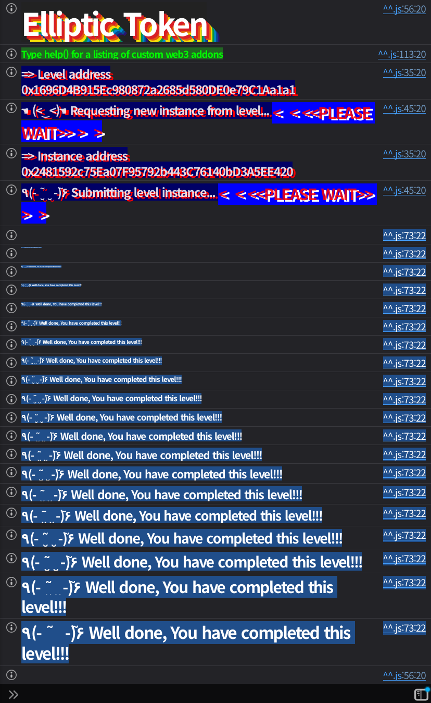

## Challenge
### Prompt
BOB created and owns a new ERC20 token with an elliptic curve–based <br>signed voucher redemption system called EllipticToken (\$ETK). Bob can <br>create vouchers off-chain that can be redeemed on-chain for \$ETK. The <br>contract also includes a permit system based on elliptic curve <br>signatures.
Bob is a lazy developer and “optimized” some steps of the ECDSA algorithm. Can you find the flaw?
Your goal is to steal the \$ETK tokens that ALICE (`0xA11CE84AcB91Ac59B0A4E2945C9157eF3Ab17D4e`) just redeemed.
Things that might help:
- Look for any missing step in the [Elliptic Curve Digital Signature Algorithm (ECDSA)](https://en.wikipedia.org/wiki/Elliptic_Curve_Digital_Signature_Algorithm).

Good luck. Elliptic curves do not forgive domain confusion.
### Code
```solidity
// SPDX-License-Identifier: MIT
pragma solidity 0.8.28;

import {Ownable} from "openzeppelin-contracts-08/access/Ownable.sol";
import {ECDSA} from "openzeppelin-contracts-08/utils/cryptography/ECDSA.sol";
import {ERC20} from "openzeppelin-contracts-08/token/ERC20/ERC20.sol";

contract EllipticToken is Ownable, ERC20 {
    error HashAlreadyUsed();
    error InvalidOwner();
    error InvalidReceiver();
    error InvalidSpender();

    constructor() ERC20("EllipticToken", "ETK") {}

    mapping(bytes32 => bool) public usedHashes;

    function redeemVoucher(
        uint256 amount,
        address receiver,
        bytes32 salt,
        bytes memory ownerSignature,
        bytes memory receiverSignature
    ) external {
        bytes32 voucherHash = keccak256(abi.encodePacked(amount, receiver, salt));
        require(!usedHashes[voucherHash], HashAlreadyUsed());

        // Verify that the owner emitted the voucher
        require(ECDSA.recover(voucherHash, ownerSignature) == owner(), InvalidOwner());

        // Verify that the receiver accepted the voucher
        require(ECDSA.recover(voucherHash, receiverSignature) == receiver, InvalidReceiver());

        // Nullify the voucher
        usedHashes[voucherHash] = true;

        // Mint the tokens
        _mint(receiver, amount);
    }

    function permit(uint256 amount, address spender, bytes memory tokenOwnerSignature, bytes memory spenderSignature)
        external
    {
        bytes32 permitHash = keccak256(abi.encode(amount));
        require(!usedHashes[permitHash], HashAlreadyUsed());
        require(!usedHashes[bytes32(amount)], HashAlreadyUsed());

        // Recover the token owner that emitted the permit
        address tokenOwner = ECDSA.recover(bytes32(amount), tokenOwnerSignature);

        // Verify that the spender accepted the permit
        bytes32 permitAcceptHash = keccak256(abi.encodePacked(tokenOwner, spender, amount));
        require(ECDSA.recover(permitAcceptHash, spenderSignature) == spender, InvalidSpender());

        // Nullify the permit
        usedHashes[permitHash] = true;

        // Approve the spender
        _approve(tokenOwner, spender, amount);
    }
}
```
## Background

---

In ECDSA, let the private key be `d` and the public key be Q=dG. With the message hash as `e`, a signature is usually represented as `(r, s, v)`. Here `r` comes from the x-coordinate of the point R=kG built from the nonce `k`, and `s` is produced by the following equation.
$$
s \equiv k^{-1}(e + rd) \pmod n
$$
A verifier can check the signature without knowing the private key, using only the public key Q, the message hash `e`, and the signature `(r, s)`. First compute `w = s^{-1}`, then form the two values:
$$
u_1 \equiv ew \pmod n, \quad u_2 \equiv rw \pmod n
$$
Then compute the point R'.
$$
R' = u_1G + u_2Q
$$
Verification consists of checking that the value taken from R''s x-coordinate equals `r`. In other words, ECDSA verification ultimately asks "can this `(e, r, s)` combination produce the same point with respect to the public key Q?"

---

In ECDSA, a problem arises if the application does not securely fix the message hash `e`. If the attacker can also choose the `e` that goes into the verification equation, then even without the private key they can build a valid `(e, r, s)` combination for any public key Q.
Suppose we pick arbitrary `u1`, `u2` and compute the point:
$$
R = u_1G + u_2Q
$$
Then obtain `r` from R's x-coordinate and fit `s` and `e` as follows.
$$
s \equiv r u_2^{-1} \pmod n
$$
$$
e \equiv r u_1 u_2^{-1} \pmod n
$$
Then during verification we get `e / s = u1` and `r / s = u2`, so we reconstruct the same R. As a result `(r, s)` looks like a valid signature over the message hash `e`. We did not sign a document with a particular meaning; we worked backward to fit values that satisfy the verification equation.

---

For a proper permit, the message should include "who allows whom, how much, on which contract, on which chain, with which nonce." This is exactly why ERC-2612 and EIP-712 use this kind of structure.
When `permit()` verifies the token owner's signature, it uses `bytes32(amount)` itself as the message hash. `amount` is a value the user chooses, and that very value becomes the ECDSA digest. In other words, there is no domain separation between the meaning of the permit and the signature digest.
## Challenge code analysis

---

First, the information we can get from `redeemVoucher()`:
```solidity
function redeemVoucher(
    uint256 amount,
    address receiver,
    bytes32 salt,
    bytes memory ownerSignature,
    bytes memory receiverSignature
) external {
    bytes32 voucherHash = keccak256(abi.encodePacked(amount, receiver, salt));
    require(!usedHashes[voucherHash], HashAlreadyUsed());

    require(ECDSA.recover(voucherHash, ownerSignature) == owner(), InvalidOwner());
    require(ECDSA.recover(voucherHash, receiverSignature) == receiver, InvalidReceiver());

    usedHashes[voucherHash] = true;
    _mint(receiver, amount);
}
```
`redeemVoucher()` checks Bob's signature and the receiver's signature over `voucherHash`. According to the challenge description, Alice has already redeemed a voucher. That transaction's calldata contains Alice's `receiverSignature`, and we can also recompute `voucherHash` from `amount`, `receiver`, and `salt`.
With this information we can recover Alice's public key Q off-chain. Solidity's `ECDSA.recover` only returns an address, but feeding the same `(voucherHash, receiverSignature)` into an off-chain ECDSA library also gives the public key. The Q obtained here is the public key we need to forge signatures.

---

The part of `permit()` that recovers `tokenOwner` is below.
```solidity
function permit(uint256 amount, address spender, bytes memory tokenOwnerSignature, bytes memory spenderSignature)
    external
{
    bytes32 permitHash = keccak256(abi.encode(amount));
    require(!usedHashes[permitHash], HashAlreadyUsed());
    require(!usedHashes[bytes32(amount)], HashAlreadyUsed());

    address tokenOwner = ECDSA.recover(bytes32(amount), tokenOwnerSignature);

    bytes32 permitAcceptHash = keccak256(abi.encodePacked(tokenOwner, spender, amount));
    require(ECDSA.recover(permitAcceptHash, spenderSignature) == spender, InvalidSpender());

    usedHashes[permitHash] = true;
    _approve(tokenOwner, spender, amount);
}
```
Here `tokenOwner` is computed as `ECDSA.recover(bytes32(amount), tokenOwnerSignature)`. That is, `amount` is not just an approval quantity but also plays the role of the ECDSA message hash.
The attacker builds a valid `(e, r, s, v)` for Alice's public key Q, then sets `amount = uint256(e)`. Then `ECDSA.recover(bytes32(amount), tokenOwnerSignature)` returns Alice's address. The contract is fooled into thinking Alice issued a permit for `amount`.

---

The `spenderSignature` side we can build ourselves.
```solidity
bytes32 permitAcceptHash = keccak256(abi.encodePacked(tokenOwner, spender, amount));
require(ECDSA.recover(permitAcceptHash, spenderSignature) == spender, InvalidSpender());
```
The second signature is there to confirm that the spender accepted the permit. We will put the player's address as the spender, and we hold the player's private key. We can directly produce a signature over `keccak256(abi.encodePacked(ALICE, player, amount))`.
So what we need is not Alice's private key but a `tokenOwnerSignature` that recovers to Alice, plus a `spenderSignature` the player builds directly.

---

Finally, the `usedHashes` check:
```solidity
bytes32 permitHash = keccak256(abi.encode(amount));
require(!usedHashes[permitHash], HashAlreadyUsed());
require(!usedHashes[bytes32(amount)], HashAlreadyUsed());
```
The value that `redeemVoucher()` marked as used is `voucherHash`. Since the exploit uses the freshly built `e` as `amount`, both `bytes32(amount)` and `keccak256(abi.encode(amount))` differ from the hash used in the existing voucher.
Also, `amount` is a value far larger than Alice's actual balance. `_approve(tokenOwner, spender, amount)` opens a large allowance, and after that we just pull out exactly Alice's real balance via `transferFrom()`.
## Solution
From the transaction Alice already redeemed, obtain the `receiverSignature` and `voucherHash`, and recover Alice's public key Q. Then, as shown above, build a new message hash `e` and signature `(r, s, v)` that are valid with respect to Q.
In this solution, the following values were precomputed off-chain.
```solidity
uint256 private constant FORGED_AMOUNT =
    0xebf90284f84cb6e234a8ecf9393afda9c0ede46f4d6df12bd11a4757c42903c0;

bytes private constant ALICE_FORGED_SIGNATURE =
    hex"0ab5b8262a97582b1971d68211e37be02ac5d16339cb0278edffc0a465d64aac7b06ed5cd7bc5798089feda2fac7b577ef49e1f2f84a6d2392ff26078f2192a01c";
```
`FORGED_AMOUNT` is the `amount` that goes into the permit and simultaneously the ECDSA digest interpreted as `bytes32(amount)`. `ALICE_FORGED_SIGNATURE` is the signature that recovers to Alice's address over this digest.
Now the player only needs to build the `spenderSignature` with its own private key. If the `permit()` call succeeds, Alice ends up having granted the player a very large allowance, and we can pull Alice's ETK with `transferFrom(ALICE, player, aliceBalance)`.
### Exploit
```solidity
// SPDX-License-Identifier: MIT
pragma solidity ^0.8.28;

import "forge-std/Script.sol";

interface IEllipticToken {
    function balanceOf(address account) external view returns (uint256);
    function permit(uint256 amount, address spender, bytes calldata tokenOwnerSignature, bytes calldata spenderSignature)
        external;
    function transferFrom(address from, address to, uint256 amount) external returns (bool);
}

contract Sol35 is Script {
    address private constant ALICE = 0xA11CE84AcB91Ac59B0A4E2945C9157eF3Ab17D4e;

    uint256 private constant FORGED_AMOUNT =
        0xebf90284f84cb6e234a8ecf9393afda9c0ede46f4d6df12bd11a4757c42903c0;

    bytes private constant ALICE_FORGED_SIGNATURE =
        hex"0ab5b8262a97582b1971d68211e37be02ac5d16339cb0278edffc0a465d64aac7b06ed5cd7bc5798089feda2fac7b577ef49e1f2f84a6d2392ff26078f2192a01c";

    function run() external {
        uint256 privateKey = vm.envUint("PRIVATE_KEY");
        address player = vm.addr(privateKey);
        IEllipticToken token = IEllipticToken(vm.envAddress("ELLIPTIC_TOKEN_INSTANCE"));
        uint256 aliceBalance = token.balanceOf(ALICE);

        bytes32 permitAcceptHash = keccak256(abi.encodePacked(ALICE, player, FORGED_AMOUNT));
        (uint8 v, bytes32 r, bytes32 s) = vm.sign(privateKey, permitAcceptHash);
        bytes memory spenderSignature = abi.encodePacked(r, s, v);

        vm.startBroadcast(privateKey);

        token.permit(FORGED_AMOUNT, player, ALICE_FORGED_SIGNATURE, spenderSignature);
        require(token.transferFrom(ALICE, player, aliceBalance), "transferFrom failed");
        require(token.balanceOf(ALICE) == 0, "alice still has ETK");

        vm.stopBroadcast();
    }
}
```

