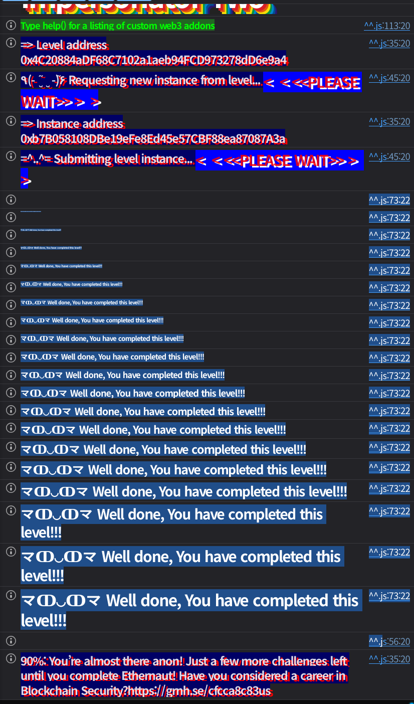

## Challenge
### Description
The goal of this level is for you to steal all the funds from the contract.
Things that might help:
- Look carefully at the 2 signatures that the owner of the contract used to lock it and set the admin.
### Code
```solidity
// SPDX-License-Identifier: MIT
pragma solidity 0.8.28;

import {Ownable} from "openzeppelin-contracts-08/access/Ownable.sol";
import {ECDSA} from "openzeppelin-contracts-08/utils/cryptography/ECDSA.sol";
import {Strings} from "openzeppelin-contracts-08/utils/Strings.sol";

contract ImpersonatorTwo is Ownable {
    using Strings for uint256;

    error NotAdmin();
    error InvalidSignature();
    error FundsLocked();

    address public admin;
    uint256 public nonce;
    bool locked;

    constructor() payable {}

    modifier onlyAdmin() {
        require(msg.sender == admin, NotAdmin());
        _;
    }

    function setAdmin(bytes memory signature, address newAdmin) public {
        string memory message = string(abi.encodePacked("admin", nonce.toString(), newAdmin));
        require(_verify(hash_message(message), signature), InvalidSignature());
        nonce++;
        admin = newAdmin;
    }

    function switchLock(bytes memory signature) public {
        string memory message = string(abi.encodePacked("lock", nonce.toString()));
        require(_verify(hash_message(message), signature), InvalidSignature());
        nonce++;
        locked = !locked;
    }

    function withdraw() public onlyAdmin {
        require(!locked, FundsLocked());
        payable(admin).transfer(address(this).balance);
    }

    function hash_message(string memory message) public pure returns (bytes32) {
        return ECDSA.toEthSignedMessageHash(abi.encodePacked(message));
    }

    function _verify(bytes32 hash, bytes memory signature) internal view returns (bool) {
        return ECDSA.recover(hash, signature) == owner();
    }
}
```
## Background

---

With the message hash $z$, the private key $d$, and the secp256k1 group order $n$, an ECDSA signature is produced roughly as follows.
$$
s \equiv k^{-1}(z + rd) \pmod n
$$
Here $k$ is a nonce that must be freshly chosen for each signature.
The $r$ that goes into the signature comes from the x-coordinate of $kG$.

If the $r$ of two signatures over different messages is the same, that is a strong signal that the same $k$ was reused.

---

Suppose two messages $z_1$ and $z_2$ were signed with the same private key $d$ and the same $k$.
$$
s_1 \equiv k^{-1}(z_1 + rd) \pmod n
$$
$$
s_2 \equiv k^{-1}(z_2 + rd) \pmod n
$$
Subtracting the two equations cancels the private key term.
$$
s_1 - s_2 \equiv k^{-1}(z_1-z_2) \pmod n
$$
This gives $k$.
$$
k \equiv (z_1-z_2)(s_1-s_2)^{-1} \pmod n
$$
And substituting back into the first equation yields the private key as well.
$$
d \equiv (s_1k-z_1)r^{-1} \pmod n
$$
So two signatures with the same $r$ and their message hashes are enough to recover the owner's private key.

---

The contract uses `ECDSA.toEthSignedMessageHash`. So what gets signed is not a plain `keccak256(message)` but a hash with the following prefix.
```solidity
keccak256(abi.encodePacked("\x19Ethereum Signed Message:\n", message.length, message))
```
In the `setAdmin` message, `abi.encodePacked("admin", nonce.toString(), newAdmin)`, `newAdmin` is appended as a raw 20-byte address value, not a `0x...` string.
## Code analysis

---

The hint tells us to look at the two signatures the owner used to lock the contract and to set the admin. When the instance is created, the factory calls them in this order.
```solidity
bytes constant SWITCH_LOCK_SIG = abi.encodePacked(
    hex"e5648161e95dbf2bfc687b72b745269fa906031e2108118050aba59524a23c40", // r
    hex"70026fc30e4e02a15468de57155b080f405bd5b88af05412a9c3217e028537e3", // s
    uint8(27) // v
);
bytes constant SET_ADMIN_SIG = abi.encodePacked(
    hex"e5648161e95dbf2bfc687b72b745269fa906031e2108118050aba59524a23c40", // r
    hex"4c3ac03b268ae1d2aca1201e8a936adf578a8b95a49986d54de87cd0ccb68a79", // s
    uint8(27) // v
);

address constant OWNER = 0x03E2cf81BBE61D1fD1421aFF98e8605a5A9e953a;
address constant ADMIN = 0xADa4aFfe581d1A31d7F75E1c5a3A98b2D4C40f68;

instance.transferOwnership(OWNER);
instance.switchLock(SWITCH_LOCK_SIG);
instance.setAdmin(SET_ADMIN_SIG, ADMIN);
```
The two signatures have the same `r`.
```plain text
r = e5648161e95dbf2bfc687b72b745269fa906031e2108118050aba59524a23c40
```
Since the signature nonce $k$ was reused, knowing the message hashes used for `switchLock` and `setAdmin` lets us recover the owner's private key.

---

Based on the factory call order, `nonce` starts at 0.
```solidity
function switchLock(bytes memory signature) public {
    string memory message = string(abi.encodePacked("lock", nonce.toString()));
    require(_verify(hash_message(message), signature), InvalidSignature());
    nonce++;
    locked = !locked;
}
```
The first call is `switchLock`, so the message is `"lock0"`. After this call `nonce` becomes 1 and `locked` becomes `true`.
```solidity
function setAdmin(bytes memory signature, address newAdmin) public {
    string memory message = string(abi.encodePacked("admin", nonce.toString(), newAdmin));
    require(_verify(hash_message(message), signature), InvalidSignature());
    nonce++;
    admin = newAdmin;
}
```
The second call is `setAdmin`, so the message is `abi.encodePacked("admin", "1", ADMIN)`. After this call `nonce` becomes 2 and `admin` becomes the initial admin address.

---

Signature verification only checks whether it recovers to the owner address.
```solidity
function _verify(bytes32 hash, bytes memory signature) internal view returns (bool) {
    return ECDSA.recover(hash, signature) == owner();
}
```
It does not store whether a signature has been used, nor does it check that the signer is `msg.sender`. With the owner's private key recovered, we can sign new owner messages for the current `nonce`.
There are two conditions to withdraw.
```solidity
function withdraw() public onlyAdmin {
    require(!locked, FundsLocked());
    payable(admin).transfer(address(this).balance);
}
```
`admin` must be our address, and `locked` must be `false`. The initial state is `nonce = 2`, `locked = true`, `admin = ADMIN`, so we change admin with a signature over `admin2<player>`, then turn the lock back off with a signature over `lock3`.
## Solution
Recover the owner's private key from the two initial signatures.
1. The initial `switchLock` signature is a signature over `lock0`.
2. The initial `setAdmin` signature is a signature over `abi.encodePacked("admin", "1", INITIAL_ADMIN)`.
3. Since the `r` of the two signatures is the same, the same $k$ was reused.
4. Recover the owner's private key $d$ with the formula above.
5. Sign the `admin2<player>` message with the current player address and call `setAdmin`.
6. The next nonce is then 3, so sign the `lock3` message and call `switchLock`.
7. Now `admin == player` and `locked == false`, so withdraw the balance with `withdraw`.

`vm.sign` produces a signature from an arbitrary private key and digest, so the recovered owner private key only produces the bytes signatures the challenge contract requires. The transactions are sent with the player's `PRIVATE_KEY`.
### Exploit
```solidity
// SPDX-License-Identifier: MIT
pragma solidity ^0.8.28;

import "forge-std/Script.sol";

interface IImpersonatorTwo {
    function nonce() external view returns (uint256);
    function owner() external view returns (address);
    function admin() external view returns (address);
    function setAdmin(bytes memory signature, address newAdmin) external;
    function switchLock(bytes memory signature) external;
    function withdraw() external;
}

contract Sol37 is Script {
    uint256 private constant SECP256K1_N = 0xFFFFFFFFFFFFFFFFFFFFFFFFFFFFFFFEBAAEDCE6AF48A03BBFD25E8CD0364141;
    uint256 private constant SECP256K1_HALF_N = 0x7FFFFFFFFFFFFFFFFFFFFFFFFFFFFFFF5D576E7357A4501DDFE92F46681B20A0;

    uint256 private constant R = 0xe5648161e95dbf2bfc687b72b745269fa906031e2108118050aba59524a23c40;
    uint256 private constant SWITCH_LOCK_S = 0x70026fc30e4e02a15468de57155b080f405bd5b88af05412a9c3217e028537e3;
    uint256 private constant SET_ADMIN_S = 0x4c3ac03b268ae1d2aca1201e8a936adf578a8b95a49986d54de87cd0ccb68a79;

    address private constant OWNER = 0x03E2cf81BBE61D1fD1421aFF98e8605a5A9e953a;
    address private constant INITIAL_ADMIN = 0xADa4aFfe581d1A31d7F75E1c5a3A98b2D4C40f68;

    function run() external {
        uint256 privateKey = vm.envUint("PRIVATE_KEY");
        address player = vm.addr(privateKey);
        IImpersonatorTwo target = IImpersonatorTwo(vm.envAddress("IMPERSONATOR_TWO_INSTANCE"));

        uint256 ownerPrivateKey = _recoverOwnerPrivateKey();
        require(vm.addr(ownerPrivateKey) == OWNER, "owner key recovery failed");
        require(target.owner() == OWNER, "unexpected owner");

        uint256 nonce = target.nonce();
        bytes32 setAdminHash = _hashMessage(abi.encodePacked("admin", _toString(nonce), player));
        bytes memory setAdminSignature = _sign(ownerPrivateKey, setAdminHash);

        bytes32 switchLockHash = _hashMessage(abi.encodePacked("lock", _toString(nonce + 1)));
        bytes memory switchLockSignature = _sign(ownerPrivateKey, switchLockHash);

        vm.startBroadcast(privateKey);
        target.setAdmin(setAdminSignature, player);
        target.switchLock(switchLockSignature);
        target.withdraw();
        vm.stopBroadcast();

        require(target.admin() == player, "admin was not changed");
        require(address(target).balance == 0, "funds still remain");
    }

    function _recoverOwnerPrivateKey() private view returns (uint256) {
        bytes32 lockHash = _hashMessage(abi.encodePacked("lock", "0"));
        bytes32 adminHash = _hashMessage(abi.encodePacked("admin", "1", INITIAL_ADMIN));

        uint256 k = mulmod(
            _subMod(uint256(lockHash), uint256(adminHash)),
            _modInverse(_subMod(SWITCH_LOCK_S, SET_ADMIN_S)),
            SECP256K1_N
        );

        return mulmod(_subMod(mulmod(SWITCH_LOCK_S, k, SECP256K1_N), uint256(lockHash)), _modInverse(R), SECP256K1_N);
    }

    function _sign(uint256 privateKey, bytes32 digest) private pure returns (bytes memory) {
        (uint8 v, bytes32 r, bytes32 s) = vm.sign(privateKey, digest);
        uint256 sValue = uint256(s);

        if (sValue > SECP256K1_HALF_N) {
            s = bytes32(SECP256K1_N - sValue);
            v = 55 - v;
        }

        return abi.encodePacked(r, s, v);
    }

    function _hashMessage(bytes memory message) private pure returns (bytes32) {
        return keccak256(abi.encodePacked("\x19Ethereum Signed Message:\n", _toString(message.length), message));
    }

    function _modInverse(uint256 value) private view returns (uint256) {
        return _modExp(value, SECP256K1_N - 2, SECP256K1_N);
    }

    function _modExp(uint256 base, uint256 exponent, uint256 modulus) private view returns (uint256 result) {
        bytes memory input = abi.encode(uint256(32), uint256(32), uint256(32), base, exponent, modulus);
        bool success;

        assembly {
            success := staticcall(gas(), 0x05, add(input, 0x20), mload(input), 0x00, 0x20)
            result := mload(0x00)
        }

        require(success, "modexp failed");
    }

    function _subMod(uint256 left, uint256 right) private pure returns (uint256) {
        return addmod(left % SECP256K1_N, SECP256K1_N - (right % SECP256K1_N), SECP256K1_N);
    }

    function _toString(uint256 value) private pure returns (string memory) {
        if (value == 0) {
            return "0";
        }

        uint256 temp = value;
        uint256 digits;

        while (temp != 0) {
            digits++;
            temp /= 10;
        }

        bytes memory buffer = new bytes(digits);

        while (value != 0) {
            digits--;
            buffer[digits] = bytes1(uint8(48 + (value % 10)));
            value /= 10;
        }

        return string(buffer);
    }
}
```

