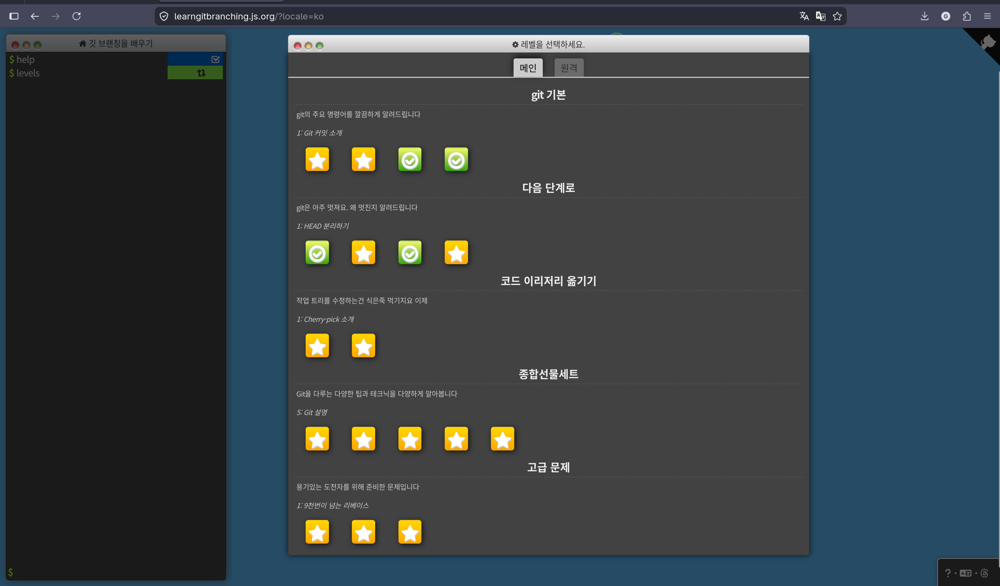
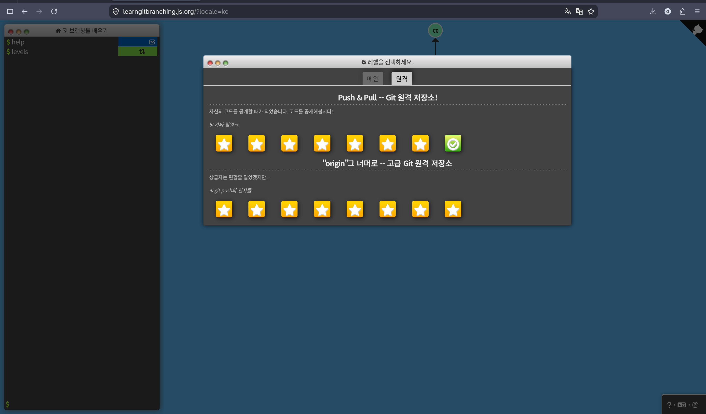

Git is a tool for creating commits, moving branches, and merging diverged work back together. I found it much easier to understand when I focused on where pointers move in the commit graph.

## 1. Git's basic units

A commit is a record that saves a particular point in time of the project. A branch is a label that points to a commit, and `HEAD` is where I am currently looking.

- Commit: a point where changes are saved
- Branch: a pointer to a specific commit
- HEAD: the location I am currently working at
- Remote-tracking branch: a pointer that remembers the state of a remote branch locally

## 2. Recording

Changes first go to the staging area and are then recorded as a commit.


`git add` stages changes from the working files into the staging area, and `git commit` saves only the staged content as a new commit.

- `git add .` stage changes under the current directory
- `git add <file>` stage only a specific file
- `git commit -m "message"` save staged changes as a commit
- `git commit -am "message"` add and commit already-tracked files in one step
- `git commit --amend` edit the message or content of the last commit

`--amend` rebuilds the last commit as a new commit. Use it carefully on commits already pushed to a remote.

## 3. Moving

Branches are created to split up work streams. If you move to a branch you created and then commit, that branch pointer moves to the new commit.


If `HEAD` is attached to `feature`, your current working location is `feature`. Committing in this state appends the new commit after `feature`.

- `git branch` list branches
- `git branch <branch>` create a new branch at the current location
- `git branch -d <branch>` delete a merged branch
- `git branch -D <branch>` force-delete a branch
- `git branch -f <branch> <where>` force-move a branch to a specific location
- `git checkout <branch>` / `git switch <branch>` switch branches
- `git checkout -b <branch>` / `git switch -c <branch>` create a branch and switch to it

With relative references you can point to a location without knowing the commit hash.


`HEAD^` points to the parent of the current commit, and `HEAD~2` points to the commit two steps up from the current location.

- `HEAD^` parent of the current commit
- `HEAD~3` the commit three steps up from the current location
- `<branch>^2` the second parent of a merge commit

## 4. Merging

The main ways to combine branches are `merge` and `rebase`. Both combine work but leave different commit graphs.


`merge` combines another branch's changes into the current branch. If a fast-forward is possible, only the branch pointer moves with no merge commit, and `--no-ff` forces a merge commit. The merge in the figure above is a non-fast-forward case.

`rebase` restacks the working commits after a new base branch so they form a single line.

- `git merge <branch>` merge the specified branch into the current branch
- `git merge --continue` continue a merge after resolving conflicts
- `git merge --abort` abort an in-progress merge
- `git merge --no-ff <branch>` create a merge commit even when fast-forward is possible
- `git rebase <newbase>` restack the current branch's commits onto a new base
- `git rebase <newbase> <branch>` relocate the specified branch onto a new base

Use rebase carefully on commits you have already shared, because the commit hashes change.

## 5. Undoing and selecting commits

Of the undo commands, `reset` moves the branch pointer into the past, while `revert` records the undo as a new commit.


`reset` changes where the current branch points. `revert` leaves the existing commit in place and adds a new commit with the opposite changes.

- `git reset HEAD~1` move the current branch one commit back
- `git reset --soft HEAD~1` undo only the commit, keep staging
- `git reset --mixed HEAD~1` undo the commit and staging, keep working files
- `git reset --hard HEAD~1` undo the commit, staging, and working file changes
- `git revert HEAD` create a new commit that undoes the changes

Local commits you have not yet shared can be cleaned up with `reset`, while commits already shared are safer to undo with `revert`.


`cherry-pick` picks only the changes of a specific commit from another branch and appends it as a new commit after the current branch.

- `git cherry-pick <commit1> <commit2>` apply only specific commits to the current branch

`cherry-pick` is safer to run with a clean working tree. If a conflict occurs, resolve it and then continue.


`rebase -i` reorganizes the order, messages, and inclusion of recent commits.

- `git rebase -i HEAD~3` edit the order, messages, and inclusion of recent commits

The commonly used options are `pick`, `reword`, `edit`, `squash`, `fixup`, and `drop`. Here you decide whether to keep a commit, change its message, combine it, or remove it.

## 6. Marking and temporary storage

A tag is a fixed label attached to an important commit. stash is for briefly setting aside changes that are not quite ready to commit.

- `git tag <tag>` add a lightweight tag at the current HEAD
- `git tag <tag> <commit>` add a lightweight tag at the specified commit
- `git tag -a <tag> -m "message"` create an annotated tag
- `git push origin <tag>` upload a specific tag to the remote
- `git push origin --tags` upload all local tags to the remote
- `git describe` describe the current location relative to the nearest annotated tag
- `git describe --tags` describe relative to the nearest tag, including lightweight tags


`stash` lets you temporarily store in-progress changes and reapply them later.

- `git stash` temporarily save working directory/staging changes of tracked files
- `git stash -u` save including untracked files
- `git stash -a` save including ignored files
- `git stash list` list stashes
- `git stash pop` reapply saved changes and try to remove them from the stash list

## 7. Remote repositories and collaboration

A remote repository is a place to share my work and receive others' work. You need to know how `fetch`, `pull`, and `push` differ.


`fetch` only pulls the remote state into the remote-tracking branches. `pull` integrates the fetched remote changes into the current branch, and `push` uploads local commits to the remote repository.

- `git clone <url>` clone a remote repository locally
- `git fetch` fetch remote changes without merging them into the current branch
- `git pull` after fetching, integrate the remote changes into the current branch
- `git pull --rebase` after fetching, integrate by rebase instead of merge
- `git pull --no-rebase` after fetching, integrate by merge
- `git pull --ff-only` integrate only when a fast-forward is possible
- `git push` upload local commits to the remote
- `git push -u <remote> <branch>` push and set up the upstream tracking relationship

Remote-tracking branches are usually shown as `origin/main`. The actual remote branch lives in the remote repository, and the local `origin/main` remembers the remote state as of the last communication. In learning environments it may appear shortened as `o/main`.

- `git checkout -b <branch> <remote>/<branch>` create and track a new local branch based on a remote branch
- `git branch -u <remote>/<branch> <local-branch>` make an existing local branch track a remote branch
- `git fetch <remote> <source>:<destination>` fetch a remote source into a local destination
- `git pull <remote> <source>:<destination>` fetch and then integrate into the current branch
- `git push <remote> <source>:<destination>` upload a local source to a remote destination
- `git push <remote> :<branch>` delete a remote branch

## 8. Common workflows

### Working on a new feature

```bash
git checkout -b <branch>
git add .
git commit -m "message"
git push -u <remote> <branch>
```

### When the remote is ahead and push is rejected

```bash
git pull --rebase
git push
```

or

```bash
git fetch
git rebase <remote>/<branch>
git push
```

### When you accidentally committed to main

If you have not yet pushed to the remote `main` and have no uncommitted working changes, you can create a new branch first and then reset `main` back to the remote state, as below. `--hard` can also undo working directory changes, so check `git status` first.

```bash
git status
git branch <new-branch>
git reset --hard <remote>/main
git switch <new-branch>
git push -u <remote> <new-branch>
```

If the commit has already been pushed to the remote `main`, it is safer to use `revert` instead of this workflow, or to handle it separately after agreeing with the team.

## 9. Commands to be careful with

- `git reset --hard <where>` actual file changes can be lost
- `git push <remote> :<branch>` delete a remote branch
- `git branch -f <branch> <where>` force-move a branch pointer
- `git rebase <shared-branch>` can change the hashes of shared commits
- `git commit --amend` rewrite the last commit as a new commit




