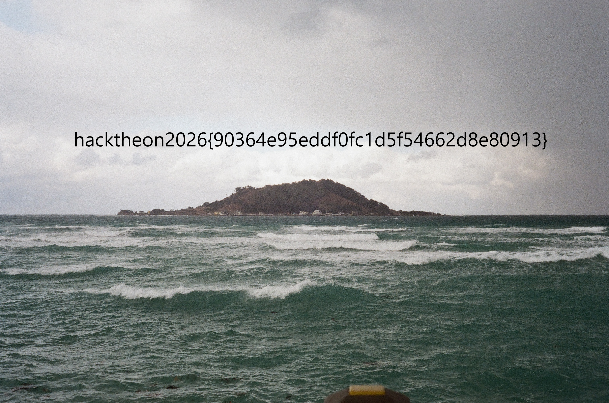

# Brain Outside

### Summary

The `client` binary does not contain the actual verification code. It is a loader: it maps each stage sent by the server into RWX `mmap` memory, runs it, and sends back only the return value. So I could follow the protocol and collect the PNG fragments without executing every stage.

### Analysis

The loader does very little.

```c
read(sock, &len, 4);
buf = mmap(..., PROT_READ | PROT_WRITE | PROT_EXEC, ...);
read(sock, buf, len);
ret = ((uint64_t (*)())buf)();
send(sock, &ret, 8);
```

The decrypt stub differed slightly from stage to stage. I grouped the variants into patterns, such as 8-byte XOR, cumulative add followed by XOR, and NOT/pair swap, and decrypted the body accordingly.

At first I tried to pass by running each stage as is. But the server only receives the stage's return value, so sending the correct ret value was enough to keep receiving the next stage, without running the verification code.

Most decrypted stages verify a specific range of `flag.png`. Each stage needs only three values.

```text
file offset
length
expected bytes
```

I kept writing these values into an empty PNG.

```python
with open("flag_recovered.png", "r+b") as f:
    f.seek(fileoff)
    f.write(expected)
```

Once all stages were collected, the gaps were gone.

```text
known 9193720 of 9193720
gaps 0 []
```

The recovered image:



### Flag

`hacktheon2026{90364e95eddf0fc1d5f54662d8e80913}`
