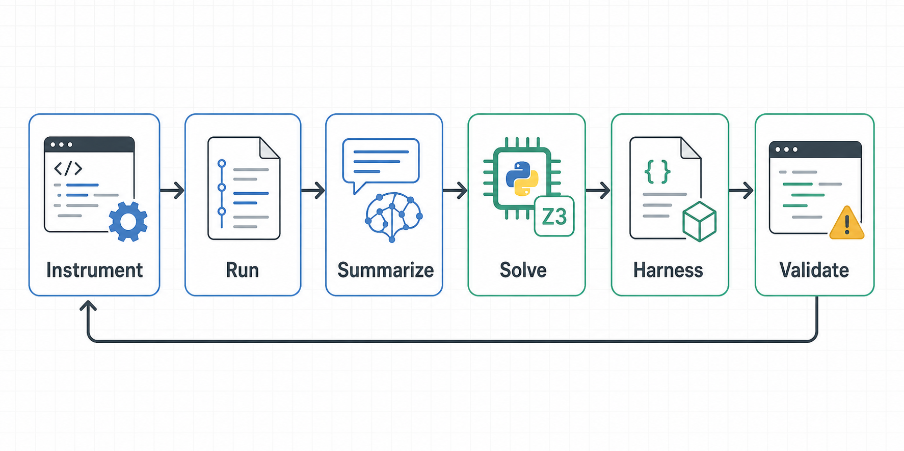

| 항목 | 내용 |
| --- | --- |
| 논문 제목 | Agentic Concolic Execution |
| 저자 | Zhengxiong Luo, Huan Zhao, Dylan Wolff, Cristian Cadar, Abhik Roychoudhury |
| 학회명 | IEEE Symposium on Security and Privacy, S&P 2026 |

## 0. 한 줄 요약

기존 concolic execution이 라이브러리, 런타임, 환경 조건, 복잡한 조건식에서 막히는 지점을 LLM 에이전트와 실제 실행 검증 루프로 우회해 보려는 논문이다.

LLM에게 "버그 찾아줘"라고 맡기는 논문이라기보다, 실행 기록을 읽고 어떤 분기를 열지 고른 뒤, 그 분기에 닿기 위한 입력, 환경 조작, 검증 절차를 도구 루프로 묶은 시스템 논문에 가깝다.

## 1. 논문을 고른 이유

이 논문을 고른 이유는 LLM을 보안 분석에 쓰는 방식이 단순한 코드 요약이나 취약점 질의가 아니었기 때문이다.

요즘 내가 관심 있는 하네스 엔지니어링도 이쪽과 맞닿아 있다. 내가 말하는 하네스는 단순히 퍼즈 타깃 코드 하나가 아니라, LLM이 특정 작업을 잘 수행하도록 프롬프트, 도구 호출, 실행 환경, 피드백, 검증 루프를 묶어 둔 작업 틀에 가깝다. Google OSS-Fuzz 쪽에서도 Fuzz Introspector로 덜 퍼징된 함수를 찾고, LLM이 퍼즈 타깃을 만들고, 빌드/런타임 피드백으로 고치는 흐름을 보여준다. 내가 흥미롭게 본 지점도 결국 LLM을 혼자 두지 않고 작업 환경을 설계한다는 점이다.

이 논문도 같은 문제의식을 공유한다고 봤다. 좋은 입력 하나를 찍어내는 것보다, LLM이 실행 기록을 보고 도구를 호출하고 실패를 되먹임받게 만드는 구조가 더 중요할 수 있다는 점이 흥미로웠다.

## 2. 문제 정의

concolic execution은 실제 실행과 심볼릭 추론을 같이 쓴다. 간단한 코드에서는 실행 경로의 조건을 모으고, 그중 하나를 뒤집어 새 입력을 만들면 된다. 예를 들어 `if (x > 10)`에서 false 쪽으로 갔다면, 다음에는 `x > 10`을 만족하는 입력을 만들어 true 쪽을 열어 보는 식이다.

문제는 실제 프로그램에 들어가면 이 흐름이 바로 복잡해진다는 것이다.

- `atof`, `memcpy`, 부동소수점 연산처럼 라이브러리와 런타임에 기대는 동작이 많다.
- 파일, 네트워크, CLI 인자, 환경 변수도 실행 경로를 바꾼다.
- 이런 동작을 전부 SMT 식으로 모델링하려면 언어와 환경마다 모델을 따로 만들어야 한다.
- 모델을 만들더라도 조건식이 커지면 솔버가 감당하기 어렵다.

논문에서는 앞의 문제를 C1: 심볼릭 모델링, 뒤의 문제를 C2: 조건 풀이로 둔다.

내가 보기엔 이 논문의 출발점은 "LLM이 더 똑똑한 솔버인가?"가 아니라 오히려 "사람이 코드 의미를 읽고 조건을 줄여 쓰듯이, LLM이 조건을 더 다루기 쉬운 형태로 바꿀 수 있는가?"가 맞다.

## 3. 핵심 아이디어

CONCOLLMIC은 solver를 LLM으로 대체하는 것이 아니다.

LLM은 실행 기록을 읽고, 아직 못 간 분기를 고르고, 그 분기를 열기 위한 조건을 정리한다. 조건은 꼭 낮은 수준의 SMT 식일 필요가 없다. 어떤 경우에는 자연어가 더 낫고, 어떤 경우에는 Python 코드나 Z3 식이 더 낫다.

예를 들어 사람이 보기에는 "두 float 사이에 표현 가능한 값이 20개 이하"만 알면 되는 상황이 있다. 기존 도구는 그 과정에 있는 `atof`, `memcpy`, 타입 변환, 반복문을 모두 식으로 바꾸려다 막힌다. CONCOLLMIC은 이런 조건을 더 높은 의미 단위로 요약하고, 실제 계산은 Python이나 Z3 같은 도구에 넘긴다.

중요한 건 마지막에 실제 실행으로 확인한다는 점이다. LLM이 그럴듯한 조건을 만들어도 목표 줄에 도달하지 못하면 실패로 처리한다. 이 검증 루프가 없었다면 그냥 코드 설명을 잘하는 에이전트에 가까웠을 것이다.

## 4. 방법론 / 시스템 설명

이 장은 "CONCOLLMIC이 테스트 입력 하나를 어떻게 새로 만들어내는가"로 보면 이해하기 쉽다. 한 바퀴의 흐름은 대략 아래와 같다.

먼저 `ACE.py instrument`로 소스 코드에 로그를 심는다. C/C++ 코드라면 `fprintf(stderr, ...)` 같은 로그가 들어간다. 함수에 들어갔는지, 어떤 기본 블록을 지나갔는지, 어느 파일의 어느 줄 근처를 실행했는지 나중에 복원하기 위한 표시다.

여기서 포인트는 프로그램을 실제로 실행한다는 점이다. 기존 심볼릭 실행 도구는 언어별로 연산 의미를 많이 구현해야 한다. 반면 CONCOLLMIC은 프로그램을 평소처럼 컴파일하고 실행한 뒤, 실행 중 남긴 로그로 "이번 입력이 어떤 길을 지나갔는지"를 다시 만든다. 레포의 `--instr_languages` 옵션도 언어별 분석 엔진을 고르는 옵션이라기보다, 어떤 확장자의 파일에 로그를 넣을지 고르는 필터에 가깝다.

그다음 `ACE.py run`으로 계측된 프로그램을 돌린다. 이때 사용자는 타깃을 어떻게 실행할지 정해 둔 Python 함수를 넘긴다. 레포에서는 이것을 테스트 하네스라고 부르는데, 타깃 코드 자체가 하네스라는 뜻은 아니다. 입력 파일을 만들고, 명령행 인자를 넣고, 환경 변수를 설정하고, 프로그램을 실행한 뒤 표준 에러와 종료 코드를 돌려주는 바깥쪽 작업 틀에 가깝다.

초기 입력으로 한 번 실행하면 로그가 쌓인다. CONCOLLMIC은 이 로그를 그대로 LLM에게 던지지 않고, 읽기 쉬운 실행 요약으로 줄인다. 여기에는 함수 호출 흐름, 실제로 실행된 코드, 아직 실행되지 않은 코드 블록, 각 블록의 커버리지 정보가 들어간다. 쉽게 말하면 "이번 실행에서 어디까지 갔고, 어디는 아직 못 갔는지"를 보여주는 지도다.

그다음부터 세 종류의 에이전트가 역할을 나눠서 움직인다.

- 스케줄링 에이전트는 기존 테스트케이스 중 어디서 이어서 탐색할지 고른다. 커버리지가 낮은 부분, 이전에 실패했던 비율, 테스트케이스가 만들어진 이력 같은 정보를 본다.
- 요약 에이전트는 아직 실행되지 않은 분기 하나를 고른다. 그리고 그 분기에 가려면 입력 파일, 명령행 인자, 환경 변수, 이전 분기 조건이 어떻게 맞아야 하는지 정리한다.
- 풀이 에이전트는 그 조건을 실제 실행 가능한 값으로 바꾼다. 필요하면 Python을 실행해서 값을 계산하거나, Z3로 식을 풀 수 있다.

요약 에이전트가 하는 일이 특히 중요하다. 단순히 "이 if문을 true로 만들어라"라고 쓰면 풀이 에이전트가 뭘 해야 할지 모른다. 예를 들어 파일을 읽는 프로그램이라면 "첫 줄에는 정수와 실수가 있어야 한다", "그 뒤에는 정수 개수만큼의 값이 있어야 한다", "두 값의 차이가 임계값보다 작아야 한다"처럼 입력 형식까지 같이 써야 한다. 그래야 다음 단계에서 실제 입력 파일을 만들 수 있다.

이 논문이 재미있는 지점도 여기에 있다. 조건을 꼭 SMT 식으로만 쓰지 않는다. 어떤 조건은 자연어가 더 짧고 정확할 수 있고, 어떤 조건은 Python 코드로 계산하는 게 낫고, 어떤 조건은 Z3에 맡기는 게 낫다. FP-Bench 예시처럼 "두 부동소수점 값 사이에 표현 가능한 값이 20개 이하"라는 조건은 사람이 보기에는 한 문장인데, 낮은 수준의 식으로 풀면 `atof`, 반복문, 부동소수점 표현까지 줄줄이 따라온다. CONCOLLMIC은 이런 부분을 더 높은 수준의 조건으로 접는다.

풀이 에이전트는 정리된 조건을 받아 새 실행 방법을 만든다. 입력 파일 내용을 바꾸거나, 프로그램 인자를 바꾸거나, 환경 변수를 다르게 넣는 식이다. 이 결과도 말로만 끝나지 않는다. CONCOLLMIC은 새 실행을 실제로 돌려 보고, 목표 줄에 도달했는지 확인한다.

성공하면 새 테스트케이스가 큐에 저장된다. 실패하면 바로 버리지 않고 원인을 나눠 본다. 풀이 에이전트가 조건을 잘못 만족시킨 것인지, 아니면 요약 에이전트가 애초에 조건을 빠뜨렸거나 잘못 쓴 것인지 다시 검토한다. 레포 코드에도 풀이 결과를 다시 보는 단계와 요약 결과를 다시 보는 단계가 따로 있다.

그래서 CONCOLLMIC은 "LLM에게 분기를 열 방법을 물어본다" 정도의 시스템이 아니다. 실행 로그로 현재 상태를 알려주고, 열어볼 분기를 고르게 하고, 조건을 입력/환경 수준으로 다시 쓰게 하고, Python이나 Z3 같은 도구를 쓰게 하고, 마지막에는 실제 실행으로 맞는지 확인한다.

내가 보기엔 이 구조가 논문에서 가장 중요한 부분이다. LLM이 혼자 추측하는 게 아니라, 정리된 실행 정보와 도구와 실패 피드백 안에서 움직인다. 하네스 엔지니어링 관점에서도 이게 핵심이다. LLM이 특정 분석 작업을 잘 수행하도록 입력 정보, 도구, 실행 방식, 검증 기준을 하나의 작업 틀로 묶어 둔 것이다.

## 5. 평가 및 결과 해석

| 평가 대상 | 결과 |
| --- | --- |
| 8개 C/C++ 프로그램 | KLEE 대비 233%, KLEE-Pending 대비 135%, SymCC 대비 130%, SymSan 대비 115% 더 높은 분기 커버리지 |
| AFL++ 비교 | 평균 81% 높은 커버리지 |
| 다중 언어 프로그램 | ultrajson 3.5배, jansi 8.2배, py4j 1.9배, protobuf-go 1.9배 커버리지 증가 |
| FP-Bench | KLEE-Float보다 20%, 일반 KLEE보다 107% 높은 커버리지 |
| 버그 탐지 | 11개 신규 버그 발견, 9개는 확인 또는 수정, libsoup 버그는 CVE-2025-4945 |

숫자만 보면 CONCOLLMIC이 KLEE나 AFL++보다 낫다는 이야기로 끝나기 쉬워보인다. 그런데 그렇게만 보면 오해가 생길 수 있다. KLEE류 도구는 잘 정의된 심볼릭 모델과 솔버가 강한 영역에서 장점이 있다. 반대로 CONCOLLMIC은 라이브러리 호출, 환경 변수, CLI 인자, 네트워크 입력처럼 모델링하기 까다로운 영역에서 강점을 보인다.

그래서 이 결과는 "LLM이 솔버를 대체했다"기보다는, 기존 concolic execution이 낮은 수준의 모델링 때문에 막히는 지점에서 LLM 에이전트가 의미적 연결고리 역할을 할 수 있다는 쪽으로 읽는 게 맞아 보인다.

특히 libsoup 버그가 CVE로 이어진 점이 중요하다. 커버리지 숫자만 올린 게 아니라 실제 버그로 이어지는 경로까지 건드렸고, 모델 학습 시점과 관계없이 새로 발견한 사례이므로 학습 데이터에서 외운 결과라고 보기도 어렵다.

## 6. 인상 깊었던 사례: `bc`의 malloc 실패 경로

`bc` 사례가 제일 인상적이었다. 일반적인 테스트에서는 `malloc`이 거의 실패하지 않기 때문에, 메모리 할당 실패를 처리하는 분기는 잘 열리지 않는다.

CONCOLLMIC은 여기서 단순히 입력 파일을 바꾸지 않았다.

- 목표: `malloc` 실패 분기 도달
- 조건: `bc_malloc` 안에서 `malloc(size)`이 `NULL`을 반환해야 함
- 방법: custom malloc wrapper 작성
- 실행: `LD_PRELOAD`로 표준 `malloc` 가로채기
- 결과: 평소에는 닿기 어려운 에러 처리 경로 실행

## 7. 한계점

먼저 비용이 크다. 논문 기준으로 테스트 입력 하나를 만드는 데 평균 69초, 0.21달러가 든다. 퍼저처럼 입력을 대량으로 던지는 방식과는 잘 맞지 않는다.

현실적인 사용법은 따로 있을 것 같다. 기존 퍼저나 동적 심볼릭 실행 도구가 막힌 지점에서, 비싸지만 의미 있는 시도를 몇 번 더 해보게 만드는 보조 도구에 가깝다.

LLM이 만드는 조건도 틀릴 수 있다. CONCOLLMIC은 실행 기록에 근거를 두고, 도구를 호출하고, 실제 실행으로 다시 확인하면서 틀린 출력을 걸러낸다. 그래도 정확성을 수학적으로 보장하는 방식은 아니다. 그래서 검증 도구라기보다는 버그 탐지 도구로 보는 게 맞다.

부록의 구성 요소 제거 실험도 중요하다. LLM이 다음 테스트 입력을 고르는 방식은 깊이 우선 탐색이나 무작위 선택보다 통계적으로 유의미하게 좋지 않았다. 즉 성능의 핵심은 "LLM이 다음 목표를 기가 막히게 고른다"가 아니라, 조건 요약, 조건 풀이, 환경 조작 쪽에 더 가까워 보인다.

실패 사례 분석도 비슷한 이야기를 한다. `oggenc` 실패 50개를 보면, 큰 비중은 애초에 도달 불가능한 경로를 고른 경우와 목표에 닿기 전에 프로그램이 먼저 크래시한 경우였다. 요약 에이전트가 조건을 잘못 정리한 경우도 있었지만, 전체 실패를 단순히 "LLM 환각"으로만 설명하기는 어렵다.

논문 메타 리뷰에서도 평가 프로그램 규모가 제한적이고, 높은 수준의 의미 해석과 낮은 수준의 정밀한 실행 사이의 균형을 충분히 보여주지 못했다는 지적이 있었다. 재현성도 고민해볼 문제다.

## 8. 느낀 점

읽고 나서 가장 크게 남은 건 LLM이 작업을 하게 만드는 틀을 설계하는 방식이다.

CONCOLLMIC은 LLM에게 버그를 찾아달라고만 시키지 않는다. 어떤 환경을 만들어야 특정 분기에 도달하는지 생각하게 하고, 그걸 실제 실행으로 확인한다.

요즘 LLM 기반 보안 연구도 점점 이 방향으로 가는 것 같다. 모델에게 최종 판단을 맡기는 것보다, 모델을 실행 가능한 중간 산출물을 만드는 데 쓰고, 그 산출물을 빌드/실행/커버리지/크래시로 검증한다.

하네스 엔지니어링이 중요해지는 이유도 여기에 있다고 느꼈다. 좋은 모델 하나보다, 모델이 어떤 정보를 보고 어떤 도구를 쓰고 어떤 기준으로 실패를 고치는지가 더 큰 차이를 만들 수 있다. LLM은 이 수작업을 줄일 수 있지만, 검증 루프 없이 믿고 쓰기에는 아직 위험하다.

그래서 이 구조를 Web3 버그바운티 쪽 하네스 엔지니어링에 적용해보고 싶다. 스마트컨트랙트 분석에서도 LLM에게 바로 취약점을 물어보는 것보다, 목표 상태를 정하고, 필요한 컨텍스트와 도구를 주고, 실행 결과를 다시 피드백하는 작업 틀을 만드는 쪽이 더 가능성이 있어 보였다.

## 9. 앞으로 해볼 것

직접 적용한다면 처음부터 전체 DeFi 프로토콜을 대상으로 삼기보다, 하나의 공개된 버그바운티 스코프 안에서 "특정 상태가 되어야만 실행되는 분기"를 하나 고르는 게 좋을 것 같다.

예를 들면 이런 상태를 목표로 잡을 수 있다.

- 가격 oracle 값이 특정 범위에 있을 때
- 권한 상태가 바뀐 직후
- 풀 준비금이 비정상적인 비율이 되었을 때
- 청산 조건이 거의 경계값에 걸렸을 때
- 여러 트랜잭션이 특정 순서로 실행되어야 할 때

그다음 CONCOLLMIC식으로 실행 로그를 남기고, 목표 분기를 고르고, 그 분기에 도달하기 위한 트랜잭션 시퀀스나 포크 환경을 LLM이 조합하게 한다.

처음부터 버그를 찾겠다를 목표로 잡으면 실험이 너무 커지니까 성공 기준은 작게 잡는 게 나아 보인다. 예를 들어 기존 퍼저가 못 닿던 `require` 이후 분기에 도달했다거나, 특정 리버트 조건을 통과하는 트랜잭션 시퀀스를 만들었다는 정도면 충분히 첫 실험이 될 수 있다.

Web3에서는 입력 하나보다 호출 순서와 상태가 더 중요하기도 해서 `LD_PRELOAD`로 `malloc` 실패를 만드는 사례가 크게 와닿았다. 스마트컨트랙트에서도 결국 중요한 건 특정 상태를 일부러 만드는 일이고, LLM이 그 상태에 도달하는 실험을 잘 수행하도록 컨텍스트, 도구, 실행 환경, 검증 기준을 묶어 주는 게 하네스 엔지니어링의 좋은 예시로 봤다.

## 마무리

CONCOLLMIC은 concolic execution을 LLM으로 단순히 다시 포장한 논문이라기보다, 기존 도구가 막히는 지점에 LLM 에이전트를 끼워 넣은 연구에 가깝다.

핵심은 LLM에게 "버그를 찾아라"라고 맡기는 것이 아니라 실행 기록, 목표 분기, 도구 호출, 환경 조작, 실패 피드백, 실제 실행 검증을 하나의 작업 틀로 묶어서 LLM이 특정 분석 작업을 반복적으로 수행하게 만든다는 점이 더 중요하다.

계속 돌려놓는 퍼저처럼 쓰기에는 비용과 속도가 부담스럽다. 더 현실적인 활용 방식은 기존 퍼저나 심볼릭 실행이 막힌 지점에서, LLM이 도구와 검증 루프 안에서 비싼 시도를 몇 번 더 해보게 만드는 보조 시스템으로 쓰는 것이다.

## 참고한 자료

- [Agentic Concolic Execution 논문 PDF](https://fouzhe.github.io/publications/paper/SP26-ConcoLLMic.pdf)
- [ConcoLLMic GitHub Repository](https://github.com/ConcoLLMic/ConcoLLMic)
- [OSS-Fuzz: Fuzz target generation using LLMs](https://google.github.io/oss-fuzz/research/llms/target_generation/)
- [Google Security Blog: AI-Powered Fuzzing](https://security.googleblog.com/2023/08/ai-powered-fuzzing-breaking-bug-hunting.html)
- [Google Security Blog: Leveling Up Fuzzing](https://security.googleblog.com/2024/11/leveling-up-fuzzing-finding-more.html)
