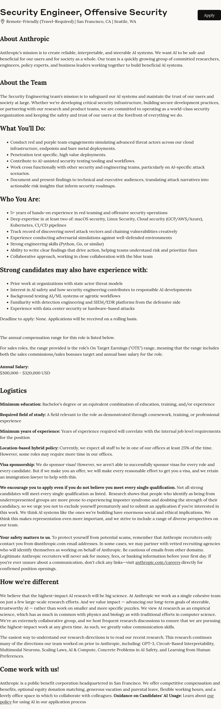
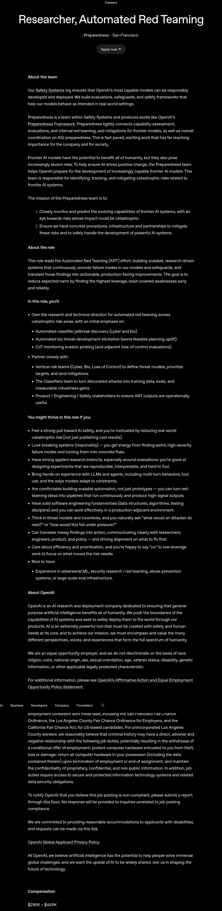
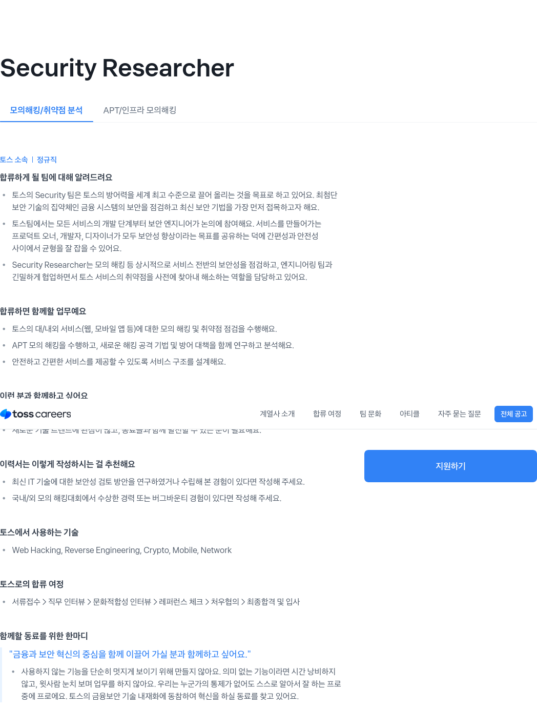
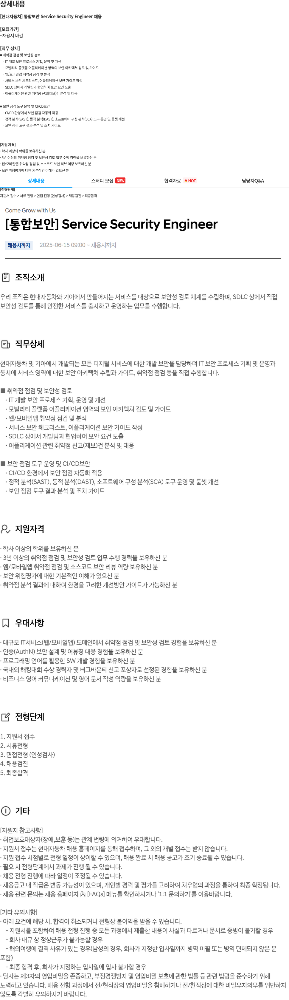
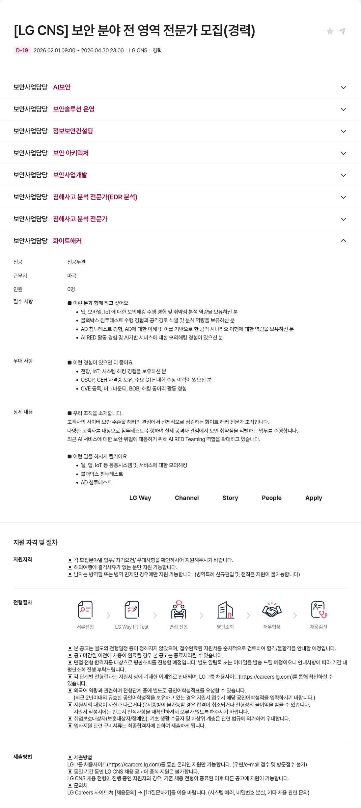

### 보기 중 진로에서 중요한 가치 우선 순위 생각해보기

보기: 연봉, 근무지역, 워라밸, 안정성, 성장가능성, 직무적합성, 자율성, 함께 일하는 사람, 조직문화, 명예, 회사 인지도, 재미

### 가장 중요한 가치 2개

**연봉, 성장가능성**

### 우선순위가 가장 낮은 가치 2개

**워라밸, 안정성**

---

## 시장 분석

### 희망 회사 3개

1. **Anthropic**
2. **OpenAI** 
3. **비바리퍼블리카(토스)** 

### 희망 직무

AI를 활용한 보안 연구, 오펜시브 시큐리티(모의해킹/레드팀)

### 공고 분석

#### 1. Anthropic — Security Engineer, Offensive Security

[공고 링크](https://job-boards.greenhouse.io/anthropic/jobs/5105509008)

#### 2. OpenAI — Researcher, Automated Red Teaming

[공고 링크](https://openai.com/careers/researcher-automated-red-teaming-san-francisco/)

#### 3. 비바리퍼블리카(토스) — Security Researcher (모의해킹/취약점 분석)

[공고 링크](https://toss.im/career/job-detail?job_id=4076085003&company=%ED%86%A0%EC%8A%A4&detailedPosition=%EB%AA%A8%EC%9D%98%ED%95%B4%ED%82%B9%2F%EC%B7%A8%EC%95%BD%EC%A0%90%20%EB%B6%84%EC%84%9D)

#### 4. 현대자동차 — [통합보안] Service Security Engineer

[공고 링크](https://linkareer.com/activity/254586)

#### 5. LG CNS — 보안 전 영역 전문가 (화이트해커 포함)

[공고 링크](https://zighang.com/recruitment/aca9d267-7678-4da3-a70b-0d927ba3040d)

---

### 공고에서 반복해서 나온 역량 3개

**1. 실전 경험**

다섯 곳 모두 표현은 달랐지만 결국 같은 걸 요구하고 있었다. 공통점은 "직접 뚫어본 적이 있는가"였다. 이론으로 아는 것과 실제로 해본 것은 다르다는 걸 업계에서도 명확하게 알고 직접 뚫어본 사람을 요구하고 있었다.

**2. 개발력**

해킹만으로는 부족하다는 걸 공고를 보면서 체감했다. Anthropic은 Python/Go, OpenAI는 자료구조와 알고리즘 같은 엔지니어링 기초, 토스는 웹/모바일 기술 스택, 현대차는 CI/CD 보안 도구, LG CNS는 보안솔루션 개발을 요구한다. 취약점을 찾는 것에서 끝나는 게 아니라, 그걸 자동화하고 도구로 만들어낼 수 있는 능력까지 보고 있었다.

**3. 새로운 취약점을 찾는 능력**

알려진 CVE를 재현하는 수준이 아니라, 아무도 발견하지 못한 취약점을 스스로 찾아낼 수 있는가를 본다. Anthropic은 새로운 공격 벡터와 취약점 체이닝, OpenAI는 AI 모델의 실패 모드, 토스는 신규 공격 기법 연구를 요구했다. 결국 "없던 걸 찾아내는 사람"을 원하고 있었다.

---

### 지금 내가 해야 할 것

**웹 개발과 자동화 공부**

공고들을 분석하면서 가장 크게 느낀 점은, 해킹 실력만으로는 어디에도 갈 수 없다는 것이었다. 다섯 곳 모두 개발력을 요구하는데, 지금 나에게 가장 부족한 부분이 정확히 이 지점이다.

워게임이나 CTF는 꾸준히 해왔고, AI 활용도 나름대로 파봤다. 하지만 웹 개발은 1학년 때 한 번 놓친 이후로 아직까지 제대로 잡지 못했다. 레드팀 자동화 파이프라인을 구축하려면 개발이 필수고, 회사에서도 이걸 중요하게 보는 것 같다. 웹 개발과 Python 자동화부터 집중적으로 해볼 생각이다.
