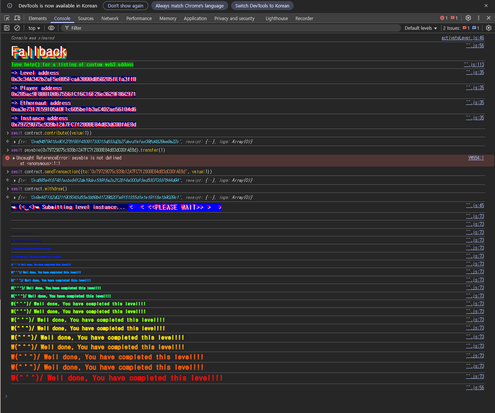

## 문제
### 지문
Look carefully at the contract's code below.
You will beat this level if
	you claim ownership of the contract
	you reduce its balance to 0
Things that might help
How to send ether when interacting with an ABI
How to send ether outside of the ABI
Converting to and from wei/ether units (see help() command)
Fallback methods
### 코드
```solidity
// SPDX-License-Identifier: MIT
pragma solidity ^0.8.0;

contract Fallback {
    mapping(address => uint256) public contributions;
    address public owner;
    constructor() {
        owner = msg.sender;
        contributions[msg.sender] = 1000 * (1 ether);
    }

    modifier onlyOwner() {
        require(msg.sender == owner, "caller is not the owner");
        _;
    }

    function contribute() public payable {
        require(msg.value < 0.001 ether);
        contributions[msg.sender] += msg.value;
        if (contributions[msg.sender] > contributions[owner]) {
            owner = msg.sender;
        }
    }

    function getContribution() public view returns (uint256) {
        return contributions[msg.sender];
    }

    function withdraw() public onlyOwner {
        payable(owner).transfer(address(this).balance);
    }

    receive() external payable {
        require(msg.value > 0 && contributions[msg.sender] > 0);
        owner = msg.sender;
    }
}
```
## 배경지식

---

컨트랙트에 이더를 보내거나 존재하지 않는 함수를 호출하면 일반 함수 호출과 다른 진입점이 실행될 수 있다. 이때 사용되는 함수가 `receive()`와 `fallback()`이다.
동작은 다음처럼 나뉜다.
- `msg.data`가 비어 있고 이더만 전송되면 `receive()`가 있으면 `receive()`가 실행된다.
- `msg.data`가 있거나, 호출한 함수 시그니처가 컨트랙트에 없으면 `fallback()`이 실행된다.
- `receive()`는 이더 수신 전용 함수라서 항상 `payable`이다.
- `fallback()`으로 이더를 받으려면 `payable`로 선언되어 있어야 한다.
이 문제에서는 실제로 `fallback()` 함수가 아니라 `receive()` 함수가 사용된다. 그런데 제목이 Fallback인 이유는 솔리디티 `0.6.0` 이전에는 이 역할이 `fallback()` 하나로 처리되다가, 이후 `receive()`와 `fallback()`으로 분리되었기 때문이다.

---

`contract.contribute({value: 1})`처럼 함수를 호출하면서 이더를 보내면 ABI에 정의된 함수가 실행된다. 반대로 함수명을 지정하지 않고 컨트랙트 주소로 이더만 보내면 ABI 함수 호출이 아니라 이더 전송 트랜잭션이 된다.
이 문제에서는 이 차이를 이용한다. `contribute()`를 한 번 호출해서 `contributions[msg.sender] > 0` 상태를 만든 뒤, 함수 호출 없이 이더만 보내야 `receive()`가 실행된다.

---

`1 ether`는 `10^18 wei`다. 따라서 콘솔에서 `value: 1`이라고 보내면 `1 ether`가 아니라 `1 wei`를 보내는 것이다.
이 문제의 `contribute()`는 `msg.value < 0.001 ether`만 요구하고, `receive()`는 `msg.value > 0`만 요구한다. 즉 아주 작은 값인 `1 wei`만 보내도 조건을 만족시킬 수 있다.
## 문제 코드 분석

---

먼저 초기 `owner`와 `contributions`를 보자.
```solidity
mapping(address => uint256) public contributions;
address public owner;

constructor() {
    owner = msg.sender;
    contributions[msg.sender] = 1000 * (1 ether);
}
```
배포자는 처음부터 `owner`가 되고, `contributions[owner]`에는 `1000 ether`가 들어간다. `contribute()`만 보면 기여도가 기존 owner보다 커야 owner를 바꿀 수 있는데, 공격자가 `1000 ether`보다 크게 기여하는 것은 문제 의도상 현실적인 풀이가 아니다.
따라서 owner를 바꾸는 다른 경로를 찾아야 한다.

---

이제 `contribute()`를 보자.
```solidity
function contribute() public payable {
    require(msg.value < 0.001 ether);
    contributions[msg.sender] += msg.value;
    if (contributions[msg.sender] > contributions[owner]) {
        owner = msg.sender;
    }
}
```
`contribute()`는 직접 owner를 탈취하기에는 불리하다. `msg.value`가 `0.001 ether`보다 작아야 하므로, `1000 ether`를 넘기려면 너무 많은 호출이 필요하다.
하지만 이 함수는 `contributions[msg.sender]`를 0보다 크게 만드는 용도로는 충분하다. 이 상태가 `receive()` 조건을 만족시키기 위한 준비 단계다.

---

소유권 변경은 `receive()`에서 일어난다.
```solidity
receive() external payable {
    require(msg.value > 0 && contributions[msg.sender] > 0);
    owner = msg.sender;
}
```
owner를 실제로 바꾸는 함수는 `receive()`다. 이 함수는 이더만 들어오는 트랜잭션에서 실행되고, 조건은 두 가지다.
- `msg.value > 0`
- `contributions[msg.sender] > 0`
첫 번째 조건은 `1 wei`만 보내도 만족한다. 두 번째 조건은 앞에서 `contribute({value: 1})`를 한 번 호출하면 만족한다. 따라서 공격자는 먼저 아주 작은 기여를 등록하고, 그 다음 함수 호출 없이 이더만 보내서 `receive()`를 실행시키면 `owner`가 된다.

---

마지막으로 `withdraw()`를 보면 된다.
```solidity
modifier onlyOwner() {
    require(msg.sender == owner, "caller is not the owner");
    _;
}

function withdraw() public onlyOwner {
    payable(owner).transfer(address(this).balance);
}
```
문제의 두 번째 조건은 컨트랙트 잔액을 0으로 만드는 것이다. `withdraw()`는 `onlyOwner`만 통과하면 컨트랙트의 전체 잔액을 현재 `owner`에게 보낸다.
흐름은 여기서 끝난다. 먼저 `contribute()`로 `receive()` 조건을 만들고, 이더만 보내 `owner`를 가져온 뒤, `withdraw()`로 잔액을 빼내면 된다.
## 풀이
먼저 `contribute()`에 `1 wei`를 보내 내 `contributions` 값을 0보다 크게 만든다. 이후 함수 호출 없이 컨트랙트에 `1 wei`를 한 번 더 보내면 `receive()`가 실행되고 `owner`가 내 주소로 바뀐다.
이제 소유권은 가져왔으니 `withdraw()`만 호출하면 된다. 컨트랙트에 남아 있던 잔액은 현재 `owner`인 내 주소로 전송된다.
### 익스플로잇
```javascript
await contract.contribute({ value: 1 });
await contract.sendTransaction({ value: 1 });
await contract.withdraw();
```

