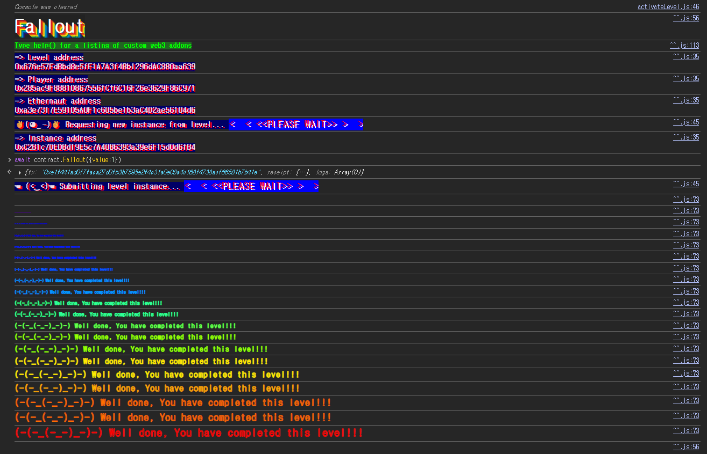

## 문제
### 지문
Claim ownership of the contract below to complete this level.
Things that might help
Solidity Remix IDE
### 코드
```solidity
// SPDX-License-Identifier: MIT
pragma solidity ^0.6.0;

import "openzeppelin-contracts-06/math/SafeMath.sol";

contract Fallout {
    using SafeMath for uint256;

    mapping(address => uint256) allocations;
    address payable public owner;

    /* constructor */
    function Fal1out() public payable {
        owner = msg.sender;
        allocations[owner] = msg.value;
    }

    modifier onlyOwner() {
        require(msg.sender == owner, "caller is not the owner");
        _;
    }

    function allocate() public payable {
        allocations[msg.sender] = allocations[msg.sender].add(msg.value);
    }

    function sendAllocation(address payable allocator) public {
        require(allocations[allocator] > 0);
        allocator.transfer(allocations[allocator]);
    }

    function collectAllocations() public onlyOwner {
        msg.sender.transfer(address(this).balance);
    }

    function allocatorBalance(address allocator) public view returns (uint256) {
        return allocations[allocator];
    }
}
```
## 배경지식

---

현재 Solidity에서는 생성자를 `constructor()`로 작성한다. 생성자는 컨트랙트가 배포될 때 한 번만 실행되고, 배포 이후에는 외부에서 다시 호출할 수 없다.
그런데 Solidity 0.4.22 이전에는 생성자를 `constructor()` 키워드가 아니라 컨트랙트 이름과 같은 함수로 작성했다. 예를 들어 컨트랙트명이 `Fallout`이면 생성자도 `function Fallout() public { ... }` 형태였다.
이 방식은 오타에 취약하다. 함수명이 컨트랙트명과 정확히 같지 않으면 컴파일러는 생성자로 보지 않고 그냥 일반 `public` 함수로 취급한다. 그래서 배포 이후에도 누구나 호출할 수 있게 된다.

---

`payable`은 함수가 ETH를 받을 수 있게 하는 키워드다. `msg.value`는 해당 함수 호출과 함께 전송된 ETH의 양이다.
이 문제의 `Fal1out()`은 `public payable`이므로 외부 계정이 직접 호출하면서 ETH를 보낼 수 있다. 그리고 함수 내부에서 `owner = msg.sender`를 실행하므로, 호출자가 그대로 `owner`가 된다.
## 문제 코드 분석

---

먼저 `owner`와 `onlyOwner`를 보자.
```solidity
address payable public owner;

modifier onlyOwner() {
    require(msg.sender == owner, "caller is not the owner");
    _;
}
```
`owner`는 컨트랙트의 관리자 주소다. `onlyOwner`는 `msg.sender`가 현재 `owner`와 같을 때만 함수를 실행하게 한다.
따라서 이 레벨의 목표인 소유권 탈취는 결국 `owner` 값을 내 주소로 바꾸는 것이다.

---

문제는 생성자처럼 보이는 아래 함수다.
```solidity
/* constructor */
function Fal1out() public payable {
    owner = msg.sender;
    allocations[owner] = msg.value;
}
```
주석에는 `constructor`라고 적혀 있지만 실제 함수명은 `Fal1out`이다. `Fallout`의 두 번째 `l`처럼 보이는 자리에 숫자 `1`이 들어가 있다.
컨트랙트 이름은 `Fallout`이고 함수 이름은 `Fal1out`이라 둘은 같지 않다. 구버전 생성자 문법으로 봐도 생성자가 아니고, Solidity 0.6.0 기준에서도 `constructor()`가 아니다. 결국 이 함수는 배포 때 한 번 실행되는 함수가 아니라, 배포 후에도 누구나 호출할 수 있는 일반 `public` 함수다.
`owner = msg.sender`에 접근 제어가 없기 때문에 아무 주소나 `Fal1out()`을 호출하면 그 주소가 `owner`가 된다.
## 풀이
`Fal1out()`은 생성자가 아니라 일반 함수이고, 내부에서 바로 `owner = msg.sender`를 실행한다. 내 계정으로 이 함수를 한 번 호출하면 ownership claim 조건은 끝난다.
함수에 `payable`이 붙어 있어서 ETH를 함께 보낼 수는 있지만, 소유권을 바꾸는 데 큰 금액이 필요한 건 아니다. `value: 1`만 넣어 호출해도 충분하다.
### 익스플로잇
```javascript
await contract.Fal1out({ value: 1 })
```

