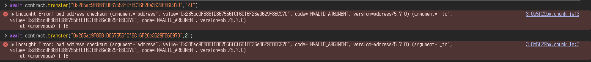
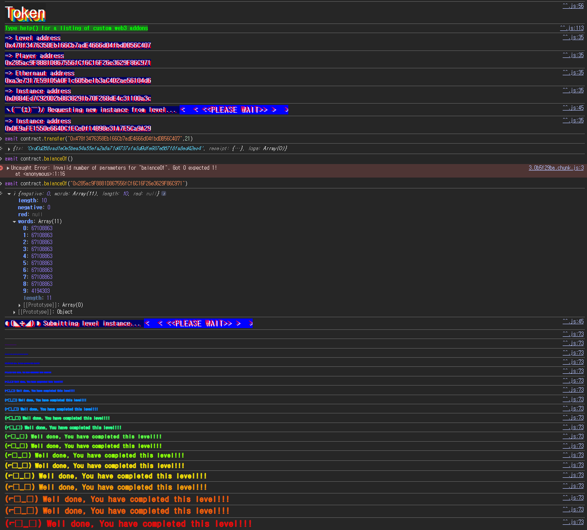

## 문제
### 지문
The goal of this level is for you to hack the basic token contract below.
You are given 20 tokens to start with and you will beat the level if you somehow manage to get your hands on any additional tokens. Preferably a very large amount of tokens.
Things that might help:
What is an odometer?
### 코드
```solidity
// SPDX-License-Identifier: MIT
pragma solidity ^0.6.0;

contract Token {
    mapping(address => uint256) balances;
    uint256 public totalSupply;

    constructor(uint256 _initialSupply) public {
        balances[msg.sender] = totalSupply = _initialSupply;
    }

    function transfer(address _to, uint256 _value) public returns (bool) {
        require(balances[msg.sender] - _value >= 0);
        balances[msg.sender] -= _value;
        balances[_to] += _value;
        return true;
    }

    function balanceOf(address _owner) public view returns (uint256 balance) {
        return balances[_owner];
    }
}
```
## 배경지식

---

`uint256`은 부호 없는 256비트 정수다. 따라서 표현할 수 있는 값은 $0$부터 $2^{256}-1$까지다.
문제는 이 범위를 벗어나는 연산이다. 예를 들어 `uint256` 값 0에서 1을 빼면 -1이 되는 것이 아니라 $2^{256}-1$로 돌아간다.
문제 힌트에 나온 odometer도 같은 의미다. 주행거리계가 최대값을 넘으면 다시 0으로 돌아가듯이, 고정 크기 정수도 범위를 벗어나면 처음이나 끝 값으로 이어진다.


---

이 문제는 `pragma solidity ^0.6.0`을 사용한다. Solidity 0.8.0 이전에는 기본 산술 연산에서 오버플로우/언더플로우를 자동으로 검사하지 않는다.
따라서 `SafeMath` 없이 `uint256` 뺄셈을 하면 언더플로우가 발생해도 revert되지 않고, 값이 `uint256` 범위 안에서 순환한다. 그래서 `balances[msg.sender] - _value`가 방어 코드처럼 보이지만 실제로는 막아주지 못한다.
## 문제 코드 분석

---

먼저 잔액 구조를 보자.
```solidity
mapping(address => uint256) balances;
uint256 public totalSupply;

constructor(uint256 _initialSupply) public {
    balances[msg.sender] = totalSupply = _initialSupply;
}
```
`balances`는 주소별 토큰 잔액을 저장한다. 플레이어는 시작할 때 20 토큰을 가지고, 클리어 조건은 20보다 많은 토큰을 갖는 것이다.
즉 `totalSupply`를 정상적으로 늘릴 필요는 없다. `balanceOf(player)`만 20보다 커지면 된다.

---

문제는 잔액 검사에 있다.
```solidity
require(balances[msg.sender] - _value >= 0);
```
겉으로는 현재 잔액보다 많이 보내지 못하게 막는 코드처럼 보인다. 하지만 `balances[msg.sender]`와 `_value`가 모두 `uint256`이라서 뺄셈 결과도 `uint256`이다.
`uint256`은 음수가 될 수 없으므로 `>= 0` 비교는 의미가 없다. 잔액 20에서 21을 빼면 revert되는 것이 아니라 언더플로우가 발생해 $2^{256}-1$이 된다.
결국 이 `require`는 잔액 검사를 제대로 하지 못한다. 의도대로 막으려면 뺄셈 전에 아래처럼 비교해야 한다.
```solidity
require(balances[msg.sender] >= _value);
```

---

상태 업데이트는 다음 순서로 진행된다.
```solidity
balances[msg.sender] -= _value;
balances[_to] += _value;
```
플레이어 잔액이 20일 때 `_value`로 21을 넣으면 첫 줄에서 플레이어 잔액이 $2^{256}-1$이 된다. 이 값은 20보다 훨씬 크므로 레벨 조건을 만족한다.
`_to`를 내 주소로 넣으면 안 된다. 같은 슬롯에서 21을 뺐다가 다시 21을 더하게 되므로 결과적으로 원래 잔액으로 돌아온다.
그래서 `_to`에는 플레이어가 아닌 다른 주소를 넣어야 한다.

## 풀이
플레이어의 시작 잔액은 20이다. 여기서 `transfer`에 21을 넣으면 잔액 차감 단계에서 언더플로우가 발생한다.
받는 주소는 내 주소만 아니면 된다. 여기서는 레벨 주소로 보냈다.
### 익스플로잇
```javascript
await contract.transfer("0x478f3476358Eb166Cb7adE4666d04fbdDB56C407", 21)
```

