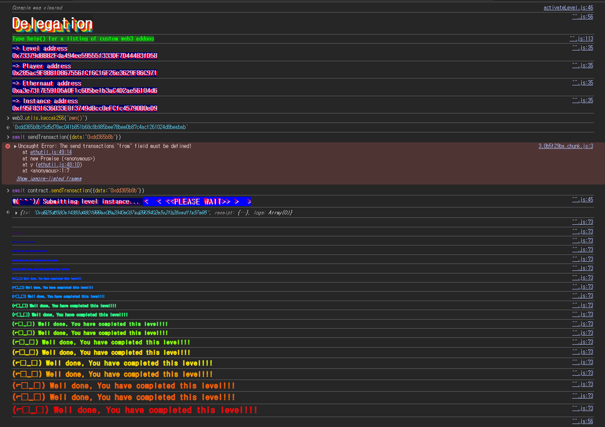

## 문제
### 지문
The goal of this level is for you to claim ownership of the instance you are given.
Things that might help
- Look into Solidity's documentation on the `delegatecall` low level function, how it works, how it can be used to delegate operations to on-chain libraries, and what implications it has on execution scope.
- Fallback methods
- Method ids
### 코드
```solidity
// SPDX-License-Identifier: MIT
pragma solidity ^0.8.0;

contract Delegate {
    address public owner;

    constructor(address _owner) {
        owner = _owner;
    }

    function pwn() public {
        owner = msg.sender;
    }
}

contract Delegation {
    address public owner;
    Delegate delegate;

    constructor(address _delegateAddress) {
        delegate = Delegate(_delegateAddress);
        owner = msg.sender;
    }

    fallback() external {
        (bool result,) = address(delegate).delegatecall(msg.data);
        if (result) {
            this;
        }
    }
}
```
## 배경지식
---
`fallback()`은 호출한 함수 selector가 현재 컨트랙트의 함수와 매칭되지 않을 때 실행되는 함수다.
이 문제에서는 `Delegation`에 `pwn()` 함수가 없다. 따라서 `Delegation` 주소로 `pwn()`의 calldata를 보내면 일반 함수 호출이 아니라 `fallback()`으로 들어간다.
`fallback()`이 `payable`이 아니므로 이더를 같이 보내는 호출은 필요하지 않다. 여기서는 calldata만 보내면 된다.
---
low-level call은 ABI를 직접 인코딩해서 호출하는 방식이다. Solidity에서 함수 호출 calldata의 앞 4바이트는 함수 시그니처를 `keccak256`으로 해싱한 뒤 앞 4바이트만 잘라 만든다.
예를 들어 `pwn()`의 selector는 다음처럼 구할 수 있다.
```javascript
web3.utils.keccak256("pwn()").slice(0, 10)
```
결과는 `0xdd365b8b`이다. 인자가 없는 함수이므로 calldata는 이 4바이트 selector만 있으면 된다.
---
`delegatecall`은 대상 컨트랙트의 코드를 실행하지만, 실행 컨텍스트는 호출한 컨트랙트의 것을 사용한다.
즉 `A.delegatecall(B의 코드)`라고 하면 코드는 `B`의 코드를 쓰지만 `address(this)`, `msg.sender`, storage는 `A` 기준으로 유지된다.
`Delegate.pwn()` 안에는 `owner = msg.sender`가 있는데, 이 코드가 `delegatecall`로 실행되면 `Delegate.owner`가 아니라 `Delegation.owner`를 바꾸게 된다.
## 문제 코드 분석
---
먼저 `Delegate`의 `pwn()`을 보자.
```solidity
contract Delegate {
    address public owner;

    constructor(address _owner) {
        owner = _owner;
    }

    function pwn() public {
        owner = msg.sender;
    }
}
```
`Delegate`에는 `pwn()`이 있고, 호출자의 주소를 `owner`에 저장한다.
일반적으로 `Delegate` 컨트랙트에 직접 `pwn()`을 호출하면 `Delegate`의 `owner`만 바뀐다. 하지만 이 문제의 목표는 `Delegation`의 `owner`를 가져오는 것이다.
그래서 `Delegate`를 직접 호출하면 안 되고, `Delegation`이 `Delegate`의 코드를 대신 실행하게 만들어야 한다.
---
이제 `Delegation`의 `fallback()`을 보자.
```solidity
contract Delegation {
    address public owner;
    Delegate delegate;

    constructor(address _delegateAddress) {
        delegate = Delegate(_delegateAddress);
        owner = msg.sender;
    }

    fallback() external {
        (bool result,) = address(delegate).delegatecall(msg.data);
        if (result) {
            this;
        }
    }
}
```
`Delegation`에는 `pwn()` 함수가 없다. 그래서 `pwn()`의 selector인 `0xdd365b8b`를 `Delegation` 주소로 보내면 `fallback()`이 실행된다.
`fallback()`은 받은 `msg.data`를 그대로 `delegatecall`에 넘긴다. 결국 `Delegate` 컨트랙트에서 같은 selector에 해당하는 `pwn()`이 실행된다.
`delegatecall`은 storage를 `Delegation` 기준으로 사용한다. 두 컨트랙트 모두 첫 번째 상태변수로 `address public owner`를 가지고 있으므로 slot 0이 `owner`로 맞아 떨어진다.
따라서 `Delegate.pwn()`의 `owner = msg.sender`는 실제로 `Delegation`의 slot 0, 즉 `Delegation.owner`를 내 주소로 덮어쓴다.
---
필요한 조건은 세 가지다.
- `Delegation`에 없는 함수 selector를 보내 `fallback()`을 실행한다.
- `fallback()`이 `msg.data`를 그대로 `delegatecall`에 넘긴다.
- `Delegate.pwn()`이 `delegatecall` 컨텍스트에서 실행되어 `Delegation.owner`를 바꾼다.
이 조건이 모두 맞아 있으니 `pwn()`의 selector인 `0xdd365b8b`만 `Delegation` 인스턴스에 보내면 된다.
## 풀이
`pwn()`의 함수 selector를 구해서 `Delegation` 인스턴스에 calldata로 보낸다.
```javascript
web3.utils.keccak256("pwn()")
// '0xdd365b8b15d5d78ec041b851b68c8b985bee78bee0b87c4acf261024d8beabab'
```
함수 selector는 이 해시의 앞 4바이트이므로 `0xdd365b8b`를 보내면 된다. `Delegation`에는 이 selector에 해당하는 함수가 없으니 호출은 `fallback()`으로 들어간다. 그 안에서 `Delegate`에 `delegatecall(msg.data)`가 실행되고, 결국 `pwn()`이 돈다.
### 익스플로잇
```javascript
await contract.sendTransaction({ data: "0xdd365b8b" })
```

