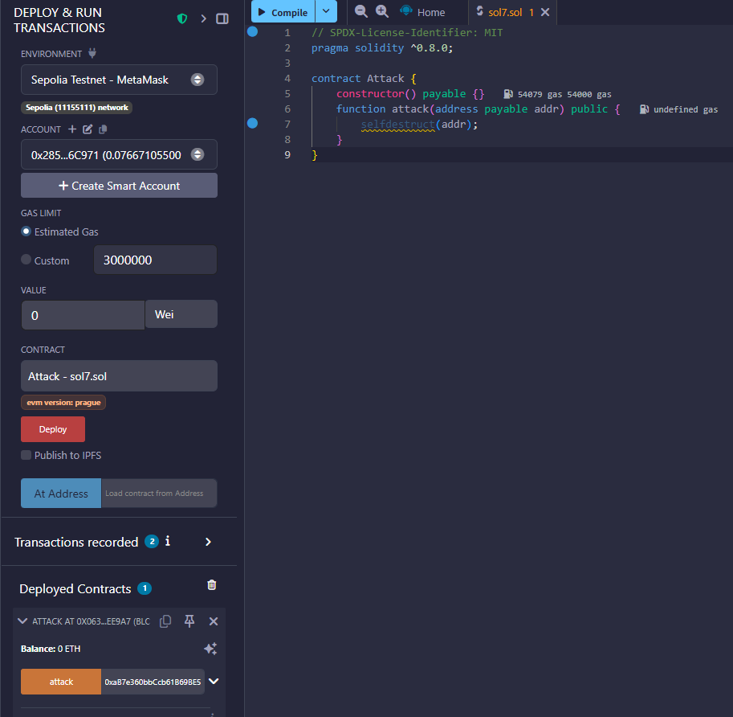
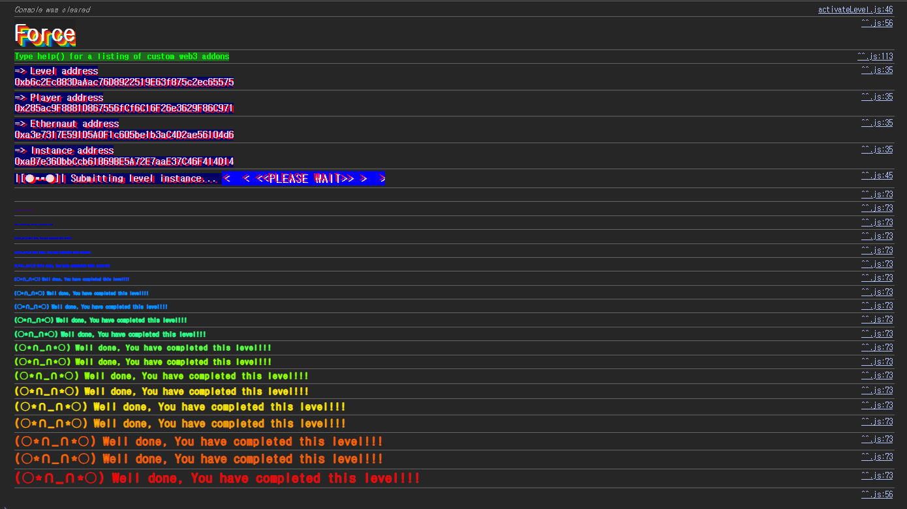

## 문제
### 지문
Some contracts will simply not take your money `¯\_(ツ)_/¯`
The goal of this level is to make the balance of the contract greater than zero.
Things that might help:
- Fallback methods
- Sometimes the best way to attack a contract is with another contract.
- See the ["?"](https://ethernaut.openzeppelin.com/help) page above, section "Beyond the console"
### 코드
```solidity
// SPDX-License-Identifier: MIT
pragma solidity ^0.8.0;

contract Force { /*
                   MEOW ?
         /\_/\   /
    ____/ o o \
    /~____  =ø= /
    (______)__m_m)
                   */ }
```
## 배경지식
---
컨트랙트가 이더를 받으려면 보통 `receive()`나 `payable fallback()`이 필요하다.
`msg.data` 없이 이더만 보내면 `receive()`가 실행되고, `receive()`가 없으면 `fallback()`으로 넘어간다. 이때 실행 가능한 payable 함수가 없으면 일반적인 이더 전송은 revert된다.
즉 `Force`처럼 `receive()`도 없고 `fallback()`도 없는 컨트랙트에는 `transfer`, `send`, low-level `call{value: ...}("")` 같은 방식으로 이더를 넣기 어렵다.
---
하지만 EVM에서 컨트랙트 잔액은 컨트랙트 코드가 직접 허락한 경로로만 증가하는 값이 아니다. 대표적으로 다음 두 가지 방법으로 특정 주소에 이더가 강제로 들어갈 수 있다.
- 다른 컨트랙트가 `selfdestruct(target)`를 호출하면서 남은 이더를 `target`으로 보낸다.
- 채굴자/검증자가 블록 보상 수령 주소를 해당 컨트랙트 주소로 지정한다.
이 문제에서는 두 번째 방법까지 갈 필요가 없고, 첫 번째 방법을 exploit 경로로 쓰면 된다.
---
`selfdestruct(payable recipient)`는 호출한 컨트랙트의 잔액을 `recipient`에게 보낸다. 이 전송은 수신 컨트랙트의 `receive()`나 `fallback()`을 호출하는 일반적인 메시지 호출이 아니다. 따라서 수신 컨트랙트가 이더 수신 함수를 갖고 있지 않아도 잔액이 증가할 수 있다.
EIP-6780 이후에는 `selfdestruct()`의 코드 삭제 동작이 제한되었지만, 이 레벨에서는 삭제 여부가 중요하지 않다. 필요한 건 공격 컨트랙트의 잔액을 `Force` 주소로 강제로 보내는 효과다.
## 문제 코드 분석
---
문제 컨트랙트는 비어 있다.
```solidity
contract Force { /* ... */ }
```
`Force`에는 상태 변수도 없고 함수도 없다. 특히 `receive()`와 `fallback()`이 없다.
따라서 플레이어가 `Force` 주소로 평범하게 이더를 보내면, 실행할 payable entrypoint가 없어서 전송이 실패한다. 문제의 목표는 소유권을 바꾸거나 함수를 호출하는 것이 아니라 단순히 `Force`의 balance를 0보다 크게 만드는 것이다.
---
목표는 `Force` 컨트랙트의 balance를 0보다 크게 만드는 것이다. 검증 조건은 대략 다음과 같이 볼 수 있다.
```solidity
address(force).balance > 0
```
컨트랙트 내부 함수가 없어도 주소 자체는 이더 잔액을 가질 수 있다. 그러니 핵심은 `Force`의 코드를 실행하지 않고, `Force` 주소의 balance만 증가시키는 방법을 찾는 것이다.
---
공격 컨트랙트를 payable constructor로 배포하면서 1 wei를 넣어둔다. 그 다음 공격 컨트랙트에서 `selfdestruct(forceAddress)`를 호출하면 공격 컨트랙트의 잔액이 `Force` 주소로 이동한다.
이 과정에서 `Force`의 `receive()`나 `fallback()`은 호출되지 않는다. 그래서 `Force`가 아무 함수도 갖고 있지 않아도 잔액이 생기고, 레벨 조건을 만족하게 된다.
## 풀이
일반 전송은 `Force`가 이더를 받을 함수가 없어서 실패한다. 하지만 `selfdestruct()`로 인한 잔액 전송은 수신자의 payable 함수 존재 여부와 무관하게 주소의 balance를 증가시킨다.
그래서 1 wei를 가진 공격 컨트랙트를 만들고, 그 컨트랙트를 `selfdestruct`시키면서 `Force` 주소를 수신자로 지정하면 된다.
### 익스플로잇
```solidity
// SPDX-License-Identifier: MIT
pragma solidity ^0.8.0;

contract Attack {
    constructor() payable {}

    function attack(address payable target) public {
        selfdestruct(target);
    }
}
```


