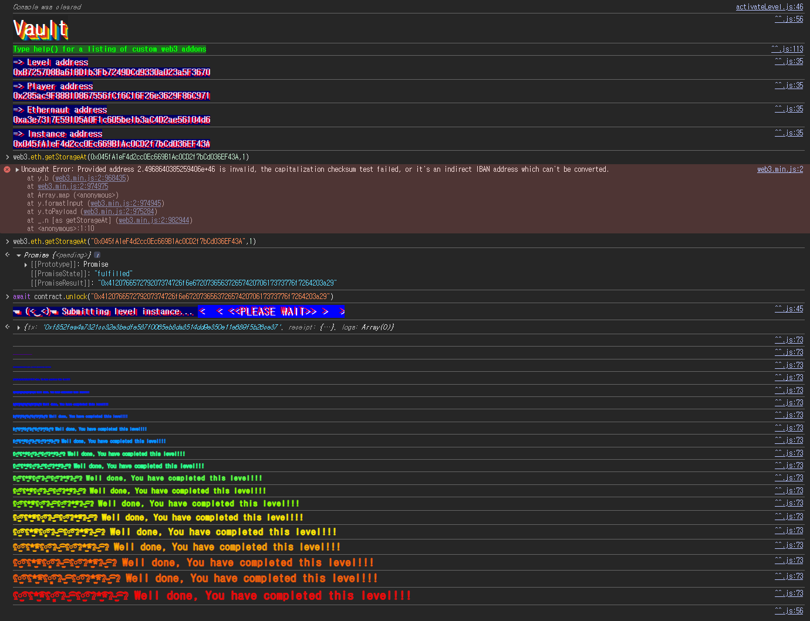

## 문제
### 지문
Unlock the vault to pass the level!
### 코드
```solidity
// SPDX-License-Identifier: MIT
pragma solidity ^0.8.0;

contract Vault {
    bool public locked;
    bytes32 private password;

    constructor(bytes32 _password) {
        locked = true;
        password = _password;
    }

    function unlock(bytes32 _password) public {
        if (password == _password) {
            locked = false;
        }
    }
}
```
## 배경지식
---
컨트랙트의 상태변수는 EVM storage에 저장된다. storage는 32바이트 단위의 슬롯으로 나뉘고, 일반적인 값 타입 상태변수는 선언 순서에 따라 slot 0부터 배치된다.
Solidity는 작은 타입들을 같은 슬롯에 packing할 수 있다. 예를 들어 `bool`은 1바이트만 필요하다. 하지만 `bytes32`는 슬롯 하나를 전부 차지하는 32바이트 타입이므로, 앞의 `bool`이 slot 0에 들어가면 다음 `bytes32`는 slot 1에 저장된다.
외부에서 특정 슬롯을 직접 읽을 때는 `web3.eth.getStorageAt`을 사용할 수 있다.
```javascript
await web3.eth.getStorageAt(contractAddress, slotNumber)
```
---
`private`는 컨트랙트 코드 레벨에서의 접근 제한이다. 즉 다른 컨트랙트가 `password()` 같은 getter를 호출하거나 상속 컨트랙트에서 직접 접근하지 못하게 막는다.
하지만 블록체인에 기록된 storage 자체를 숨기는 기능은 아니다. 모든 노드는 컨트랙트 storage를 가지고 있고, RPC를 통해 특정 슬롯의 raw value를 조회할 수 있다. 그래서 비밀값을 상태변수에 그대로 저장하면 `private`를 붙여도 실제로는 숨겨지지 않는다.
## 문제 코드 분석
---
storage 구조부터 보자.
```solidity
contract Vault {
    bool public locked;
    bytes32 private password;
```
`locked`는 첫 번째 상태변수이므로 slot 0에 저장된다. `password`는 두 번째 상태변수이고 타입이 `bytes32`라서 slot 1에 저장된다.
`private`은 자동 getter만 막고, `password` 값은 컨트랙트 storage에 평문으로 들어간다. `private` 때문에 자동 getter는 만들어지지 않지만 slot 1을 직접 읽으면 값은 그대로 나온다.
---
잠금 해제 조건은 단순하다.
```solidity
function unlock(bytes32 _password) public {
    if (password == _password) {
        locked = false;
    }
}
```
`unlock`은 입력받은 `_password`가 storage에 저장된 `password`와 같으면 `locked`를 `false`로 바꾼다. 별도의 권한 체크는 없다.
공격 흐름은 단순하다. slot 1에서 `password` 값을 읽고, 그 값을 그대로 `unlock`에 넘기면 된다.
## 풀이
이 문제에서 `private`는 값 자체를 숨기는 장치가 아니다. `password`는 외부 함수로 직접 읽을 수 없을 뿐, storage slot 1에는 그대로 저장되어 있다.
slot 1을 조회해서 `bytes32` 값을 얻고, 그 값을 `unlock`의 인자로 넣으면 `locked`가 `false`가 된다.
### 익스플로잇
```javascript
const password = await web3.eth.getStorageAt(
  "0x045fA1eF4d2cc0Ec669B1Ac0CD2f7bCd036EF43A",
  1
);

await contract.unlock(password);
```

