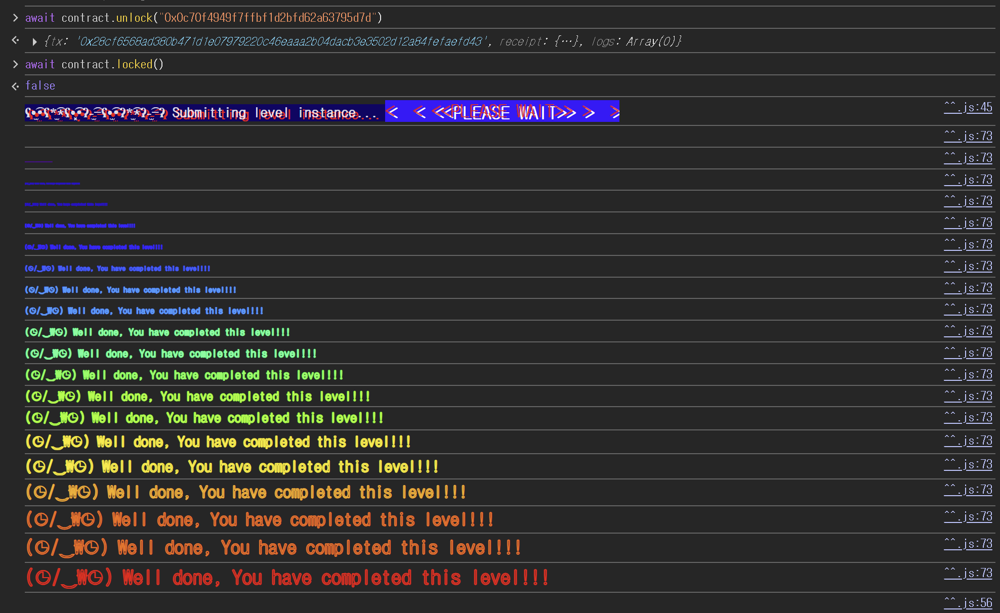

## 문제
### 지문
The creator of this contract was careful enough to protect the sensitive areas of its storage.
Unlock this contract to beat the level.
Things that might help:
- Understanding how storage works
- Understanding how parameter parsing works
- Understanding how casting works
Tips:
- Remember that metamask is just a commodity. Use another tool if it is presenting problems. Advanced gameplay could involve using remix, or your own web3 provider.
### 코드
```solidity
// SPDX-License-Identifier: MIT
pragma solidity ^0.8.0;

contract Privacy {
    bool public locked = true;
    uint256 public ID = block.timestamp;
    uint8 private flattening = 10;
    uint8 private denomination = 255;
    uint16 private awkwardness = uint16(block.timestamp);
    bytes32[3] private data;

    constructor(bytes32[3] memory _data) {
        data = _data;
    }

    function unlock(bytes16 _key) public {
        require(_key == bytes16(data[2]));
        locked = false;
    }

    /*
    A bunch of super advanced solidity algorithms...

      ,*'^`*.,*'^`*.,*'^`*.,*'^`*.,*'^`*.,*'^`
      .,*'^`*.,*'^`*.,*'^`*.,*'^`*.,*'^`*.,*'^`*.,
      *.,*'^`*.,*'^`*.,*'^`*.,*'^`*.,*'^`*.,*'^`*.,*'^         ,---/V\
      `*.,*'^`*.,*'^`*.,*'^`*.,*'^`*.,*'^`*.,*'^`*.,*'^`*.    ~|__(o.o)
      ^`*.,*'^`*.,*'^`*.,*'^`*.,*'^`*.,*'^`*.,*'^`*.,*'^`*.,*'  UU  UU
    */
}
```
## 배경지식
---
`private`은 Solidity 코드 관점의 접근 제한자다. 외부 컨트랙트에서 `data()` 같은 getter로 직접 읽을 수 없고, 상속 컨트랙트에서도 접근할 수 없다는 뜻이다.
하지만 블록체인에 저장된 스토리지 자체가 암호화되는 것은 아니다. 컨트랙트의 상태 변수는 EVM 스토리지 슬롯에 저장되고, 특정 슬롯 번호를 알면 `web3.eth.getStorageAt`으로 값을 읽을 수 있다. 그래서 `private`을 비밀 저장소처럼 쓰면 안 된다.
---
EVM 스토리지는 32바이트 단위 슬롯으로 구성된다. `uint256`, `bytes32`처럼 32바이트를 전부 쓰는 값은 슬롯 하나를 단독으로 차지한다.
반대로 `bool`, `uint8`, `uint16`처럼 32바이트보다 작은 값들은 가능하면 같은 슬롯에 함께 저장된다. 이때 변수 선언 순서대로 슬롯에 배치되고, 작은 값들은 한 슬롯 안에서 오른쪽부터 채워진다.
이 문제의 변수 배치를 정리하면 다음과 같다.
```solidity
// slot 0
bool public locked = true;

// slot 1
uint256 public ID = block.timestamp;

// slot 2
uint8 private flattening = 10;
uint8 private denomination = 255;
uint16 private awkwardness = uint16(block.timestamp);

// slot 3, 4, 5
bytes32[3] private data;
```
이 배치대로라면 `data[0]`은 slot 3, `data[1]`은 slot 4, `data[2]`는 slot 5에 저장된다.
---
고정 길이 바이트 타입끼리 변환할 때는 정수 타입과 헷갈리면 안 된다. `bytesN`에서 `bytesM`으로 변환할 때 `N > M`이면 오른쪽 바이트가 잘리고 왼쪽 바이트가 남는다.
예를 들어 `bytes32` 값을 `bytes16`으로 바꾸면 앞 16바이트만 남는다.
```solidity
bytes16(data[2])
```
따라서 `unlock`에 넣을 `_key`는 slot 5 전체 값이 아니라, slot 5에 저장된 32바이트 값의 앞 16바이트다.
## 문제 코드 분석
---
먼저 잠금 조건을 보자.
```solidity
bool public locked = true;
```
레벨을 통과하려면 `locked`를 `false`로 바꿔야 한다. 직접 값을 바꾸는 public setter는 없으므로 `unlock`을 통과해야 한다.
`locked`는 첫 번째 상태 변수이기 때문에 slot 0에 저장된다. 실제로 slot 0을 읽으면 마지막 값이 `01`인 것을 볼 수 있고, 이는 `true`를 의미한다.
---
이제 `data`의 위치를 계산해보자.
```solidity
uint8 private flattening = 10;
uint8 private denomination = 255;
uint16 private awkwardness = uint16(block.timestamp);
bytes32[3] private data;
```
`flattening`, `denomination`, `awkwardness`는 모두 작기 때문에 slot 2 하나에 packing된다. 그 다음에 나오는 `bytes32[3] data`는 각 원소가 32바이트라서 slot 3부터 하나씩 차지한다.
따라서 `data[2]`는 다음처럼 계산된다.
```solidity
slot(data[2]) = slot(data[0]) + 2 = 3 + 2 = 5
```
문제에서 `data`가 `private`이어도 이 슬롯 값은 외부에서 읽을 수 있다. `private`은 getter 생성을 막을 뿐, 스토리지 조회를 막지 못한다.
---
마지막으로 `unlock`의 비교 방식을 보자.
```solidity
function unlock(bytes16 _key) public {
    require(_key == bytes16(data[2]));
    locked = false;
}
```
비교에 쓰이는 값은 `bytes16(data[2])`다. `data[2]`는 `bytes32`이고 `_key`는 `bytes16`이므로, 비교 전에 `data[2]`의 앞 16바이트만 남긴다.
그러니 slot 5를 읽은 뒤 전체 32바이트를 넣는 것이 아니라, 앞 16바이트만 잘라서 `unlock`에 넘기면 된다.
## 풀이
`data[2]`는 slot 5에 있으므로 이 슬롯만 읽으면 된다.
```javascript
await web3.eth.getStorageAt("0xF5149Bd38aE9B0634ADdE17A238c1517f7191E69", 5)
// "0x0c70f4949f7ffbf1d2bfd62a63795d7d3f6d6e787d928794f25c6c0a6848af62"
```
`unlock`은 이 값을 `bytes16`으로 바꿔 비교한다. `bytes32 -> bytes16` 변환에서는 앞 16바이트만 남으므로 key는 `0x0c70f4949f7ffbf1d2bfd62a63795d7d`다.
### 익스플로잇
```solidity
await contract.unlock("0x0c70f4949f7ffbf1d2bfd62a63795d7d")
{tx: '0x28cf6568ad380b471d1e07979220c46eaaa2b04dacb3e3502d12a84fefaefd43', receipt: {…}, logs: Array(0)}
await contract.locked()
false
```

