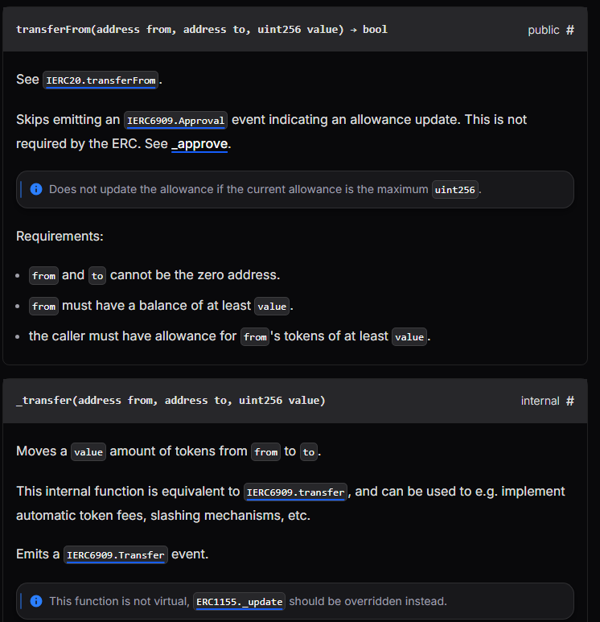
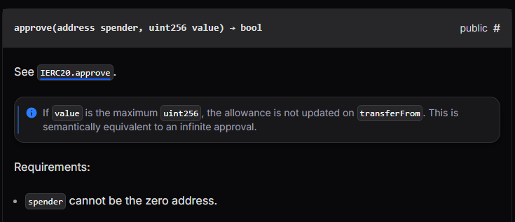
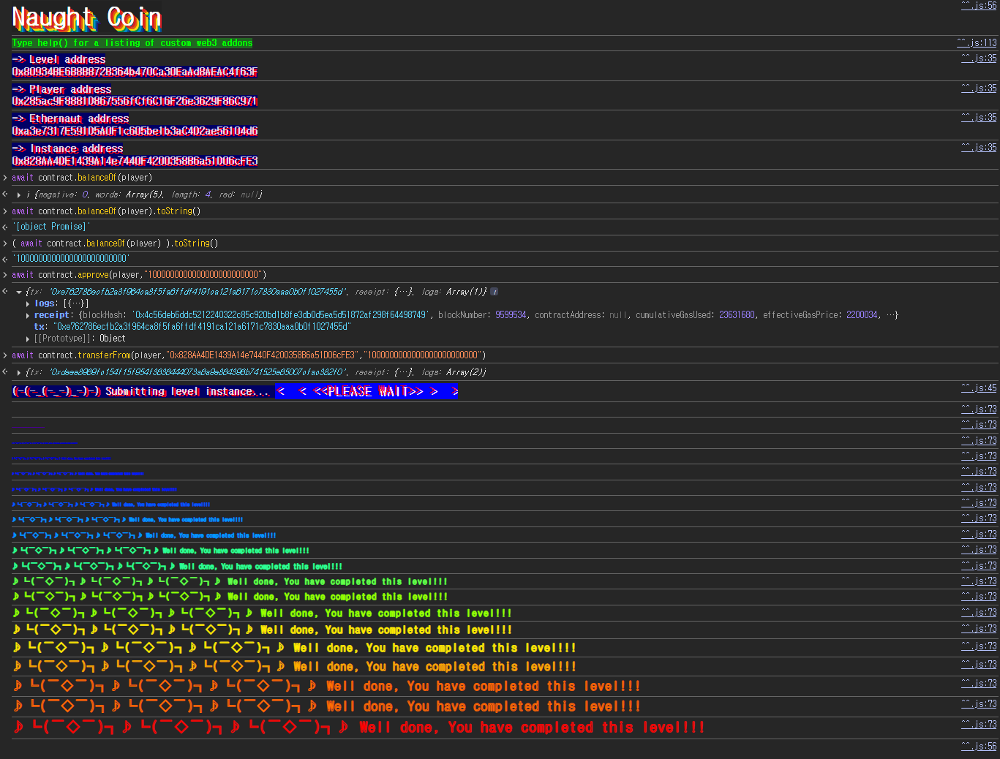

## 문제
### 지문
NaughtCoin is an ERC20 token and you're already holding all of them. The catch is that you'll only be able to transfer them after a 10 year lockout period. Can you figure out how to get them out to another address so that you can transfer them freely? Complete this level by getting your token balance to 0.
Things that might help
- The [ERC20](https://github.com/ethereum/EIPs/blob/master/EIPS/eip-20.md) Spec
- The [OpenZeppelin](https://github.com/OpenZeppelin/zeppelin-solidity/tree/master/contracts) codebase
### 코드
```solidity
// SPDX-License-Identifier: MIT
pragma solidity ^0.8.0;

import "openzeppelin-contracts-08/token/ERC20/ERC20.sol";

contract NaughtCoin is ERC20 {
    // string public constant name = 'NaughtCoin';
    // string public constant symbol = '0x0';
    // uint public constant decimals = 18;
    uint256 public timeLock = block.timestamp + 10 * 365 days;
    uint256 public INITIAL_SUPPLY;
    address public player;

    constructor(address _player) ERC20("NaughtCoin", "0x0") {
        player = _player;
        INITIAL_SUPPLY = 1000000 * (10 ** uint256(decimals()));
        // _totalSupply = INITIAL_SUPPLY;
        // _balances[player] = INITIAL_SUPPLY;
        _mint(player, INITIAL_SUPPLY);
        emit Transfer(address(0), player, INITIAL_SUPPLY);
    }

    function transfer(address _to, uint256 _value) public override lockTokens returns (bool) {
        super.transfer(_to, _value);
    }

    // Prevent the initial owner from transferring tokens until the timelock has passed
    modifier lockTokens() {
        if (msg.sender == player) {
            require(block.timestamp > timeLock);
            _;
        } else {
            _;
        }
    }
}
```
## 배경지식
<hr />
ERC20은 `transfer`, `approve`, `transferFrom`, `balanceOf`, `allowance` 같은 공통 함수를 정해둔 토큰 표준이다.
NaughtCoin은 직접 모든 전송 로직을 구현한 것이 아니라 OpenZeppelin의 `ERC20`을 상속한다. 따라서 코드에 보이는 `transfer`만 볼 것이 아니라, 상속받은 ERC20 표준 함수들도 같이 봐야 한다.
<hr />
ERC20에서 토큰을 옮기는 대표적인 방법은 두 가지다.
`transfer(to, amount)`는 `msg.sender`의 토큰을 바로 `to`에게 보낸다. 즉, 자기 잔액을 직접 보내는 함수다.
```solidity
function transfer(address to, uint256 value) external returns (bool);
```

`transferFrom(from, to, amount)`는 `from`의 토큰을 `to`에게 보낸다. 대신 아무나 남의 토큰을 움직일 수 있으면 안 되므로, 먼저 `from`이 `msg.sender`에게 allowance를 열어줘야 한다.
```solidity
function transferFrom(address from, address to, uint256 value) external returns (bool);
```

<hr />
`approve(spender, amount)`는 `spender`가 내 토큰을 `amount`만큼 가져갈 수 있도록 허용하는 함수다. 이 허용량은 `allowance(owner, spender)`로 조회할 수 있다.
흐름은 이렇게 보면 된다.
1. `player`가 `approve(spender, amount)`를 호출한다.
2. `spender`가 `transferFrom(player, receiver, amount)`를 호출한다.
3. ERC20은 `allowance(player, spender)`를 차감하고 `player`의 잔액을 `receiver`로 옮긴다.
이 문제에서는 `spender`를 그냥 `player` 자기 자신으로 둬도 된다. `approve(player, amount)`로 자신에게 allowance를 열고, 같은 주소에서 `transferFrom(player, receiver, amount)`를 호출하면 `msg.sender`는 `player`이므로 allowance 조건을 만족한다.
## 문제 코드 분석
<hr />
먼저 초기 토큰 지급을 보자.
```solidity
uint256 public timeLock = block.timestamp + 10 * 365 days;
uint256 public INITIAL_SUPPLY;
address public player;

constructor(address _player) ERC20("NaughtCoin", "0x0") {
    player = _player;
    INITIAL_SUPPLY = 1000000 * (10 ** uint256(decimals()));
    _mint(player, INITIAL_SUPPLY);
    emit Transfer(address(0), player, INITIAL_SUPPLY);
}
```
컨트랙트가 배포되면 `player`에게 전체 발행량이 민팅된다. 목표는 이 `player`의 토큰 잔액을 0으로 만드는 것이다.
`INITIAL_SUPPLY`는 `1000000 * 10^18`이다. OpenZeppelin ERC20의 기본 `decimals()`가 18이기 때문에 실제 최소 단위 기준으로는 `1000000000000000000000000`이 된다.
<hr />
잠금은 여기서 걸린다.
```solidity
function transfer(address _to, uint256 _value) public override lockTokens returns (bool) {
    super.transfer(_to, _value);
}

modifier lockTokens() {
    if (msg.sender == player) {
        require(block.timestamp > timeLock);
        _;
    } else {
        _;
    }
}
```
`lockTokens`는 `msg.sender == player`일 때 10년이 지나야 통과하게 만든다. 그런데 이 modifier가 붙은 함수는 `transfer`뿐이다.
`player`가 `transfer`를 직접 호출하면 막힌다. 하지만 ERC20에는 `transferFrom`도 있고, NaughtCoin은 `transferFrom`을 override하지 않았다. 상속받은 OpenZeppelin의 `transferFrom`은 그대로 열려 있는 셈이다.
<hr />
문제는 제한이 한쪽에만 있다는 점이다.
```solidity
contract NaughtCoin is ERC20 {
    ...
    function transfer(address _to, uint256 _value) public override lockTokens returns (bool) {
        super.transfer(_to, _value);
    }
}
```
보안상 의도는 `player`의 토큰 이동을 10년 동안 막는 것이다. 그렇다면 `transfer`뿐 아니라 `transferFrom`으로 `player`의 잔액이 빠져나가는 경우도 제한해야 한다.
하지만 현재 코드는 `transfer`만 막고 있다. `approve`도 막혀 있지 않고, `transferFrom`도 막혀 있지 않다. 따라서 `player`가 먼저 allowance를 열어준 뒤 `transferFrom`으로 자신의 잔액을 다른 주소로 옮기면 문제 조건을 만족할 수 있다.
## 풀이
`transfer` 대신 `approve`와 `transferFrom`을 쓰면 된다. `transfer`는 `lockTokens` 때문에 막히지만, `approve`와 `transferFrom`은 NaughtCoin에서 따로 막지 않았다.
전체 토큰 수량만큼 `player`에게 allowance를 열고, `transferFrom(player, recipient, amount)`를 호출하면 된다. 여기서 `recipient`는 내 다른 지갑 주소나 임의의 수신 주소면 된다. 조건은 `player`의 `balanceOf(player)`가 0이 되는 것이다.
### 익스플로잇
```javascript
await contract.approve(player, "1000000000000000000000000")
await contract.transferFrom(player, "0x828AA4DE1439A14e7440F4200358B6a51D06cFE3", "1000000000000000000000000")
```

